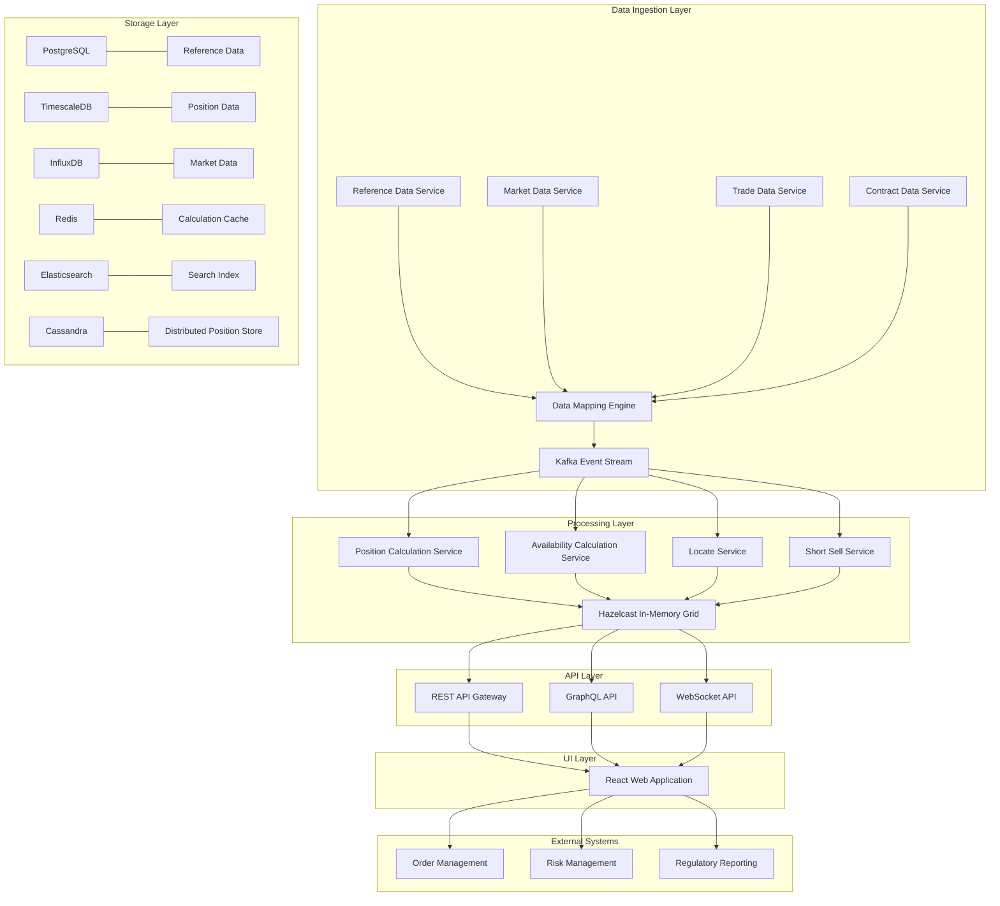

# Inventory Management System (IMS)

[](https://build.example.com/ims)
[](https://tests.example.com/ims)
[](LICENSE)

## Overview

The Inventory Management System (IMS) is a state-of-the-art enterprise application designed to provide comprehensive inventory aggregation and distribution capabilities for licensed prime brokers operating across global jurisdictions. The system collects, processes, and analyzes massive amounts of data to perform real-time and on-demand calculations of global inventory positions.

This solution addresses the critical business need for a unified, high-performance platform that can handle complex inventory calculations while ensuring compliance with diverse and sometimes conflicting regulatory requirements across multiple jurisdictions.

## Key Features

- **Comprehensive data ingestion** from multiple sources including reference data, market data, trade data, contract data, and external availability
- **Real-time position calculation and inventory aggregation** with support for 300,000+ events per second
- **Customizable calculation rules** to accommodate regulatory requirements across different markets
- **Workflow management** for locate approvals and short sell authorizations
- **Rich visualization capabilities** for inventory data with interactive dashboards
- **Global market support** with market-specific rule implementation
- **High performance architecture** delivering sub-200ms end-to-end latency
- **High availability design** with 99.999% uptime during operational hours (24x6)

## Architecture Overview

The IMS employs an event-driven microservices architecture with distributed messaging to ensure high throughput, resilience, and flexibility. Key architectural elements include:

- **Microservices approach** with domain-driven design principles
- **Event-driven communication** through Apache Kafka for high-throughput processing
- **Command Query Responsibility Segregation (CQRS)** for optimized read and write operations
- **Polyglot persistence** with specialized databases for different data types:
  - Tick database for market data
  - High-performance data stores for position and inventory calculations
  - Time-series databases for historical analysis
- **Service mesh** for secure service-to-service communication
- **Global deployment** with region-specific configurations for local market requirements



## Technology Stack

### Backend

- Java 17 (primary language for core services)
- Spring Boot 3.1 (application framework)
- Kotlin 1.8 (for real-time processing components)
- Scala 2.13 (for data processing)
- Apache Kafka 3.4 (distributed messaging)
- Hazelcast 5.3 (in-memory data grid)
- Project Reactor 3.5 (reactive programming)
- Akka 2.7 (actor model for distributed systems)

### Frontend

- TypeScript 4.9 (primary language)
- React 18.2 (UI library)
- Redux 4.2 (state management)
- Material-UI 5.13 (UI component library)
- AG Grid 29.3 (data grid component)
- D3.js 7.8 (data visualization)
- React Query 4.29 (data fetching)

### Databases

- PostgreSQL 15.3 (primary relational database)
- TimescaleDB 2.10 (time-series data)
- InfluxDB 2.7 (tick database)
- Redis 7.0 (caching & pub/sub)
- Elasticsearch 8.8 (search & analytics)
- Cassandra 4.1 (distributed NoSQL)
- Amazon S3 (object storage)

### Infrastructure & DevOps

- Kubernetes 1.27 (container orchestration)
- Docker 23.0 (containerization)
- Istio 1.16+ (service mesh)
- Terraform 1.4 (infrastructure as code)
- Helm 3.12 (Kubernetes package management)
- Jenkins 2.401 (CI/CD automation)
- Prometheus & Grafana (monitoring)
- ELK Stack (log management)

## Project Structure

```
ims/
├── src/
│   ├── backend/              # Backend services
│   │   ├── api-gateway/      # API Gateway service
│   │   ├── reference-data/   # Reference data service
│   │   ├── market-data/      # Market data service
│   │   ├── position/         # Position calculation service
│   │   ├── inventory/        # Inventory calculation service
│   │   ├── locate/           # Locate service
│   │   ├── short-sell/       # Short sell validation service
│   │   ├── common/           # Shared libraries and utilities
│   │   └── build.gradle      # Gradle build configuration
│   │
│   ├── web/                  # Web frontend
│   │   ├── public/           # Static files
│   │   ├── src/              # React application source
│   │   │   ├── components/   # UI components
│   │   │   ├── pages/        # Page components
│   │   │   ├── services/     # API service clients
│   │   │   ├── store/        # Redux store
│   │   │   └── utils/        # Utility functions
│   │   ├── package.json      # NPM configuration
│   │   └── tsconfig.json     # TypeScript configuration
│   │
│   └── test/                 # Test suites
│       ├── unit/             # Unit tests
│       ├── integration/      # Integration tests
│       ├── performance/      # Performance tests
│       └── e2e/              # End-to-end tests
│
├── infrastructure/           # Infrastructure as code
│   ├── terraform/            # Terraform modules
│   │   ├── aws/              # AWS infrastructure
│   │   ├── azure/            # Azure infrastructure
│   │   └── modules/          # Shared modules
│   │
│   ├── kubernetes/           # Kubernetes configuration
│   │   ├── manifests/        # Kubernetes manifests
│   │   └── helm/             # Helm charts
│   │
│   └── ci-cd/                # CI/CD configuration
│       ├── jenkins/          # Jenkins pipelines
│       └── scripts/          # CI/CD scripts
│
├── docs/                     # Documentation
│   ├── architecture/         # Architecture documentation
│   ├── api/                  # API documentation
│   ├── development/          # Development guides
│   └── operations/           # Operations guides
│
├── docker-compose.yml        # Local development setup
├── Makefile                  # Common commands
├── .gitignore                # Git ignore file
└── README.md                 # This file
```

## Setup Instructions

### Prerequisites

- Java 17 or higher
- Node.js 18 or higher
- Docker and Docker Compose
- Kubernetes cluster (for production deployment)
- AWS CLI and/or Azure CLI (for cloud deployments)
- Helm 3.x
- kubectl

### Local Development Setup

1. Clone the repository:
   ```bash
   git clone https://github.com/your-organization/ims.git
   cd ims
   ```

2. Start the required infrastructure services using Docker Compose:
   ```bash
   docker-compose up -d
   ```

3. Build and run the backend services:
   ```bash
   cd src/backend
   ./gradlew bootRun
   ```

4. In a separate terminal, start the frontend development server:
   ```bash
   cd src/web
   npm install
   npm start
   ```

5. Access the application at http://localhost:3000

### Configuration

The application uses a hierarchical configuration approach:

1. Default configurations in `application.yml` files
2. Environment-specific configurations in `application-{env}.yml`
3. Environment variables for sensitive values and deployment-specific settings
4. Config maps and secrets for Kubernetes deployments

Key configuration files:
- `src/backend/*/src/main/resources/application.yml` - Service configurations
- `infrastructure/kubernetes/manifests/configmaps/` - Kubernetes config maps
- `.env.example` - Example environment variables (copy to `.env` for local development)

### Production Deployment

1. Build Docker images:
   ```bash
   make build-images
   ```

2. Push Docker images to your registry:
   ```bash
   make push-images
   ```

3. Deploy infrastructure using Terraform:
   ```bash
   cd infrastructure/terraform/aws  # or azure
   terraform init
   terraform apply
   ```

4. Deploy application to Kubernetes:
   ```bash
   cd infrastructure/kubernetes
   helm upgrade --install ims helm/ims --values helm/ims/values-prod.yaml
   ```

5. Verify deployment:
   ```bash
   kubectl get pods -n ims
   ```

## API Documentation

API documentation is available through Swagger UI when running the API Gateway service:

- Local: http://localhost:8080/swagger-ui.html
- Staging: https://api.staging.ims.example.com/swagger-ui.html
- Production: https://api.ims.example.com/swagger-ui.html

The system exposes the following API categories:

1. **Reference Data API** - Manage security and counterparty data
2. **Position API** - Access position and settlement ladder data
3. **Inventory API** - Query inventory availability metrics
4. **Locate API** - Submit and manage locate requests
5. **Order Validation API** - Validate orders against limits

For real-time data, the system provides WebSocket endpoints:
- `/ws/market-data` - Market data updates
- `/ws/position` - Position updates
- `/ws/inventory` - Inventory updates
- `/ws/locate` - Locate request notifications

## Monitoring and Operations

The system includes comprehensive monitoring capabilities:

- **Prometheus and Grafana** for metrics collection and visualization
- **ELK Stack** for centralized logging
- **Jaeger** for distributed tracing
- **Alertmanager** for alerting and notifications

Key operational dashboards:
- System Health Dashboard
- Performance Metrics Dashboard
- Business Operations Dashboard
- Exception Management Dashboard

## Contributing Guidelines

### Development Workflow

1. Create a feature branch from `develop`:
   ```bash
   git checkout -b feature/your-feature-name
   ```

2. Develop and test your changes locally

3. Ensure your code follows the project's code style guidelines:
   ```bash
   # Backend code style check
   ./gradlew checkstyleMain
   
   # Frontend code style check
   cd src/web
   npm run lint
   ```

4. Write tests for your changes:
   ```bash
   # Run backend tests
   ./gradlew test
   
   # Run frontend tests
   cd src/web
   npm test
   ```

5. Submit a pull request to the `develop` branch

### Code Style Guidelines

- Backend: Follow the Java style guide in `checkstyle.xml`
- Frontend: Follow the TypeScript/React style guide in `.eslintrc.js`
- Use meaningful variable and function names
- Write comprehensive JavaDoc/JSDoc comments
- Follow the SOLID principles and clean code practices

### Pull Request Process

1. Ensure all tests pass and code style guidelines are followed
2. Update documentation if necessary
3. Get at least one code review approval
4. PR will be merged by a repository maintainer

## License

Proprietary - All rights reserved.

## Contact Information

For questions or support, contact the development team at [ims-support@example.com](mailto:ims-support@example.com).

## Acknowledgements

- This project builds on numerous open-source technologies and frameworks
- Thanks to all contributors and stakeholders for their ongoing support