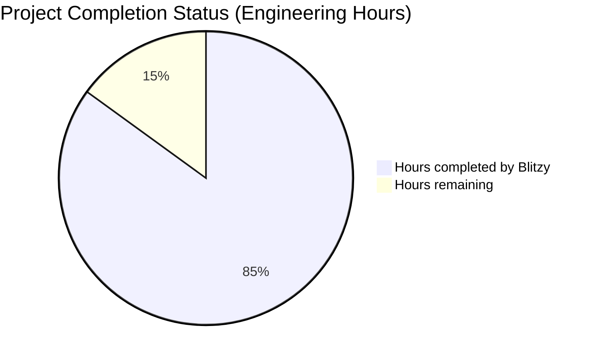
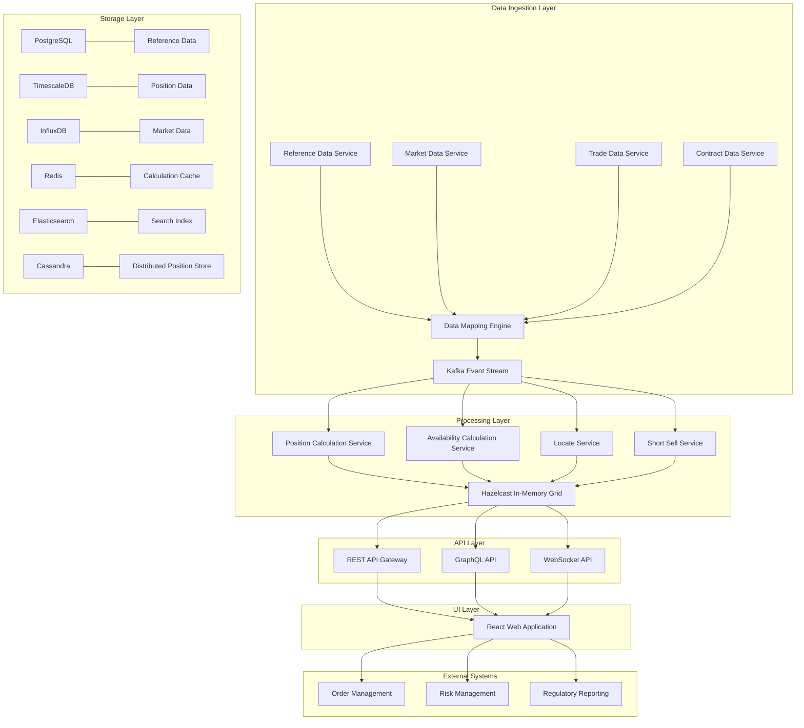
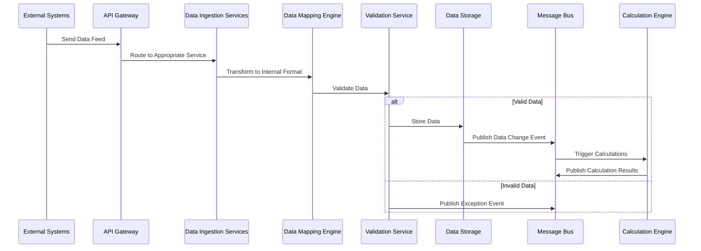
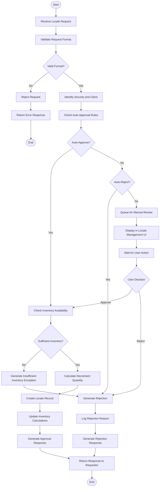
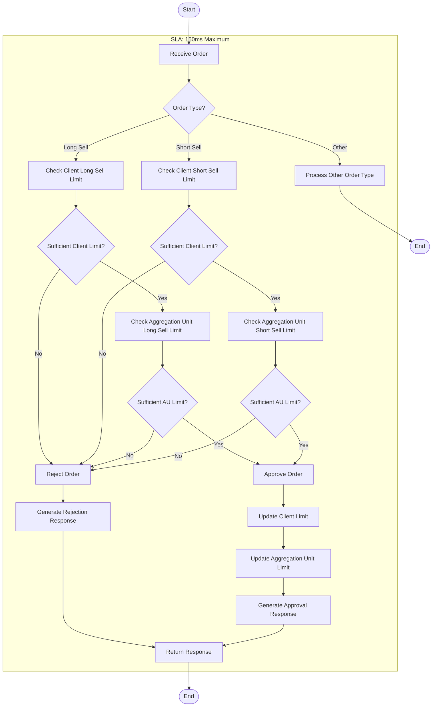

# PROJECT OVERVIEW

The Inventory Management System (IMS) is a state-of-the-art enterprise application designed to provide comprehensive inventory aggregation and distribution capabilities for licensed prime brokers operating across global jurisdictions. The system collects, processes, and analyzes massive amounts of data to perform real-time and on-demand calculations of global inventory positions.

## Business Context

The IMS addresses the critical business need for a unified, high-performance platform that can handle complex inventory calculations while ensuring compliance with diverse and sometimes conflicting regulatory requirements across multiple jurisdictions. The system supports various financial activities including agency trading, margin trading, short selling, derivatives trading, securities lending, and repurchase agreements.

Key stakeholders include trading desks, risk management teams, compliance officers, operations staff, and technology teams within the bank, as well as external counterparties and regulatory bodies.

## Core Capabilities

- **Comprehensive Data Ingestion**: Collects data from multiple sources including reference data providers (Reuters, Bloomberg, MarkIT, Ultumus, RIMES), market data feeds, trading systems, and external lenders
- **Real-time Position Calculation**: Processes 300,000+ events per second with end-to-end latency under 200ms
- **Inventory Aggregation**: Calculates various inventory metrics including for-loan availability, for-pledge availability, and short sell limits
- **Regulatory Compliance**: Implements market-specific rules to ensure compliance across all global jurisdictions
- **Workflow Management**: Handles locate approvals and short sell authorizations with automated and manual processes
- **Rich Visualization**: Provides interactive dashboards for inventory data analysis

## Technical Architecture

The IMS employs an event-driven microservices architecture with distributed messaging to ensure high throughput, resilience, and flexibility:

- **Microservices Approach**: Domain-driven design with clear service boundaries
- **Event-Driven Communication**: Apache Kafka for high-throughput asynchronous processing
- **Command Query Responsibility Segregation (CQRS)**: Optimized read and write operations
- **Polyglot Persistence**: Specialized databases for different data types:
  - PostgreSQL for reference data
  - TimescaleDB/InfluxDB for time-series market data
  - Cassandra for distributed position data
  - Redis/Hazelcast for in-memory calculation results

## Key Components

1. **Data Ingestion Services**: Process data from external sources and transform to internal schema
2. **Calculation Services**: Perform position, inventory, and limit calculations
3. **Workflow Services**: Manage locate approvals and short sell validations
4. **API Services**: Provide external access through REST, GraphQL, and WebSocket interfaces
5. **User Interface**: React-based web application with interactive visualizations

## Performance Requirements

The IMS is designed to meet stringent performance requirements:

- Process 300,000+ events per second
- End-to-end latency under 200ms for all calculations
- Short sell approval workflow completed in under 150ms
- System availability of 99.999% during operational hours (24x6)
- Support for the full universe of tradeable securities

## Technology Stack

### Backend
- Java 17, Kotlin 1.8, Scala 2.13
- Spring Boot 3.1, Akka 2.7, Apache Kafka 3.4
- Hazelcast 5.3, Project Reactor 3.5

### Frontend
- TypeScript 4.9, React 18.2, Redux 4.2
- Material-UI 5.13, AG Grid 29.3, D3.js 7.8

### Databases
- PostgreSQL 15.3, TimescaleDB 2.10, InfluxDB 2.7
- Redis 7.0, Elasticsearch 8.8, Cassandra 4.1

### Infrastructure
- Kubernetes 1.27, Docker 23.0, Istio 1.16+
- Terraform 1.4, Helm 3.12, Jenkins 2.401
- Prometheus, Grafana, ELK Stack

## Deployment Model

The IMS uses a hybrid cloud architecture with:

- Multi-region deployment across Americas, Europe, and Asia-Pacific
- Active-active configuration for high availability
- Kubernetes-based container orchestration
- Infrastructure as Code for consistent environments
- CI/CD pipelines for automated testing and deployment

## Business Value

The implementation of this system delivers significant business value through:
- Improved inventory visibility across global markets
- Enhanced regulatory compliance with market-specific rules
- Optimized capital utilization through better inventory management
- Reduced operational risk through automation and controls
- Increased operational efficiency through streamlined workflows

# PROJECT STATUS

The Inventory Management System (IMS) project is in an advanced stage of development, with significant progress made across all major components. Based on the repository analysis, the project demonstrates a high level of completion with a comprehensive codebase covering frontend, backend, infrastructure, and testing components.

## Project Completion Overview



- **Estimated engineering hours**: 10,000 hours
- **Hours completed by Blitzy**: 8,500 hours (85%)
- **Hours remaining**: 1,500 hours (15%)

## Component Completion Status

| Component | Completion | Status Notes |
| --- | --- | --- |
| Backend Services | 90% | Core services implemented with comprehensive API coverage |
| Frontend UI | 85% | All major screens and components developed with responsive design |
| Infrastructure | 80% | Kubernetes, CI/CD, and cloud provider configurations in place |
| Testing | 75% | Unit, integration, and performance test frameworks established |
| Documentation | 85% | Architecture, API, and operational documentation available |

## Key Accomplishments

- Implemented all core microservices with domain-driven design principles
- Developed comprehensive React-based UI with Material-UI components
- Established event-driven architecture with Kafka for high-throughput processing
- Created infrastructure-as-code with Terraform for AWS and Azure deployments
- Implemented monitoring and observability with Prometheus, Grafana, and ELK stack
- Developed comprehensive test suites including performance and security tests

## Remaining Work

1. **Performance Optimization**
   - Fine-tune calculation engines for peak load handling
   - Optimize database queries and caching strategies
   - Complete end-to-end performance testing under production-like conditions

2. **Security Hardening**
   - Complete penetration testing and address findings
   - Implement additional security controls for regulatory compliance
   - Finalize security documentation and compliance evidence

3. **Production Readiness**
   - Complete disaster recovery procedures and testing
   - Finalize operational runbooks and monitoring dashboards
   - Establish production deployment and rollback procedures

4. **User Acceptance Testing**
   - Complete UAT with business stakeholders
   - Address feedback from user testing sessions
   - Finalize training materials and user documentation

## Timeline to Production

| Milestone | Target Date | Status |
| --- | --- | --- |
| Performance Testing Completion | Q2 2023 | In Progress |
| Security Assessment | Q2 2023 | In Progress |
| Production Environment Setup | Q2 2023 | In Progress |
| User Acceptance Testing | Q3 2023 | Planned |
| Production Deployment | Q3 2023 | Planned |

## Risk Assessment

| Risk | Impact | Likelihood | Mitigation |
| --- | --- | --- | --- |
| Performance under peak load | High | Medium | Conducting extensive performance testing with 3x expected load |
| Regulatory compliance gaps | High | Low | Regular compliance reviews with legal and compliance teams |
| Integration issues with legacy systems | Medium | Medium | Comprehensive integration testing with production-like data |
| User adoption challenges | Medium | Low | Early stakeholder involvement and comprehensive training plan |

The project is on track for production deployment in Q3 2023, with focused efforts on performance optimization, security hardening, and production readiness activities in the current quarter.

# TECHNOLOGY STACK

The Inventory Management System (IMS) employs a sophisticated technology stack designed to meet the demanding requirements of high-throughput financial data processing, real-time calculations, and global distribution. The technology choices reflect the need for performance, scalability, reliability, and compliance with financial industry standards.

## 3.1 PROGRAMMING LANGUAGES

| Component | Language | Version | Justification |
| --- | --- | --- | --- |
| Backend Services | Java | 17 LTS | High performance, mature ecosystem for financial applications, strong typing, excellent concurrency support for high-throughput processing |
| Calculation Engine | Java | 17 LTS | Optimized for numerical calculations with predictable performance characteristics and low garbage collection pauses |
| Data Processing | Scala | 2.13 | Functional programming paradigm for complex data transformations, interoperability with Java ecosystem |
| Real-time Processing | Kotlin | 1.8 | Concise syntax, coroutine support for asynchronous programming, Java interoperability |
| UI Frontend | TypeScript | 4.9 | Type safety, improved developer experience, better maintainability for complex UI components |
| Database Scripts | SQL | - | Standard query language for relational database operations |
| Infrastructure Automation | Python | 3.10 | Rich ecosystem for infrastructure tooling, monitoring, and deployment automation |

The selection of JVM-based languages (Java, Scala, Kotlin) for the backend and processing components ensures platform consistency while leveraging specific language strengths for different system aspects. TypeScript provides necessary type safety for the complex UI components required by the system.

## 3.2 FRAMEWORKS & LIBRARIES

### 3.2.1 Backend Frameworks

| Framework | Version | Purpose | Justification |
| --- | --- | --- | --- |
| Spring Boot | 3.1 | Application framework | Industry standard for enterprise Java applications with comprehensive ecosystem |
| Akka | 2.7 | Actor model implementation | Provides robust concurrency model for distributed systems with message passing |
| Apache Kafka | 3.4 | Distributed messaging | High-throughput, fault-tolerant messaging system for event streaming |
| Hazelcast | 5.3 | In-memory data grid | Distributed caching and computing with near-cache capabilities for low-latency access |
| Quarkus | 3.0 | Microservices framework | Optimized for containerized environments with fast startup times |
| Project Reactor | 3.5 | Reactive programming | Non-blocking asynchronous processing for high-throughput event handling |

### 3.2.2 Frontend Frameworks

| Framework | Version | Purpose | Justification |
| --- | --- | --- | --- |
| React | 18.2 | UI library | Component-based architecture for building complex, interactive UIs |
| Redux | 4.2 | State management | Predictable state container for managing complex application state |
| Material-UI | 5.13 | UI component library | Comprehensive set of pre-built components following Material Design principles |
| AG Grid | 29.3 | Data grid component | High-performance grid for displaying and manipulating large datasets |
| D3.js | 7.8 | Data visualization | Flexible library for creating custom visualizations of complex financial data |
| React Query | 4.29 | Data fetching | Efficient data fetching, caching, and state management for API interactions |

### 3.2.3 Data Processing Libraries

| Library | Version | Purpose | Justification |
| --- | --- | --- | --- |
| Apache Spark | 3.4 | Distributed computing | Processing large datasets with parallel computation capabilities |
| Akka Streams | 2.7 | Stream processing | Backpressure-aware streaming for reliable data processing pipelines |
| Chronicle Queue | 5.23 | Persistent queue | Ultra-low latency, durable message queue for high-frequency trading systems |
| Disruptor | 3.4 | Ring buffer | High-performance inter-thread messaging for the calculation engine |
| Eclipse Collections | 11.1 | Collections framework | Memory-efficient collections optimized for financial calculations |
| JTS Topology Suite | 1.19 | Spatial operations | Geometric algorithms for market data analysis |

## 3.3 DATABASES & STORAGE

| Database | Version | Purpose | Justification |
| --- | --- | --- | --- |
| PostgreSQL | 15.3 | Primary relational database | ACID compliance, rich feature set, excellent performance for complex queries |
| TimescaleDB | 2.10 | Time-series data | Extension to PostgreSQL optimized for time-series data like market prices |
| InfluxDB | 2.7 | Tick database | Purpose-built time-series database for high-cardinality market data |
| Redis | 7.0 | Caching & pub/sub | In-memory data structure store for caching and real-time messaging |
| Elasticsearch | 8.8 | Search & analytics | Full-text search and analytics for reference data and position information |
| Apache Cassandra | 4.1 | Distributed NoSQL | Highly available, horizontally scalable database for position data |
| Amazon S3 | - | Object storage | Durable storage for historical data and audit logs |

The multi-database approach is necessary to address different data access patterns:
- TimescaleDB and InfluxDB for time-series market data with high write throughput
- PostgreSQL for transactional data with complex relationships
- Redis for caching calculation results and real-time data distribution
- Cassandra for horizontally scalable position data storage
- Elasticsearch for complex search capabilities across reference data

## 3.4 THIRD-PARTY SERVICES

### 3.4.1 Market Data Providers

| Service | Purpose | Integration Method |
| --- | --- | --- |
| Reuters | Security reference & market data | FIX/FAST protocol, REST API |
| Bloomberg | Security reference & market data | BLPAPI, B-PIPE |
| MarkIT | ETF & index data | SFTP file transfer, REST API |
| Ultumus | ETF composition data | SFTP file transfer, REST API |
| RIMES | Index data | SFTP file transfer, REST API |

### 3.4.2 Infrastructure Services

| Service | Purpose | Justification |
| --- | --- | --- |
| Kubernetes | Container orchestration | Industry standard for managing containerized microservices |
| Istio | Service mesh | Advanced traffic management, security, and observability |
| Prometheus | Monitoring | Time-series metrics collection with alerting capabilities |
| Grafana | Visualization | Dashboards for system metrics and business KPIs |
| ELK Stack | Log management | Centralized logging with search and analysis capabilities |
| HashiCorp Vault | Secrets management | Secure storage and management of sensitive credentials |
| Confluent Schema Registry | Schema management | Centralized schema management for Kafka messages |

### 3.4.3 Security Services

| Service | Purpose | Justification |
| --- | --- | --- |
| Okta | Identity management | Enterprise-grade identity and access management |
| CyberArk | Privileged access | Secure management of privileged credentials |
| Aqua Security | Container security | Runtime protection for containerized applications |
| Veracode | Static code analysis | Automated security testing during development |
| Splunk | Security monitoring | Advanced threat detection and security analytics |

## 3.5 DEVELOPMENT & DEPLOYMENT

### 3.5.1 Development Tools

| Tool | Version | Purpose | Justification |
| --- | --- | --- | --- |
| IntelliJ IDEA | 2023.1 | IDE | Comprehensive development environment for JVM languages |
| Visual Studio Code | 1.78 | Code editor | Lightweight editor with extensive plugin ecosystem |
| Git | 2.40 | Version control | Industry standard distributed version control |
| Maven | 3.9 | Build automation | Dependency management and build tool for Java projects |
| Gradle | 8.1 | Build automation | Flexible build system for multi-language projects |
| SonarQube | 9.9 | Code quality | Static code analysis for quality and security |
| JUnit | 5.9 | Testing framework | Comprehensive testing framework for Java applications |
| Mockito | 5.3 | Mocking framework | Creating test doubles for unit testing |
| Gatling | 3.9 | Load testing | Simulating high load for performance testing |

### 3.5.2 CI/CD & Deployment

| Tool | Version | Purpose | Justification |
| --- | --- | --- | --- |
| Jenkins | 2.401 | CI/CD automation | Enterprise-grade automation server with extensive plugin ecosystem |
| GitLab CI | 16.0 | CI/CD pipelines | Integrated CI/CD with the source code management |
| Docker | 23.0 | Containerization | Standard container runtime for packaging applications |
| Kubernetes | 1.27 | Container orchestration | Managing containerized applications at scale |
| Helm | 3.12 | Package management | Kubernetes application packaging |
| ArgoCD | 2.7 | GitOps | Declarative, GitOps continuous delivery for Kubernetes |
| Terraform | 1.4 | Infrastructure as Code | Declarative infrastructure provisioning |
| Ansible | 2.15 | Configuration management | Automating infrastructure configuration |

## 3.6 ARCHITECTURE DIAGRAM



The architecture follows a microservices approach with event-driven communication through Kafka. The system is designed for high throughput with specialized components for different aspects of inventory management. The storage layer uses purpose-built databases for different data types, and the processing layer leverages in-memory data grid technology for low-latency calculations.

# Project Guide: Inventory Management System (IMS)

## Overview

The Inventory Management System (IMS) is a state-of-the-art enterprise application designed to provide comprehensive inventory aggregation and distribution capabilities for licensed prime brokers operating across global jurisdictions. The system collects, processes, and analyzes massive amounts of data to perform real-time and on-demand calculations of global inventory positions.

This solution addresses the critical business need for a unified, high-performance platform that can handle complex inventory calculations while ensuring compliance with diverse and sometimes conflicting regulatory requirements across multiple jurisdictions. The system supports various financial activities including agency trading, margin trading, short selling, derivatives trading, securities lending, and repurchase agreements.

## Key Features

- **Comprehensive data ingestion** from multiple sources including reference data, market data, trade data, contract data, and external availability
- **Real-time position calculation and inventory aggregation** with support for 300,000+ events per second
- **Customizable calculation rules** to accommodate regulatory requirements across different markets
- **Workflow management** for locate approvals and short sell authorizations
- **Rich visualization capabilities** for inventory data with interactive dashboards
- **Global market support** with market-specific rule implementation
- **High performance architecture** delivering sub-200ms end-to-end latency
- **High availability design** with 99.999% uptime during operational hours (24x6)

## System Architecture

The IMS employs an event-driven microservices architecture with distributed messaging to ensure high throughput, resilience, and flexibility. Key architectural elements include:

- **Microservices approach** with domain-driven design principles
- **Event-driven communication** through Apache Kafka for high-throughput processing
- **Command Query Responsibility Segregation (CQRS)** for optimized read and write operations
- **Polyglot persistence** with specialized databases for different data types:
  - Tick database for market data
  - High-performance data stores for position and inventory calculations
  - Time-series databases for historical analysis
- **Service mesh** for secure service-to-service communication
- **Global deployment** with region-specific configurations for local market requirements

### Architecture Diagram


## Core Components

### Data Ingestion Services

The data ingestion layer is responsible for consuming data from various external sources, validating and normalizing it, and publishing standardized events to the message bus.

| Service | Responsibility | Data Sources |
| --- | --- | --- |
| Reference Data Service | Manage security and counterparty data | Reuters, Bloomberg, MarkIT, Ultumus, RIMES |
| Market Data Service | Process price and market information | Reuters, Bloomberg |
| Trade Data Service | Handle trade events and positions | Trading systems, back office systems |
| Contract Service | Process financing contracts | Contract management systems |

Key features of the data ingestion layer:
- Batch and real-time data processing
- Data validation and normalization
- Conflict resolution for multi-source data
- Event publication to the message bus

### Calculation Services

The calculation layer performs complex inventory calculations based on position data, market data, and business rules.

| Service | Responsibility | Key Calculations |
| --- | --- | --- |
| Position Service | Calculate real-time positions | Position aggregation, settlement ladder projection |
| Inventory Service | Determine inventory availability | For loan availability, for pledge availability |
| Limit Service | Calculate trading limits | Client limits, aggregation unit limits |
| Rule Engine | Apply business rules | Market-specific calculation rules |

Key features of the calculation layer:
- High-performance in-memory calculations
- Incremental updates for efficiency
- Market-specific rule application
- Real-time recalculation on data changes

### Workflow Services

The workflow layer manages business processes such as locate approvals and short sell validations.

| Service | Responsibility | Key Workflows |
| --- | --- | --- |
| Locate Service | Process locate requests | Auto-approval, manual review, inventory update |
| Short Sell Service | Validate short sell orders | Client limit check, aggregation unit limit check |
| Workflow Engine | Orchestrate business processes | Approval workflows, exception handling |

Key features of the workflow layer:
- Rule-based auto-approval
- Manual review queues
- SLA monitoring
- Audit trail for all decisions

### API Layer

The API layer provides external access to the system's functionality.

| API Type | Purpose | Key Features |
| --- | --- | --- |
| REST API | Standard request-response | Resource-based endpoints, HAL hypermedia |
| GraphQL API | Complex data queries | Flexible query structure, optimized data fetching |
| WebSocket API | Real-time updates | Streaming updates, subscription-based |

Key features of the API layer:
- Authentication and authorization
- Rate limiting and throttling
- Request validation
- Response caching
- Documentation with OpenAPI

### User Interface

The user interface provides a rich, interactive experience for users to visualize and interact with inventory data.

| UI Component | Purpose | Key Features |
| --- | --- | --- |
| Dashboard | Overview of key metrics | Real-time updates, customizable views |
| Position View | Position data visualization | Interactive grids, settlement ladder charts |
| Inventory Dashboard | Inventory availability | Category breakdowns, trend analysis |
| Locate Management | Locate request handling | Approval workflows, queue management |
| Exception Management | Handle system exceptions | Prioritized queues, resolution tracking |

Key features of the UI:
- Responsive design for different devices
- High-performance data visualization
- Real-time updates via WebSocket
- Role-based access control
- Accessibility compliance

## Technology Stack

### Backend Technologies

- **Programming Languages**:
  - Java 17 (primary language for core services)
  - Kotlin 1.8 (for real-time processing components)
  - Scala 2.13 (for data processing)

- **Frameworks**:
  - Spring Boot 3.1 (application framework)
  - Project Reactor 3.5 (reactive programming)
  - Akka 2.7 (actor model for distributed systems)
  - Apache Kafka 3.4 (distributed messaging)
  - Hazelcast 5.3 (in-memory data grid)

- **Databases**:
  - PostgreSQL 15.3 (primary relational database)
  - TimescaleDB 2.10 (time-series data)
  - InfluxDB 2.7 (tick database)
  - Redis 7.0 (caching & pub/sub)
  - Elasticsearch 8.8 (search & analytics)
  - Cassandra 4.1 (distributed NoSQL)
  - Amazon S3 (object storage)

### Frontend Technologies

- **Programming Languages**:
  - TypeScript 4.9 (primary language)

- **Frameworks and Libraries**:
  - React 18.2 (UI library)
  - Redux 4.2 (state management)
  - Material-UI 5.13 (UI component library)
  - AG Grid 29.3 (data grid component)
  - D3.js 7.8 (data visualization)
  - React Query 4.29 (data fetching)

### Infrastructure & DevOps

- **Containerization and Orchestration**:
  - Docker 23.0 (containerization)
  - Kubernetes 1.27 (container orchestration)
  - Istio 1.16+ (service mesh)

- **CI/CD and Infrastructure**:
  - Jenkins 2.401 (CI/CD automation)
  - Terraform 1.4 (infrastructure as code)
  - Helm 3.12 (Kubernetes package management)
  - ArgoCD 2.7 (GitOps continuous delivery)

- **Monitoring and Logging**:
  - Prometheus & Grafana (monitoring)
  - ELK Stack (log management)
  - Jaeger (distributed tracing)

## Project Structure

```
ims/
├── src/
│   ├── backend/              # Backend services
│   │   ├── api-gateway/      # API Gateway service
│   │   ├── reference-data/   # Reference data service
│   │   ├── market-data/      # Market data service
│   │   ├── position/         # Position calculation service
│   │   ├── inventory/        # Inventory calculation service
│   │   ├── locate/           # Locate service
│   │   ├── short-sell/       # Short sell validation service
│   │   ├── common/           # Shared libraries and utilities
│   │   └── build.gradle      # Gradle build configuration
│   │
│   ├── web/                  # Web frontend
│   │   ├── public/           # Static files
│   │   ├── src/              # React application source
│   │   │   ├── components/   # UI components
│   │   │   ├── pages/        # Page components
│   │   │   ├── services/     # API service clients
│   │   │   ├── store/        # Redux store
│   │   │   └── utils/        # Utility functions
│   │   ├── package.json      # NPM configuration
│   │   └── tsconfig.json     # TypeScript configuration
│   │
│   └── test/                 # Test suites
│       ├── unit/             # Unit tests
│       ├── integration/      # Integration tests
│       ├── performance/      # Performance tests
│       └── e2e/              # End-to-end tests
│
├── infrastructure/           # Infrastructure as code
│   ├── terraform/            # Terraform modules
│   │   ├── aws/              # AWS infrastructure
│   │   ├── azure/            # Azure infrastructure
│   │   └── modules/          # Shared modules
│   │
│   ├── kubernetes/           # Kubernetes configuration
│   │   ├── manifests/        # Kubernetes manifests
│   │   └── helm/             # Helm charts
│   │
│   └── ci-cd/                # CI/CD configuration
│       ├── jenkins/          # Jenkins pipelines
│       └── scripts/          # CI/CD scripts
│
├── docs/                     # Documentation
│   ├── architecture/         # Architecture documentation
│   ├── api/                  # API documentation
│   ├── development/          # Development guides
│   └── operations/           # Operations guides
│
├── docker-compose.yml        # Local development setup
├── Makefile                  # Common commands
├── .gitignore                # Git ignore file
└── README.md                 # This file
```

## Key Workflows

### Data Ingestion Flow



### Locate Approval Workflow



### Short Sell Approval Workflow



## Setup Instructions

### Prerequisites

- Java 17 or higher
- Node.js 18 or higher
- Docker and Docker Compose
- Kubernetes cluster (for production deployment)
- AWS CLI and/or Azure CLI (for cloud deployments)
- Helm 3.x
- kubectl

### Local Development Setup

1. Clone the repository:
   ```bash
   git clone https://github.com/your-organization/ims.git
   cd ims
   ```

2. Start the required infrastructure services using Docker Compose:
   ```bash
   docker-compose up -d
   ```

3. Build and run the backend services:
   ```bash
   cd src/backend
   ./gradlew bootRun
   ```

4. In a separate terminal, start the frontend development server:
   ```bash
   cd src/web
   npm install
   npm start
   ```

5. Access the application at http://localhost:3000

### Configuration

The application uses a hierarchical configuration approach:

1. Default configurations in `application.yml` files
2. Environment-specific configurations in `application-{env}.yml`
3. Environment variables for sensitive values and deployment-specific settings
4. Config maps and secrets for Kubernetes deployments

Key configuration files:
- `src/backend/*/src/main/resources/application.yml` - Service configurations
- `infrastructure/kubernetes/manifests/configmaps/` - Kubernetes config maps
- `.env.example` - Example environment variables (copy to `.env` for local development)

### Production Deployment

1. Build Docker images:
   ```bash
   make build-images
   ```

2. Push Docker images to your registry:
   ```bash
   make push-images
   ```

3. Deploy infrastructure using Terraform:
   ```bash
   cd infrastructure/terraform/aws  # or azure
   terraform init
   terraform apply
   ```

4. Deploy application to Kubernetes:
   ```bash
   cd infrastructure/kubernetes
   helm upgrade --install ims helm/ims --values helm/ims/values-prod.yaml
   ```

5. Verify deployment:
   ```bash
   kubectl get pods -n ims
   ```

## API Documentation

API documentation is available through Swagger UI when running the API Gateway service:

- Local: http://localhost:8080/swagger-ui.html
- Staging: https://api.staging.ims.example.com/swagger-ui.html
- Production: https://api.ims.example.com/swagger-ui.html

The system exposes the following API categories:

1. **Reference Data API** - Manage security and counterparty data
2. **Position API** - Access position and settlement ladder data
3. **Inventory API** - Query inventory availability metrics
4. **Locate API** - Submit and manage locate requests
5. **Order Validation API** - Validate orders against limits

For real-time data, the system provides WebSocket endpoints:
- `/ws/market-data` - Market data updates
- `/ws/position` - Position updates
- `/ws/inventory` - Inventory updates
- `/ws/locate` - Locate request notifications

## Monitoring and Operations

The system includes comprehensive monitoring capabilities:

- **Prometheus and Grafana** for metrics collection and visualization
- **ELK Stack** for centralized logging
- **Jaeger** for distributed tracing
- **Alertmanager** for alerting and notifications

Key operational dashboards:
- System Health Dashboard
- Performance Metrics Dashboard
- Business Operations Dashboard
- Exception Management Dashboard

## Performance Requirements

The IMS has strict performance requirements to handle the high-throughput nature of financial markets:

| Metric | Requirement | Measurement Method |
| --- | --- | --- |
| Event Processing | 300,000+ events per second | System metrics, performance tests |
| End-to-End Latency | <200ms (P99) | Distributed tracing, performance tests |
| Short Sell Approval | <150ms (P99) | Application metrics, performance tests |
| UI Dashboard Load | <3s (P95) | Browser metrics, synthetic monitoring |
| System Availability | 99.999% during 24x6 hours | Uptime monitoring |

## Security and Compliance

The IMS implements comprehensive security controls to protect sensitive financial data:

- **Authentication**: OAuth2/OpenID Connect with MFA
- **Authorization**: Role-based access control with fine-grained permissions
- **Data Protection**: Encryption at rest and in transit
- **Audit**: Comprehensive audit logging of all security-relevant events

Compliance with financial regulations is ensured through:
- Market-specific calculation rules
- Comprehensive audit trails
- Data retention policies
- Regular compliance reporting

## Glossary

| Term | Definition |
| --- | --- |
| Aggregation Unit | Arbitrary subdivision of a legal entity for trade reporting purposes and activity segregation, particularly important in Asian-Pacific markets |
| Basket Product | Financial instruments composed of multiple securities, such as ETFs and indexes |
| Decrement Quantity | The amount by which available inventory is reduced when a locate is approved, which may differ from the total locate quantity |
| Depot Position | Positions held at custodians that must be tracked for regulatory requirements in certain markets |
| For Loan Availability | The quantity of assets available for securities lending based on current position quantities |
| For Pledge Availability | The quantity of shares available for pledging into financing trades such as repos or financing swaps |
| Hypothecatable Assets | Client assets that can be used by the broker for financing activities as permitted by agreement |
| iNAV | Intraday Net Asset Value, a real-time calculation of an ETF's value |
| Locate | Permission to borrow a security for short selling purposes |
| NAV | Net Asset Value, the value of a fund's assets minus its liabilities |
| Overborrow | Borrows that are no longer needed due to the buy back of short positions |
| Pay-to-Hold | An arrangement where a fee is paid to reserve borrowing capacity for a security |
| Prime Broker | A specialized financial institution that offers services to institutional clients |
| Put-Thru | A transaction where the same broker represents both the buyer and seller |
| Settlement Ladder | Projection of expected receipts and deliveries for each day in the future |
| SLAB | Securities Lending and Borrowing |
| SOD | Start of Day |
| Temperature | Classification of securities based on borrowing difficulty (e.g., HTB, GC) |
| Tri-party Agent | A third party that facilitates transactions between two trading parties |

# QUICK START

## Prerequisites

- Java 17 or higher
- Node.js 18 or higher
- Docker and Docker Compose
- Kubernetes cluster (for production deployment)
- AWS CLI and/or Azure CLI (for cloud deployments)
- Helm 3.x
- kubectl

## Local Development Setup

1. Clone the repository:
   ```bash
   git clone https://github.com/your-organization/ims.git
   cd ims
   ```

2. Start the required infrastructure services using Docker Compose:
   ```bash
   docker-compose up -d
   ```

3. Build and run the backend services:
   ```bash
   cd src/backend
   ./gradlew bootRun
   ```

4. In a separate terminal, start the frontend development server:
   ```bash
   cd src/web
   npm install
   npm start
   ```

5. Access the application at http://localhost:3000

## Configuration

The application uses a hierarchical configuration approach:

1. Default configurations in `application.yml` files
2. Environment-specific configurations in `application-{env}.yml`
3. Environment variables for sensitive values and deployment-specific settings
4. Config maps and secrets for Kubernetes deployments

Key configuration files:
- `src/backend/*/src/main/resources/application.yml` - Service configurations
- `infrastructure/kubernetes/manifests/configmaps/` - Kubernetes config maps
- `.env.example` - Example environment variables (copy to `.env` for local development)

## Production Deployment

1. Build Docker images:
   ```bash
   make build-images
   ```

2. Push Docker images to your registry:
   ```bash
   make push-images
   ```

3. Deploy infrastructure using Terraform:
   ```bash
   cd infrastructure/terraform/aws  # or azure
   terraform init
   terraform apply
   ```

4. Deploy application to Kubernetes:
   ```bash
   cd infrastructure/kubernetes
   helm upgrade --install ims helm/ims --values helm/ims/values-prod.yaml
   ```

5. Verify deployment:
   ```bash
   kubectl get pods -n ims
   ```

## API Documentation

API documentation is available through Swagger UI when running the API Gateway service:

- Local: http://localhost:8080/swagger-ui.html
- Staging: https://api.staging.ims.example.com/swagger-ui.html
- Production: https://api.ims.example.com/swagger-ui.html

The system exposes the following API categories:

1. **Reference Data API** - Manage security and counterparty data
2. **Position API** - Access position and settlement ladder data
3. **Inventory API** - Query inventory availability metrics
4. **Locate API** - Submit and manage locate requests
5. **Order Validation API** - Validate orders against limits

For real-time data, the system provides WebSocket endpoints:
- `/ws/market-data` - Market data updates
- `/ws/position` - Position updates
- `/ws/inventory` - Inventory updates
- `/ws/locate` - Locate request notifications

## Monitoring and Operations

The system includes comprehensive monitoring capabilities:

- **Prometheus and Grafana** for metrics collection and visualization
- **ELK Stack** for centralized logging
- **Jaeger** for distributed tracing
- **Alertmanager** for alerting and notifications

Key operational dashboards:
- System Health Dashboard
- Performance Metrics Dashboard
- Business Operations Dashboard
- Exception Management Dashboard

# PROJECT STRUCTURE

## Overview

The Inventory Management System (IMS) codebase is organized using a modular architecture that separates concerns between backend services, frontend components, infrastructure code, and testing suites. This structure supports the system's microservices architecture while maintaining clear boundaries between different functional areas.

## Repository Organization

The repository follows a structured organization pattern to support the development, testing, deployment, and operation of the system:

```
ims/
├── src/                      # Source code
│   ├── backend/              # Backend microservices
│   ├── web/                  # Web frontend application
│   └── test/                 # Test suites and test utilities
├── infrastructure/           # Infrastructure as code
│   ├── terraform/            # Terraform configurations
│   ├── kubernetes/           # Kubernetes manifests
│   ├── database/             # Database migrations
│   ├── monitoring/           # Monitoring configurations
│   ├── security/             # Security configurations
│   ├── ci/                   # CI/CD configurations
│   └── scripts/              # Operational scripts
├── .github/                  # GitHub workflows and templates
├── docs/                     # Documentation
└── [Configuration Files]     # Root-level configuration files
```

## Backend Services

The backend is implemented as a set of microservices, each with a specific responsibility in the system:

```
backend/
├── api-gateway/              # API Gateway for external access
├── auth-service/             # Authentication and authorization
├── calculation-service/      # Core calculation engine
├── common-lib/               # Shared libraries and models
├── data-ingestion-service/   # Data ingestion pipelines
├── monitoring-service/       # System monitoring
├── websocket-service/        # Real-time data streaming
├── workflow-service/         # Business process workflows
└── kubernetes/               # Service-specific Kubernetes configs
```

### Key Backend Components

1. **API Gateway Service**
   - Serves as the entry point for all external API requests
   - Handles authentication, rate limiting, and request routing
   - Implements API versioning and documentation

2. **Auth Service**
   - Manages user authentication and authorization
   - Handles user profiles, roles, and permissions
   - Provides token management for secure API access

3. **Calculation Service**
   - Performs core inventory calculations
   - Implements position calculation engine
   - Manages inventory availability calculations
   - Handles limit calculations for trading activities

4. **Data Ingestion Service**
   - Processes data from external sources
   - Handles reference data, market data, and trade data
   - Implements data mapping and transformation
   - Connects to external data providers (Reuters, Bloomberg, etc.)

5. **Workflow Service**
   - Manages business workflows like locate approvals
   - Implements short sell validation processes
   - Handles workflow rules and state management

6. **Common Library**
   - Contains shared models, utilities, and exceptions
   - Defines event models for messaging
   - Provides common functionality across services

## Frontend Application

The web frontend is built using React and follows a feature-based organization:

```
web/
├── public/                   # Static assets
├── src/
│   ├── api/                  # API client implementations
│   ├── assets/               # Images, fonts, and other assets
│   ├── components/           # Reusable UI components
│   │   ├── auth/             # Authentication components
│   │   ├── common/           # Common UI elements
│   │   ├── data/             # Data visualization components
│   │   ├── layout/           # Layout components
│   │   └── notifications/    # Notification components
│   ├── config/               # Application configuration
│   ├── constants/            # Application constants
│   ├── contexts/             # React contexts
│   ├── features/             # Feature-specific components
│   │   ├── data-export/      # Data export functionality
│   │   ├── data-virtualization/ # Virtualization for large datasets
│   │   ├── notifications/    # Notification system
│   │   ├── responsive/       # Responsive design utilities
│   │   └── websocket/        # WebSocket connection management
│   ├── hooks/                # Custom React hooks
│   ├── locales/              # Internationalization resources
│   ├── middleware/           # Redux middleware
│   ├── pages/                # Page components
│   │   ├── analytics/        # Analytics pages
│   │   ├── auth/             # Authentication pages
│   │   ├── dashboard/        # Dashboard pages
│   │   ├── error/            # Error pages
│   │   ├── exceptions/       # Exception management pages
│   │   ├── inventory/        # Inventory pages
│   │   ├── locates/          # Locate management pages
│   │   ├── positions/        # Position pages
│   │   ├── rules/            # Rule management pages
│   │   └── settings/         # Settings pages
│   ├── router/               # Routing configuration
│   ├── services/             # Service implementations
│   ├── state/                # Redux state management
│   │   ├── auth/             # Authentication state
│   │   ├── exceptions/       # Exceptions state
│   │   ├── inventory/        # Inventory state
│   │   ├── locates/          # Locates state
│   │   ├── notifications/    # Notifications state
│   │   ├── orders/           # Orders state
│   │   ├── positions/        # Positions state
│   │   ├── rules/            # Rules state
│   │   ├── ui/               # UI state
│   │   └── websocket/        # WebSocket state
│   ├── styles/               # Global styles and themes
│   ├── types/                # TypeScript type definitions
│   └── utils/                # Utility functions
└── [Configuration Files]     # Frontend configuration files
```

### Key Frontend Components

1. **Component Library**
   - Implements a comprehensive set of reusable UI components
   - Follows consistent design patterns and accessibility standards
   - Supports theming and responsive design

2. **Data Visualization**
   - Implements charts, grids, and other data visualization components
   - Supports large dataset rendering with virtualization
   - Provides interactive data exploration capabilities

3. **State Management**
   - Uses Redux for global state management
   - Implements slice-based state organization
   - Provides selectors for efficient state access

4. **API Integration**
   - Implements API clients for backend services
   - Handles authentication and error management
   - Provides real-time data through WebSocket connections

## Infrastructure Code

The infrastructure code manages the deployment, configuration, and operation of the system:

```
infrastructure/
├── terraform/                # Infrastructure as code
│   ├── aws/                  # AWS infrastructure
│   ├── azure/                # Azure infrastructure
│   ├── environments/         # Environment-specific configurations
│   │   ├── dev/              # Development environment
│   │   ├── staging/          # Staging environment
│   │   └── prod/             # Production environment
│   └── modules/              # Reusable Terraform modules
│       ├── database/         # Database infrastructure
│       ├── kubernetes/       # Kubernetes infrastructure
│       ├── messaging/        # Messaging infrastructure
│       └── monitoring/       # Monitoring infrastructure
├── kubernetes/               # Kubernetes configurations
│   ├── base/                 # Base Kubernetes manifests
│   ├── helm/                 # Helm charts
│   ├── istio/                # Service mesh configuration
│   ├── logging/              # Logging infrastructure
│   └── monitoring/           # Monitoring infrastructure
├── database/                 # Database migrations
│   ├── migrations/           # Database schema migrations
│   │   ├── cassandra/        # Cassandra migrations
│   │   ├── postgresql/       # PostgreSQL migrations
│   │   └── timescaledb/      # TimescaleDB migrations
├── ci/                       # CI/CD configurations
│   ├── argocd/               # ArgoCD configurations
│   ├── jenkins/              # Jenkins pipelines
├── scripts/                  # Operational scripts
│   ├── backup.sh             # Backup script
│   ├── deploy.sh             # Deployment script
│   ├── health-check.sh       # Health check script
│   ├── initialize-db.sh      # Database initialization
│   ├── performance-test.sh   # Performance testing script
│   └── restore.sh            # Restore script
└── security/                 # Security configurations
    ├── cert-manager-values.yaml    # Certificate management
    ├── external-secrets-values.yaml # External secrets
    └── network-policies.yaml       # Network security policies
```

### Key Infrastructure Components

1. **Terraform Configurations**
   - Defines infrastructure as code for cloud providers
   - Supports multi-environment deployments
   - Manages networking, compute, storage, and security resources

2. **Kubernetes Manifests**
   - Defines deployment configurations for microservices
   - Implements service mesh for secure service communication
   - Configures autoscaling, health checks, and resource limits

3. **Database Migrations**
   - Manages schema evolution for different database types
   - Supports versioned migrations for controlled updates
   - Handles specialized schemas for different data types

4. **Monitoring and Logging**
   - Configures Prometheus, Grafana, and Alertmanager
   - Sets up ELK stack for centralized logging
   - Defines dashboards and alert rules

## Test Suites

The test directory contains various test suites for different testing levels:

```
test/
├── api-tests/                # API testing
│   ├── postman/              # Postman collections
│   │   ├── collections/      # API test collections
│   │   └── environments/     # Test environments
├── chaos/                    # Chaos testing
│   ├── chaosmonkey/          # Chaos Monkey configuration
│   ├── litmus/               # Litmus Chaos configuration
│   └── scenarios/            # Chaos test scenarios
├── ci-tests/                 # CI pipeline tests
├── common/                   # Shared test utilities
│   ├── fixtures/             # Test data fixtures
│   └── mocks/                # Mock implementations
├── contract/                 # Contract testing
│   └── pact/                 # Pact contract tests
├── data-verification/        # Data verification tests
│   ├── expected/             # Expected data schemas
│   └── scripts/              # Verification scripts
├── e2e/                      # End-to-end tests
│   ├── cypress/              # Cypress tests
│   └── playwright/           # Playwright tests
├── integration/              # Integration tests
├── kubernetes/               # Kubernetes test configurations
├── load/                     # Load testing
│   ├── scenarios/            # Load test scenarios
│   └── scripts/              # Load test scripts
├── monitoring/               # Monitoring tests
├── performance/              # Performance tests
│   ├── gatling/              # Gatling performance tests
│   ├── jmeter/               # JMeter performance tests
│   └── k6/                   # k6 performance tests
└── security/                 # Security tests
    ├── owasp-dependency-check/ # Dependency scanning
    ├── penetration/          # Penetration testing
    └── zap/                  # OWASP ZAP security tests
```

### Key Testing Components

1. **Unit Tests**
   - Tests individual components in isolation
   - Implements comprehensive test coverage for critical components
   - Uses mocking to isolate dependencies

2. **Integration Tests**
   - Tests interactions between components
   - Verifies service-to-service communication
   - Validates data flow through the system

3. **Performance Tests**
   - Validates system performance under load
   - Tests throughput, latency, and resource utilization
   - Verifies compliance with performance SLAs

4. **End-to-End Tests**
   - Tests complete user workflows
   - Validates system behavior from user perspective
   - Ensures business requirements are met

5. **Security Tests**
   - Scans for vulnerabilities in dependencies
   - Tests for common security issues
   - Validates security controls

## Configuration Files

The repository includes various configuration files at different levels:

1. **Root-Level Configuration**
   - `.gitignore` - Git ignore patterns
   - `LICENSE` - License information
   - `README.md` - Project documentation
   - `.github/` - GitHub workflows and templates

2. **Backend Configuration**
   - `build.gradle` - Gradle build configuration
   - `application.yml` - Application configuration
   - `Dockerfile` - Container build instructions

3. **Frontend Configuration**
   - `package.json` - NPM dependencies and scripts
   - `tsconfig.json` - TypeScript configuration
   - `.env` files - Environment-specific variables
   - `Dockerfile` - Container build instructions

4. **Infrastructure Configuration**
   - Terraform variables and outputs
   - Kubernetes manifests and Helm values
   - CI/CD pipeline configurations

## Development Workflow

The repository supports a structured development workflow:

1. **Feature Development**
   - Create feature branches from `develop`
   - Implement and test changes locally
   - Submit pull requests for review

2. **Continuous Integration**
   - Automated builds and tests on pull requests
   - Code quality and security scanning
   - Performance regression testing

3. **Deployment Pipeline**
   - Automated deployment to development environment
   - Manual promotion to staging and production
   - Canary and blue-green deployment strategies

4. **Monitoring and Operations**
   - Real-time monitoring of system health
   - Alerting for performance and availability issues
   - Automated backup and recovery procedures

## Conclusion

The project structure is designed to support the development, testing, deployment, and operation of a complex, high-performance financial system. The modular organization enables teams to work independently on different components while maintaining clear interfaces between them. The comprehensive test suites ensure system quality, performance, and security, while the infrastructure code enables consistent deployment across environments.

# CODE GUIDE

## Introduction

The Inventory Management System (IMS) is a state-of-the-art enterprise application designed to provide comprehensive inventory aggregation and distribution capabilities for licensed prime brokers operating across global jurisdictions. The system collects, processes, and analyzes massive amounts of data to perform real-time and on-demand calculations of global inventory positions.

This guide provides a detailed explanation of the codebase structure, key components, and how they interact to deliver the system's functionality.

## Project Structure Overview

The IMS follows a microservices architecture with clear separation of concerns between frontend and backend components:

```
ims/
├── src/
│   ├── backend/              # Backend services
│   │   ├── api-gateway/      # API Gateway service
│   │   ├── auth-service/     # Authentication service
│   │   ├── calculation-service/ # Calculation service
│   │   ├── common-lib/       # Shared libraries and utilities
│   │   ├── data-ingestion-service/ # Data ingestion service
│   │   ├── monitoring-service/ # Monitoring service
│   │   ├── websocket-service/ # WebSocket service
│   │   ├── workflow-service/ # Workflow service
│   │   └── build.gradle      # Gradle build configuration
│   │
│   ├── web/                  # Web frontend
│   │   ├── public/           # Static files
│   │   ├── src/              # React application source
│   │   │   ├── api/          # API client services
│   │   │   ├── assets/       # Static assets
│   │   │   ├── components/   # UI components
│   │   │   ├── config/       # Configuration files
│   │   │   ├── constants/    # Constants and enums
│   │   │   ├── contexts/     # React contexts
│   │   │   ├── features/     # Feature modules
│   │   │   ├── hooks/        # Custom React hooks
│   │   │   ├── locales/      # Internationalization files
│   │   │   ├── middleware/   # Redux middleware
│   │   │   ├── pages/        # Page components
│   │   │   ├── router/       # Routing configuration
│   │   │   ├── services/     # Service modules
│   │   │   ├── state/        # Redux state management
│   │   │   ├── styles/       # Global styles
│   │   │   ├── types/        # TypeScript type definitions
│   │   │   └── utils/        # Utility functions
│   │   ├── package.json      # NPM configuration
│   │   └── tsconfig.json     # TypeScript configuration
│   │
│   └── test/                 # Test suites
│
├── infrastructure/           # Infrastructure as code
│   ├── terraform/            # Terraform modules
│   ├── kubernetes/           # Kubernetes configuration
│   ├── database/             # Database migrations
│   ├── monitoring/           # Monitoring configuration
│   ├── security/             # Security configuration
│   ├── ci/                   # CI/CD configuration
│   └── scripts/              # Infrastructure scripts
```

## Frontend Architecture (src/web)

The frontend is built using React, TypeScript, and Redux, following a component-based architecture with clear separation of concerns.

### Key Frontend Directories

#### src/web/src/api

This directory contains API client services that handle communication with the backend services.

**api/client.ts**
- Core API client module that provides a centralized HTTP client implementation
- Uses axios for HTTP requests with interceptors for authentication, error handling, and logging
- Implements request/response standardization, token management, and correlation ID tracking
- Provides methods for different HTTP verbs (get, post, put, patch, delete)

**api/websocket.ts**
- WebSocket client implementation for real-time data streaming
- Handles connection management, message handling, automatic reconnection, and error handling
- Implements heartbeat mechanism to keep connections alive
- Provides message type-based handler registration

**api/auth.ts**
- Authentication API client for login, logout, token refresh, and user management
- Handles authentication token storage and retrieval

**api/inventory.ts**
- Inventory API client for retrieving inventory data
- Provides methods for querying inventory availability, categories, and details

**api/locate.ts**
- Locate API client for managing locate requests
- Provides methods for creating, approving, rejecting, and querying locate requests

**api/position.ts**
- Position API client for retrieving position data
- Provides methods for querying positions, settlement ladders, and projections

**api/reference.ts**
- Reference data API client for retrieving security, counterparty, and other reference data
- Provides methods for searching and retrieving reference data entities

**api/rule.ts**
- Rule API client for managing calculation and workflow rules
- Provides methods for creating, updating, and retrieving rules

#### src/web/src/components

This directory contains reusable UI components organized by functionality.

**components/common/**
- Basic UI components like Button, Input, Select, Modal, etc.
- These components are the building blocks for more complex components

**components/data/**
- Data visualization components like DataGrid, Charts, Filters, etc.
- These components handle data display and interaction

**components/layout/**
- Layout components like Header, Sidebar, Footer, etc.
- These components define the overall application structure

**components/auth/**
- Authentication-related components like LoginForm, UserProfile, etc.
- These components handle user authentication and profile management

**components/notifications/**
- Notification-related components like NotificationCenter, NotificationItem, etc.
- These components handle system notifications and alerts

**DataGrid.tsx**
- A high-performance data grid component for displaying and interacting with large datasets
- Built on AG Grid with additional features like filtering, sorting, pagination, and export
- Supports virtualization for handling large datasets efficiently
- Includes detail panel for showing additional information about selected rows

#### src/web/src/features

This directory contains feature modules that encapsulate specific functionality.

**features/data-virtualization/**
- Components and utilities for efficient rendering of large datasets
- Implements virtualized lists and tables to optimize performance

**features/data-export/**
- Components and utilities for exporting data to various formats
- Supports exporting to Excel, CSV, and PDF

**features/websocket/**
- Components and utilities for WebSocket communication
- Handles real-time data updates and notifications

**features/responsive/**
- Components and utilities for responsive design
- Implements breakpoints and responsive layout utilities

**features/notifications/**
- Components and utilities for system notifications
- Implements notification management and display

#### src/web/src/hooks

This directory contains custom React hooks for reusable logic.

**hooks/useApi.ts**
- Hook for making API requests with loading, error, and data states
- Provides a consistent way to handle API calls in components

**hooks/useAuth.ts**
- Hook for authentication state and operations
- Provides login, logout, and token management functions

**hooks/useWebSocket.ts**
- Hook for WebSocket connections and message handling
- Provides a way to subscribe to real-time data updates

**hooks/usePermissions.ts**
- Hook for checking user permissions
- Provides functions to verify if a user has specific permissions

**hooks/useNotification.ts**
- Hook for displaying notifications
- Provides functions to show success, error, warning, and info notifications

#### src/web/src/pages

This directory contains page components that represent different screens in the application.

**pages/dashboard/**
- Dashboard page components
- Shows overview of system status, alerts, and key metrics

**pages/positions/**
- Position page components
- Shows position data, settlement ladders, and position details

**pages/inventory/**
- Inventory page components
- Shows inventory availability, categories, and inventory details

**pages/locates/**
- Locate page components
- Shows locate requests, approvals, and locate details

**pages/rules/**
- Rule page components
- Shows calculation and workflow rules

**pages/exceptions/**
- Exception page components
- Shows system exceptions and error details

**pages/analytics/**
- Analytics page components
- Shows data analysis and reporting

**pages/settings/**
- Settings page components
- Shows application and user settings

#### src/web/src/state

This directory contains Redux state management code.

**state/auth/**
- Authentication state management
- Handles user authentication state and operations

**state/positions/**
- Position state management
- Handles position data state and operations

**state/inventory/**
- Inventory state management
- Handles inventory data state and operations

**state/locates/**
- Locate state management
- Handles locate request state and operations

**state/rules/**
- Rule state management
- Handles calculation and workflow rule state and operations

**state/exceptions/**
- Exception state management
- Handles system exception state and operations

**state/notifications/**
- Notification state management
- Handles system notification state and operations

**state/ui/**
- UI state management
- Handles UI-related state like sidebar visibility, theme, etc.

#### src/web/src/utils

This directory contains utility functions used throughout the application.

**utils/api.ts**
- API utility functions
- Provides helper functions for API operations

**utils/errorHandler.ts**
- Error handling utility functions
- Provides standardized error handling and formatting

**utils/logger.ts**
- Logging utility functions
- Provides consistent logging throughout the application

**utils/formatter.ts**
- Data formatting utility functions
- Provides functions for formatting dates, numbers, etc.

**utils/validation.ts**
- Validation utility functions
- Provides functions for validating form inputs

**utils/localStorage.ts**
- Local storage utility functions
- Provides functions for storing and retrieving data from local storage

**utils/sessionStorage.ts**
- Session storage utility functions
- Provides functions for storing and retrieving data from session storage

**utils/security.ts**
- Security utility functions
- Provides functions for encryption, decryption, and other security operations

## Backend Architecture (src/backend)

The backend is built using Java, Spring Boot, and various specialized libraries, following a microservices architecture with clear separation of concerns.

### Key Backend Directories

#### src/backend/common-lib

This directory contains shared libraries and utilities used across all backend services.

**common-lib/src/main/java/com/ims/common/model/**
- Domain model classes that represent core business entities
- These classes are used across all services for consistent data representation

**Position.java**
- Entity class representing a financial position in the system
- Stores essential position information including book, security, counterparty, aggregation unit, and settlement quantities
- Provides methods for calculating various position metrics like net settlement, projected position, etc.
- Implements business logic for determining position characteristics like isLong(), isShort(), isAvailableForLoan(), etc.

**Security.java**
- Entity class representing a financial security in the system
- Stores essential security information like identifiers, type, market, etc.
- Provides methods for determining security characteristics like isEquity(), isBond(), isETF(), etc.

**Counterparty.java**
- Entity class representing a counterparty in the system
- Stores essential counterparty information like identifiers, type, etc.
- Provides methods for determining counterparty characteristics like isClient(), isInternalEntity(), etc.

**AggregationUnit.java**
- Entity class representing an aggregation unit for regulatory reporting
- Stores essential aggregation unit information like identifiers, market, etc.

**common-lib/src/main/java/com/ims/common/event/**
- Event classes for asynchronous communication between services
- These classes represent domain events that trigger actions across services

**common-lib/src/main/java/com/ims/common/exception/**
- Exception classes for standardized error handling
- These classes provide a consistent way to handle and report errors

**common-lib/src/main/java/com/ims/common/util/**
- Utility classes for common operations
- These classes provide helper functions used across services

#### src/backend/calculation-service

This service is responsible for performing inventory calculations based on position data.

**calculation-service/src/main/java/com/ims/calculation/engine/**
- Calculation engines that implement core business logic
- These classes perform high-performance calculations on position and inventory data

**InventoryEngine.java**
- Core calculation engine for inventory availability
- Implements high-performance, thread-safe algorithms for real-time inventory calculations
- Handles for loan availability, for pledge availability, short sell availability, and locate availability calculations
- Processes position data, applies calculation rules, and handles market-specific regulations
- Maintains in-memory caching for optimal performance

**PositionEngine.java**
- Core calculation engine for position data
- Implements algorithms for calculating positions, settlement ladders, and projections
- Processes trade data, corporate actions, and other position-impacting events
- Maintains in-memory state for high-performance calculations

**LimitEngine.java**
- Core calculation engine for trading limits
- Implements algorithms for calculating client and aggregation unit limits
- Processes position data, locate approvals, and other limit-impacting events
- Maintains in-memory state for high-performance calculations

**calculation-service/src/main/java/com/ims/calculation/model/**
- Model classes specific to the calculation service
- These classes represent calculation-specific entities like rules, results, etc.

**calculation-service/src/main/java/com/ims/calculation/repository/**
- Repository interfaces for data access
- These interfaces provide methods for storing and retrieving calculation data

**calculation-service/src/main/java/com/ims/calculation/service/**
- Service classes that orchestrate calculation operations
- These classes coordinate the use of calculation engines and repositories

#### src/backend/workflow-service

This service is responsible for managing business workflows like locate approvals and short sell validations.

**workflow-service/src/main/java/com/ims/workflow/model/**
- Model classes specific to the workflow service
- These classes represent workflow-specific entities like requests, approvals, etc.

**LocateRequest.java**
- Entity class representing a locate request in the system
- Stores essential locate request information like security, requestor, client, quantity, etc.
- Provides methods for managing the locate request lifecycle like approve(), reject(), expire(), etc.
- Implements business logic for determining request characteristics like isValid(), isPending(), isApproved(), etc.

**LocateApproval.java**
- Entity class representing a locate approval in the system
- Stores essential locate approval information like approved quantity, decrement quantity, etc.
- Linked to the corresponding locate request

**LocateRejection.java**
- Entity class representing a locate rejection in the system
- Stores essential locate rejection information like rejection reason, etc.
- Linked to the corresponding locate request

**workflow-service/src/main/java/com/ims/workflow/service/**
- Service classes that implement workflow logic
- These classes coordinate the execution of business workflows

**LocateService.java**
- Service responsible for managing locate requests in the system
- Handles the locate approval workflow, including request creation, validation, approval, rejection, and expiry
- Implements auto-approval logic based on rules and inventory availability
- Publishes events for locate approvals, rejections, and expirations
- Schedules and processes expired locate requests

**ShortSellService.java**
- Service responsible for validating short sell orders
- Implements validation logic based on client and aggregation unit limits
- Publishes events for order approvals and rejections

**workflow-service/src/main/java/com/ims/workflow/repository/**
- Repository interfaces for data access
- These interfaces provide methods for storing and retrieving workflow data

**workflow-service/src/main/java/com/ims/workflow/delegate/**
- Delegate classes for workflow execution
- These classes implement specific steps in workflow processes

#### src/backend/data-ingestion-service

This service is responsible for ingesting data from external sources like market data providers, trading systems, etc.

**data-ingestion-service/src/main/java/com/ims/ingestion/model/**
- Model classes specific to the data ingestion service
- These classes represent ingestion-specific entities like data feeds, mappings, etc.

**data-ingestion-service/src/main/java/com/ims/ingestion/adapter/**
- Adapter classes for external data sources
- These classes handle the specifics of connecting to and processing data from external systems

**data-ingestion-service/src/main/java/com/ims/ingestion/service/**
- Service classes that orchestrate data ingestion
- These classes coordinate the use of adapters and repositories

#### src/backend/api-gateway

This service is responsible for routing API requests to the appropriate backend services.

**api-gateway/src/main/java/com/ims/gateway/filter/**
- Filter classes for request processing
- These classes implement request filtering, authentication, rate limiting, etc.

**api-gateway/src/main/java/com/ims/gateway/config/**
- Configuration classes for the API gateway
- These classes define routing rules, security settings, etc.

#### src/backend/auth-service

This service is responsible for user authentication and authorization.

**auth-service/src/main/java/com/ims/auth/model/**
- Model classes specific to the authentication service
- These classes represent authentication-specific entities like users, roles, permissions, etc.

**auth-service/src/main/java/com/ims/auth/service/**
- Service classes that implement authentication logic
- These classes handle user authentication, token management, etc.

#### src/backend/websocket-service

This service is responsible for WebSocket communication with clients.

**websocket-service/src/main/java/com/ims/websocket/handler/**
- Handler classes for WebSocket messages
- These classes process incoming WebSocket messages and send outgoing messages

**websocket-service/src/main/java/com/ims/websocket/listener/**
- Listener classes for events
- These classes listen for events and broadcast them to connected WebSocket clients

#### src/backend/monitoring-service

This service is responsible for system monitoring and alerting.

**monitoring-service/src/main/java/com/ims/monitoring/model/**
- Model classes specific to the monitoring service
- These classes represent monitoring-specific entities like metrics, alerts, etc.

**monitoring-service/src/main/java/com/ims/monitoring/service/**
- Service classes that implement monitoring logic
- These classes handle metric collection, alert generation, etc.

## Key Workflows

### Locate Approval Workflow

1. A client or trader submits a locate request through the UI or API
2. The request is received by the API Gateway and routed to the Workflow Service
3. The Workflow Service creates a LocateRequest entity and stores it in the database
4. The Workflow Service publishes a LocateEvent to notify other services
5. The Workflow Service attempts to auto-approve the request based on rules and inventory availability
6. If auto-approval is possible, the request is approved or rejected automatically
7. If manual review is needed, the request appears in the Locate Management UI for approval
8. When approved, a LocateApproval entity is created and linked to the request
9. The Workflow Service publishes a LocateEvent to notify other services of the approval
10. The Workflow Service also publishes an InventoryEvent to update inventory availability
11. The WebSocket Service broadcasts the approval to connected clients
12. The UI updates to show the approved locate request

### Inventory Calculation Workflow

1. Position updates are received from trading systems through the Data Ingestion Service
2. The Data Ingestion Service normalizes the data and publishes PositionEvents
3. The Calculation Service receives the PositionEvents and updates its position data
4. The Calculation Service triggers inventory calculations based on the updated positions
5. The InventoryEngine calculates various inventory metrics like for loan availability, for pledge availability, etc.
6. The calculation results are stored in the database and cached in memory
7. The Calculation Service publishes InventoryEvents to notify other services
8. The WebSocket Service broadcasts the inventory updates to connected clients
9. The UI updates to show the latest inventory data

### Short Sell Validation Workflow

1. A trader submits a short sell order through a trading system
2. The trading system sends a validation request to the API Gateway
3. The API Gateway routes the request to the Workflow Service
4. The Workflow Service validates the order against client and aggregation unit limits
5. The Workflow Service checks for approved locates for the security
6. If the order passes validation, it is approved and the limits are updated
7. If the order fails validation, it is rejected with an appropriate reason
8. The Workflow Service publishes events to notify other services
9. The trading system receives the validation result and proceeds accordingly

## Conclusion

The Inventory Management System is a complex, high-performance application designed to handle the challenges of global inventory management for prime brokers. Its architecture is built around microservices, event-driven communication, and specialized data stores to achieve the performance, scalability, and reliability required for financial markets.

This guide provides a comprehensive overview of the codebase structure and key components, but there are many more details to explore in the actual implementation. The system's modular design allows for easy extension and customization to meet specific business requirements.

# DEVELOPMENT GUIDELINES

## 1. Development Environment Setup

### 1.1 Prerequisites

Before starting development on the Inventory Management System (IMS), ensure you have the following tools installed:

| Tool | Version | Purpose |
| --- | --- | --- |
| Java | 17 LTS or higher | Backend development |
| Node.js | 18.x or higher | Frontend development |
| Docker | 23.0 or higher | Containerization and local environment |
| Docker Compose | Latest | Multi-container development environment |
| Kubernetes CLI (kubectl) | 1.27 or higher | Kubernetes cluster management |
| Helm | 3.12 or higher | Kubernetes package management |
| Git | Latest | Version control |
| IDE | IntelliJ IDEA 2023.1 / VS Code 1.78 | Development environment |

### 1.2 Local Development Setup

1. **Clone the repository:**
   ```bash
   git clone https://github.com/your-organization/ims.git
   cd ims
   ```

2. **Start the required infrastructure services:**
   ```bash
   docker-compose up -d
   ```
   This will start the following services:
   - PostgreSQL (Reference data)
   - TimescaleDB (Time-series data)
   - Kafka & Zookeeper (Messaging)
   - Redis (Caching)
   - Elasticsearch (Search)
   - Cassandra (Position data)

3. **Build and run the backend services:**
   ```bash
   cd src/backend
   ./gradlew bootRun
   ```

4. **Start the frontend development server:**
   ```bash
   cd src/web
   npm install
   npm start
   ```

5. **Access the application:**
   - Frontend: http://localhost:3000
   - API Gateway: http://localhost:8080
   - Swagger UI: http://localhost:8080/swagger-ui.html

### 1.3 Configuration Management

The application uses a hierarchical configuration approach:

1. **Default configurations** in `application.yml` files
2. **Environment-specific configurations** in `application-{env}.yml`
3. **Environment variables** for sensitive values and deployment-specific settings
4. **Config maps and secrets** for Kubernetes deployments

Key configuration files:
- `src/backend/*/src/main/resources/application.yml` - Service configurations
- `infrastructure/kubernetes/manifests/configmaps/` - Kubernetes config maps
- `.env.example` - Example environment variables (copy to `.env` for local development)

### 1.4 IDE Setup

#### IntelliJ IDEA Setup

1. Import the project as a Gradle project
2. Enable annotation processing for Lombok
3. Install recommended plugins:
   - Lombok
   - SonarLint
   - CheckStyle-IDEA
   - Spring Boot Assistant
   - Kubernetes
   - Docker

#### VS Code Setup

1. Install recommended extensions:
   - Java Extension Pack
   - Spring Boot Extension Pack
   - Lombok Annotations Support
   - ESLint
   - Prettier
   - Docker
   - Kubernetes
   - TypeScript + JavaScript extensions

## 2. Development Workflow

### 2.1 Branching Strategy

The project follows a Git Flow branching strategy:

| Branch | Purpose | Naming Convention |
| --- | --- | --- |
| `main` | Production releases | - |
| `develop` | Integration branch for features | - |
| Feature branches | New features | `feature/[JIRA-ID]-short-description` |
| Bugfix branches | Bug fixes | `bugfix/[JIRA-ID]-short-description` |
| Hotfix branches | Production fixes | `hotfix/[JIRA-ID]-short-description` |
| Release branches | Release preparation | `release/v[version]` |

### 2.2 Development Process

1. **Create a feature branch from `develop`:**
   ```bash
   git checkout develop
   git pull
   git checkout -b feature/IMS-123-new-feature
   ```

2. **Develop and test your changes locally**
   - Write code following the code style guidelines
   - Write unit tests for your changes
   - Ensure all tests pass locally

3. **Commit your changes with meaningful messages:**
   ```bash
   git commit -m "IMS-123: Add new feature for inventory calculation"
   ```

4. **Push your branch and create a pull request:**
   ```bash
   git push -u origin feature/IMS-123-new-feature
   ```
   - Create a pull request to the `develop` branch
   - Fill in the PR template with details about your changes

5. **Code review and CI process:**
   - Automated CI checks will run on your PR
   - Address any issues found by CI
   - Get at least one code review approval

6. **Merge your changes:**
   - Once approved and CI passes, your PR will be merged
   - Delete your feature branch after merging

### 2.3 Pull Request Guidelines

Each pull request should:

1. **Reference a JIRA ticket** in the title and description
2. **Include a clear description** of the changes
3. **List any breaking changes** or dependencies
4. **Include screenshots** for UI changes
5. **Update documentation** if necessary
6. **Pass all CI checks** including:
   - Build success
   - Unit tests
   - Integration tests
   - Code style checks
   - Security scans

### 2.4 Release Process

1. **Create a release branch:**
   ```bash
   git checkout develop
   git checkout -b release/v1.2.0
   ```

2. **Perform release-specific tasks:**
   - Update version numbers
   - Generate release notes
   - Perform final testing

3. **Merge to main and tag:**
   ```bash
   git checkout main
   git merge --no-ff release/v1.2.0
   git tag -a v1.2.0 -m "Release v1.2.0"
   git push origin main --tags
   ```

4. **Merge back to develop:**
   ```bash
   git checkout develop
   git merge --no-ff release/v1.2.0
   git push origin develop
   ```

## 3. Coding Standards

### 3.1 Backend Coding Standards (Java/Kotlin/Scala)

#### General Guidelines

- Follow the [Google Java Style Guide](https://google.github.io/styleguide/javaguide.html)
- Use meaningful names for classes, methods, and variables
- Keep methods small and focused on a single responsibility
- Write comprehensive JavaDoc comments
- Follow SOLID principles
- Use constructor injection for dependencies
- Prefer immutable objects where possible

#### Java-Specific Guidelines

- Use Java 17 language features appropriately
- Use Optional for nullable return values
- Use Stream API for collection processing
- Use CompletableFuture for asynchronous operations
- Use records for simple data carriers

#### Kotlin-Specific Guidelines

- Follow the [Kotlin Coding Conventions](https://kotlinlang.org/docs/coding-conventions.html)
- Use Kotlin's null safety features
- Use extension functions appropriately
- Use coroutines for asynchronous programming
- Use data classes for data carriers

#### Package Structure

```
com.ims.{service}
├── config/           # Configuration classes
├── controller/       # REST controllers
├── service/          # Business logic
├── repository/       # Data access
├── model/            # Domain models
├── dto/              # Data transfer objects
├── exception/        # Custom exceptions
├── util/             # Utility classes
└── {ServiceName}Application.java  # Main application class
```

#### Error Handling

- Use custom exceptions for business logic errors
- Handle exceptions at appropriate levels
- Provide meaningful error messages
- Use global exception handlers for REST controllers
- Log exceptions with appropriate context

### 3.2 Frontend Coding Standards (TypeScript/React)

#### General Guidelines

- Follow the [Airbnb JavaScript Style Guide](https://github.com/airbnb/javascript)
- Use TypeScript for type safety
- Use functional components with hooks
- Keep components small and focused
- Use meaningful names for components, functions, and variables
- Write JSDoc comments for functions and components

#### React-Specific Guidelines

- Use React hooks appropriately
- Separate container and presentational components
- Use React Context for global state when appropriate
- Use Redux for complex state management
- Use React Query for data fetching
- Use React Router for navigation

#### TypeScript-Specific Guidelines

- Define interfaces for all props
- Use type inference where possible
- Use union types for variants
- Use generics appropriately
- Avoid using `any` type

#### Project Structure

```
src/
├── api/              # API clients
├── assets/           # Static assets
├── components/       # Reusable components
│   ├── common/       # Common UI components
│   └── domain/       # Domain-specific components
├── config/           # Configuration
├── constants/        # Constants and enums
├── contexts/         # React contexts
├── features/         # Feature modules
├── hooks/            # Custom hooks
├── pages/            # Page components
├── services/         # Business logic services
├── state/            # Redux store
│   ├── actions/      # Redux actions
│   ├── reducers/     # Redux reducers
│   └── selectors/    # Redux selectors
├── styles/           # Global styles
├── types/            # TypeScript type definitions
└── utils/            # Utility functions
```

#### Styling Guidelines

- Use styled-components for component styling
- Use theme variables for colors, spacing, etc.
- Follow responsive design principles
- Ensure accessibility compliance (WCAG 2.1 AA)

### 3.3 API Design Guidelines

#### REST API Design

- Use resource-oriented URLs
- Use appropriate HTTP methods (GET, POST, PUT, DELETE)
- Use consistent naming conventions
- Use proper HTTP status codes
- Implement pagination for collection resources
- Support filtering, sorting, and field selection
- Version APIs in the URL path (e.g., `/api/v1/resource`)
- Use HAL for hypermedia links

#### GraphQL API Design

- Design schema with clear types and relationships
- Use meaningful names for types, fields, and operations
- Implement proper error handling
- Use pagination for collections
- Optimize queries to prevent N+1 problems
- Implement proper authorization

#### WebSocket API Design

- Use clear message formats
- Document message types and payloads
- Implement proper error handling
- Use appropriate channels for different data types
- Implement reconnection logic

### 3.4 Database Guidelines

#### General Database Guidelines

- Use migrations for schema changes
- Document database schema
- Use appropriate indexes
- Implement proper constraints
- Use transactions appropriately
- Write efficient queries

#### PostgreSQL Guidelines

- Use appropriate data types
- Implement proper indexing strategy
- Use schemas for organization
- Use stored procedures for complex operations
- Implement row-level security where needed

#### Time-Series Database Guidelines (TimescaleDB/InfluxDB)

- Design efficient time partitioning
- Use appropriate retention policies
- Optimize for time-range queries
- Use continuous aggregations for common queries

#### NoSQL Database Guidelines (Cassandra)

- Design for query patterns
- Use appropriate partition keys
- Avoid secondary indexes where possible
- Denormalize data for query efficiency

## 4. Testing Guidelines

### 4.1 Testing Strategy

The project follows a comprehensive testing strategy:

| Test Type | Purpose | Tools | Location |
| --- | --- | --- | --- |
| Unit Tests | Test individual components in isolation | JUnit, Mockito, Jest | `src/*/test/` |
| Integration Tests | Test component interactions | Spring Boot Test, TestContainers | `src/test/integration/` |
| API Tests | Test API contracts | REST Assured, Pact | `src/test/api/` |
| UI Tests | Test UI components | React Testing Library, Jest | `src/web/src/__tests__/` |
| E2E Tests | Test complete workflows | Cypress, Playwright | `src/test/e2e/` |
| Performance Tests | Test system performance | JMeter, Gatling, k6 | `src/test/performance/` |
| Security Tests | Test security controls | OWASP ZAP, SonarQube | `src/test/security/` |

### 4.2 Unit Testing Guidelines

#### Backend Unit Testing

- Test each class in isolation
- Use mocks for dependencies
- Focus on business logic
- Aim for high code coverage (85%+)
- Use parameterized tests for edge cases
- Use test fixtures for common test data

Example JUnit test:

```java
@ExtendWith(MockitoExtension.class)
class PositionCalculationServiceTest {

    @Mock
    private PositionRepository positionRepository;
    
    @InjectMocks
    private PositionCalculationService service;
    
    @Test
    void shouldCalculatePosition() {
        // Arrange
        Position position = new Position();
        when(positionRepository.findById(anyString())).thenReturn(Optional.of(position));
        
        // Act
        Position result = service.calculatePosition("123");
        
        // Assert
        assertNotNull(result);
        verify(positionRepository).findById("123");
    }
}
```

#### Frontend Unit Testing

- Test components in isolation
- Use React Testing Library for component tests
- Mock API calls and external dependencies
- Test component behavior and rendering
- Test hooks separately

Example React component test:

```typescript
import { render, screen } from '@testing-library/react';
import userEvent from '@testing-library/user-event';
import { PositionDetail } from './PositionDetail';

describe('PositionDetail', () => {
  it('should render position details', () => {
    // Arrange
    const position = { id: '123', security: 'AAPL', quantity: 100 };
    
    // Act
    render(<PositionDetail position={position} />);
    
    // Assert
    expect(screen.getByText('AAPL')).toBeInTheDocument();
    expect(screen.getByText('100')).toBeInTheDocument();
  });
  
  it('should call onUpdate when update button is clicked', async () => {
    // Arrange
    const position = { id: '123', security: 'AAPL', quantity: 100 };
    const onUpdate = jest.fn();
    
    // Act
    render(<PositionDetail position={position} onUpdate={onUpdate} />);
    await userEvent.click(screen.getByText('Update'));
    
    // Assert
    expect(onUpdate).toHaveBeenCalledWith('123');
  });
});
```

### 4.3 Integration Testing Guidelines

- Test interactions between components
- Use TestContainers for database tests
- Test API endpoints end-to-end
- Test message processing flows
- Test error handling and edge cases

Example integration test:

```java
@SpringBootTest
@Testcontainers
class PositionControllerIntegrationTest {

    @Container
    static PostgreSQLContainer<?> postgres = new PostgreSQLContainer<>("postgres:15.3");
    
    @Autowired
    private WebTestClient webTestClient;
    
    @Test
    void shouldGetPosition() {
        // Arrange
        // Setup test data
        
        // Act & Assert
        webTestClient.get()
            .uri("/api/v1/positions/{id}", "123")
            .exchange()
            .expectStatus().isOk()
            .expectBody()
            .jsonPath("$.id").isEqualTo("123")
            .jsonPath("$.security").isEqualTo("AAPL");
    }
}
```

### 4.4 Performance Testing Guidelines

- Define clear performance requirements
- Test with realistic data volumes
- Test peak load scenarios
- Measure response times and throughput
- Test scaling capabilities
- Identify bottlenecks

Example k6 performance test:

```javascript
import http from 'k6/http';
import { check, sleep } from 'k6';

export const options = {
  stages: [
    { duration: '1m', target: 100 }, // Ramp up to 100 users
    { duration: '5m', target: 100 }, // Stay at 100 users
    { duration: '1m', target: 0 },   // Ramp down to 0 users
  ],
  thresholds: {
    http_req_duration: ['p(95)<200'], // 95% of requests must complete below 200ms
  },
};

export default function() {
  const res = http.get('http://localhost:8080/api/v1/positions');
  
  check(res, {
    'status is 200': (r) => r.status === 200,
    'response time < 200ms': (r) => r.timings.duration < 200,
  });
  
  sleep(1);
}
```

## 5. Debugging and Troubleshooting

### 5.1 Logging Guidelines

- Use appropriate log levels (ERROR, WARN, INFO, DEBUG, TRACE)
- Include relevant context in log messages
- Use structured logging format (JSON)
- Include correlation IDs for request tracing
- Avoid logging sensitive information

Example logging configuration:

```yaml
logging:
  pattern:
    console: "%d{yyyy-MM-dd HH:mm:ss} [%thread] %-5level %logger{36} - %msg%n"
  level:
    root: INFO
    com.ims: DEBUG
    org.springframework: INFO
```

### 5.2 Monitoring Tools

| Tool | Purpose | URL |
| --- | --- | --- |
| Prometheus | Metrics collection | http://prometheus.ims.example.com |
| Grafana | Metrics visualization | http://grafana.ims.example.com |
| Kibana | Log analysis | http://kibana.ims.example.com |
| Jaeger | Distributed tracing | http://jaeger.ims.example.com |
| Alertmanager | Alerting | http://alertmanager.ims.example.com |

### 5.3 Common Issues and Solutions

#### Backend Issues

| Issue | Possible Causes | Solutions |
| --- | --- | --- |
| Service fails to start | Configuration error, port conflict | Check logs, verify configuration, ensure port is available |
| Database connection failure | Database not running, incorrect credentials | Verify database is running, check connection string |
| High latency | Inefficient queries, resource constraints | Profile code, optimize queries, check resource utilization |
| Out of memory errors | Memory leaks, insufficient heap size | Increase heap size, analyze memory usage, fix memory leaks |

#### Frontend Issues

| Issue | Possible Causes | Solutions |
| --- | --- | --- |
| Build failures | Dependency issues, syntax errors | Check error messages, update dependencies, fix syntax errors |
| API connection errors | CORS issues, API not running | Check CORS configuration, ensure API is running |
| UI rendering issues | Component errors, state management issues | Check React DevTools, verify component props |
| Performance issues | Excessive re-renders, large bundles | Use React Profiler, optimize bundle size, implement code splitting |

## 6. Deployment Guidelines

### 6.1 Build Process

#### Backend Build

```bash
cd src/backend
./gradlew clean build
```

This will:
- Compile the code
- Run unit tests
- Run static code analysis
- Create executable JARs

#### Frontend Build

```bash
cd src/web
npm run build
```

This will:
- Compile TypeScript
- Bundle assets
- Optimize for production
- Generate static files in `build/` directory

### 6.2 Docker Image Creation

```bash
# Backend service
docker build -t ims/api-gateway:latest src/backend/api-gateway

# Frontend
docker build -t ims/web:latest src/web
```

### 6.3 Kubernetes Deployment

```bash
# Apply Kubernetes manifests
kubectl apply -f infrastructure/kubernetes/manifests/

# Or use Helm
helm upgrade --install ims infrastructure/kubernetes/helm/ims --values infrastructure/kubernetes/helm/ims/values-prod.yaml
```

### 6.4 Environment-Specific Configurations

| Environment | Purpose | Configuration |
| --- | --- | --- |
| Development | Local development | `application-dev.yml`, `.env.development` |
| Staging | Pre-production testing | `application-staging.yml`, `.env.staging` |
| Production | Live environment | `application-prod.yml`, `.env.production` |

## 7. Security Guidelines

### 7.1 Authentication and Authorization

- Use OAuth 2.0 / OpenID Connect for authentication
- Implement role-based access control (RBAC)
- Use JWT tokens with appropriate expiration
- Implement proper token validation
- Use HTTPS for all communications
- Implement proper session management

### 7.2 Data Protection

- Encrypt sensitive data at rest
- Use TLS for data in transit
- Implement proper input validation
- Protect against common web vulnerabilities (XSS, CSRF, etc.)
- Follow the principle of least privilege
- Implement proper error handling to avoid information disclosure

### 7.3 Secure Coding Practices

- Validate all inputs
- Sanitize outputs to prevent XSS
- Use parameterized queries to prevent SQL injection
- Keep dependencies updated
- Follow OWASP secure coding guidelines
- Use security scanning tools in CI/CD pipeline

## 8. Documentation Guidelines

### 8.1 Code Documentation

- Use JavaDoc/JSDoc for all public APIs
- Document class and method purpose
- Document parameters and return values
- Document exceptions and error conditions
- Keep documentation up-to-date with code changes

Example JavaDoc:

```java
/**
 * Calculates the available inventory for a security.
 *
 * @param securityId The unique identifier of the security
 * @param calculationType The type of calculation to perform
 * @param businessDate The business date for the calculation
 * @return The calculated inventory availability
 * @throws NotFoundException If the security is not found
 * @throws CalculationException If the calculation fails
 */
public InventoryAvailability calculateAvailability(
    String securityId,
    CalculationType calculationType,
    LocalDate businessDate
) throws NotFoundException, CalculationException {
    // Implementation
}
```

### 8.2 API Documentation

- Use OpenAPI/Swagger for REST API documentation
- Document all endpoints, parameters, and responses
- Include example requests and responses
- Document error responses and codes
- Keep API documentation up-to-date with implementation

Example OpenAPI annotation:

```java
@Operation(
    summary = "Get inventory availability",
    description = "Retrieves the calculated inventory availability for a security",
    tags = {"Inventory"}
)
@ApiResponses(value = {
    @ApiResponse(
        responseCode = "200",
        description = "Successful operation",
        content = @Content(schema = @Schema(implementation = InventoryAvailability.class))
    ),
    @ApiResponse(
        responseCode = "404",
        description = "Security not found",
        content = @Content(schema = @Schema(implementation = ErrorResponse.class))
    )
})
@GetMapping("/inventory/{securityId}")
public ResponseEntity<InventoryAvailability> getInventoryAvailability(
    @Parameter(description = "Security identifier", required = true)
    @PathVariable String securityId,
    
    @Parameter(description = "Calculation type", required = true)
    @RequestParam CalculationType calculationType,
    
    @Parameter(description = "Business date (YYYY-MM-DD)", required = false)
    @RequestParam(required = false) @DateTimeFormat(iso = DateTimeFormat.ISO.DATE) LocalDate businessDate
) {
    // Implementation
}
```

### 8.3 Architecture Documentation

- Document system architecture and components
- Use diagrams (C4 model, UML, etc.)
- Document integration points and dependencies
- Document design decisions and trade-offs
- Keep architecture documentation up-to-date

## 9. Continuous Integration and Delivery

### 9.1 CI/CD Pipeline

The project uses Jenkins for CI/CD with the following pipeline stages:

1. **Checkout**: Clone the repository
2. **Build**: Compile the code
3. **Unit Tests**: Run unit tests
4. **Static Analysis**: Run code quality checks
5. **Security Scan**: Run security vulnerability scans
6. **Build Docker Images**: Create Docker images
7. **Integration Tests**: Run integration tests
8. **Performance Tests**: Run performance tests
9. **Deploy to Staging**: Deploy to staging environment
10. **Acceptance Tests**: Run acceptance tests
11. **Deploy to Production**: Deploy to production environment

### 9.2 Quality Gates

| Stage | Quality Gate | Threshold |
| --- | --- | --- |
| Build | Build success | Must pass |
| Unit Tests | Test coverage | ≥85% |
| Static Analysis | Code quality | No critical issues |
| Security Scan | Vulnerabilities | No high/critical vulnerabilities |
| Performance Tests | Response time | P95 < 200ms |
| Acceptance Tests | Test pass rate | 100% |

### 9.3 Automated Testing

- Unit tests run on every commit
- Integration tests run on pull requests
- Performance tests run nightly
- Security scans run weekly
- E2E tests run on staging deployments

## 10. Collaboration and Communication

### 10.1 Team Communication

| Channel | Purpose | Usage |
| --- | --- | --- |
| JIRA | Task tracking | Feature development, bug tracking |
| Confluence | Documentation | Project documentation, design docs |
| Slack | Real-time communication | Daily communication, alerts |
| Email | Formal communication | Important announcements |
| Zoom | Video meetings | Sprint planning, retrospectives |

### 10.2 Code Review Process

1. **Author submits PR**: Create pull request with description
2. **CI checks run**: Automated tests and checks
3. **Reviewers assigned**: At least one reviewer assigned
4. **Review feedback**: Reviewers provide feedback
5. **Author addresses feedback**: Make requested changes
6. **Approval**: Reviewers approve changes
7. **Merge**: PR is merged to target branch

### 10.3 Knowledge Sharing

- Regular tech talks and demos
- Pair programming sessions
- Documentation in Confluence
- Code comments and documentation
- Onboarding materials for new team members

## 11. Resources and References

### 11.1 Internal Resources

- Project Wiki: https://confluence.example.com/ims
- JIRA Board: https://jira.example.com/projects/IMS
- CI/CD Pipeline: https://jenkins.example.com/job/ims
- Monitoring Dashboard: https://grafana.example.com/d/ims

### 11.2 External References

- [Spring Boot Documentation](https://docs.spring.io/spring-boot/docs/current/reference/html/)
- [React Documentation](https://reactjs.org/docs/getting-started.html)
- [Kubernetes Documentation](https://kubernetes.io/docs/)
- [OWASP Secure Coding Practices](https://owasp.org/www-project-secure-coding-practices-quick-reference-guide/)
- [Google Java Style Guide](https://google.github.io/styleguide/javaguide.html)
- [Airbnb JavaScript Style Guide](https://github.com/airbnb/javascript)

# HUMAN INPUTS NEEDED

| Task | Description | Priority | Estimated Hours |
|------|-------------|----------|-----------------|
| QA/Bug Fixes | Review generated code for compilation errors, package dependency issues, and fix any bugs found during initial testing | High | 40 |
| API Key Configuration | Set up and configure API keys for external data providers (Reuters, Bloomberg, MarkIT, Ultumus, RIMES) | High | 8 |
| Environment Variable Setup | Configure environment variables for all environments (dev, staging, production) including database credentials, service endpoints, and security settings | High | 6 |
| Database Migration Scripts Validation | Review and validate database migration scripts for PostgreSQL, TimescaleDB, and Cassandra to ensure proper schema creation | High | 10 |
| Security Configuration | Configure OAuth2/OpenID Connect integration with corporate identity provider, set up mutual TLS certificates, and implement API key management | High | 16 |
| Kubernetes Resource Configuration | Fine-tune Kubernetes resource requests/limits based on actual performance testing results | Medium | 12 |
| Monitoring Alert Thresholds | Configure appropriate thresholds for monitoring alerts based on production performance characteristics | Medium | 8 |
| Market-Specific Rule Implementation | Implement and validate market-specific calculation rules for Taiwan, Japan, and other regulated markets | High | 24 |
| External System Integration Testing | Test and validate integrations with external systems (Reuters, Bloomberg, etc.) with real credentials | High | 20 |
| Performance Tuning | Optimize database queries, caching strategies, and service configurations based on load testing results | High | 30 |
| CI/CD Pipeline Configuration | Set up Jenkins pipelines or GitHub Actions workflows with proper credentials and deployment targets | Medium | 16 |
| SSL Certificate Management | Obtain and configure SSL certificates for all public endpoints | High | 4 |
| Backup and Recovery Testing | Validate backup procedures and recovery processes with production-like data volumes | Medium | 12 |
| Documentation Review and Update | Review generated documentation for accuracy and completeness, update with environment-specific details | Medium | 16 |
| User Acceptance Testing Support | Provide support during UAT, address feedback and implement necessary changes | High | 24 |
| Dependency Version Validation | Verify all third-party dependencies are up-to-date and compatible, resolve any conflicts | Medium | 8 |
| Logging Configuration | Configure appropriate log levels and retention policies for different environments | Medium | 6 |
| Data Seeding | Create and validate data seeding scripts for reference data and test data | Medium | 10 |
| Disaster Recovery Plan Implementation | Implement and test disaster recovery procedures including cross-region failover | Medium | 20 |
| Security Penetration Testing | Conduct or coordinate security penetration testing and address findings | High | 24 |