# Technical Specifications

## 1. INTRODUCTION

### 1.1 EXECUTIVE SUMMARY

The Inventory Management System (IMS) is a state-of-the-art enterprise application designed to provide comprehensive inventory aggregation and distribution capabilities for a licensed prime broker operating across all global jurisdictions. The system will collect, process, and analyze massive amounts of data to perform real-time and on-demand calculations of global inventory positions.

This solution addresses the critical business need for a unified, high-performance platform that can handle complex inventory calculations while ensuring compliance with diverse and sometimes conflicting regulatory requirements across multiple jurisdictions. The system will support various financial activities including agency trading, margin trading, short selling, derivatives trading, securities lending, and repurchase agreements.

Key stakeholders include trading desks, risk management teams, compliance officers, operations staff, and technology teams within the bank, as well as external counterparties and regulatory bodies.

The implementation of this system will deliver significant business value through improved inventory visibility, enhanced regulatory compliance, optimized capital utilization, reduced operational risk, and increased operational efficiency.

### 1.2 SYSTEM OVERVIEW

#### 1.2.1 Project Context

The IMS will operate within a complex financial ecosystem where the bank facilitates various types of trading activities across global markets. The system must integrate with multiple data sources, trading platforms, and downstream systems while maintaining data integrity and performance.

Current inventory management processes are likely fragmented across multiple systems, creating challenges in obtaining a unified view of inventory positions, ensuring regulatory compliance, and optimizing inventory utilization. The new system will consolidate these capabilities into a single, high-performance platform.

The IMS will be a critical component in the bank's technology landscape, interfacing with trading systems, market data providers, reference data systems, settlement systems, and regulatory reporting platforms.

#### 1.2.2 High-Level Description

The IMS will provide the following primary capabilities:
- Comprehensive data ingestion from multiple sources
- Real-time position calculation and inventory aggregation
- Customizable calculation rules to accommodate regulatory requirements
- Workflow management for locate approvals and short sell authorizations
- Rich visualization capabilities for inventory data

The system architecture will employ a microservices approach with a distributed messaging mechanism to ensure high throughput, resilience, and flexibility. The solution will utilize purpose-built databases for different data types, including a tick database for market data and high-performance data stores for position and inventory calculations.

Major system components include:
- Data ingestion services
- Calculation engines
- Workflow management services
- API layer
- User interface
- Monitoring and alerting systems

#### 1.2.3 Success Criteria

| Success Criteria | Measurement |
| --- | --- |
| Performance | Process 300,000+ events per second with end-to-end latency under 200ms |
| Availability | 99.999% uptime during operational hours (24x6) |
| Accuracy | 100% accuracy in inventory calculations and regulatory compliance |
| Scalability | Support for all global markets and security types without performance degradation |
| User Adoption | Positive feedback from 90%+ of users within 3 months of deployment |

### 1.3 SCOPE

#### 1.3.1 In-Scope

**Core Features and Functionalities:**

| Category | In-Scope Elements |
| --- | --- |
| Data Ingestion | Reference data, market data, trade data, positions, contracts |
| Calculations | Position aggregation, settlement ladders, availability calculations, locate availability |
| Workflows | Locate approvals, short sell approvals |
| User Interface | Real-time dashboards, position views, calculation views |
| Reporting | Regulatory reporting, exception reporting, inventory analytics |

**Implementation Boundaries:**

| Boundary Type | Coverage |
| --- | --- |
| System Boundaries | From data ingestion to calculation outputs and UI visualization |
| User Groups | Trading desks, operations, compliance, risk management |
| Geographic Coverage | All global markets where the bank operates |
| Data Domains | Securities, counterparties, positions, trades, contracts, market data |

#### 1.3.2 Out-of-Scope

- Trade execution functionality
- Order management capabilities
- Portfolio management tools
- Risk management calculations beyond inventory impacts
- Accounting and financial reporting
- Client relationship management
- Detailed settlement processing
- Physical securities handling
- Detailed corporate actions processing beyond position impact
- Development of source data feeds (the system will consume existing feeds)
- Historical data analysis beyond what's needed for current calculations
- Machine learning or predictive analytics capabilities

## 2. PRODUCT REQUIREMENTS

### 2.1 FEATURE CATALOG

#### 2.1.1 Data Ingestion Features

| Feature ID | Feature Name | Category | Priority | Status |
| --- | --- | --- | --- | --- |
| F-101 | Reference Data Ingestion | Data Ingestion | Critical | Proposed |
| F-102 | Market Data Ingestion | Data Ingestion | Critical | Proposed |
| F-103 | Trade Data Ingestion | Data Ingestion | Critical | Proposed |
| F-104 | Security Financing Contract Ingestion | Data Ingestion | Critical | Proposed |
| F-105 | Swap Contract Ingestion | Data Ingestion | Critical | Proposed |
| F-106 | External Availability Ingestion | Data Ingestion | Critical | Proposed |

**F-101: Reference Data Ingestion**

*Description:*
- Overview: Ingest and process security reference data, counterparty details, index compositions, and aggregation units from multiple sources.
- Business Value: Provides foundational data for all inventory calculations and regulatory compliance.
- User Benefits: Ensures accurate security identification and counterparty information across all operations.
- Technical Context: Requires batch processing capabilities and real-time update handling.

*Dependencies:*
- System Dependencies: Data mapping framework, conflict resolution system
- External Dependencies: Reuters, Bloomberg, MarkIT, Ultumus, and RIMES data feeds
- Integration Requirements: Ability to combine data from multiple sources with intelligent mapping

**F-102: Market Data Ingestion**

*Description:*
- Overview: Ingest and store market data including prices, basket NAVs, and volatility data.
- Business Value: Enables accurate valuation of positions and inventory.
- User Benefits: Provides up-to-date market information for decision making.
- Technical Context: Requires high-performance tick database for storing time-series data.

*Dependencies:*
- Prerequisite Features: F-101 (Reference Data Ingestion)
- System Dependencies: Tick database, time-series data processing
- External Dependencies: Market data providers
- Integration Requirements: Real-time data feed processing

#### 2.1.2 Calculation Features

| Feature ID | Feature Name | Category | Priority | Status |
| --- | --- | --- | --- | --- |
| F-201 | Position and Settlement Ladder Calculation | Calculation | Critical | Proposed |
| F-202 | For Loan Availability Calculation | Calculation | Critical | Proposed |
| F-203 | For Pledge Availability Calculation | Calculation | High | Proposed |
| F-204 | Overborrow Identification | Calculation | High | Proposed |
| F-205 | Long and Short Sell Availability Calculation | Calculation | Critical | Proposed |
| F-206 | Locate Availability Calculation | Calculation | Critical | Proposed |
| F-207 | Calculation Rule Customization | Calculation | High | Proposed |

**F-201: Position and Settlement Ladder Calculation**

*Description:*
- Overview: Calculate real-time positions and settlement ladders for all securities across all books.
- Business Value: Provides accurate view of current and projected positions.
- User Benefits: Enables informed trading and inventory management decisions.
- Technical Context: Requires high-performance calculation engine with real-time updates.

*Dependencies:*
- Prerequisite Features: F-101, F-102, F-103
- System Dependencies: Position data store, calculation engine
- Integration Requirements: Integration with trade booking systems

**F-205: Long and Short Sell Availability Calculation**

*Description:*
- Overview: Calculate limits for long and short selling at client/desk and aggregation unit levels.
- Business Value: Ensures regulatory compliance and optimal inventory utilization.
- User Benefits: Provides clear limits for trading activities.
- Technical Context: Requires market-specific rule implementation.

*Dependencies:*
- Prerequisite Features: F-201, F-202, F-206
- System Dependencies: Position data store, calculation engine
- Integration Requirements: Integration with order management systems

#### 2.1.3 Workflow Features

| Feature ID | Feature Name | Category | Priority | Status |
| --- | --- | --- | --- | --- |
| F-301 | Locate Approval Workflow | Workflow | Critical | Proposed |
| F-302 | Short Sell Approval Workflow | Workflow | Critical | Proposed |

**F-301: Locate Approval Workflow**

*Description:*
- Overview: Process locate requests with auto-approval rules and manual review capabilities.
- Business Value: Streamlines locate approval process while ensuring compliance.
- User Benefits: Reduces manual effort and accelerates locate approvals.
- Technical Context: Requires workflow engine with rule processing capabilities.

*Dependencies:*
- Prerequisite Features: F-201, F-206
- System Dependencies: Workflow engine, rule processor
- Integration Requirements: Integration with upstream locate request systems

**F-302: Short Sell Approval Workflow**

*Description:*
- Overview: Validate and approve short sell orders against client and aggregation unit limits.
- Business Value: Ensures regulatory compliance for short selling activities.
- User Benefits: Provides immediate feedback on order validity.
- Technical Context: Requires high-performance validation engine with sub-150ms response time.

*Dependencies:*
- Prerequisite Features: F-201, F-205, F-301
- System Dependencies: Limit calculation engine, order validation system
- Integration Requirements: Integration with order management systems

#### 2.1.4 User Interface Features

| Feature ID | Feature Name | Category | Priority | Status |
| --- | --- | --- | --- | --- |
| F-401 | Position Visualization | UI | High | Proposed |
| F-402 | Inventory Dashboard | UI | High | Proposed |
| F-403 | Locate Management Interface | UI | High | Proposed |
| F-404 | Exception Management Dashboard | UI | Medium | Proposed |
| F-405 | Calculation Rule Management | UI | Medium | Proposed |

**F-401: Position Visualization**

*Description:*
- Overview: Provide interactive visualization of positions with filtering, pivoting, and aggregation capabilities.
- Business Value: Enables effective analysis of position data.
- User Benefits: Simplifies complex position data interpretation.
- Technical Context: Requires high-performance data visualization components.

*Dependencies:*
- Prerequisite Features: F-201
- System Dependencies: UI framework, data visualization library
- Integration Requirements: API integration with calculation engine

#### 2.1.5 System Features

| Feature ID | Feature Name | Category | Priority | Status |
| --- | --- | --- | --- | --- |
| F-501 | High-Throughput Message Processing | System | Critical | Proposed |
| F-502 | System Resilience and Redundancy | System | Critical | Proposed |
| F-503 | System Monitoring | System | High | Proposed |
| F-504 | Distributed Deployment | System | High | Proposed |
| F-505 | Message Delivery Guarantees | System | Critical | Proposed |

**F-501: High-Throughput Message Processing**

*Description:*
- Overview: Process 300,000+ events per second with end-to-end latency under 200ms.
- Business Value: Ensures system can handle peak market activity.
- User Benefits: Provides real-time data during critical market events.
- Technical Context: Requires distributed messaging architecture and optimized processing.

*Dependencies:*
- System Dependencies: High-performance messaging infrastructure
- Technical Constraints: 200ms maximum latency requirement

### 2.2 FUNCTIONAL REQUIREMENTS TABLE

#### 2.2.1 Reference Data Ingestion Requirements

| Requirement ID | Description | Acceptance Criteria | Priority |
| --- | --- | --- | --- |
| F-101-RQ-001 | Weekly batch load of security reference data | Successfully process weekly batch load with reconciliation | Must-Have |
| F-101-RQ-002 | Real-time security reference data updates | Process real-time updates within 200ms | Must-Have |
| F-101-RQ-003 | Multi-source data integration | Successfully combine data from Reuters, Bloomberg, MarkIT, Ultumus, and RIMES | Must-Have |
| F-101-RQ-004 | Unique internal identifier management | Generate and maintain unique identifiers for all securities | Must-Have |
| F-101-RQ-005 | Conflict reporting for security mapping | Generate exception reports for mapping conflicts | Should-Have |
| F-101-RQ-006 | Counterparty data ingestion | Successfully ingest and process all counterparty details | Must-Have |
| F-101-RQ-007 | Index composition ingestion | Process basket product constituents and weights | Must-Have |
| F-101-RQ-008 | Aggregation unit data ingestion | Process aggregation unit definitions and attributes | Must-Have |

*Technical Specifications for F-101-RQ-001:*
- Input Parameters: Batch file of security reference data
- Output/Response: Updated security reference data store, reconciliation report
- Performance Criteria: Complete processing within maintenance window
- Data Requirements: Security details for bonds, equities, and basket products

*Validation Rules for F-101-RQ-001:*
- Business Rules: Only update records if changes exist
- Data Validation: Validate all required fields are present
- Security Requirements: Secure file transfer protocol
- Compliance Requirements: Maintain data lineage for audit purposes

#### 2.2.2 Position and Settlement Ladder Calculation Requirements

| Requirement ID | Description | Acceptance Criteria | Priority |
| --- | --- | --- | --- |
| F-201-RQ-001 | Real-time position calculation | Calculate positions within 200ms of receiving updates | Must-Have |
| F-201-RQ-002 | Settlement ladder projection | Project settlement activity for current day plus 4 days | Must-Have |
| F-201-RQ-003 | Position filtering and aggregation | Support filtering and aggregation by all specified attributes | Must-Have |
| F-201-RQ-004 | Corporate action handling | Correctly reflect corporate actions in position calculations | Must-Have |
| F-201-RQ-005 | Position projection calculation | Calculate projected positions based on current positions and open orders | Should-Have |

*Technical Specifications for F-201-RQ-001:*
- Input Parameters: SOD positions, trades, corporate actions
- Output/Response: Calculated real-time positions
- Performance Criteria: 200ms maximum calculation time
- Data Requirements: Position data, trade data, corporate action data

*Validation Rules for F-201-RQ-001:*
- Business Rules: Apply calculation formulas as specified in requirements
- Data Validation: Validate input data completeness
- Security Requirements: Ensure data access controls
- Compliance Requirements: Maintain calculation audit trail

#### 2.2.3 Locate Approval Workflow Requirements

| Requirement ID | Description | Acceptance Criteria | Priority |
| --- | --- | --- | --- |
| F-301-RQ-001 | Auto-approval rule definition | Support definition of auto-approval rules based on specified criteria | Must-Have |
| F-301-RQ-002 | Locate request processing | Process locate requests according to auto-approval rules | Must-Have |
| F-301-RQ-003 | Manual locate review | Support manual review of pending locate requests | Must-Have |
| F-301-RQ-004 | Inventory validation for locates | Validate inventory levels before approving locates | Must-Have |
| F-301-RQ-005 | Locate persistence | Persist approved locates and update inventory calculations | Must-Have |

*Technical Specifications for F-301-RQ-001:*
- Input Parameters: Rule definition parameters
- Output/Response: Stored rule configuration
- Performance Criteria: Rule processing within 100ms
- Data Requirements: Rule configuration data

*Validation Rules for F-301-RQ-001:*
- Business Rules: Validate rule logic consistency
- Data Validation: Ensure all required rule parameters are provided
- Security Requirements: Role-based access control for rule management
- Compliance Requirements: Maintain rule change audit trail

#### 2.2.4 Short Sell Approval Workflow Requirements

| Requirement ID | Description | Acceptance Criteria | Priority |
| --- | --- | --- | --- |
| F-302-RQ-001 | Client limit calculation | Calculate client limits for long and short selling | Must-Have |
| F-302-RQ-002 | Aggregation unit limit calculation | Calculate aggregation unit limits for long and short selling | Must-Have |
| F-302-RQ-003 | Order validation against client limit | Validate orders against client limits | Must-Have |
| F-302-RQ-004 | Order validation against aggregation unit limit | Validate orders against aggregation unit limits | Must-Have |
| F-302-RQ-005 | Order approval | Approve orders that pass all validation checks | Must-Have |
| F-302-RQ-006 | Performance requirement | Complete workflow in under 150ms | Must-Have |

*Technical Specifications for F-302-RQ-001:*
- Input Parameters: Client positions, approved locates, approved orders
- Output/Response: Calculated client limits
- Performance Criteria: Calculation within 50ms
- Data Requirements: Position data, locate data, order data

*Validation Rules for F-302-RQ-001:*
- Business Rules: Apply market-specific regulations for limit calculations
- Data Validation: Validate input data completeness
- Security Requirements: Ensure data access controls
- Compliance Requirements: Maintain calculation audit trail

### 2.3 FEATURE RELATIONSHIPS

#### 2.3.1 Feature Dependencies Map

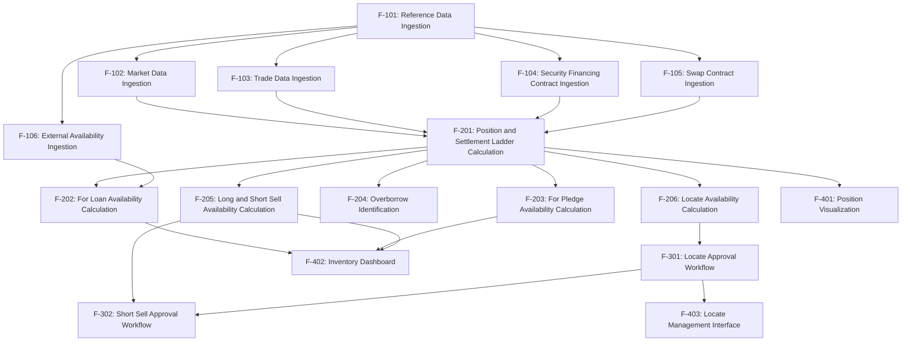
```mermaid
graph TD
    F101[F-101: Reference Data Ingestion] --> F102[F-102: Market Data Ingestion]
    F101 --> F103[F-103: Trade Data Ingestion]
    F101 --> F104[F-104: Security Financing Contract Ingestion]
    F101 --> F105[F-105: Swap Contract Ingestion]
    F101 --> F106[F-106: External Availability Ingestion]
    
    F102 --> F201[F-201: Position and Settlement Ladder Calculation]
    F103 --> F201
    F104 --> F201
    F105 --> F201
    
    F201 --> F202[F-202: For Loan Availability Calculation]
    F106 --> F202
    F201 --> F203[F-203: For Pledge Availability Calculation]
    F201 --> F204[F-204: Overborrow Identification]
    F201 --> F205[F-205: Long and Short Sell Availability Calculation]
    F201 --> F206[F-206: Locate Availability Calculation]
    
    F206 --> F301[F-301: Locate Approval Workflow]
    F205 --> F302[F-302: Short Sell Approval Workflow]
    F301 --> F302
    
    F201 --> F401[F-401: Position Visualization]
    F202 --> F402[F-402: Inventory Dashboard]
    F203 --> F402
    F205 --> F402
    F301 --> F403[F-403: Locate Management Interface]
```

#### 2.3.2 Integration Points

| Source Feature | Target System/Feature | Integration Type | Description |
| --- | --- | --- | --- |
| F-101 | External Data Providers | API/File | Ingest reference data from Reuters, Bloomberg, etc. |
| F-102 | Market Data Providers | API/Stream | Ingest market data from price feeds |
| F-103 | Trading Systems | API/Stream | Ingest trade data from order management systems |
| F-301 | Upstream Systems | API | Receive locate requests from client systems |
| F-302 | Order Management Systems | API | Validate short sell orders |

#### 2.3.3 Shared Components

| Component | Used By Features | Description |
| --- | --- | --- |
| Data Mapping Engine | F-101, F-102, F-103, F-104, F-105, F-106 | Maps external identifiers to internal identifiers |
| Calculation Engine | F-201, F-202, F-203, F-204, F-205, F-206 | Performs inventory calculations |
| Rule Engine | F-301, F-302, F-207 | Processes business rules for approvals and calculations |
| Messaging Infrastructure | All Features | Provides high-throughput message processing |

### 2.4 IMPLEMENTATION CONSIDERATIONS

#### 2.4.1 Technical Constraints

| Feature ID | Technical Constraints |
| --- | --- |
| F-501 | Must process 300,000+ events per second |
| F-502 | Must achieve 99.999% uptime during 24x6 operational hours |
| F-302 | Must complete workflow in under 150ms |
| F-201 | Must update calculations within 200ms of receiving data |

#### 2.4.2 Performance Requirements

| Feature ID | Performance Requirement |
| --- | --- |
| F-501 | Process 300,000+ events per second with end-to-end latency under 200ms |
| F-302 | Complete short sell approval workflow in under 150ms |
| F-201 | Update position calculations within 200ms of receiving data |
| F-401 | Dashboard load time under 3 seconds |

#### 2.4.3 Scalability Considerations

| Feature ID | Scalability Considerations |
| --- | --- |
| F-501 | Must scale to handle peak market events |
| F-504 | Must support distributed deployment across geographic locations |
| F-201 | Must scale to support full universe of tradeable securities |
| F-301 | Must handle peak locate request volumes during market open |

#### 2.4.4 Security Implications

| Feature ID | Security Implications |
| --- | --- |
| F-101 | Must secure sensitive counterparty and security data |
| F-301 | Must enforce role-based access control for locate approvals |
| F-405 | Must maintain audit trail for calculation rule changes |
| F-505 | Must ensure message integrity during transmission |

#### 2.4.5 Maintenance Requirements

| Feature ID | Maintenance Requirements |
| --- | --- |
| F-207 | Must support rule updates without system downtime |
| F-503 | Must provide comprehensive monitoring for system health |
| F-504 | Must support rolling updates across distributed components |
| F-101 | Must support reconciliation of reference data |

### 2.5 TRACEABILITY MATRIX

| Requirement ID | Business Need | Feature ID | Test Case ID |
| --- | --- | --- | --- |
| F-101-RQ-001 | Accurate security reference data | F-101 | TC-101-001 |
| F-201-RQ-001 | Real-time position visibility | F-201 | TC-201-001 |
| F-301-RQ-001 | Efficient locate approval process | F-301 | TC-301-001 |
| F-302-RQ-006 | High-performance order validation | F-302 | TC-302-006 |
| F-501-RQ-001 | Handle peak market activity | F-501 | TC-501-001 |

## 3. TECHNOLOGY STACK

### 3.1 PROGRAMMING LANGUAGES

| Component | Language | Version | Justification |
| --- | --- | --- | --- |
| Backend Services | Java | 17 LTS | High performance, mature ecosystem for financial applications, strong typing, excellent concurrency support for high-throughput processing |
| Calculation Engine | Java | 17 LTS | Optimized for numerical calculations with predictable performance characteristics and low garbage collection pauses |
| Data Processing | Scala | 2.13 | Functional programming paradigm for complex data transformations, interoperability with Java ecosystem |
| Real-time Processing | Kotlin | 1.8 | Concise syntax, coroutine support for asynchronous programming, Java interoperability |
| UI Frontend | TypeScript | 4.9 | Type safety, improved developer experience, better maintainability for complex UI components |
| Database Scripts | SQL | - | Standard query language for relational database operations |
| Infrastructure Automation | Python | 3.10 | Rich ecosystem for infrastructure tooling, monitoring, and deployment automation |

The selection of JVM-based languages (Java, Scala, Kotlin) for the backend and processing components ensures platform consistency while leveraging specific language strengths for different system aspects. TypeScript provides necessary type safety for the complex UI components required by the system.

### 3.2 FRAMEWORKS & LIBRARIES

#### 3.2.1 Backend Frameworks

| Framework | Version | Purpose | Justification |
| --- | --- | --- | --- |
| Spring Boot | 3.1 | Application framework | Industry standard for enterprise Java applications with comprehensive ecosystem |
| Akka | 2.7 | Actor model implementation | Provides robust concurrency model for distributed systems with message passing |
| Apache Kafka | 3.4 | Distributed messaging | High-throughput, fault-tolerant messaging system for event streaming |
| Hazelcast | 5.3 | In-memory data grid | Distributed caching and computing with near-cache capabilities for low-latency access |
| Quarkus | 3.0 | Microservices framework | Optimized for containerized environments with fast startup times |
| Project Reactor | 3.5 | Reactive programming | Non-blocking asynchronous processing for high-throughput event handling |

#### 3.2.2 Frontend Frameworks

| Framework | Version | Purpose | Justification |
| --- | --- | --- | --- |
| React | 18.2 | UI library | Component-based architecture for building complex, interactive UIs |
| Redux | 4.2 | State management | Predictable state container for managing complex application state |
| Material-UI | 5.13 | UI component library | Comprehensive set of pre-built components following Material Design principles |
| AG Grid | 29.3 | Data grid component | High-performance grid for displaying and manipulating large datasets |
| D3.js | 7.8 | Data visualization | Flexible library for creating custom visualizations of complex financial data |
| React Query | 4.29 | Data fetching | Efficient data fetching, caching, and state management for API interactions |

#### 3.2.3 Data Processing Libraries

| Library | Version | Purpose | Justification |
| --- | --- | --- | --- |
| Apache Spark | 3.4 | Distributed computing | Processing large datasets with parallel computation capabilities |
| Akka Streams | 2.7 | Stream processing | Backpressure-aware streaming for reliable data processing pipelines |
| Chronicle Queue | 5.23 | Persistent queue | Ultra-low latency, durable message queue for high-frequency trading systems |
| Disruptor | 3.4 | Ring buffer | High-performance inter-thread messaging for the calculation engine |
| Eclipse Collections | 11.1 | Collections framework | Memory-efficient collections optimized for financial calculations |
| JTS Topology Suite | 1.19 | Spatial operations | Geometric algorithms for market data analysis |

### 3.3 DATABASES & STORAGE

| Database | Version | Purpose | Justification |
| --- | --- | --- | --- |
| PostgreSQL | 15.3 | Primary relational database | ACID compliance, rich feature set, excellent performance for complex queries |
| TimescaleDB | 2.10 | Time-series data | Extension to PostgreSQL optimized for time-series data like market prices |
| InfluxDB | 2.7 | Tick database | Purpose-built time-series database for high-cardinality market data |
| Redis | 7.0 | Caching & pub/sub | In-memory data structure store for caching and real-time messaging |
| Elasticsearch | 8.8 | Search & analytics | Full-text search and analytics for reference data and position information |
| Apache Cassandra | 4.1 | Distributed NoSQL | Highly available, horizontally scalable database for position data |
| Amazon S3 | - | Object storage | Durable storage for historical data and audit logs |

The multi-database approach is necessary to address different data access patterns:
- TimescaleDB and InfluxDB for time-series market data with high write throughput
- PostgreSQL for transactional data with complex relationships
- Redis for caching calculation results and real-time data distribution
- Cassandra for horizontally scalable position data storage
- Elasticsearch for complex search capabilities across reference data

### 3.4 THIRD-PARTY SERVICES

#### 3.4.1 Market Data Providers

| Service | Purpose | Integration Method |
| --- | --- | --- |
| Reuters | Security reference & market data | FIX/FAST protocol, REST API |
| Bloomberg | Security reference & market data | BLPAPI, B-PIPE |
| MarkIT | ETF & index data | SFTP file transfer, REST API |
| Ultumus | ETF composition data | SFTP file transfer, REST API |
| RIMES | Index data | SFTP file transfer, REST API |

#### 3.4.2 Infrastructure Services

| Service | Purpose | Justification |
| --- | --- | --- |
| Kubernetes | Container orchestration | Industry standard for managing containerized microservices |
| Istio | Service mesh | Advanced traffic management, security, and observability |
| Prometheus | Monitoring | Time-series metrics collection with alerting capabilities |
| Grafana | Visualization | Dashboards for system metrics and business KPIs |
| ELK Stack | Log management | Centralized logging with search and analysis capabilities |
| HashiCorp Vault | Secrets management | Secure storage and management of sensitive credentials |
| Confluent Schema Registry | Schema management | Centralized schema management for Kafka messages |

#### 3.4.3 Security Services

| Service | Purpose | Justification |
| --- | --- | --- |
| Okta | Identity management | Enterprise-grade identity and access management |
| CyberArk | Privileged access | Secure management of privileged credentials |
| Aqua Security | Container security | Runtime protection for containerized applications |
| Veracode | Static code analysis | Automated security testing during development |
| Splunk | Security monitoring | Advanced threat detection and security analytics |

### 3.5 DEVELOPMENT & DEPLOYMENT

#### 3.5.1 Development Tools

| Tool | Version | Purpose | Justification |
| --- | --- | --- | --- |
| IntelliJ IDEA | 2023.1 | IDE | Comprehensive development environment for JVM languages |
| Visual Studio Code | 1.78 | Code editor | Lightweight editor with extensive plugin ecosystem |
| Git | 2.40 | Version control | Industry standard distributed version control |
| Maven | 3.9 | Build automation | Dependency management and build tool for Java projects |
| Gradle | 8.1 | Build automation | Flexible build system for multi-language projects |
| SonarQube | 9.9 | Code quality | Static code analysis for quality and security |
| JUnit | 5.9 | Testing framework | Comprehensive testing framework for Java applications |
| Mockito | 5.3 | Mocking framework | Creating test doubles for unit testing |
| Gatling | 3.9 | Load testing | Simulating high load for performance testing |

#### 3.5.2 CI/CD & Deployment

| Tool | Version | Purpose | Justification |
| --- | --- | --- | --- |
| Jenkins | 2.401 | CI/CD automation | Enterprise-grade automation server with extensive plugin ecosystem |
| GitLab CI | 16.0 | CI/CD pipelines | Integrated CI/CD with the source code management |
| Docker | 23.0 | Containerization | Standard container runtime for packaging applications |
| Kubernetes | 1.27 | Container orchestration | Managing containerized applications at scale |
| Helm | 3.12 | Package management | Kubernetes application packaging |
| ArgoCD | 2.7 | GitOps | Declarative, GitOps continuous delivery for Kubernetes |
| Terraform | 1.4 | Infrastructure as Code | Declarative infrastructure provisioning |
| Ansible | 2.15 | Configuration management | Automating infrastructure configuration |

### 3.6 ARCHITECTURE DIAGRAM

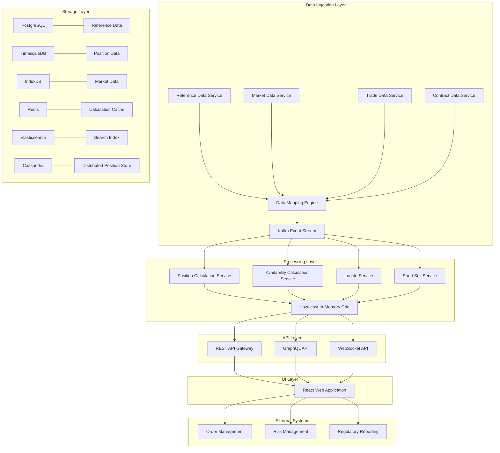
```mermaid
graph TD
    subgraph "Data Ingestion Layer"
        A1[Reference Data Service] --> B1[Data Mapping Engine]
        A2[Market Data Service] --> B1
        A3[Trade Data Service] --> B1
        A4[Contract Data Service] --> B1
        B1 --> C1[Kafka Event Stream]
    end
    
    subgraph "Processing Layer"
        C1 --> D1[Position Calculation Service]
        C1 --> D2[Availability Calculation Service]
        C1 --> D3[Locate Service]
        C1 --> D4[Short Sell Service]
        D1 --> E1[Hazelcast In-Memory Grid]
        D2 --> E1
        D3 --> E1
        D4 --> E1
    end
    
    subgraph "Storage Layer"
        F1[PostgreSQL] --- G1[Reference Data]
        F2[TimescaleDB] --- G2[Position Data]
        F3[InfluxDB] --- G3[Market Data]
        F4[Redis] --- G4[Calculation Cache]
        F5[Elasticsearch] --- G5[Search Index]
        F6[Cassandra] --- G6[Distributed Position Store]
    end
    
    subgraph "API Layer"
        E1 --> H1[REST API Gateway]
        E1 --> H2[GraphQL API]
        E1 --> H3[WebSocket API]
    end
    
    subgraph "UI Layer"
        H1 --> I1[React Web Application]
        H2 --> I1
        H3 --> I1
    end
    
    subgraph "External Systems"
        I1 --> J1[Order Management]
        I1 --> J2[Risk Management]
        I1 --> J3[Regulatory Reporting]
    end
```

The architecture follows a microservices approach with event-driven communication through Kafka. The system is designed for high throughput with specialized components for different aspects of inventory management. The storage layer uses purpose-built databases for different data types, and the processing layer leverages in-memory data grid technology for low-latency calculations.

## 4. PROCESS FLOWCHART

### 4.1 SYSTEM WORKFLOWS

#### 4.1.1 Core Business Processes

##### Data Ingestion and Processing Workflow

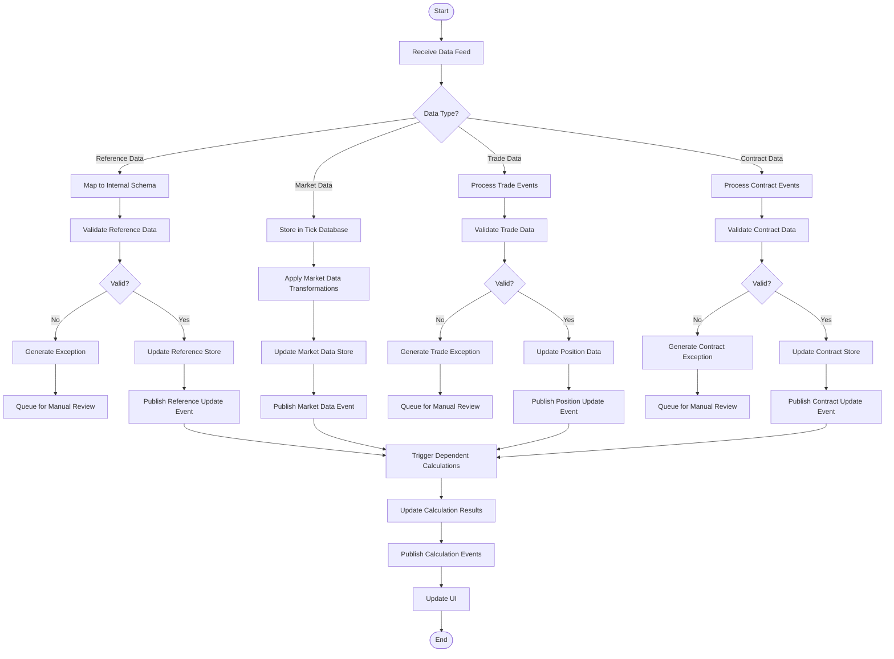
```mermaid
flowchart TD
    Start([Start]) --> A[Receive Data Feed]
    A --> B{Data Type?}
    B -->|Reference Data| C[Map to Internal Schema]
    B -->|Market Data| D[Store in Tick Database]
    B -->|Trade Data| E[Process Trade Events]
    B -->|Contract Data| F[Process Contract Events]
    
    C --> G[Validate Reference Data]
    G --> H{Valid?}
    H -->|Yes| I[Update Reference Store]
    H -->|No| J[Generate Exception]
    J --> K[Queue for Manual Review]
    I --> L[Publish Reference Update Event]
    
    D --> M[Apply Market Data Transformations]
    M --> N[Update Market Data Store]
    N --> O[Publish Market Data Event]
    
    E --> P[Validate Trade Data]
    P --> Q{Valid?}
    Q -->|Yes| R[Update Position Data]
    Q -->|No| S[Generate Trade Exception]
    S --> T[Queue for Manual Review]
    R --> U[Publish Position Update Event]
    
    F --> V[Validate Contract Data]
    V --> W{Valid?}
    W -->|Yes| X[Update Contract Store]
    W -->|No| Y[Generate Contract Exception]
    Y --> Z[Queue for Manual Review]
    X --> AA[Publish Contract Update Event]
    
    L --> AB[Trigger Dependent Calculations]
    O --> AB
    U --> AB
    AA --> AB
    
    AB --> AC[Update Calculation Results]
    AC --> AD[Publish Calculation Events]
    AD --> AE[Update UI]
    AE --> End([End])
```

##### Locate Approval Workflow

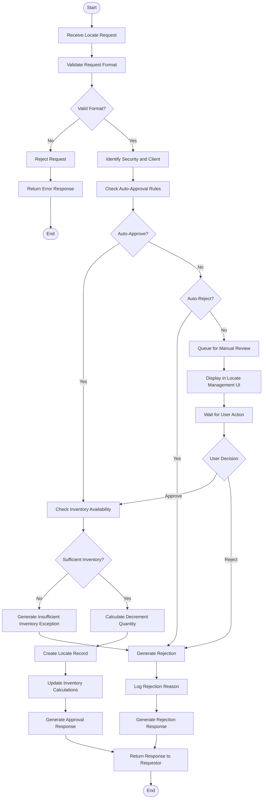
```mermaid
flowchart TD
    Start([Start]) --> A[Receive Locate Request]
    A --> B[Validate Request Format]
    B --> C{Valid Format?}
    C -->|No| D[Reject Request]
    D --> E[Return Error Response]
    E --> End1([End])
    
    C -->|Yes| F[Identify Security and Client]
    F --> G[Check Auto-Approval Rules]
    G --> H{Auto-Approve?}
    H -->|Yes| I[Check Inventory Availability]
    H -->|No| J{Auto-Reject?}
    
    J -->|Yes| K[Generate Rejection]
    J -->|No| L[Queue for Manual Review]
    L --> M[Display in Locate Management UI]
    M --> N[Wait for User Action]
    N --> O{User Decision}
    O -->|Approve| I
    O -->|Reject| K
    
    I --> P{Sufficient Inventory?}
    P -->|No| Q[Generate Insufficient Inventory Exception]
    Q --> K
    P -->|Yes| R[Calculate Decrement Quantity]
    R --> S[Create Locate Record]
    S --> T[Update Inventory Calculations]
    T --> U[Generate Approval Response]
    
    K --> V[Log Rejection Reason]
    V --> W[Generate Rejection Response]
    
    U --> X[Return Response to Requestor]
    W --> X
    X --> End2([End])
```

##### Short Sell Approval Workflow

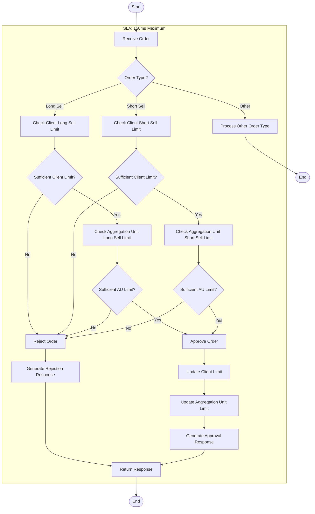
```mermaid
flowchart TD
    Start([Start]) --> A[Receive Order]
    A --> B{Order Type?}
    B -->|Long Sell| C[Check Client Long Sell Limit]
    B -->|Short Sell| D[Check Client Short Sell Limit]
    B -->|Other| E[Process Other Order Type]
    E --> End1([End])
    
    C --> F{Sufficient Client Limit?}
    F -->|No| G[Reject Order]
    F -->|Yes| H[Check Aggregation Unit Long Sell Limit]
    
    D --> I{Sufficient Client Limit?}
    I -->|No| G
    I -->|Yes| J[Check Aggregation Unit Short Sell Limit]
    
    H --> K{Sufficient AU Limit?}
    K -->|No| G
    K -->|Yes| L[Approve Order]
    
    J --> M{Sufficient AU Limit?}
    M -->|No| G
    M -->|Yes| L
    
    G --> N[Generate Rejection Response]
    L --> O[Update Client Limit]
    O --> P[Update Aggregation Unit Limit]
    P --> Q[Generate Approval Response]
    
    N --> R[Return Response]
    Q --> R
    R --> End2([End])
    
    subgraph "SLA: 150ms Maximum"
        A
        B
        C
        D
        E
        F
        G
        H
        I
        J
        K
        L
        M
        N
        O
        P
        Q
        R
    end
```

#### 4.1.2 Integration Workflows

##### Data Integration Flow

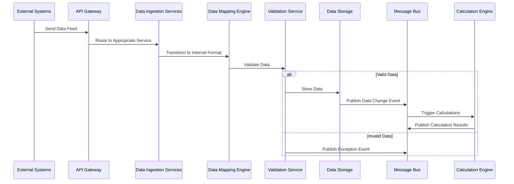
```mermaid
sequenceDiagram
    participant External as External Systems
    participant Gateway as API Gateway
    participant Ingestion as Data Ingestion Services
    participant Mapping as Data Mapping Engine
    participant Validation as Validation Service
    participant Storage as Data Storage
    participant Messaging as Message Bus
    participant Calculation as Calculation Engine
    
    External->>Gateway: Send Data Feed
    Gateway->>Ingestion: Route to Appropriate Service
    Ingestion->>Mapping: Transform to Internal Format
    Mapping->>Validation: Validate Data
    
    alt Valid Data
        Validation->>Storage: Store Data
        Storage->>Messaging: Publish Data Change Event
        Messaging->>Calculation: Trigger Calculations
        Calculation->>Messaging: Publish Calculation Results
    else Invalid Data
        Validation->>Messaging: Publish Exception Event
    end
```

##### Batch Processing Sequence

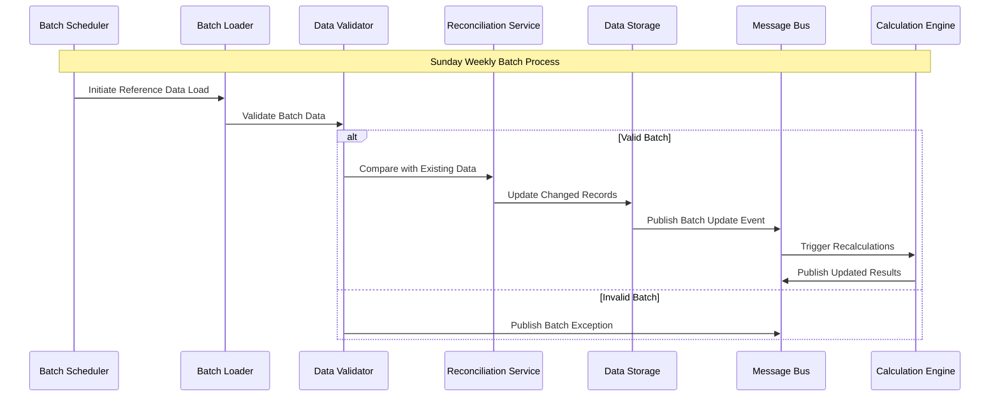
```mermaid
sequenceDiagram
    participant Scheduler as Batch Scheduler
    participant Loader as Batch Loader
    participant Validator as Data Validator
    participant Reconciliation as Reconciliation Service
    participant Storage as Data Storage
    participant Messaging as Message Bus
    participant Calculation as Calculation Engine
    
    Note over Scheduler,Calculation: Sunday Weekly Batch Process
    
    Scheduler->>Loader: Initiate Reference Data Load
    Loader->>Validator: Validate Batch Data
    
    alt Valid Batch
        Validator->>Reconciliation: Compare with Existing Data
        Reconciliation->>Storage: Update Changed Records
        Storage->>Messaging: Publish Batch Update Event
        Messaging->>Calculation: Trigger Recalculations
        Calculation->>Messaging: Publish Updated Results
    else Invalid Batch
        Validator->>Messaging: Publish Batch Exception
    end
```

### 4.2 FLOWCHART REQUIREMENTS

#### 4.2.1 Position Calculation Workflow

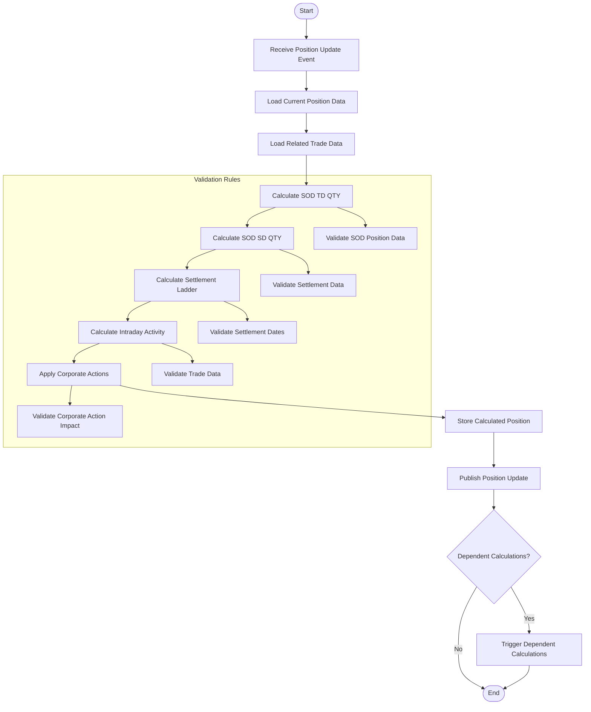
```mermaid
flowchart TD
    Start([Start]) --> A[Receive Position Update Event]
    A --> B[Load Current Position Data]
    B --> C[Load Related Trade Data]
    C --> D[Calculate SOD TD QTY]
    D --> E[Calculate SOD SD QTY]
    E --> F[Calculate Settlement Ladder]
    F --> G[Calculate Intraday Activity]
    G --> H[Apply Corporate Actions]
    H --> I[Store Calculated Position]
    I --> J[Publish Position Update]
    J --> K{Dependent Calculations?}
    K -->|Yes| L[Trigger Dependent Calculations]
    K -->|No| End([End])
    L --> End
    
    subgraph "Validation Rules"
        D --> D1[Validate SOD Position Data]
        E --> E1[Validate Settlement Data]
        F --> F1[Validate Settlement Dates]
        G --> G1[Validate Trade Data]
        H --> H1[Validate Corporate Action Impact]
    end
```

#### 4.2.2 For Loan Availability Calculation

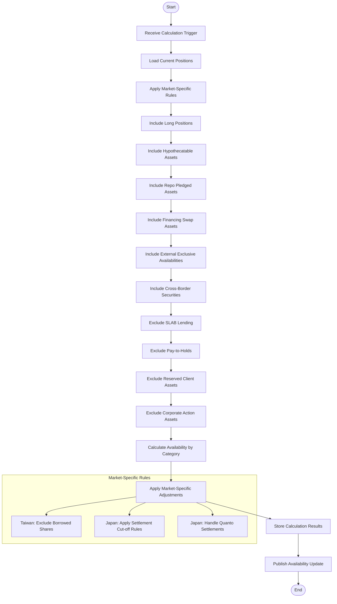
```mermaid
flowchart TD
    Start([Start]) --> A[Receive Calculation Trigger]
    A --> B[Load Current Positions]
    B --> C[Apply Market-Specific Rules]
    
    C --> D[Include Long Positions]
    D --> E[Include Hypothecatable Assets]
    E --> F[Include Repo Pledged Assets]
    F --> G[Include Financing Swap Assets]
    G --> H[Include External Exclusive Availabilities]
    H --> I[Include Cross-Border Securities]
    
    I --> J[Exclude SLAB Lending]
    J --> K[Exclude Pay-to-Holds]
    K --> L[Exclude Reserved Client Assets]
    L --> M[Exclude Corporate Action Assets]
    
    M --> N[Calculate Availability by Category]
    N --> O[Apply Market-Specific Adjustments]
    O --> P[Store Calculation Results]
    P --> Q[Publish Availability Update]
    Q --> End([End])
    
    subgraph "Market-Specific Rules"
        O --> O1[Taiwan: Exclude Borrowed Shares]
        O --> O2[Japan: Apply Settlement Cut-off Rules]
        O --> O3[Japan: Handle Quanto Settlements]
    end
```

#### 4.2.3 Error Handling Flow

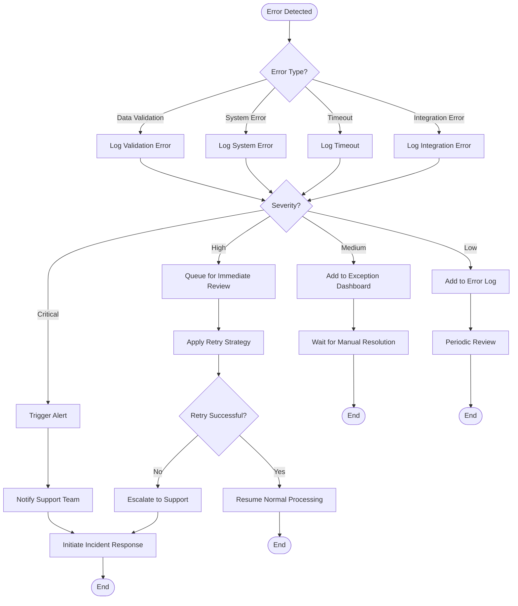
```mermaid
flowchart TD
    Start([Error Detected]) --> A{Error Type?}
    A -->|Data Validation| B[Log Validation Error]
    A -->|System Error| C[Log System Error]
    A -->|Timeout| D[Log Timeout]
    A -->|Integration Error| E[Log Integration Error]
    
    B --> F{Severity?}
    C --> F
    D --> F
    E --> F
    
    F -->|Critical| G[Trigger Alert]
    F -->|High| H[Queue for Immediate Review]
    F -->|Medium| I[Add to Exception Dashboard]
    F -->|Low| J[Add to Error Log]
    
    G --> K[Notify Support Team]
    H --> L[Apply Retry Strategy]
    
    L --> M{Retry Successful?}
    M -->|Yes| N[Resume Normal Processing]
    M -->|No| O[Escalate to Support]
    
    I --> P[Wait for Manual Resolution]
    J --> Q[Periodic Review]
    
    K --> R[Initiate Incident Response]
    O --> R
    
    N --> End1([End])
    P --> End2([End])
    Q --> End3([End])
    R --> End4([End])
```

### 4.3 TECHNICAL IMPLEMENTATION

#### 4.3.1 State Management

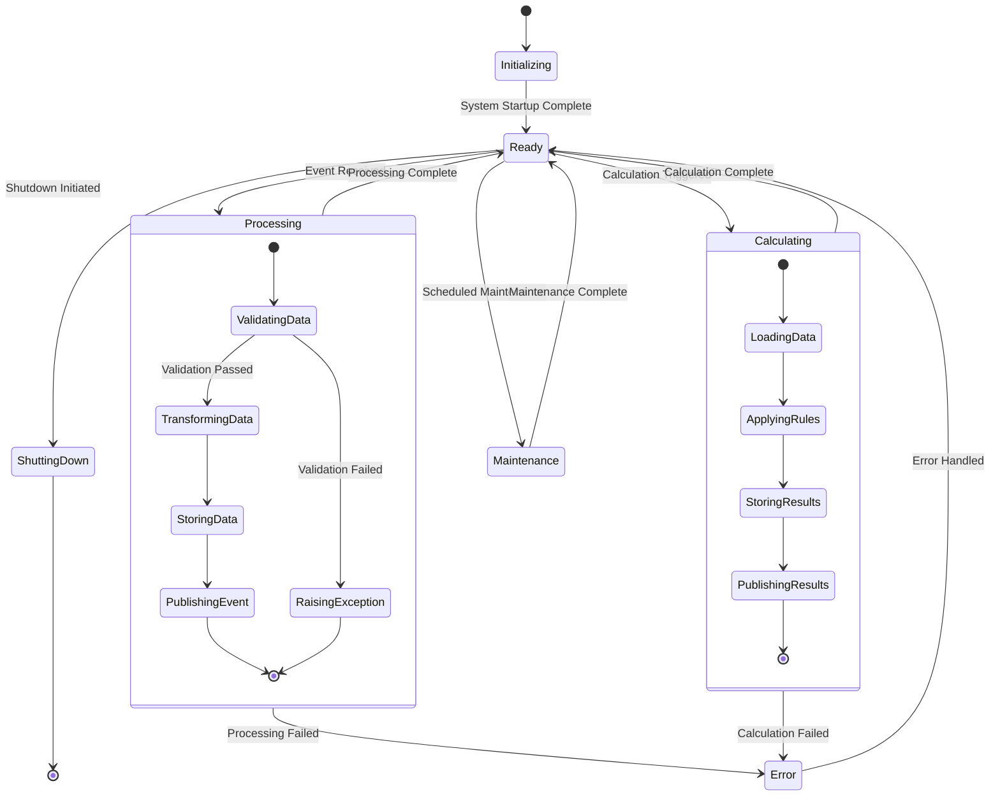
```mermaid
stateDiagram-v2
    [*] --> Initializing
    Initializing --> Ready: System Startup Complete
    
    Ready --> Processing: Event Received
    Processing --> Ready: Processing Complete
    Processing --> Error: Processing Failed
    Error --> Ready: Error Handled
    
    Ready --> Calculating: Calculation Triggered
    Calculating --> Ready: Calculation Complete
    Calculating --> Error: Calculation Failed
    
    Ready --> Maintenance: Scheduled Maintenance
    Maintenance --> Ready: Maintenance Complete
    
    Ready --> ShuttingDown: Shutdown Initiated
    ShuttingDown --> [*]
    
    state Processing {
        [*] --> ValidatingData
        ValidatingData --> TransformingData: Validation Passed
        ValidatingData --> RaisingException: Validation Failed
        TransformingData --> StoringData
        StoringData --> PublishingEvent
        PublishingEvent --> [*]
        RaisingException --> [*]
    }
    
    state Calculating {
        [*] --> LoadingData
        LoadingData --> ApplyingRules
        ApplyingRules --> StoringResults
        StoringResults --> PublishingResults
        PublishingResults --> [*]
    }
```

#### 4.3.2 Transaction Boundaries

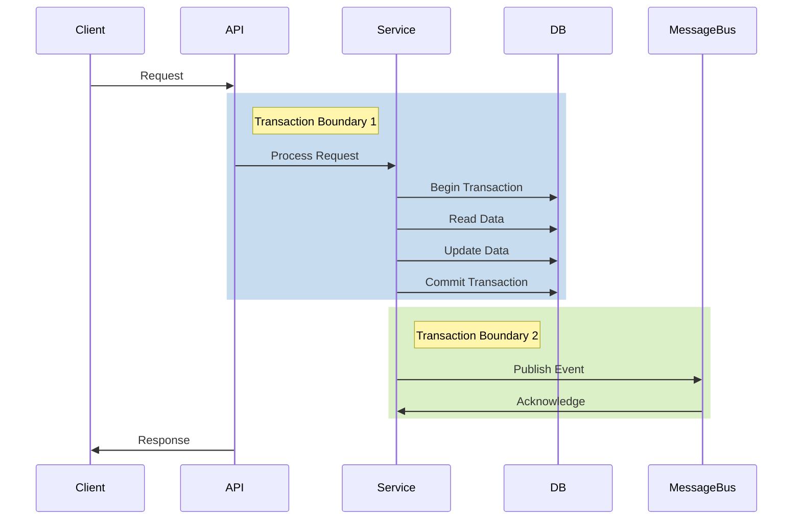
```mermaid
sequenceDiagram
    participant Client
    participant API
    participant Service
    participant DB
    participant MessageBus
    
    Client->>API: Request
    
    rect rgb(200, 220, 240)
    note right of API: Transaction Boundary 1
    API->>Service: Process Request
    Service->>DB: Begin Transaction
    Service->>DB: Read Data
    Service->>DB: Update Data
    Service->>DB: Commit Transaction
    end
    
    rect rgb(220, 240, 200)
    note right of Service: Transaction Boundary 2
    Service->>MessageBus: Publish Event
    MessageBus->>Service: Acknowledge
    end
    
    API->>Client: Response
```

### 4.4 HIGH-LEVEL SYSTEM WORKFLOW

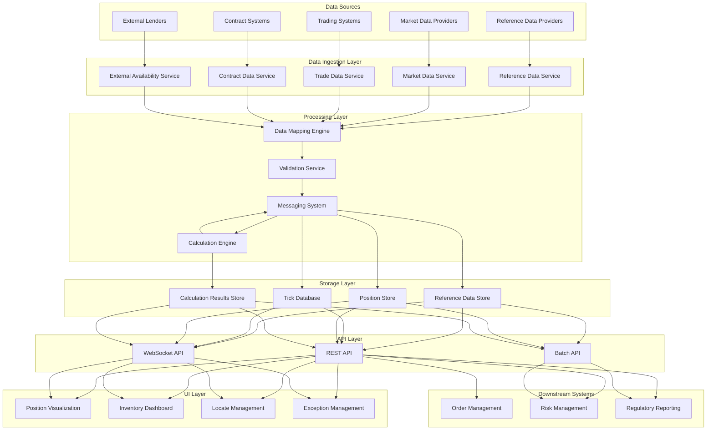
```mermaid
flowchart TD
    subgraph "Data Sources"
        A1[Reference Data Providers]
        A2[Market Data Providers]
        A3[Trading Systems]
        A4[Contract Systems]
        A5[External Lenders]
    end
    
    subgraph "Data Ingestion Layer"
        B1[Reference Data Service]
        B2[Market Data Service]
        B3[Trade Data Service]
        B4[Contract Data Service]
        B5[External Availability Service]
    end
    
    subgraph "Processing Layer"
        C1[Data Mapping Engine]
        C2[Validation Service]
        C3[Messaging System]
        C4[Calculation Engine]
    end
    
    subgraph "Storage Layer"
        D1[Reference Data Store]
        D2[Tick Database]
        D3[Position Store]
        D4[Calculation Results Store]
    end
    
    subgraph "API Layer"
        E1[REST API]
        E2[WebSocket API]
        E3[Batch API]
    end
    
    subgraph "UI Layer"
        F1[Position Visualization]
        F2[Inventory Dashboard]
        F3[Locate Management]
        F4[Exception Management]
    end
    
    subgraph "Downstream Systems"
        G1[Order Management]
        G2[Risk Management]
        G3[Regulatory Reporting]
    end
    
    A1 --> B1
    A2 --> B2
    A3 --> B3
    A4 --> B4
    A5 --> B5
    
    B1 --> C1
    B2 --> C1
    B3 --> C1
    B4 --> C1
    B5 --> C1
    
    C1 --> C2
    C2 --> C3
    
    C3 --> D1
    C3 --> D2
    C3 --> D3
    
    C3 --> C4
    C4 --> C3
    C4 --> D4
    
    D1 --> E1
    D2 --> E1
    D3 --> E1
    D4 --> E1
    
    D1 --> E2
    D2 --> E2
    D3 --> E2
    D4 --> E2
    
    D1 --> E3
    D3 --> E3
    D4 --> E3
    
    E1 --> F1
    E1 --> F2
    E1 --> F3
    E1 --> F4
    
    E2 --> F1
    E2 --> F2
    E2 --> F3
    E2 --> F4
    
    E1 --> G1
    E1 --> G2
    E1 --> G3
    
    E3 --> G2
    E3 --> G3
```

### 4.5 DETAILED PROCESS FLOWS

#### 4.5.1 Reference Data Ingestion Process

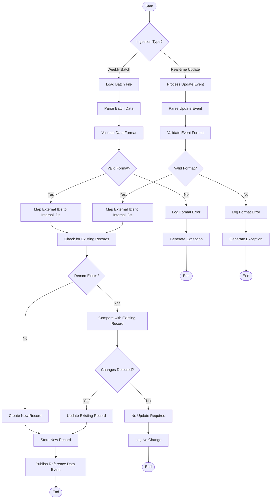
```mermaid
flowchart TD
    Start([Start]) --> A{Ingestion Type?}
    A -->|Weekly Batch| B[Load Batch File]
    A -->|Real-time Update| C[Process Update Event]
    
    B --> D[Parse Batch Data]
    D --> E[Validate Data Format]
    E --> F{Valid Format?}
    F -->|No| G[Log Format Error]
    G --> H[Generate Exception]
    F -->|Yes| I[Map External IDs to Internal IDs]
    
    C --> J[Parse Update Event]
    J --> K[Validate Event Format]
    K --> L{Valid Format?}
    L -->|No| M[Log Format Error]
    M --> N[Generate Exception]
    L -->|Yes| O[Map External IDs to Internal IDs]
    
    I --> P[Check for Existing Records]
    O --> P
    
    P --> Q{Record Exists?}
    Q -->|Yes| R[Compare with Existing Record]
    Q -->|No| S[Create New Record]
    
    R --> T{Changes Detected?}
    T -->|No| U[No Update Required]
    T -->|Yes| V[Update Existing Record]
    
    S --> W[Store New Record]
    V --> W
    
    W --> X[Publish Reference Data Event]
    U --> Y[Log No Change]
    
    H --> End1([End])
    N --> End2([End])
    X --> End3([End])
    Y --> End4([End])
```

#### 4.5.2 Short Sell Approval Detailed Flow

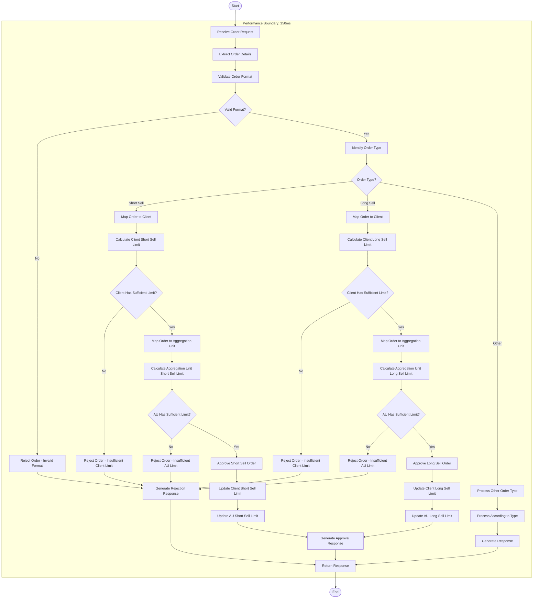
```mermaid
flowchart TD
    Start([Start]) --> A[Receive Order Request]
    A --> B[Extract Order Details]
    B --> C[Validate Order Format]
    C --> D{Valid Format?}
    D -->|No| E[Reject Order - Invalid Format]
    D -->|Yes| F[Identify Order Type]
    
    F --> G{Order Type?}
    G -->|Short Sell| H[Map Order to Client]
    G -->|Long Sell| I[Map Order to Client]
    G -->|Other| J[Process Other Order Type]
    
    H --> K[Calculate Client Short Sell Limit]
    I --> L[Calculate Client Long Sell Limit]
    
    K --> M{Client Has Sufficient Limit?}
    M -->|No| N[Reject Order - Insufficient Client Limit]
    M -->|Yes| O[Map Order to Aggregation Unit]
    
    L --> P{Client Has Sufficient Limit?}
    P -->|No| Q[Reject Order - Insufficient Client Limit]
    P -->|Yes| R[Map Order to Aggregation Unit]
    
    O --> S[Calculate Aggregation Unit Short Sell Limit]
    R --> T[Calculate Aggregation Unit Long Sell Limit]
    
    S --> U{AU Has Sufficient Limit?}
    U -->|No| V[Reject Order - Insufficient AU Limit]
    U -->|Yes| W[Approve Short Sell Order]
    
    T --> X{AU Has Sufficient Limit?}
    X -->|No| Y[Reject Order - Insufficient AU Limit]
    X -->|Yes| Z[Approve Long Sell Order]
    
    W --> AA[Update Client Short Sell Limit]
    Z --> AB[Update Client Long Sell Limit]
    
    AA --> AC[Update AU Short Sell Limit]
    AB --> AD[Update AU Long Sell Limit]
    
    AC --> AE[Generate Approval Response]
    AD --> AE
    
    E --> AF[Generate Rejection Response]
    N --> AF
    Q --> AF
    V --> AF
    Y --> AF
    
    J --> AG[Process According to Type]
    AG --> AH[Generate Response]
    
    AE --> AI[Return Response]
    AF --> AI
    AH --> AI
    
    AI --> End([End])
    
    subgraph "Performance Boundary: 150ms"
        A
        B
        C
        D
        E
        F
        G
        H
        I
        J
        K
        L
        M
        N
        O
        P
        Q
        R
        S
        T
        U
        V
        W
        X
        Y
        Z
        AA
        AB
        AC
        AD
        AE
        AF
        AG
        AH
        AI
    end
```

### 4.6 INTEGRATION SEQUENCE DIAGRAMS

#### 4.6.1 Market Data Integration

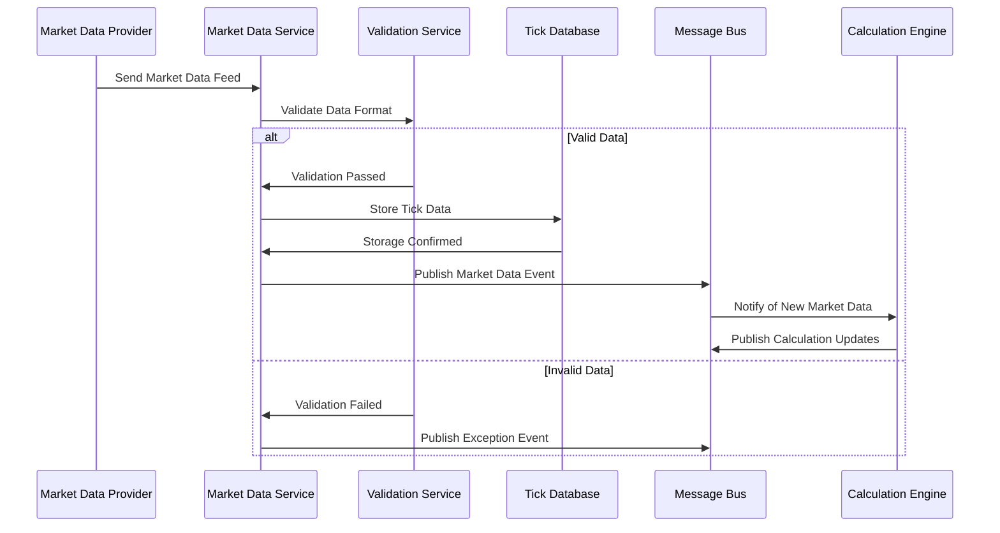
```mermaid
sequenceDiagram
    participant MDP as Market Data Provider
    participant MDS as Market Data Service
    participant VAL as Validation Service
    participant TDB as Tick Database
    participant MSG as Message Bus
    participant CAL as Calculation Engine
    
    MDP->>MDS: Send Market Data Feed
    MDS->>VAL: Validate Data Format
    
    alt Valid Data
        VAL->>MDS: Validation Passed
        MDS->>TDB: Store Tick Data
        TDB->>MDS: Storage Confirmed
        MDS->>MSG: Publish Market Data Event
        MSG->>CAL: Notify of New Market Data
        CAL->>MSG: Publish Calculation Updates
    else Invalid Data
        VAL->>MDS: Validation Failed
        MDS->>MSG: Publish Exception Event
    end
```

#### 4.6.2 Locate Request Integration

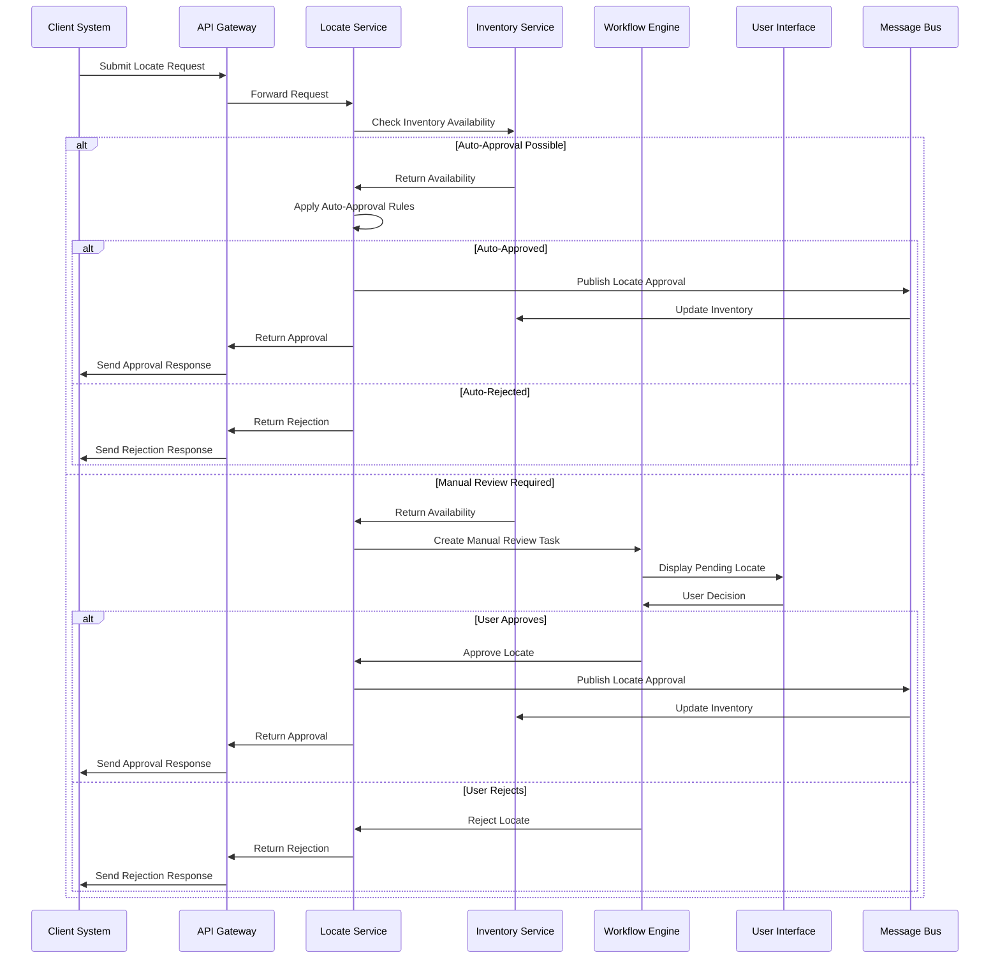
```mermaid
sequenceDiagram
    participant Client as Client System
    participant API as API Gateway
    participant LOC as Locate Service
    participant INV as Inventory Service
    participant WF as Workflow Engine
    participant UI as User Interface
    participant MSG as Message Bus
    
    Client->>API: Submit Locate Request
    API->>LOC: Forward Request
    LOC->>INV: Check Inventory Availability
    
    alt Auto-Approval Possible
        INV->>LOC: Return Availability
        LOC->>LOC: Apply Auto-Approval Rules
        
        alt Auto-Approved
            LOC->>MSG: Publish Locate Approval
            MSG->>INV: Update Inventory
            LOC->>API: Return Approval
            API->>Client: Send Approval Response
        else Auto-Rejected
            LOC->>API: Return Rejection
            API->>Client: Send Rejection Response
        end
    else Manual Review Required
        INV->>LOC: Return Availability
        LOC->>WF: Create Manual Review Task
        WF->>UI: Display Pending Locate
        
        UI->>WF: User Decision
        
        alt User Approves
            WF->>LOC: Approve Locate
            LOC->>MSG: Publish Locate Approval
            MSG->>INV: Update Inventory
            LOC->>API: Return Approval
            API->>Client: Send Approval Response
        else User Rejects
            WF->>LOC: Reject Locate
            LOC->>API: Return Rejection
            API->>Client: Send Rejection Response
        end
    end
```

## 5. SYSTEM ARCHITECTURE

### 5.1 HIGH-LEVEL ARCHITECTURE

#### 5.1.1 System Overview

The Inventory Management System (IMS) follows an event-driven microservices architecture to achieve the high throughput, resilience, and flexibility required for real-time inventory calculations across global markets. This architectural approach was selected to address several key requirements:

- **Event-Driven Processing**: The system processes over 300,000 events per second with end-to-end latency under 200ms, requiring a highly optimized event processing pipeline.
- **Distributed Deployment**: Components can be deployed across geographic regions to minimize latency for market-specific operations while maintaining global data consistency.
- **Resilience and Redundancy**: The architecture supports partial failures without significant impact on user experience, achieving 99.999% uptime during operational hours.
- **Scalability**: The system scales horizontally to handle peak loads during market events and to accommodate the full universe of tradeable securities.

Key architectural principles include:

- **Domain-Driven Design**: The system is organized around business domains (data ingestion, calculation, workflow management) with clear boundaries.
- **Command Query Responsibility Segregation (CQRS)**: Separates read and write operations to optimize for high-throughput calculations and responsive queries.
- **Event Sourcing**: Maintains an immutable log of all events to ensure data integrity and support audit requirements.
- **Polyglot Persistence**: Utilizes specialized databases for different data types (time-series, relational, in-memory) to optimize performance.

System boundaries encompass data ingestion from external sources, internal processing and calculations, and distribution to downstream systems and user interfaces. Major interfaces include REST APIs, WebSocket connections for real-time updates, and message-based integration with external systems.

#### 5.1.2 Core Components Table

| Component Name | Primary Responsibility | Key Dependencies | Critical Considerations |
| --- | --- | --- | --- |
| Data Ingestion Services | Receive and normalize data from external sources | External data providers, Data mapping engine | Must handle diverse data formats and ensure data quality |
| Data Mapping Engine | Transform external identifiers to internal schema | Reference data store | Must resolve conflicts and maintain data lineage |
| Calculation Engine | Perform inventory calculations | Position data, Market data, Reference data | Must achieve sub-200ms performance for all calculations |
| Position Service | Maintain real-time position data | Trade data, Settlement data | Must handle high-frequency updates |
| Inventory Service | Calculate availability across different categories | Position data, Market rules | Must support market-specific rule customization |
| Workflow Engine | Manage locate and short sell approval processes | Inventory data, Client limits | Must complete workflows within SLA (150ms for short sell) |
| Message Bus | Facilitate asynchronous communication between services | None | Must guarantee message delivery with at-least-once semantics |
| API Gateway | Provide unified access point for external systems | All internal services | Must enforce security and handle high request volumes |
| User Interface | Present data and workflows to end users | API Gateway | Must support responsive visualization of large datasets |

#### 5.1.3 Data Flow Description

The IMS data flow begins with parallel ingestion streams for reference data, market data, trade data, and contract data. Each ingestion service validates and normalizes incoming data before publishing events to the central message bus.

The message bus serves as the backbone of the system, implementing a publish-subscribe pattern that allows services to consume only relevant events. This approach decouples services and enables independent scaling. The message bus guarantees at-least-once delivery with deduplication mechanisms to handle potential duplicates.

Position and inventory calculations are triggered by relevant events. The calculation engine maintains in-memory state for high-performance processing while persisting results to appropriate data stores. Calculation results are published back to the message bus for consumption by other services and downstream systems.

Workflow processes for locate approvals and short sell validations consume position and inventory data to make decisions. These workflows may involve automated rules processing or manual intervention through the user interface.

Data is persisted in specialized stores:
- Reference data in a relational database
- Market data in a time-series database
- Position data in a distributed NoSQL database
- Calculation results in an in-memory data grid with persistence

The API layer provides access to data and functionality for both the user interface and external systems. Real-time updates are delivered via WebSocket connections, while request-response interactions use REST APIs.

#### 5.1.4 External Integration Points

| System Name | Integration Type | Data Exchange Pattern | Protocol/Format | SLA Requirements |
| --- | --- | --- | --- | --- |
| Reuters | Data Provider | Batch + Real-time | FIX/FAST, REST API | 99.9% availability, <500ms latency |
| Bloomberg | Data Provider | Batch + Real-time | BLPAPI, B-PIPE | 99.9% availability, <500ms latency |
| MarkIT | Data Provider | Batch | SFTP, REST API | Daily file delivery within maintenance window |
| Ultumus | Data Provider | Batch | SFTP, REST API | Daily file delivery within maintenance window |
| RIMES | Data Provider | Batch | SFTP, REST API | Daily file delivery within maintenance window |
| Trading Systems | Bi-directional | Real-time | FIX, REST API | 99.99% availability, <150ms response time |
| Order Management | Consumer | Real-time | REST API, WebSocket | 99.99% availability, <150ms response time |
| Risk Management | Consumer | Real-time + Batch | REST API, File Export | 99.9% availability, <1s response time |
| Regulatory Reporting | Consumer | Batch | File Export | Daily delivery within reporting window |

### 5.2 COMPONENT DETAILS

#### 5.2.1 Data Ingestion Services

**Purpose and Responsibilities**:
- Consume data from external sources (reference data, market data, trade data, contracts)
- Validate data format and content
- Transform data to internal schema
- Publish normalized data events to the message bus

**Technologies and Frameworks**:
- Java/Kotlin microservices using Spring Boot
- Apache Kafka for message streaming
- Custom validation and transformation libraries
- Resilience4j for circuit breaking and retry logic

**Key Interfaces and APIs**:
- Provider-specific adapters for external data sources
- Internal event publishing interface to message bus
- Management API for monitoring and control
- Configuration API for data mapping rules

**Data Persistence Requirements**:
- Temporary storage for in-flight data
- Persistent storage for data mapping configurations
- Error queue for invalid data

**Scaling Considerations**:
- Horizontal scaling based on data volume
- Independent scaling for different data types
- Regional deployment for market-specific data sources

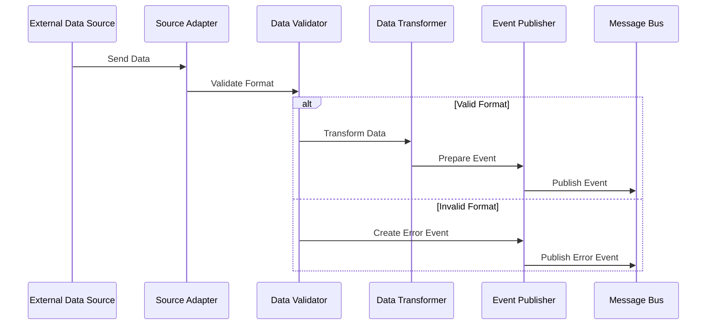
```mermaid
sequenceDiagram
    participant External as External Data Source
    participant Adapter as Source Adapter
    participant Validator as Data Validator
    participant Transformer as Data Transformer
    participant Publisher as Event Publisher
    participant Bus as Message Bus
    
    External->>Adapter: Send Data
    Adapter->>Validator: Validate Format
    
    alt Valid Format
        Validator->>Transformer: Transform Data
        Transformer->>Publisher: Prepare Event
        Publisher->>Bus: Publish Event
    else Invalid Format
        Validator->>Publisher: Create Error Event
        Publisher->>Bus: Publish Error Event
    end
```

#### 5.2.2 Calculation Engine

**Purpose and Responsibilities**:
- Process position and inventory data
- Apply calculation rules for different markets and use cases
- Generate real-time inventory availability metrics
- Support customizable calculation rules

**Technologies and Frameworks**:
- Java with high-performance libraries (Eclipse Collections, Disruptor)
- Hazelcast for distributed in-memory computing
- Custom rule engine for market-specific calculations
- Project Reactor for reactive processing

**Key Interfaces and APIs**:
- Event consumer interface for position updates
- Event publisher interface for calculation results
- Rule configuration API
- Query API for calculation results

**Data Persistence Requirements**:
- In-memory state for active calculations
- Persistent storage for calculation rules
- Calculation result cache with persistence

**Scaling Considerations**:
- Vertical scaling for computation-intensive nodes
- Horizontal scaling for parallel processing
- Data locality for market-specific calculations

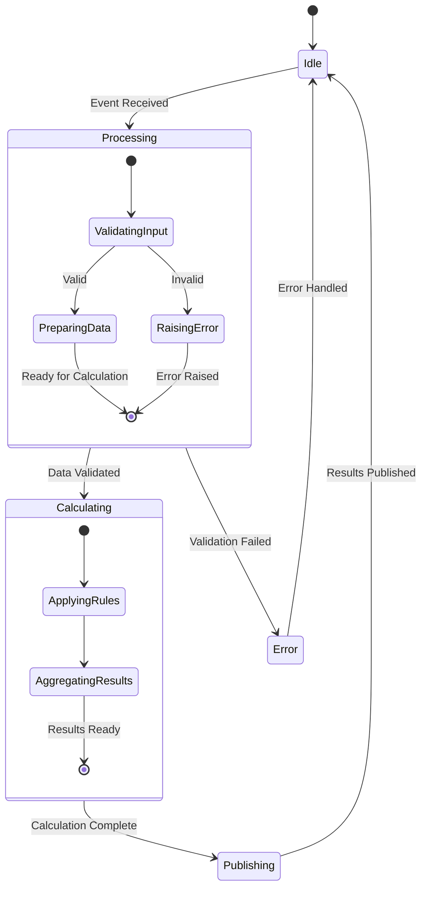
```mermaid
stateDiagram-v2
    [*] --> Idle
    Idle --> Processing: Event Received
    Processing --> Calculating: Data Validated
    Processing --> Error: Validation Failed
    Calculating --> Publishing: Calculation Complete
    Publishing --> Idle: Results Published
    Error --> Idle: Error Handled
    
    state Processing {
        [*] --> ValidatingInput
        ValidatingInput --> PreparingData: Valid
        ValidatingInput --> RaisingError: Invalid
        PreparingData --> [*]: Ready for Calculation
        RaisingError --> [*]: Error Raised
    }
    
    state Calculating {
        [*] --> ApplyingRules
        ApplyingRules --> AggregatingResults
        AggregatingResults --> [*]: Results Ready
    }
```

#### 5.2.3 Workflow Engine

**Purpose and Responsibilities**:
- Manage locate approval workflows
- Process short sell approval requests
- Apply auto-approval rules
- Facilitate manual review processes

**Technologies and Frameworks**:
- Java/Kotlin microservices
- Camunda BPM for workflow orchestration
- Redis for distributed state management
- Custom rule engine for approval logic

**Key Interfaces and APIs**:
- Workflow initiation API
- Task management API
- Rule configuration API
- Status query API

**Data Persistence Requirements**:
- Workflow state storage
- Rule configuration storage
- Audit trail for all workflow actions

**Scaling Considerations**:
- Horizontal scaling for high-volume workflows
- Regional deployment for market-specific workflows
- Stateless design for workflow execution

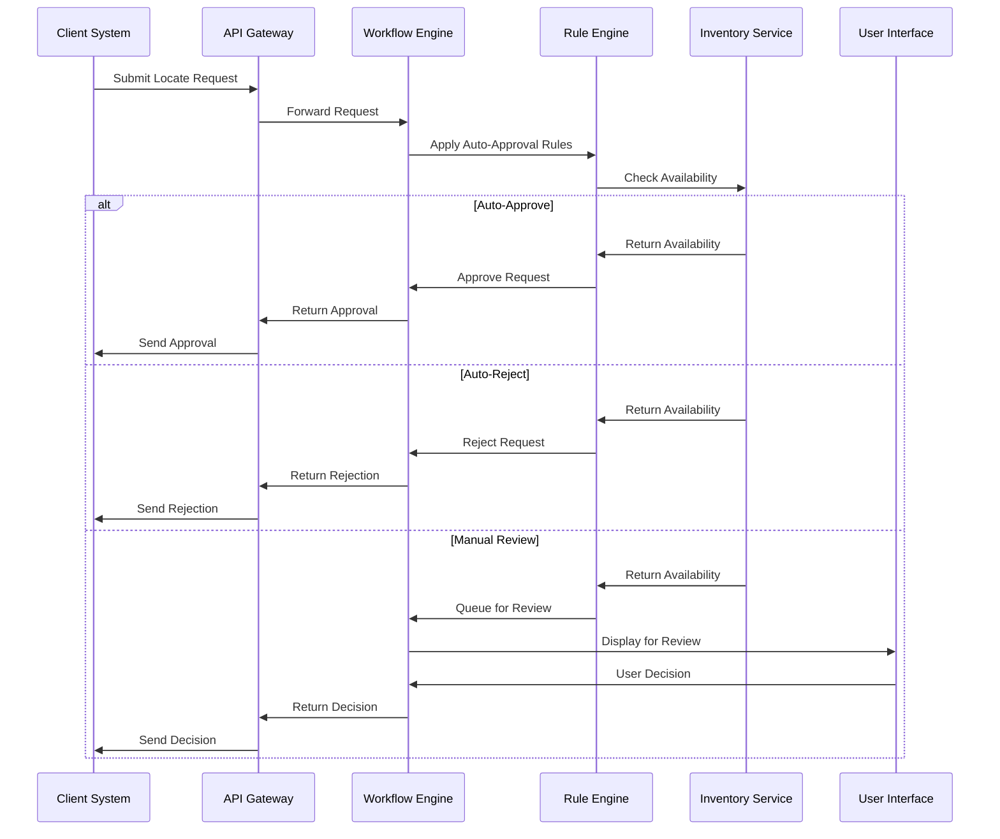
```mermaid
sequenceDiagram
    participant Client as Client System
    participant Gateway as API Gateway
    participant Workflow as Workflow Engine
    participant Rules as Rule Engine
    participant Inventory as Inventory Service
    participant UI as User Interface
    
    Client->>Gateway: Submit Locate Request
    Gateway->>Workflow: Forward Request
    Workflow->>Rules: Apply Auto-Approval Rules
    Rules->>Inventory: Check Availability
    
    alt Auto-Approve
        Inventory->>Rules: Return Availability
        Rules->>Workflow: Approve Request
        Workflow->>Gateway: Return Approval
        Gateway->>Client: Send Approval
    else Auto-Reject
        Inventory->>Rules: Return Availability
        Rules->>Workflow: Reject Request
        Workflow->>Gateway: Return Rejection
        Gateway->>Client: Send Rejection
    else Manual Review
        Inventory->>Rules: Return Availability
        Rules->>Workflow: Queue for Review
        Workflow->>UI: Display for Review
        UI->>Workflow: User Decision
        Workflow->>Gateway: Return Decision
        Gateway->>Client: Send Decision
    end
```

#### 5.2.4 API Layer

**Purpose and Responsibilities**:
- Provide unified access to system functionality
- Handle authentication and authorization
- Manage request routing and load balancing
- Support both synchronous and asynchronous communication

**Technologies and Frameworks**:
- Spring Cloud Gateway
- GraphQL for complex queries
- WebSocket for real-time updates
- OAuth2/OpenID Connect for authentication

**Key Interfaces and APIs**:
- REST API for CRUD operations
- GraphQL API for complex queries
- WebSocket API for real-time updates
- Batch API for bulk operations

**Data Persistence Requirements**:
- API key storage
- Rate limiting counters
- Request logs

**Scaling Considerations**:
- Horizontal scaling based on request volume
- Regional deployment for latency reduction
- Stateless design for request handling

```mermaid
flowchart TD
    Client[Client Application] --> Gateway[API Gateway]
    Gateway --> Auth[Authentication Service]
    Gateway --> REST[REST API]
    Gateway --> GraphQL[GraphQL API]
    Gateway --> WS[WebSocket API]
    
    REST --> Services[Internal Services]
    GraphQL --> Services
    WS --> Services
    
    Services --> Cache[Response Cache]
    Services --> Bus[Message Bus]
    
    subgraph "API Layer"
        Gateway
        Auth
        REST
        GraphQL
        WS
        Cache
    end
```

### 5.3 TECHNICAL DECISIONS

#### 5.3.1 Architecture Style Decisions

| Decision | Options Considered | Selected Approach | Rationale |
| --- | --- | --- | --- |
| Overall Architecture | Monolithic, Microservices, Service-Oriented | Event-Driven Microservices | Enables high throughput, independent scaling, and resilience required for real-time processing |
| Communication Pattern | Request-Response, Event-Driven, Hybrid | Event-Driven with Request-Response for queries | Supports high-throughput asynchronous processing while allowing direct queries for UI |
| State Management | Stateful Services, Stateless with External State, Hybrid | Stateless services with distributed state | Enables horizontal scaling while maintaining performance for stateful operations |
| Deployment Model | Centralized, Regional, Hybrid | Hybrid with core services global and edge services regional | Balances global consistency with regional performance requirements |

The event-driven microservices architecture was selected primarily to address the high-throughput requirement (300,000+ events per second) while maintaining sub-200ms end-to-end latency. This approach allows for:

- Independent scaling of components based on load
- Resilience through service isolation
- Flexibility in deployment across geographic regions
- Optimized data processing pipelines for different data types

The hybrid communication pattern combines event-driven processing for high-throughput operations with request-response for user queries, providing the best of both worlds for different use cases.

```mermaid
flowchart TD
    A[Architecture Decision] --> B{Primary Requirement?}
    B -->|Throughput| C[Event-Driven]
    B -->|Consistency| D[Request-Response]
    B -->|Both| E[Hybrid Approach]
    
    C --> F{Deployment Model?}
    D --> F
    E --> F
    
    F -->|Global| G[Centralized]
    F -->|Regional| H[Distributed]
    F -->|Mixed| I[Hybrid]
    
    G --> J{State Management?}
    H --> J
    I --> J
    
    J -->|Stateful| K[Vertical Scaling]
    J -->|Stateless| L[Horizontal Scaling]
    J -->|Mixed| M[Distributed State]
```

#### 5.3.2 Data Storage Solution Rationale

| Data Type | Selected Solution | Alternatives Considered | Rationale |
| --- | --- | --- | --- |
| Reference Data | PostgreSQL | MongoDB, Oracle | Strong consistency, complex relationships, ACID compliance |
| Market Data | InfluxDB/TimescaleDB | Cassandra, KDB+ | Optimized for time-series data with high write throughput |
| Position Data | Cassandra | MongoDB, CockroachDB | Horizontal scalability, tunable consistency, optimized for writes |
| Calculation Results | Hazelcast + Redis | Memcached, Coherence | In-memory performance with persistence, distributed processing |

The polyglot persistence approach was selected to optimize each data store for its specific use case:

- Reference data requires strong consistency and complex relationship modeling, making PostgreSQL ideal
- Market data has high write throughput with time-series access patterns, making specialized time-series databases optimal
- Position data requires horizontal scalability with eventual consistency, making Cassandra a strong choice
- Calculation results need sub-millisecond access with distributed processing capabilities, making in-memory data grids with persistence the best option

This approach prioritizes performance and scalability over the simplicity of a single database solution, which is necessary given the performance requirements of the system.

#### 5.3.3 Caching Strategy Justification

| Cache Type | Implementation | Purpose | Eviction Strategy |
| --- | --- | --- | --- |
| Reference Data Cache | Hazelcast Near Cache | Minimize database reads for static data | Time-based with updates on change |
| Calculation Result Cache | Redis | Store recent calculation results | LRU with time-based expiration |
| Position Data Cache | Hazelcast | Maintain active positions for calculations | None (complete dataset) |
| API Response Cache | Redis | Reduce duplicate query processing | Time-based with invalidation on updates |

The multi-level caching strategy is designed to:

- Minimize latency for frequently accessed data
- Reduce database load for read-heavy operations
- Maintain data consistency through appropriate invalidation
- Support distributed access across services

For calculation-intensive operations, the system maintains an in-memory representation of all active positions to eliminate database reads during the calculation process. This approach is critical for achieving the sub-200ms latency requirement for end-to-end processing.

### 5.4 CROSS-CUTTING CONCERNS

#### 5.4.1 Monitoring and Observability Approach

The IMS implements a comprehensive monitoring and observability strategy with multiple layers:

- **Infrastructure Monitoring**: Kubernetes-native monitoring for cluster health, resource utilization, and node status
- **Application Metrics**: Custom and standard JVM metrics collected via Micrometer and exposed through Prometheus endpoints
- **Business Metrics**: Domain-specific metrics for inventory levels, calculation performance, and workflow throughput
- **Distributed Tracing**: End-to-end request tracing using OpenTelemetry to track requests across service boundaries
- **Log Aggregation**: Centralized logging with structured log formats and correlation IDs using the ELK stack
- **Alerting**: Multi-level alerting based on SLOs with different severity levels and notification channels
- **Dashboards**: Custom Grafana dashboards for both technical and business metrics

Key monitoring metrics include:
- End-to-end latency for event processing
- Throughput rates for different event types
- Error rates and types
- Cache hit/miss ratios
- Database query performance
- API response times
- Business-level metrics (inventory levels, locate approval rates)

#### 5.4.2 Error Handling Patterns

The IMS implements a multi-layered error handling strategy:

- **Validation Errors**: Detected during data ingestion and returned immediately with clear error messages
- **Business Rule Violations**: Handled through defined exception flows with appropriate notifications
- **System Failures**: Managed through circuit breakers, retries, and fallback mechanisms
- **Integration Failures**: Isolated through bulkheads to prevent cascading failures

All errors are logged with correlation IDs to enable tracing through the system. Critical errors trigger alerts to operations teams, while business exceptions are routed to appropriate business users for resolution.

```mermaid
flowchart TD
    A[Error Detected] --> B{Error Type?}
    B -->|Validation| C[Return Validation Error]
    B -->|Business Rule| D[Create Business Exception]
    B -->|System| E[Apply Resilience Pattern]
    B -->|Integration| F[Isolate and Retry]
    
    C --> G[Log Error]
    D --> H[Route to Exception Queue]
    E --> I{Recoverable?}
    F --> J{Retry Successful?}
    
    I -->|Yes| K[Apply Retry Pattern]
    I -->|No| L[Circuit Break and Alert]
    
    J -->|Yes| M[Resume Processing]
    J -->|No| N[Create Integration Exception]
    
    H --> O[Display in Exception UI]
    L --> P[Trigger Incident Response]
    N --> Q[Alert Integration Team]
    
    G --> R[Complete Error Handling]
    K --> R
    M --> R
    O --> R
    P --> R
    Q --> R
```

#### 5.4.3 Authentication and Authorization Framework

The IMS implements a comprehensive security framework:

- **Authentication**: OAuth2/OpenID Connect integration with the bank's identity provider
- **Authorization**: Role-based access control (RBAC) with fine-grained permissions
- **API Security**: TLS encryption, API keys, and JWT tokens
- **Data Security**: Encryption at rest and in transit
- **Audit**: Comprehensive audit logging of all security-relevant events

User roles are defined based on business functions (trader, operations, compliance) with appropriate permissions for each role. The system supports delegation of authority and temporary access grants for specific functions.

All security events are logged and monitored for suspicious activity, with alerts for potential security violations. Regular security audits and penetration testing ensure the ongoing security of the system.

#### 5.4.4 Performance Requirements and SLAs

| Component | Performance Metric | SLA Target | Measurement Method |
| --- | --- | --- | --- |
| Event Processing | End-to-end Latency | <200ms (P99) | Distributed Tracing |
| Short Sell Approval | Response Time | <150ms (P99) | API Metrics |
| UI Dashboard | Load Time | <3s (P95) | Browser Metrics |
| Calculation Engine | Throughput | >300,000 events/sec | System Metrics |
| System Availability | Uptime | 99.999% during 24x6 hours | Uptime Monitoring |

Performance testing is conducted regularly using production-like data volumes to ensure the system meets these requirements. Automated performance regression testing is part of the CI/CD pipeline to catch performance degradation early.

The system is designed with headroom to handle peak loads during market events, with auto-scaling capabilities to add resources during high-demand periods. Performance bottlenecks are continuously monitored and addressed through optimization efforts.

#### 5.4.5 Disaster Recovery Procedures

The IMS implements a comprehensive disaster recovery strategy:

- **Data Backup**: Regular backups of all persistent data with point-in-time recovery capabilities
- **System Redundancy**: Multi-region deployment with active-active configuration
- **Recovery Automation**: Automated recovery procedures for common failure scenarios
- **Failover Testing**: Regular testing of failover capabilities to ensure effectiveness
- **Business Continuity**: Defined procedures for operating during system degradation

Recovery Time Objective (RTO) is set at 15 minutes for critical functions, with a Recovery Point Objective (RPO) of less than 1 minute for transaction data. Non-critical functions have longer RTOs based on business impact.

Disaster recovery procedures are documented, regularly tested, and updated based on lessons learned from tests and actual incidents. The system includes capabilities for partial operation during recovery, prioritizing critical business functions.

## 6. SYSTEM COMPONENTS DESIGN

### 6.1 COMPONENT ARCHITECTURE

#### 6.1.1 Component Diagram

```mermaid
graph TD
    subgraph "Client Layer"
        UI[Web UI]
        ExtApps[External Applications]
    end
    
    subgraph "API Gateway Layer"
        Gateway[API Gateway]
        Auth[Authentication Service]
        RateLimit[Rate Limiting]
    end
    
    subgraph "Service Layer"
        RefDataSvc[Reference Data Service]
        MktDataSvc[Market Data Service]
        TradeDataSvc[Trade Data Service]
        ContractSvc[Contract Service]
        PosSvc[Position Service]
        CalcSvc[Calculation Service]
        LocateSvc[Locate Service]
        ShortSellSvc[Short Sell Service]
        WorkflowSvc[Workflow Service]
        NotifSvc[Notification Service]
    end
    
    subgraph "Data Processing Layer"
        DataMap[Data Mapping Engine]
        CalcEngine[Calculation Engine]
        RuleEngine[Rule Engine]
        EventProc[Event Processing]
    end
    
    subgraph "Data Storage Layer"
        RefDB[(Reference Data)]
        MktDB[(Market Data)]
        PosDB[(Position Data)]
        CalcDB[(Calculation Results)]
        EventDB[(Event Store)]
        RuleDB[(Rule Store)]
    end
    
    subgraph "Messaging Layer"
        MsgBus[Message Bus]
        EventStream[Event Stream]
    end
    
    UI --> Gateway
    ExtApps --> Gateway
    
    Gateway --> Auth
    Gateway --> RateLimit
    Gateway --> RefDataSvc
    Gateway --> MktDataSvc
    Gateway --> TradeDataSvc
    Gateway --> ContractSvc
    Gateway --> PosSvc
    Gateway --> CalcSvc
    Gateway --> LocateSvc
    Gateway --> ShortSellSvc
    Gateway --> WorkflowSvc
    
    RefDataSvc --> DataMap
    MktDataSvc --> DataMap
    TradeDataSvc --> DataMap
    ContractSvc --> DataMap
    
    DataMap --> MsgBus
    
    MsgBus --> EventProc
    EventProc --> CalcEngine
    EventProc --> RuleEngine
    
    CalcEngine --> MsgBus
    RuleEngine --> MsgBus
    
    RefDataSvc --> RefDB
    MktDataSvc --> MktDB
    PosSvc --> PosDB
    CalcSvc --> CalcDB
    WorkflowSvc --> RuleDB
    
    MsgBus --> EventStream
    EventStream --> EventDB
    
    PosSvc --> MsgBus
    CalcSvc --> MsgBus
    LocateSvc --> MsgBus
    ShortSellSvc --> MsgBus
    WorkflowSvc --> MsgBus
    NotifSvc --> MsgBus
```

#### 6.1.2 Component Responsibilities

| Component | Primary Responsibility | Key Interfaces | Data Managed |
| --- | --- | --- | --- |
| API Gateway | Route and secure API requests | REST, WebSocket | None |
| Reference Data Service | Manage security and counterparty data | REST, Event | Security, counterparty, index, aggregation unit data |
| Market Data Service | Ingest and distribute market data | REST, Event | Prices, NAVs, volatility data |
| Trade Data Service | Process trade events and orders | REST, Event | Orders, executions, depot positions |
| Contract Service | Manage financing contracts | REST, Event | Financing contracts, swap contracts |
| Position Service | Calculate and maintain position data | REST, Event | Position data, settlement ladders |
| Calculation Service | Perform inventory calculations | REST, Event | Calculation results |
| Locate Service | Process locate requests | REST, Event | Locate requests and approvals |
| Short Sell Service | Validate short sell orders | REST, Event | Short sell approvals |
| Workflow Service | Orchestrate business processes | REST, Event | Workflow state |
| Data Mapping Engine | Transform external to internal data | Internal | Mapping rules |
| Calculation Engine | Execute calculation algorithms | Internal | Calculation algorithms |
| Rule Engine | Apply business rules | Internal | Business rules |
| Event Processing | Process and route events | Internal | Event routing rules |
| Message Bus | Distribute messages between components | Pub/Sub | Messages |

#### 6.1.3 Component Interactions

The system follows an event-driven architecture with the Message Bus serving as the central communication mechanism between components. Key interaction patterns include:

1. **Data Ingestion Flow**:
   - External data sources → API Gateway → Data Services → Data Mapping Engine → Message Bus
   - Data Services persist normalized data to appropriate data stores

2. **Calculation Flow**:
   - Message Bus → Event Processing → Calculation Engine → Message Bus
   - Calculation Service persists calculation results to Calculation Results store

3. **Workflow Flow**:
   - API Gateway → Workflow Service → Rule Engine → Message Bus
   - Workflow Service orchestrates multi-step processes like locate approvals

4. **Query Flow**:
   - API Gateway → Appropriate Service → Data Store → Response to client

The event-driven approach enables loose coupling between components, allowing them to evolve independently and scale based on their specific workload characteristics.

### 6.2 DATA SERVICES DESIGN

#### 6.2.1 Reference Data Service

**Purpose**: Manage all reference data including securities, counterparties, indexes, and aggregation units.

**Key Functions**:
- Process weekly batch loads of security reference data
- Handle real-time reference data updates
- Reconcile and merge data from multiple sources
- Maintain internal identifier mapping
- Report conflicts in security mapping

**Data Model**:

```mermaid
erDiagram
    Security {
        string internalId PK
        string securityType
        string issuer
        date issueDate
        date maturityDate
        string currency
        string status
        string market
        int version
    }
    
    SecurityIdentifier {
        string internalSecurityId FK
        string identifierType
        string identifierValue
        string source
    }
    
    Counterparty {
        string counterpartyId PK
        string name
        string type
        string kycStatus
        string status
    }
    
    CounterpartyIdentifier {
        string counterpartyId FK
        string identifierType
        string identifierValue
    }
    
    CounterpartyRelationship {
        string parentId FK
        string childId FK
        string relationshipType
    }
    
    IndexComposition {
        string indexId FK
        string constituentId FK
        float weight
        string compositionType
        date effectiveDate
    }
    
    AggregationUnit {
        string aggregationUnitId PK
        string name
        string type
        string market
        string officerId FK
    }
    
    Security ||--o{ SecurityIdentifier : "has"
    Counterparty ||--o{ CounterpartyIdentifier : "has"
    Counterparty ||--o{ CounterpartyRelationship : "has parent"
    Counterparty ||--o{ CounterpartyRelationship : "has child"
    Security ||--o{ IndexComposition : "is index"
    Security ||--o{ IndexComposition : "is constituent"
```

**Processing Logic**:

1. **Batch Processing**:
   - Receive batch file from data provider
   - Parse and validate file format
   - For each security record:
     - Check if security exists in system
     - If exists, compare attributes for changes
     - If changed, update record and increment version
     - If new, create record with version 1
   - Generate reconciliation report

2. **Real-time Updates**:
   - Receive update event
   - Validate event format
   - Map external identifiers to internal identifier
   - Update security record and increment version
   - Publish reference data change event

3. **Conflict Resolution**:
   - Identify conflicting mappings between data sources
   - Apply resolution rules based on source priority
   - If automatic resolution not possible, create exception
   - Queue exception for manual review

#### 6.2.2 Market Data Service

**Purpose**: Ingest, store, and distribute market data including prices, NAVs, and volatility data.

**Key Functions**:
- Process real-time price feeds
- Store historical price data
- Manage basket NAV and iNAV data
- Handle volatility curve data

**Data Model**:

```mermaid
erDiagram
    Price {
        string securityId FK
        timestamp eventTime
        float price
        string source
        string priceType
        string currency
    }
    
    BasketNAV {
        string basketId FK
        date valueDate
        timestamp calculationTime
        float nav
        string navType
        string currency
    }
    
    VolatilityCurve {
        string securityId FK
        date valueDate
        timestamp calculationTime
        string curveType
    }
    
    VolatilityPoint {
        string curveId FK
        int tenor
        float volatility
    }
    
    FXRate {
        string baseCurrency
        string quoteCurrency
        timestamp eventTime
        float rate
        string source
        string rateType
    }
    
    Price }o--|| Security : "references"
    BasketNAV }o--|| Security : "references"
    VolatilityCurve }o--|| Security : "references"
    VolatilityCurve ||--o{ VolatilityPoint : "has"
```

**Processing Logic**:

1. **Price Feed Processing**:
   - Receive price update from provider
   - Validate price data
   - Map security identifier to internal ID
   - Store price in tick database
   - Publish price update event

2. **NAV Processing**:
   - Receive NAV/iNAV update
   - Validate NAV data
   - Map basket identifier to internal ID
   - Store NAV in database
   - Publish NAV update event

3. **Volatility Processing**:
   - Receive volatility curve update
   - Validate curve data
   - Map security identifier to internal ID
   - Store curve and points in database
   - Publish volatility update event

#### 6.2.3 Trade Data Service

**Purpose**: Process trade-related data including positions, orders, and executions.

**Key Functions**:
- Ingest start-of-day positions
- Process real-time orders and executions
- Handle depot positions
- Maintain settlement ladders

**Data Model**:

```mermaid
erDiagram
    Position {
        string bookId FK
        string securityId FK
        date businessDate
        float contractualQty
        float settledQty
        float sd0Deliver
        float sd0Receipt
        float sd1Deliver
        float sd1Receipt
        float sd2Deliver
        float sd2Receipt
        float sd3Deliver
        float sd3Receipt
        float sd4Deliver
        float sd4Receipt
    }
    
    Order {
        string orderId PK
        string securityId FK
        string buyerCounterpartyId FK
        string sellerCounterpartyId FK
        string side
        float price
        string orderType
        date orderDate
        string parentOrderId FK
        string bookId FK
    }
    
    Execution {
        string executionId PK
        string orderId FK
        float price
        float quantity
        timestamp executionTime
    }
    
    DepotPosition {
        string depotId
        string securityId FK
        date businessDate
        float settledQty
        string custodian
    }
    
    Position }o--|| Security : "references"
    Order }o--|| Security : "references"
    Order }o--|| Counterparty : "buyer"
    Order }o--|| Counterparty : "seller"
    Order }o--|| Order : "parent"
    Execution }o--|| Order : "executes"
    DepotPosition }o--|| Security : "references"
```

**Processing Logic**:

1. **Start-of-Day Position Processing**:
   - Receive SOD position file
   - Validate position data
   - For each position:
     - Map book and security to internal IDs
     - Store position data
   - Publish position update events

2. **Order Processing**:
   - Receive order event
   - Validate order data
   - Map identifiers to internal IDs
   - Store order data
   - Publish order event

3. **Execution Processing**:
   - Receive execution event
   - Validate execution data
   - Link to corresponding order
   - Update position data
   - Publish execution and position update events

4. **Depot Position Processing**:
   - Receive depot position file
   - Validate position data
   - Map security to internal ID
   - Store depot position data
   - Publish depot position update events

### 6.3 CALCULATION SERVICES DESIGN

#### 6.3.1 Position Calculation Service

**Purpose**: Calculate real-time positions and settlement ladders based on SOD positions and intraday activity.

**Key Functions**:
- Calculate current trade date positions
- Calculate settlement date positions
- Maintain settlement ladders
- Apply corporate actions to positions
- Project future positions

**Calculation Logic**:

1. **Position Calculation**:
   - Start with SOD position data
   - Apply all executions for the day
   - Calculate intraday buys, sells, and short sells
   - Apply corporate actions
   - Update current TD and SD positions

2. **Settlement Ladder Calculation**:
   - Start with SOD settlement ladder
   - Apply all new trades with their settlement dates
   - Update SD0-SD4 delivery and receipt quantities
   - Project positions based on settlement ladder

3. **Position Projection**:
   - Calculate projected positions based on open orders
   - Project depot positions based on unsettled activity
   - Project inventory based on derivative expiries

**Performance Considerations**:
- In-memory position cache for active securities
- Incremental updates to avoid full recalculation
- Parallel processing of position updates by security

#### 6.3.2 Inventory Calculation Service

**Purpose**: Calculate various inventory metrics based on position data and business rules.

**Key Functions**:
- Calculate for loan availability
- Calculate for pledge availability
- Identify overborrows
- Calculate long and short sell availability
- Calculate locate availability

**Calculation Logic**:

1. **For Loan Availability Calculation**:
   - Include long positions and hypothecatable assets
   - Include repo pledged assets
   - Include financing swap assets
   - Include external exclusive availabilities
   - Include cross-border securities
   - Exclude SLAB lending
   - Exclude pay-to-holds
   - Exclude reserved client assets
   - Exclude corporate action assets
   - Apply market-specific rules

2. **For Pledge Availability Calculation**:
   - Start with for loan availability
   - Exclude shares already pledged
   - Exclude securities with upcoming corporate actions

3. **Overborrow Identification**:
   - Identify borrows no longer needed due to buy backs
   - Account for pay-to-holds
   - Calculate excess borrow quantity

4. **Long and Short Sell Availability Calculation**:
   - Calculate client/desk limits based on:
     - Own long positions
     - Approved locates
     - Pay-to-holds
     - Intraday sell orders
   - Calculate aggregation unit limits based on:
     - Net long positions
     - Borrow contracts
     - Loan contracts
     - External lender availabilities
   - Apply market-specific regulations

5. **Locate Availability Calculation**:
   - Calculate available quantity for locate approvals
   - Account for market regulations
   - Apply locate decrement rules
   - Update decrement quantities based on trading activity

**Market-Specific Rules**:
- Taiwan: Exclude borrowed shares from for-loan availability
- Japan: Apply settlement cut-off rules for SLAB activity
- Japan: Handle quanto settlements with T+2 settlement

**Performance Considerations**:
- Rule-based calculation engine
- Caching of intermediate results
- Parallel processing of calculations by security

#### 6.3.3 Rule Engine

**Purpose**: Apply business rules for calculations and workflows based on configurable criteria.

**Key Functions**:
- Evaluate rule conditions
- Execute rule actions
- Manage rule priorities
- Support rule versioning

**Rule Structure**:

```mermaid
erDiagram
    Rule {
        string ruleId PK
        string name
        string description
        string ruleType
        int priority
        date effectiveDate
        date expiryDate
        string status
    }
    
    RuleCondition {
        string conditionId PK
        string ruleId FK
        string attribute
        string operator
        string value
        string logicalOperator
    }
    
    RuleAction {
        string actionId PK
        string ruleId FK
        string actionType
        string parameters
    }
    
    RuleVersion {
        string ruleId FK
        int version PK
        timestamp createdAt
        string createdBy
        string status
    }
    
    Rule ||--o{ RuleCondition : "has"
    Rule ||--o{ RuleAction : "has"
    Rule ||--o{ RuleVersion : "has"
```

**Rule Evaluation Logic**:

1. **Rule Selection**:
   - Identify applicable rules based on context
   - Sort rules by priority
   - Filter rules by effective date and status

2. **Condition Evaluation**:
   - Evaluate each condition against input data
   - Apply logical operators between conditions
   - Determine if rule conditions are satisfied

3. **Action Execution**:
   - If conditions are satisfied, execute actions
   - Apply action parameters based on input data
   - Return action results

**Rule Types**:
- Calculation Rules: Define how to include/exclude data in calculations
- Approval Rules: Define criteria for auto-approval/rejection
- Validation Rules: Define data validation criteria
- Workflow Rules: Define workflow routing and decisions

**Performance Considerations**:
- Rule indexing for fast lookup
- Condition optimization to minimize evaluation time
- Caching of frequently used rules

### 6.4 WORKFLOW SERVICES DESIGN

#### 6.4.1 Locate Approval Service

**Purpose**: Process locate requests and manage the locate approval workflow.

**Key Functions**:
- Receive and validate locate requests
- Apply auto-approval rules
- Facilitate manual review process
- Update inventory based on approved locates

**Workflow States**:

```mermaid
stateDiagram-v2
    [*] --> Received
    Received --> Validating
    Validating --> Invalid: Validation Failed
    Validating --> Processing: Validation Passed
    
    Processing --> AutoApproved: Auto-Approval Rules Met
    Processing --> AutoRejected: Auto-Rejection Rules Met
    Processing --> PendingReview: Manual Review Required
    
    PendingReview --> UnderReview: Reviewer Assigned
    UnderReview --> Approved: Reviewer Approves
    UnderReview --> Rejected: Reviewer Rejects
    
    AutoApproved --> InventoryChecking
    Approved --> InventoryChecking
    
    InventoryChecking --> Confirmed: Sufficient Inventory
    InventoryChecking --> Failed: Insufficient Inventory
    
    Confirmed --> Complete
    Failed --> Rejected
    
    Invalid --> [*]
    AutoRejected --> [*]
    Rejected --> [*]
    Complete --> [*]
```

**Data Model**:

```mermaid
erDiagram
    LocateRequest {
        string requestId PK
        string requestorId FK
        string clientId FK
        string securityId FK
        string locateType
        float requestedQuantity
        timestamp requestTimestamp
        string status
        string swapCashIndicator
    }
    
    LocateApproval {
        string approvalId PK
        string requestId FK
        float approvedQuantity
        float decrementQuantity
        timestamp approvalTimestamp
        string approvedBy
        date expiryDate
    }
    
    LocateRejection {
        string rejectionId PK
        string requestId FK
        string rejectionReason
        timestamp rejectionTimestamp
        string rejectedBy
    }
    
    LocateRequest ||--o| LocateApproval : "approved as"
    LocateRequest ||--o| LocateRejection : "rejected as"
    LocateRequest }o--|| Counterparty : "requestor"
    LocateRequest }o--|| Counterparty : "client"
    LocateRequest }o--|| Security : "security"
```

**Processing Logic**:

1. **Request Validation**:
   - Validate request format and required fields
   - Verify requestor and client information
   - Validate security identifier
   - Check request quantity is positive

2. **Auto-Approval Processing**:
   - Apply auto-approval rules based on:
     - Country of issue
     - Inventory availability
     - Security temperature (HTB/GC)
     - Borrow rates
     - Client locate history
     - Security locate history
   - If rules determine auto-approval, approve locate
   - If rules determine auto-rejection, reject locate
   - Otherwise, queue for manual review

3. **Manual Review Processing**:
   - Display pending locate in UI
   - Allow reviewer to approve or reject
   - Capture reviewer decision and comments

4. **Inventory Update**:
   - For approved locates:
     - Calculate decrement quantity
     - Update inventory calculations
     - Create locate approval record
   - For rejected locates:
     - Create locate rejection record
     - No inventory update

#### 6.4.2 Short Sell Approval Service

**Purpose**: Validate short sell orders against client and aggregation unit limits.

**Key Functions**:
- Calculate client limits for long and short selling
- Calculate aggregation unit limits
- Validate orders against limits
- Process order approvals and rejections

**Workflow States**:

```mermaid
stateDiagram-v2
    [*] --> Received
    Received --> Validating
    Validating --> Invalid: Validation Failed
    Validating --> Processing: Validation Passed
    
    Processing --> ClientLimitCheck
    
    ClientLimitCheck --> ClientLimitExceeded: Insufficient Client Limit
    ClientLimitCheck --> AggregationUnitCheck: Sufficient Client Limit
    
    AggregationUnitCheck --> AULimitExceeded: Insufficient AU Limit
    AggregationUnitCheck --> Approved: Sufficient AU Limit
    
    Invalid --> Rejected
    ClientLimitExceeded --> Rejected
    AULimitExceeded --> Rejected
    
    Approved --> LimitUpdating
    LimitUpdating --> Complete
    
    Rejected --> [*]
    Complete --> [*]
```

**Data Model**:

```mermaid
erDiagram
    OrderValidation {
        string validationId PK
        string orderId FK
        string orderType
        string securityId FK
        string clientId FK
        string aggregationUnitId FK
        float quantity
        timestamp validationTimestamp
        string status
        string rejectionReason
    }
    
    ClientLimit {
        string clientId FK
        string securityId FK
        date businessDate
        float longSellLimit
        float shortSellLimit
        timestamp lastUpdated
    }
    
    AggregationUnitLimit {
        string aggregationUnitId FK
        string securityId FK
        date businessDate
        float longSellLimit
        float shortSellLimit
        timestamp lastUpdated
    }
    
    OrderValidation }o--|| Order : "validates"
    OrderValidation }o--|| Security : "security"
    OrderValidation }o--|| Counterparty : "client"
    OrderValidation }o--|| AggregationUnit : "aggregation unit"
    ClientLimit }o--|| Counterparty : "client"
    ClientLimit }o--|| Security : "security"
    AggregationUnitLimit }o--|| AggregationUnit : "aggregation unit"
    AggregationUnitLimit }o--|| Security : "security"
```

**Processing Logic**:

1. **Order Validation**:
   - Validate order format and required fields
   - Identify order type (long sell, short sell, other)
   - Map order to client and aggregation unit

2. **Client Limit Calculation**:
   - For long sell:
     - Sum existing long positions
     - Add approved long sell locates
     - Subtract approved long sell orders
   - For short sell:
     - Sum approved locates
     - Add approved short sell pay-to-holds
     - Subtract approved short sell orders

3. **Aggregation Unit Limit Calculation**:
   - For long sell:
     - Sum existing long positions
   - For short sell:
     - Sum existing borrow contracts
     - Subtract existing loan contracts
     - Add external lender availabilities where permitted

4. **Order Approval Processing**:
   - Check order quantity against client limit
   - If sufficient, check against aggregation unit limit
   - If both checks pass, approve order
   - Otherwise, reject order with appropriate reason

5. **Limit Update**:
   - For approved orders:
     - Update client limit
     - Update aggregation unit limit
   - Return approval response

**Performance Considerations**:
- In-memory caching of client and AU limits
- Optimized limit calculation for high-frequency updates
- Parallel processing of multiple order validations
- Maximum 150ms end-to-end processing time

### 6.5 USER INTERFACE DESIGN

#### 6.5.1 UI Architecture

The user interface follows a modern, component-based architecture using React for the frontend with the following key characteristics:

- **Responsive Design**: Adapts to different screen sizes and devices
- **Component-Based**: Reusable UI components for consistency
- **State Management**: Redux for global state management
- **Real-Time Updates**: WebSocket connections for live data
- **Performance Optimization**: Virtualized lists for large datasets
- **Accessibility**: WCAG 2.1 AA compliance

**UI Architecture Diagram**:

```mermaid
graph TD
    subgraph "Client Browser"
        UI[React Application]
        Redux[Redux Store]
        Router[React Router]
        WSClient[WebSocket Client]
        RESTClient[REST Client]
        UIComponents[UI Component Library]
    end
    
    subgraph "Server"
        APIGateway[API Gateway]
        WSServer[WebSocket Server]
        RESTServer[REST API Server]
        Auth[Authentication Service]
    end
    
    UI --> Redux
    UI --> Router
    UI --> UIComponents
    UI --> WSClient
    UI --> RESTClient
    
    WSClient --> WSServer
    RESTClient --> APIGateway
    APIGateway --> RESTServer
    APIGateway --> Auth
```

#### 6.5.2 Key UI Components

**Position Visualization**:
- Interactive data grid for position data
- Filtering, sorting, and grouping capabilities
- Expandable rows for detail views
- Custom column configuration
- Export to Excel/CSV

**Inventory Dashboard**:
- Summary cards for key metrics
- Interactive charts for inventory trends
- Drill-down capabilities for detailed analysis
- Real-time updates of inventory levels
- Customizable dashboard layouts

**Locate Management Interface**:
- Queue view of pending locate requests
- Detail panel for selected locate
- Approval/rejection controls
- Historical locate search
- Performance metrics for locate processing

**Exception Management Dashboard**:
- Categorized view of system exceptions
- Filtering by exception type, severity, and status
- Detail view with resolution options
- Audit trail of exception handling
- Trend analysis of exception patterns

**Calculation Rule Management**:
- Rule editor with validation
- Rule testing capabilities
- Version history and comparison
- Approval workflow for rule changes
- Impact analysis for rule modifications

#### 6.5.3 UI Mockups

**Position Dashboard**:

```
+-----------------------------------------------------------------------+
| Positions Dashboard                                       [User: John] |
+-----------------------------------------------------------------------+
| Filters: [Security ▼] [Book ▼] [Date Range ▼] [Apply] [Save] [Reset]  |
+-----------------------------------------------------------------------+
| Summary:                                                               |
| Total Long: $1.2B | Total Short: $345M | Net: $855M | # Securities: 423|
+-----------------------------------------------------------------------+
| Positions:                                                    [Export] |
+----------+------------+----------+----------+----------+------------+-+
| Security | Book       | SOD Qty  | Intraday | Current  | Settlement  |▲|
+----------+------------+----------+----------+----------+------------+-+
| AAPL     | EQUITY-01  | 10,000   | +2,500   | 12,500   | [Details ▼] | |
| MSFT     | EQUITY-01  | 5,000    | -1,000   | 4,000    | [Details ▼] | |
| TSLA     | EQUITY-02  | -2,000   | +500     | -1,500   | [Details ▼] | |
| AMZN     | EQUITY-02  | 3,000    | 0        | 3,000    | [Details ▼] | |
| GOOGL    | EQUITY-03  | 1,500    | +500     | 2,000    | [Details ▼] | |
+----------+------------+----------+----------+----------+------------+-+
|                                                         1-5 of 423 ▼   |
+-----------------------------------------------------------------------+
| Settlement Ladder:                                                     |
| [Chart showing settlement projections for next 5 days]                 |
+-----------------------------------------------------------------------+
```

**Locate Management**:

```
+-----------------------------------------------------------------------+
| Locate Management                                        [User: Sarah] |
+-----------------------------------------------------------------------+
| Pending Locates: 12 | Auto-Approved: 145 | Auto-Rejected: 23 | Manual: 8|
+-----------------------------------------------------------------------+
| Filters: [Client ▼] [Security ▼] [Status ▼] [Apply] [Save] [Reset]    |
+-----------------------------------------------------------------------+
| Pending Locates:                                                     ▲ |
+----------+------------+----------+----------+----------+------------+-+
| Time     | Client     | Security | Quantity | Type     | Actions     | |
+----------+------------+----------+----------+----------+------------+-+
| 09:32:15 | ABC Capital| AAPL     | 5,000    | Short    | [Review]    | |
| 09:35:22 | XYZ Fund   | TSLA     | 2,500    | Short    | [Review]    | |
| 09:40:05 | DEF Asset  | MSFT     | 10,000   | Short    | [Review]    | |
| 09:42:18 | GHI Invest | AMZN     | 3,000    | Short    | [Review]    | |
| 09:45:30 | JKL Hedge  | GOOGL    | 7,500    | Short    | [Review]    | |
+----------+------------+----------+----------+----------+------------+-+
|                                                          1-5 of 12 ▼   |
+-----------------------------------------------------------------------+
| Selected Locate Details:                                               |
| Client: ABC Capital                                                    |
| Security: AAPL (Apple Inc.)                                            |
| Quantity: 5,000                                                        |
| Available Inventory: 15,000                                            |
| Client YTD Locates: 250,000                                            |
| Client YTD Utilization: 78%                                            |
| Security Borrow Rate: 0.25%                                            |
| Security Temperature: General Collateral                               |
|                                                                        |
| [Approve] [Reject] [Request More Info]                                 |
+-----------------------------------------------------------------------+
```

**Inventory Dashboard**:

```
+-----------------------------------------------------------------------+
| Inventory Dashboard                                      [User: David] |
+-----------------------------------------------------------------------+
| Date: 2023-06-15 | Market: Global ▼ | Refresh: [Auto ✓] | Last: 09:45:30|
+-----------------------------------------------------------------------+
| Summary:                                                               |
| Total Inventory: $2.5B | For Loan: $1.2B | For Pledge: $800M | HTB: $300M|
+-----------------------------------------------------------------------+
| Top Markets:                                                           |
| [Pie chart showing inventory distribution by market]                   |
+-----------------------------------------------------------------------+
| Inventory by Category:                                                 |
+----------+------------+----------+----------+----------+------------+-+
| Category | Value      | % Total  | 1D Change| 1W Change| Actions     |▲|
+----------+------------+----------+----------+----------+------------+-+
| Long Pos | $1.5B      | 60%      | +2.5%    | +5.2%    | [Details]   | |
| Hypothec | $500M      | 20%      | -1.0%    | -2.3%    | [Details]   | |
| Pledged  | $300M      | 12%      | +0.5%    | +1.1%    | [Details]   | |
| External | $200M      | 8%       | +1.2%    | +3.5%    | [Details]   | |
+----------+------------+----------+----------+----------+------------+-+
|                                                                        |
+-----------------------------------------------------------------------+
| Top Securities by Availability:                                        |
| [Bar chart showing top 10 securities by availability]                  |
+-----------------------------------------------------------------------+
```

#### 6.5.4 UI Performance Considerations

To ensure responsive user experience with large datasets, the UI implements several performance optimization techniques:

1. **Virtualized Lists and Tables**:
   - Only render visible rows in large data grids
   - Implement windowing for smooth scrolling
   - Lazy load data as user scrolls

2. **Data Loading Strategies**:
   - Progressive loading of dashboard components
   - Prioritize critical data first
   - Background loading of supplementary data
   - Skeleton screens during loading

3. **State Management Optimization**:
   - Selective updates to avoid full re-renders
   - Memoization of expensive calculations
   - Optimized Redux selectors
   - Local component state for UI-only state

4. **Network Optimization**:
   - GraphQL for precise data fetching
   - Data compression
   - Request batching
   - Optimistic UI updates

5. **Rendering Optimization**:
   - Code splitting for smaller initial load
   - Web workers for CPU-intensive operations
   - Debouncing of frequent events
   - Throttling of real-time updates

### 6.6 INTEGRATION INTERFACES

#### 6.6.1 External System Interfaces

| Interface | System | Direction | Protocol | Data Format | Frequency |
| --- | --- | --- | --- | --- | --- |
| Reference Data | Reuters | Inbound | SFTP, REST | XML, JSON | Weekly batch + Real-time |
| Reference Data | Bloomberg | Inbound | BLPAPI | Proprietary | Weekly batch + Real-time |
| Reference Data | MarkIT | Inbound | SFTP | CSV | Daily |
| Reference Data | Ultumus | Inbound | SFTP | CSV | Daily |
| Reference Data | RIMES | Inbound | SFTP | CSV | Daily |
| Market Data | Reuters | Inbound | FIX/FAST | Binary | Real-time |
| Market Data | Bloomberg | Inbound | B-PIPE | Proprietary | Real-time |
| Trade Data | Trading Systems | Inbound | FIX, REST | FIX, JSON | Real-time |
| Position Data | Back Office | Inbound | SFTP | CSV | Daily |
| Locate Requests | Client Systems | Inbound | REST | JSON | Real-time |
| Order Validation | Order Management | Bi-directional | REST | JSON | Real-time |
| Inventory Data | Risk Management | Outbound | REST, SFTP | JSON, CSV | Real-time + Daily |
| Inventory Data | Regulatory Reporting | Outbound | SFTP | CSV | Daily |

#### 6.6.2 API Specifications

**REST API**:

The system exposes a comprehensive REST API following OpenAPI 3.0 specifications with the following key endpoints:

1. **Reference Data API**:
   - `GET /api/v1/securities` - List securities with filtering
   - `GET /api/v1/securities/{id}` - Get security details
   - `GET /api/v1/counterparties` - List counterparties with filtering
   - `GET /api/v1/counterparties/{id}` - Get counterparty details
   - `GET /api/v1/indexes/{id}/composition` - Get index composition

2. **Position API**:
   - `GET /api/v1/positions` - List positions with filtering
   - `GET /api/v1/positions/summary` - Get position summary
   - `GET /api/v1/positions/settlement-ladder` - Get settlement ladder

3. **Inventory API**:
   - `GET /api/v1/inventory/for-loan` - Get for loan availability
   - `GET /api/v1/inventory/for-pledge` - Get for pledge availability
   - `GET /api/v1/inventory/overborrows` - Get overborrow information
   - `GET /api/v1/inventory/sell-limits` - Get long and short sell limits

4. **Locate API**:
   - `POST /api/v1/locates` - Submit locate request
   - `GET /api/v1/locates` - List locate requests with filtering
   - `GET /api/v1/locates/{id}` - Get locate request details
   - `PUT /api/v1/locates/{id}/approve` - Approve locate request
   - `PUT /api/v1/locates/{id}/reject` - Reject locate request

5. **Order Validation API**:
   - `POST /api/v1/orders/validate` - Validate order against limits
   - `GET /api/v1/limits/client/{id}` - Get client limits
   - `GET /api/v1/limits/aggregation-unit/{id}` - Get aggregation unit limits

**WebSocket API**:

The system provides real-time updates through WebSocket connections with the following channels:

1. **Market Data Channel**:
   - Price updates
   - NAV updates
   - Volatility updates

2. **Position Channel**:
   - Position updates
   - Settlement ladder updates

3. **Inventory Channel**:
   - Inventory availability updates
   - Limit updates

4. **Locate Channel**:
   - Locate request notifications
   - Locate approval/rejection notifications

5. **Exception Channel**:
   - System exception notifications
   - Data exception notifications

**GraphQL API**:

The system also provides a GraphQL API for complex queries with the following key features:

1. **Schema**:
   - Types for all major entities (Security, Position, Inventory, etc.)
   - Relationships between entities
   - Custom scalar types for specialized data

2. **Queries**:
   - Flexible position queries with nested filtering
   - Inventory availability with customizable aggregations
   - Combined data queries across multiple domains

3. **Subscriptions**:
   - Real-time updates for positions
   - Real-time updates for inventory
   - Real-time updates for locates

#### 6.6.3 Message Formats

**Event Messages**:

All internal events use a standardized message format with the following structure:

```json
{
  "metadata": {
    "eventId": "uuid",
    "eventType": "string",
    "eventTime": "ISO8601 timestamp",
    "source": "string",
    "correlationId": "uuid"
  },
  "payload": {
    // Event-specific data
  }
}
```

**Common Event Types**:

1. **Reference Data Events**:
   - `security.created`
   - `security.updated`
   - `counterparty.created`
   - `counterparty.updated`

2. **Market Data Events**:
   - `price.updated`
   - `nav.updated`
   - `volatility.updated`

3. **Position Events**:
   - `position.sod.loaded`
   - `position.updated`
   - `trade.executed`

4. **Calculation Events**:
   - `inventory.calculated`
   - `limit.updated`
   - `overborrow.identified`

5. **Workflow Events**:
   - `locate.requested`
   - `locate.approved`
   - `locate.rejected`
   - `order.validated`

**File Formats**:

For batch processing, the system supports the following file formats:

1. **CSV Format**:
   - Header row with column names
   - Standard CSV escaping rules
   - UTF-8 encoding

2. **XML Format**:
   - Well-formed XML with schema validation
   - Namespace support
   - XSD validation

3. **JSON Format**:
   - JSON Lines format for large datasets
   - Schema validation
   - UTF-8 encoding

### 6.7 SECURITY DESIGN

#### 6.7.1 Authentication and Authorization

**Authentication Mechanisms**:

1. **OAuth2/OpenID Connect**:
   - Integration with corporate identity provider
   - JWT token-based authentication
   - Token refresh mechanism
   - Multi-factor authentication support

2. **API Key Authentication**:
   - For system-to-system integration
   - Key rotation and revocation
   - Usage monitoring and rate limiting

3. **Service-to-Service Authentication**:
   - Mutual TLS authentication
   - Service account credentials
   - Internal certificate authority

**Authorization Model**:

1. **Role-Based Access Control (RBAC)**:
   - Predefined roles (Trader, Operations, Compliance, Admin)
   - Role assignment to users
   - Role hierarchy

2. **Attribute-Based Access Control (ABAC)**:
   - Dynamic permissions based on attributes
   - Context-aware authorization
   - Fine-grained access control

3. **Permission Structure**:
   - Resource-based permissions
   - Action-based permissions (read, write, approve)
   - Scope-based permissions (global, market, desk)

**Authorization Flow**:

```mermaid
sequenceDiagram
    participant User
    participant API as API Gateway
    participant Auth as Auth Service
    participant Service as Backend Service
    
    User->>API: Request with JWT
    API->>Auth: Validate Token
    Auth->>Auth: Verify Signature
    Auth->>Auth: Check Expiration
    
    alt Token Valid
        Auth->>API: Token Valid
        API->>Auth: Get User Permissions
        Auth->>API: Return Permissions
        
        API->>Service: Forward Request with User Context
        Service->>Service: Check Authorization
        
        alt Authorized
            Service->>API: Process Request
            API->>User: Return Response
        else Unauthorized
            Service->>API: Authorization Failed
            API->>User: 403 Forbidden
        end
    else Token Invalid
        Auth->>API: Token Invalid
        API->>User: 401 Unauthorized
    end
```

#### 6.7.2 Data Protection

**Data Classification**:

| Classification | Description | Examples | Protection Requirements |
| --- | --- | --- | --- |
| Public | Non-sensitive information | Security symbols, market data | Basic integrity controls |
| Internal | Business information not for public | Aggregated positions, inventory levels | Access controls, encryption in transit |
| Confidential | Sensitive business information | Client positions, trading strategies | Strong access controls, encryption in transit and at rest |
| Restricted | Highly sensitive information | Client PII, authentication credentials | Strict access controls, encryption, audit logging |

**Encryption Strategy**:

1. **Data in Transit**:
   - TLS 1.3 for all HTTP traffic
   - Mutual TLS for service-to-service communication
   - Secure file transfer protocols (SFTP, FTPS)

2. **Data at Rest**:
   - Database-level encryption
   - File system encryption
   - Key management through HSM or key management service

3. **Application-Level Encryption**:
   - Field-level encryption for sensitive data
   - Client-side encryption for highly sensitive data
   - Tokenization for PII

**Data Masking and Anonymization**:

1. **Production Data**:
   - Role-based data masking
   - Partial display of sensitive information
   - Contextual unmasking with additional authentication

2. **Non-Production Environments**:
   - Data anonymization for testing
   - Synthetic data generation
   - Irreversible transformation of sensitive fields

#### 6.7.3 Audit and Compliance

**Audit Logging**:

1. **Events to Log**:
   - Authentication events (success, failure)
   - Authorization events (access granted, denied)
   - Data access events (read, write, delete)
   - Configuration changes
   - Business events (locate approval, order validation)

2. **Log Content**:
   - Timestamp
   - User/service identity
   - Action performed
   - Resource affected
   - Result of action
   - Source IP/location
   - Correlation ID

3. **Log Management**:
   - Centralized log collection
   - Tamper-evident logging
   - Log retention policy
   - Log analysis and alerting

**Compliance Controls**:

1. **Regulatory Reporting**:
   - Automated report generation
   - Data lineage tracking
   - Reconciliation processes
   - Approval workflows

2. **Segregation of Duties**:
   - Role separation
   - Approval workflows
   - Four-eyes principle for critical actions
   - Conflict detection

3. **Change Management**:
   - Controlled deployment process
   - Configuration version control
   - Change approval workflows
   - Impact assessment

### 6.8 MONITORING AND OPERATIONS

#### 6.8.1 Monitoring Strategy

**Monitoring Layers**:

1. **Infrastructure Monitoring**:
   - Server health (CPU, memory, disk, network)
   - Container metrics
   - Database performance
   - Network latency and throughput

2. **Application Monitoring**:
   - Service health and availability
   - API response times
   - Error rates
   - Request volumes
   - Queue depths

3. **Business Monitoring**:
   - Transaction volumes
   - Processing times
   - Approval rates
   - Exception rates
   - Data quality metrics

4. **End-User Experience Monitoring**:
   - Page load times
   - UI responsiveness
   - Feature usage
   - Error encounters

**Key Performance Indicators (KPIs)**:

| Category | KPI | Target | Alert Threshold |
| --- | --- | --- | --- |
| Performance | Event Processing Latency | <200ms (P99) | >300ms (P99) |
| Performance | Short Sell Approval Time | <150ms (P99) | >200ms (P99) |
| Performance | UI Dashboard Load Time | <3s (P95) | >5s (P95) |
| Availability | System Uptime | 99.999% | <99.99% |
| Throughput | Events Processed per Second | >300,000 | <250,000 |
| Quality | Data Processing Error Rate | <0.001% | >0.01% |
| Business | Locate Auto-Approval Rate | >80% | <70% |
| Business | Short Sell Approval Rate | >95% | <90% |

**Alerting Strategy**:

1. **Alert Levels**:
   - Critical: Immediate action required, 24/7 notification
   - High: Action required within 1 hour, business hours notification
   - Medium: Action required within 1 day, daily digest
   - Low: Informational, weekly digest

2. **Alert Routing**:
   - Role-based alert assignment
   - Escalation paths
   - On-call rotation
   - Business hours vs. after-hours handling

3. **Alert Aggregation**:
   - Correlation of related alerts
   - Suppression of duplicate alerts
   - Threshold-based alert generation
   - Time-based alert suppression

#### 6.8.2 Operational Procedures

**Deployment Procedures**:

1. **Release Management**:
   - Release planning and scheduling
   - Change advisory board approval
   - Release notes generation
   - Deployment window coordination

2. **Deployment Process**:
   - Blue/green deployment strategy
   - Canary releases for high-risk changes
   - Automated deployment pipelines
   - Rollback procedures

3. **Post-Deployment Verification**:
   - Automated smoke tests
   - Performance validation
   - Business function validation
   - Monitoring alert verification

**Backup and Recovery**:

1. **Backup Strategy**:
   - Database backups (full, incremental)
   - Configuration backups
   - Log backups
   - Cross-region replication

2. **Recovery Procedures**:
   - Database restore procedures
   - Point-in-time recovery
   - Disaster recovery failover
   - Service restoration prioritization

3. **Business Continuity**:
   - Alternate processing procedures
   - Manual workarounds
   - Communication plans
   - Regular testing

**Incident Management**:

1. **Incident Detection**:
   - Automated alert generation
   - User-reported issues
   - Proactive monitoring
   - Synthetic transaction monitoring

2. **Incident Response**:
   - Severity classification
   - Initial triage and assessment
   - Technical investigation
   - Resolution implementation
   - Post-incident review

3. **Communication Plan**:
   - Stakeholder notification
   - Status updates
   - Resolution communication
   - Post-mortem reporting

#### 6.8.3 Performance Monitoring

**Performance Metrics Collection**:

1. **Infrastructure Metrics**:
   - CPU utilization
   - Memory usage
   - Disk I/O
   - Network throughput
   - Container metrics

2. **Application Metrics**:
   - Request rates
   - Response times
   - Error rates
   - Queue depths
   - Cache hit rates
   - Database query times

3. **Business Metrics**:
   - Event processing rates
   - Calculation times
   - Workflow completion times
   - Data volume metrics

**Performance Visualization**:

1. **Real-Time Dashboards**:
   - System health overview
   - Service-level metrics
   - Business process metrics
   - Alert status

2. **Historical Analysis**:
   - Trend analysis
   - Capacity planning
   - Performance regression detection
   - Correlation analysis

3. **User Experience Metrics**:
   - Page load times
   - UI responsiveness
   - Feature usage patterns
   - Error encounters

**Performance Testing**:

1. **Load Testing**:
   - Baseline performance measurement
   - Peak load simulation
   - Sustained load testing
   - Recovery testing

2. **Stress Testing**:
   - System breaking point identification
   - Degradation behavior analysis
   - Resource exhaustion testing
   - Recovery time measurement

3. **Performance Regression Testing**:
   - Automated performance tests
   - Benchmark comparison
   - Performance budget enforcement
   - Continuous performance monitoring

## 6.1 CORE SERVICES ARCHITECTURE

### 6.1.1 SERVICE COMPONENTS

The Inventory Management System (IMS) employs a microservices architecture to achieve the high throughput, resilience, and flexibility required for real-time inventory calculations across global markets.

#### Service Boundaries and Responsibilities

| Service Group | Component Services | Primary Responsibilities |
| --- | --- | --- |
| Data Ingestion Services | Reference Data Service<br>Market Data Service<br>Trade Data Service<br>Contract Service | Consume and normalize data from external sources<br>Validate data format and content<br>Transform data to internal schema<br>Publish normalized data events |
| Calculation Services | Position Service<br>Inventory Service<br>Limit Service<br>Projection Service | Calculate real-time positions<br>Determine inventory availability<br>Calculate client and AU limits<br>Project future positions and inventory |
| Workflow Services | Locate Service<br>Short Sell Service<br>Rule Engine Service | Process locate requests<br>Validate short sell orders<br>Apply business rules for approvals |
| API Services | REST API Gateway<br>WebSocket Service<br>GraphQL Service | Provide external access to system<br>Support real-time data streaming<br>Enable complex data queries |

#### Inter-Service Communication Patterns

```mermaid
flowchart TD
    subgraph "Communication Patterns"
        direction LR
        A[Event-Driven] --> B[Message Bus]
        C[Request-Response] --> D[API Gateway]
        E[Streaming] --> F[WebSocket]
    end
    
    subgraph "Message Types"
        G[Domain Events]
        H[Commands]
        I[Queries]
        J[Notifications]
    end
    
    B --> G
    B --> H
    D --> I
    F --> J
```

The IMS implements multiple communication patterns:

1. **Event-Driven Communication**: Primary pattern for high-throughput data processing
   - Uses Apache Kafka as the central message bus
   - Guarantees at-least-once delivery with deduplication
   - Supports event sourcing for audit and replay capabilities

2. **Request-Response**: Used for synchronous operations and queries
   - REST APIs for standard operations
   - GraphQL for complex data queries
   - gRPC for high-performance internal service communication

3. **Streaming**: Used for real-time data distribution
   - WebSocket connections for UI updates
   - Server-Sent Events for one-way notifications
   - Kafka Streams for continuous data processing

#### Service Discovery Mechanisms

The IMS employs a hybrid service discovery approach:

1. **Client-Side Discovery**: Services discover each other directly
   - Service registry maintained in Consul
   - Health checks performed by Consul
   - Service instances register on startup and deregister on shutdown

2. **Server-Side Discovery**: API Gateway routes requests to appropriate services
   - Load balancer integrated with service registry
   - Dynamic routing based on service health and availability
   - Circuit breaker integration for fault tolerance

#### Load Balancing Strategy

| Load Balancing Level | Mechanism | Strategy |
| --- | --- | --- |
| Infrastructure | Kubernetes Service | Round-robin with readiness probes |
| Application | Custom Load Balancer | Weighted round-robin based on capacity |
| Regional | Global Load Balancer | Geo-proximity routing with failover |
| Message Bus | Kafka Consumer Groups | Partition-based distribution |

The system implements a multi-level load balancing strategy:

1. **Infrastructure Level**: Kubernetes-native load balancing for containerized services
2. **Application Level**: Custom load balancing for specialized workloads
3. **Regional Level**: Global load balancing for geographic distribution
4. **Message Bus Level**: Partition-based load balancing for event consumers

#### Circuit Breaker Patterns

```mermaid
stateDiagram-v2
    [*] --> Closed
    Closed --> Open: Failure Threshold Exceeded
    Open --> HalfOpen: Timeout Period Elapsed
    HalfOpen --> Closed: Success Threshold Met
    HalfOpen --> Open: Failure Occurs
```

The IMS implements circuit breakers using Resilience4j with the following configuration:

1. **Failure Thresholds**: Circuit opens after 5 consecutive failures
2. **Timeout Period**: Circuit remains open for 30 seconds before attempting recovery
3. **Half-Open State**: Allows limited traffic to test service recovery
4. **Success Threshold**: Circuit fully closes after 3 consecutive successful operations
5. **Fallback Mechanisms**: Each service defines appropriate fallbacks for circuit open states

#### Retry and Fallback Mechanisms

| Scenario | Retry Strategy | Fallback Mechanism |
| --- | --- | --- |
| Transient Network Issues | Exponential backoff with jitter | Use cached data if available |
| Service Unavailability | Limited retries with circuit breaker | Degrade service functionality |
| Database Timeouts | Immediate retry with timeout increase | Use read replicas or cached data |
| Message Delivery Failures | Dead letter queue with reprocessing | Manual intervention queue |

The system implements sophisticated retry and fallback mechanisms:

1. **Retry Strategies**:
   - Exponential backoff with jitter to prevent thundering herd
   - Retry budgets to limit system-wide retry load
   - Retry policies customized by operation type

2. **Fallback Mechanisms**:
   - Cached data for read operations
   - Degraded functionality for non-critical features
   - Asynchronous processing for delayed operations
   - Manual intervention queues for critical failures

### 6.1.2 SCALABILITY DESIGN

#### Horizontal/Vertical Scaling Approach

```mermaid
flowchart TD
    subgraph "Scaling Strategy"
        A[Service Type] --> B{Scaling Approach}
        B -->|Stateless Services| C[Horizontal Scaling]
        B -->|Stateful Services| D[Vertical Scaling + Sharding]
        B -->|Computation-Intensive| E[Hybrid Scaling]
        
        C --> F[Kubernetes HPA]
        D --> G[Database Sharding]
        E --> H[GPU Acceleration]
    end
```

The IMS implements a hybrid scaling approach:

1. **Horizontal Scaling**:
   - Stateless services scale horizontally via Kubernetes Horizontal Pod Autoscaler
   - Event processors scale by adding consumer instances to consumer groups
   - API services scale based on request volume

2. **Vertical Scaling**:
   - Calculation engines scale vertically for memory-intensive operations
   - Database instances scale vertically for I/O-intensive workloads
   - In-memory data grids scale vertically for low-latency access

3. **Data Sharding**:
   - Position data sharded by security identifier
   - Market data sharded by data source and time range
   - Calculation results sharded by calculation type and security

#### Auto-Scaling Triggers and Rules

| Service Type | Scaling Metric | Scale-Out Trigger | Scale-In Trigger | Cooldown Period |
| --- | --- | --- | --- |  --- |
| API Services | CPU Utilization | >70% for 3 minutes | <30% for 10 minutes | 5 minutes |
| Event Processors | Consumer Lag | >1000 messages for 2 minutes | <100 messages for 10 minutes | 3 minutes |
| Calculation Services | Memory Utilization | >75% for 2 minutes | <40% for 15 minutes | 10 minutes |
| Database Services | Connection Count | >80% of max for 5 minutes | <40% of max for 30 minutes | 15 minutes |

Auto-scaling is implemented at multiple levels:

1. **Infrastructure Level**:
   - Kubernetes HPA based on CPU, memory, and custom metrics
   - Node auto-scaling based on cluster-wide resource utilization

2. **Application Level**:
   - Dynamic thread pool sizing based on workload
   - Adaptive batch sizes for processing efficiency
   - On-demand calculation resource allocation

3. **Data Store Level**:
   - Read replica auto-scaling based on query volume
   - Cache size adjustment based on hit/miss ratios
   - Time-series database partition management

#### Resource Allocation Strategy

The IMS implements a resource allocation strategy that prioritizes critical services:

1. **Resource Quotas**:
   - Guaranteed resources for critical services
   - Burstable resources for variable workloads
   - Resource limits to prevent noisy neighbor issues

2. **Priority Classes**:
   - High priority for core calculation services
   - Medium priority for data ingestion services
   - Low priority for batch processing and analytics

3. **Resource Optimization**:
   - Right-sizing based on historical utilization
   - Vertical pod autoscaling for efficient resource use
   - Spot instances for non-critical workloads

#### Performance Optimization Techniques

| Component | Optimization Technique | Expected Improvement |
| --- | --- | --- |
| Data Ingestion | Batch processing with adaptive sizing | 3-5x throughput increase |
| Calculation Engine | In-memory processing with vectorization | 10-20x calculation speed |
| Database Access | Connection pooling and query optimization | 50-70% latency reduction |
| API Responses | Response caching with invalidation | 80-90% reduced load for repeated queries |

The system employs multiple performance optimization techniques:

1. **Data Processing Optimizations**:
   - Batch processing for high-volume data
   - Data locality for reduced network transfer
   - Parallel processing for independent calculations
   - Incremental processing for position updates

2. **Memory Optimizations**:
   - Off-heap memory for large datasets
   - Memory-mapped files for persistence
   - Custom data structures for position data
   - Garbage collection tuning for reduced pauses

3. **Algorithmic Optimizations**:
   - Vectorized calculations for position aggregation
   - Incremental updates to avoid full recalculation
   - Lazy evaluation for derived calculations
   - Approximation algorithms for non-critical metrics

#### Capacity Planning Guidelines

The IMS capacity planning follows these guidelines:

1. **Baseline Capacity**:
   - Support for 300,000 events per second sustained throughput
   - 200ms maximum end-to-end latency for all calculations
   - Support for the full universe of tradeable securities
   - Concurrent user capacity of 1,000+ users

2. **Peak Capacity**:
   - 3x baseline capacity for market events (open, close, auctions)
   - 5x baseline capacity for extreme market conditions
   - 150ms maximum latency for short sell approvals under peak load

3. **Growth Planning**:
   - 50% annual growth in data volume
   - 30% annual growth in calculation complexity
   - 20% annual growth in user base
   - Geographic expansion to new markets

### 6.1.3 RESILIENCE PATTERNS

#### Fault Tolerance Mechanisms

```mermaid
flowchart TD
    subgraph "Fault Tolerance Mechanisms"
        A[Failure Type] --> B{Mitigation Strategy}
        B -->|Service Failure| C[Circuit Breakers]
        B -->|Data Corruption| D[Data Validation]
        B -->|Network Issues| E[Retries with Backoff]
        B -->|Resource Exhaustion| F[Rate Limiting]
        
        C --> G[Service Isolation]
        D --> H[Event Sourcing]
        E --> I[Alternative Routes]
        F --> J[Graceful Degradation]
    end
```

The IMS implements comprehensive fault tolerance mechanisms:

1. **Service Isolation**:
   - Bulkhead pattern to contain failures
   - Circuit breakers to prevent cascading failures
   - Timeout policies to limit resource consumption
   - Fallback mechanisms for degraded operation

2. **Data Resilience**:
   - Event sourcing for data recovery
   - Idempotent processing for safe retries
   - Data validation at service boundaries
   - Conflict resolution for concurrent updates

3. **Network Resilience**:
   - Retry mechanisms with exponential backoff
   - Alternative routing paths
   - Connection pooling with health checks
   - Message persistence for asynchronous communication

#### Disaster Recovery Procedures

| Scenario | Recovery Procedure | RTO | RPO |
| --- | --- | --- | --- |
| Single Service Failure | Automatic restart and recovery | <1 minute | 0 (no data loss) |
| Zone Failure | Cross-zone failover | <5 minutes | <1 minute |
| Region Failure | Cross-region failover | <15 minutes | <1 minute |
| Catastrophic Failure | Full system restore from backups | <4 hours | <15 minutes |

The IMS implements a multi-tier disaster recovery strategy:

1. **Service-Level Recovery**:
   - Automatic restart of failed services
   - State recovery from persistent storage
   - Circuit breaking to isolate failures
   - Graceful degradation of non-critical features

2. **Zone-Level Recovery**:
   - Active-active deployment across availability zones
   - Automatic traffic routing away from failed zones
   - Stateful service replication across zones
   - Data synchronization between zones

3. **Region-Level Recovery**:
   - Active-passive deployment across regions
   - Regular data replication to standby region
   - Automated failover procedures
   - Regular testing of regional failover

#### Data Redundancy Approach

The IMS implements a comprehensive data redundancy strategy:

1. **Real-Time Replication**:
   - Synchronous replication for critical data
   - Asynchronous replication for historical data
   - Multi-region replication for disaster recovery
   - Read replicas for query distribution

2. **Backup Strategy**:
   - Incremental backups every 15 minutes
   - Full backups daily
   - Backup verification and restoration testing
   - Off-site backup storage

3. **Event Sourcing**:
   - Immutable event log for all state changes
   - Event replay capabilities for recovery
   - Point-in-time recovery options
   - Audit trail for compliance

#### Failover Configurations

```mermaid
flowchart TD
    subgraph "Failover Architecture"
        A[Primary Region] -->|Sync Replication| B[Secondary Region]
        A -->|Async Replication| C[Tertiary Region]
        
        subgraph "Primary Region"
            D[Active Zone 1] <-->|Sync| E[Active Zone 2]
            D <-->|Sync| F[Active Zone 3]
            E <-->|Sync| F
        end
        
        subgraph "Secondary Region"
            G[Standby Zone 1] <-->|Sync| H[Standby Zone 2]
            G <-->|Sync| I[Standby Zone 3]
            H <-->|Sync| I
        end
        
        subgraph "Tertiary Region"
            J[DR Zone]
        end
    end
```

The IMS implements multi-level failover configurations:

1. **Service-Level Failover**:
   - Multiple instances of each service
   - Health-based routing to available instances
   - Automatic instance replacement
   - Stateless design for seamless failover

2. **Zone-Level Failover**:
   - Active-active deployment across zones
   - Automatic traffic redistribution
   - Data synchronization between zones
   - Independent infrastructure in each zone

3. **Region-Level Failover**:
   - Active-passive deployment across regions
   - Global DNS routing with health checks
   - Data replication between regions
   - Regular failover testing

#### Service Degradation Policies

| Degradation Level | Triggered By | Affected Services | User Impact |
| --- | --- | --- | --- |
| Level 1 (Minor) | Single service degradation | Non-critical features | Reduced functionality for specific features |
| Level 2 (Moderate) | Multiple service degradation | Secondary workflows | Delayed processing, limited functionality |
| Level 3 (Severe) | Critical service failure | Core functionality | Essential services only, manual approvals |
| Level 4 (Critical) | System-wide issues | All services | Read-only mode, emergency procedures |

The IMS implements graceful degradation policies:

1. **Feature-Based Degradation**:
   - Critical features prioritized over non-critical
   - Automatic disabling of resource-intensive features
   - Simplified UI for high-load scenarios
   - Batch processing instead of real-time for non-critical updates

2. **Performance-Based Degradation**:
   - Reduced data refresh rates under load
   - Simplified calculations when necessary
   - Increased caching with longer TTLs
   - Queuing of non-critical requests

3. **User-Based Degradation**:
   - Prioritization of critical user roles
   - Rate limiting for non-essential operations
   - Reduced data precision for analytical views
   - Deferred processing of complex queries

## 6.2 DATABASE DESIGN

### 6.2.1 SCHEMA DESIGN

The Inventory Management System requires a polyglot persistence approach to handle different data types and access patterns efficiently. The database architecture is designed to support high-throughput data ingestion, real-time calculations, and complex queries across multiple data domains.

#### Entity Relationships

```mermaid
erDiagram
    Security ||--o{ SecurityIdentifier : "has"
    Security ||--o{ Price : "has"
    Security ||--o{ Position : "has"
    Security ||--o{ IndexComposition : "is constituent of"
    Security ||--o{ IndexComposition : "is index for"
    Security ||--o{ LocateRequest : "is requested for"
    Security ||--o{ ClientLimit : "has limit for"
    Security ||--o{ AggregationUnitLimit : "has limit for"
    
    Counterparty ||--o{ CounterpartyIdentifier : "has"
    Counterparty ||--o{ Position : "owns"
    Counterparty ||--o{ Order : "places"
    Counterparty ||--o{ LocateRequest : "requests"
    Counterparty ||--o{ ClientLimit : "has limit"
    
    AggregationUnit ||--o{ Position : "contains"
    AggregationUnit ||--o{ AggregationUnitLimit : "has limit"
    
    Position ||--o{ PositionHistory : "has history"
    
    Order ||--o{ Execution : "has"
    Order ||--o{ OrderValidation : "is validated by"
    
    LocateRequest ||--o{ LocateApproval : "may have"
    LocateRequest ||--o{ LocateRejection : "may have"
    
    Contract ||--o{ ContractPosition : "has"
    Contract ||--o{ ContractEvent : "has"
```

#### Data Models and Structures

The system uses multiple database types to optimize for different data access patterns:

**1. Reference Data Store (PostgreSQL)**

| Entity | Description | Key Attributes |
| --- | --- | --- |
| Security | Core security information | internalId, securityType, issuer, status |
| SecurityIdentifier | External identifiers for securities | internalSecurityId, identifierType, identifierValue |
| Counterparty | Client and trading partner information | counterpartyId, name, type, status |
| CounterpartyIdentifier | External identifiers for counterparties | counterpartyId, identifierType, identifierValue |
| AggregationUnit | Regulatory grouping of positions | aggregationUnitId, name, type, market |
| IndexComposition | Constituents of index/ETF products | indexId, constituentId, weight, effectiveDate |

**2. Time-Series Data Store (TimescaleDB/InfluxDB)**

| Entity | Description | Key Attributes |
| --- | --- | --- |
| Price | Security price points | securityId, timestamp, price, source |
| BasketNAV | ETF/Index NAV values | basketId, timestamp, nav, navType |
| VolatilityCurve | Volatility data | securityId, timestamp, curveType, points |
| FXRate | Currency exchange rates | baseCurrency, quoteCurrency, timestamp, rate |

**3. Position Data Store (Cassandra)**

| Entity | Description | Key Attributes |
| --- | --- | --- |
| Position | Current position data | bookId, securityId, businessDate, quantities |
| PositionHistory | Historical position snapshots | bookId, securityId, snapshotTime, quantities |
| DepotPosition | Custodian position data | depotId, securityId, businessDate, settledQty |
| Contract | Financing contract details | contractId, type, counterpartyId, dates |
| ContractPosition | Positions within contracts | contractId, securityId, quantity |

**4. Transaction Data Store (PostgreSQL)**

| Entity | Description | Key Attributes |
| --- | --- | --- |
| Order | Trading order information | orderId, securityId, counterpartyId, side |
| Execution | Trade execution details | executionId, orderId, price, quantity |
| LocateRequest | Security locate requests | requestId, securityId, requestorId, quantity |
| LocateApproval | Approved locate details | approvalId, requestId, approvedQuantity |
| LocateRejection | Rejected locate details | rejectionId, requestId, rejectionReason |

**5. Calculation Results Store (Redis/Hazelcast)**

| Entity | Description | Key Attributes |
| --- | --- | --- |
| ClientLimit | Client trading limits | clientId, securityId, businessDate, limits |
| AggregationUnitLimit | AU trading limits | aggregationUnitId, securityId, businessDate, limits |
| InventoryAvailability | Calculated availability | securityId, calculationType, businessDate, quantity |
| CalculationAudit | Calculation audit trail | calculationId, timestamp, inputs, outputs |

#### Indexing Strategy

**Reference Data Store**

| Table | Index Type | Columns | Purpose |
| --- | --- | --- | --- |
| Security | Primary | internalId | Unique identifier lookup |
| Security | Secondary | securityType, status | Filtering by type and status |
| SecurityIdentifier | Composite | identifierType, identifierValue | External ID lookup |
| Counterparty | Primary | counterpartyId | Unique identifier lookup |
| Counterparty | Secondary | type, status | Filtering by type and status |
| AggregationUnit | Composite | market, name | Market-specific lookup |

**Time-Series Data Store**

| Table | Index Type | Columns | Purpose |
| --- | --- | --- | --- |
| Price | Time-Series | securityId, timestamp | Time-range queries |
| Price | Secondary | source | Source-specific queries |
| BasketNAV | Time-Series | basketId, timestamp | Time-range queries |
| FXRate | Time-Series | baseCurrency, quoteCurrency, timestamp | Currency pair time-series |

**Position Data Store**

| Table | Index Type | Columns | Purpose |
| --- | --- | --- | --- |
| Position | Composite | bookId, securityId, businessDate | Position lookup |
| Position | Secondary | securityId, businessDate | Security-based queries |
| DepotPosition | Composite | depotId, securityId, businessDate | Depot position lookup |
| Contract | Primary | contractId | Contract lookup |
| Contract | Secondary | counterpartyId, type | Counterparty contracts |

**Transaction Data Store**

| Table | Index Type | Columns | Purpose |
| --- | --- | --- | --- |
| Order | Primary | orderId | Order lookup |
| Order | Secondary | counterpartyId, securityId | Counterparty orders |
| LocateRequest | Primary | requestId | Locate request lookup |
| LocateRequest | Secondary | requestorId, status | Requestor locates |
| LocateRequest | Secondary | securityId, status | Security locates |

#### Partitioning Approach

**Time-Series Partitioning**

Time-series data (prices, NAVs, rates) is partitioned by time with the following strategy:

- Recent data (last 30 days): Stored in high-performance storage
- Intermediate data (30-90 days): Stored in standard storage
- Historical data (>90 days): Stored in compressed, archival storage

**Position Data Partitioning**

Position data is partitioned using the following strategy:

- By business date: Each day's positions in separate partitions
- By security ID range: Sharding based on security ID ranges
- By region: Regional partitioning for geographic optimization

**Transaction Data Partitioning**

Transaction data is partitioned using the following strategy:

- By business date: Each day's transactions in separate partitions
- By transaction type: Orders, executions, locates in separate partitions
- By status: Active vs. completed transactions

#### Replication Configuration

```mermaid
flowchart TD
    subgraph "Primary Region"
        PG_Primary[PostgreSQL Primary]
        TS_Primary[TimescaleDB Primary]
        CS_Primary[Cassandra Nodes]
        RD_Primary[Redis Cluster]
    end
    
    subgraph "Secondary Region"
        PG_Secondary[PostgreSQL Standby]
        TS_Secondary[TimescaleDB Standby]
        CS_Secondary[Cassandra Nodes]
        RD_Secondary[Redis Cluster]
    end
    
    PG_Primary -->|Synchronous Replication| PG_Secondary
    TS_Primary -->|Asynchronous Replication| TS_Secondary
    CS_Primary <-->|Multi-DC Replication| CS_Secondary
    RD_Primary -->|Asynchronous Replication| RD_Secondary
    
    subgraph "Read Replicas"
        PG_Read[PostgreSQL Read Replicas]
        TS_Read[TimescaleDB Read Replicas]
    end
    
    PG_Primary -->|Asynchronous Replication| PG_Read
    TS_Primary -->|Asynchronous Replication| TS_Read
```

**Replication Strategies**

| Database Type | Replication Method | Recovery Point Objective | Recovery Time Objective |
| --- | --- | --- | --- |
| PostgreSQL | Synchronous to standby, Async to read replicas | Near-zero | <5 minutes |
| TimescaleDB | Asynchronous streaming replication | <1 minute | <10 minutes |
| Cassandra | Multi-datacenter replication | <1 minute | <1 minute |
| Redis | Active-passive with sentinel | <1 second | <30 seconds |
| Hazelcast | Active-active with WAN replication | <1 second | <10 seconds |

#### Backup Architecture

```mermaid
flowchart TD
    subgraph "Production Databases"
        PG[PostgreSQL]
        TS[TimescaleDB]
        CS[Cassandra]
        RD[Redis]
    end
    
    subgraph "Backup Systems"
        BK_Local[Local Backup Storage]
        BK_Remote[Remote Backup Storage]
        BK_Archive[Long-term Archive]
    end
    
    PG -->|Full Daily + WAL Archiving| BK_Local
    TS -->|Full Daily + Incremental| BK_Local
    CS -->|Snapshot Daily| BK_Local
    RD -->|RDB Snapshot| BK_Local
    
    BK_Local -->|Daily Sync| BK_Remote
    BK_Remote -->|Monthly Archive| BK_Archive
    
    subgraph "Backup Verification"
        BK_Test[Backup Testing Environment]
    end
    
    BK_Remote -->|Weekly Restore Test| BK_Test
```

**Backup Strategies**

| Database Type | Backup Method | Frequency | Retention |
| --- | --- | --- | --- |
| PostgreSQL | Full backup + WAL archiving | Daily full, continuous WAL | 30 days local, 90 days remote |
| TimescaleDB | Full + incremental backups | Daily full, hourly incremental | 30 days local, 90 days remote |
| Cassandra | Snapshots + commit logs | Daily snapshots | 14 days local, 60 days remote |
| Redis | RDB snapshots + AOF | Hourly RDB, continuous AOF | 7 days local, 30 days remote |
| Hazelcast | Persistence snapshots | Hourly | 3 days local, 14 days remote |

### 6.2.2 DATA MANAGEMENT

#### Migration Procedures

The IMS implements a comprehensive data migration strategy to handle schema changes and data transformations:

1. **Schema Migration**
   - Flyway for relational database schema versioning
   - Blue-green deployment for zero-downtime migrations
   - Schema compatibility validation before deployment

2. **Data Migration**
   - ETL pipelines for large-scale data transformations
   - Incremental migration for large datasets
   - Validation and reconciliation after migration

3. **Migration Workflow**
   - Pre-migration validation and impact assessment
   - Migration execution during maintenance windows
   - Post-migration verification and rollback procedures

**Migration Patterns**

| Migration Type | Pattern | Tools | Verification Method |
| --- | --- | --- | --- |
| Schema Change | Expand-Contract | Flyway, Liquibase | Schema comparison |
| Data Transformation | Extract-Transform-Load | Apache Spark, Kafka Connect | Record count reconciliation |
| Reference Data | Dual-Write | Custom adapters | Hash comparison |
| Historical Data | Batch Processing | Apache Spark | Sampling validation |

#### Versioning Strategy

**Database Schema Versioning**

The IMS implements explicit schema versioning with the following approach:

1. **Version Numbering**
   - Major.Minor.Patch format (e.g., 1.2.3)
   - Major: Breaking changes
   - Minor: Backward-compatible additions
   - Patch: Bug fixes and non-structural changes

2. **Version Control**
   - All schema changes tracked in Git
   - Change scripts versioned and immutable
   - Migration scripts tested in CI/CD pipeline

3. **Compatibility Management**
   - Backward compatibility for at least one previous version
   - Forward compatibility where possible
   - Version-aware application code

**Data Versioning**

1. **Reference Data**
   - Explicit version field for all reference entities
   - Effective dating for time-based validity
   - Audit trail for all changes

2. **Transactional Data**
   - Immutable transaction records
   - Amendment records for corrections
   - Version chain for related records

#### Archival Policies

The IMS implements a tiered data archival strategy based on data age and access patterns:

**Archival Tiers**

| Tier | Data Age | Storage Type | Access Time | Compression |
| --- | --- | --- | --- | --- |
| Hot | 0-30 days | High-performance storage | Milliseconds | None |
| Warm | 31-90 days | Standard storage | Seconds | Light |
| Cold | 91-365 days | Archive storage | Minutes | Medium |
| Frozen | >365 days | Deep archive | Hours | Heavy |

**Archival Process**

1. **Selection Criteria**
   - Age-based selection for most data
   - Usage-based selection for reference data
   - Regulatory requirements for retention periods

2. **Archival Procedure**
   - Data extraction and transformation
   - Metadata generation and indexing
   - Compression and encryption
   - Transfer to appropriate storage tier

3. **Retrieval Process**
   - Metadata-based search
   - On-demand restoration
   - Temporary staging for analysis

#### Data Storage and Retrieval Mechanisms

The IMS implements specialized storage and retrieval mechanisms for different data types:

**Reference Data**

- Storage: Relational database with normalized schema
- Retrieval: Cached access with invalidation on change
- Access Pattern: High read, low write

**Time-Series Data**

- Storage: Specialized time-series database with compression
- Retrieval: Time-range queries with aggregation
- Access Pattern: High write, medium read

**Position Data**

- Storage: Distributed NoSQL database with sharding
- Retrieval: Key-based lookup with secondary indexes
- Access Pattern: High write, high read

**Calculation Results**

- Storage: In-memory data grid with persistence
- Retrieval: Key-based lookup with near-cache
- Access Pattern: High write, very high read

**Historical Data**

- Storage: Columnar database with compression
- Retrieval: Analytical queries with predicate pushdown
- Access Pattern: Low write, medium read

#### Caching Policies

The IMS implements a multi-level caching strategy to optimize data access:

```mermaid
flowchart TD
    Client[Client Application] --> L1[Browser Cache]
    L1 --> API[API Gateway]
    API --> L2[API Response Cache]
    L2 --> Service[Service Layer]
    Service --> L3[Application Cache]
    L3 --> L4[Database Cache]
    L4 --> DB[Database]
    
    subgraph "Cache Types"
        C1[Reference Data Cache]
        C2[Calculation Result Cache]
        C3[Query Result Cache]
        C4[Session Data Cache]
    end
```

**Cache Configuration**

| Cache Type | Implementation | TTL | Invalidation Strategy | Size |
| --- | --- | --- | --- | --- |
| Reference Data | Hazelcast Near Cache | 24 hours | Event-based | 10GB |
| Calculation Results | Redis | 5 minutes | Time + Event | 50GB |
| Query Results | Redis | 1 minute | Time-based | 20GB |
| API Responses | Redis | 30 seconds | Time + Event | 5GB |

**Cache Consistency Mechanisms**

1. **Write-Through**: Updates to reference data propagate to cache
2. **Cache-Aside**: Calculation results loaded on demand
3. **Event-Based Invalidation**: Cache entries invalidated on data changes
4. **Time-Based Expiration**: TTL for potentially stale data

### 6.2.3 COMPLIANCE CONSIDERATIONS

#### Data Retention Rules

The IMS implements data retention policies that comply with global financial regulations:

**Retention Requirements**

| Data Category | Minimum Retention | Maximum Retention | Regulatory Basis |
| --- | --- | --- | --- |
| Transaction Records | 7 years | Indefinite | SEC Rule 17a-4, MiFID II |
| Position Data | 7 years | Indefinite | SEC Rule 17a-4, MiFID II |
| Communication Records | 5 years | 7 years | FINRA Rule 4511, MiFID II |
| Audit Logs | 3 years | 7 years | SOX, GLBA |

**Retention Implementation**

1. **Active Retention**
   - Data remains in active systems for operational period
   - Full access and query capabilities
   - Regular backup and verification

2. **Archive Retention**
   - Data moved to archive storage after active period
   - Limited query capabilities
   - Write-once-read-many (WORM) storage

3. **Deletion Process**
   - Secure deletion after retention period
   - Certificate of destruction
   - Metadata retention for deletion proof

#### Backup and Fault Tolerance Policies

The IMS implements comprehensive backup and fault tolerance policies to ensure data integrity and availability:

**Backup Policies**

| Data Type | Backup Frequency | Verification Method | Retention |
| --- | --- | --- | --- |
| Critical Transaction Data | Continuous | Checksum + Restore Test | 7 years |
| Position Data | Hourly | Checksum + Restore Test | 7 years |
| Reference Data | Daily | Checksum + Restore Test | 7 years |
| Configuration Data | On Change | Checksum + Restore Test | 7 years |

**Fault Tolerance Mechanisms**

1. **Data Redundancy**
   - Multi-region replication for critical data
   - Synchronous replication for transaction data
   - Asynchronous replication for reference data

2. **System Redundancy**
   - Active-active deployment for critical services
   - Active-passive deployment for supporting services
   - Automatic failover with leader election

3. **Recovery Procedures**
   - Point-in-time recovery capabilities
   - Transaction replay from event logs
   - Automated recovery orchestration

#### Privacy Controls

The IMS implements privacy controls to protect sensitive data in compliance with global privacy regulations:

**Data Classification**

| Classification | Examples | Protection Level | Access Controls |
| --- | --- | --- | --- |
| Public | Security symbols | Basic | Read-only, no authentication |
| Internal | Aggregated positions | Standard | Authentication required |
| Confidential | Client positions | Enhanced | Role-based access, encryption |
| Restricted | PII, credentials | Maximum | MFA, encryption, audit |

**Privacy Implementation**

1. **Data Minimization**
   - Collection of only necessary data
   - Automatic purging of unnecessary data
   - Anonymization where possible

2. **Data Protection**
   - Encryption at rest for sensitive data
   - Encryption in transit for all data
   - Field-level encryption for PII

3. **Access Controls**
   - Purpose-based access restrictions
   - Temporal access limitations
   - Consent-based processing

#### Audit Mechanisms

The IMS implements comprehensive audit mechanisms to track all data access and modifications:

**Audit Logging**

| Audit Category | Events Captured | Retention | Access Controls |
| --- | --- | --- | --- |
| Data Modification | Create, Update, Delete | 7 years | Restricted |
| Data Access | Read, Export, Report | 3 years | Restricted |
| Authentication | Login, Logout, Failed Attempts | 3 years | Restricted |
| Authorization | Permission Changes, Access Grants | 7 years | Restricted |

**Audit Implementation**

1. **Database-Level Auditing**
   - Transaction logs
   - Change data capture
   - Trigger-based audit tables

2. **Application-Level Auditing**
   - Service-level audit events
   - User action logging
   - Business event tracking

3. **System-Level Auditing**
   - Infrastructure changes
   - Configuration modifications
   - Security events

**Audit Data Flow**

```mermaid
flowchart TD
    App[Application] -->|Generates| AE[Audit Events]
    DB[Database] -->|Captures| CDC[Change Data]
    Sys[System] -->|Logs| SE[System Events]
    
    AE --> AL[Audit Logger]
    CDC --> AL
    SE --> AL
    
    AL --> AS[Audit Store]
    AS --> AR[Audit Reporting]
    AS --> AM[Audit Monitoring]
    
    AM -->|Alerts| Sec[Security Team]
    AR -->|Reports| Comp[Compliance Team]
```

#### Access Controls

The IMS implements multi-layered access controls to protect data integrity and confidentiality:

**Access Control Layers**

1. **Network Layer**
   - Network segmentation
   - Firewall rules
   - VPC peering controls

2. **Application Layer**
   - Authentication requirements
   - Role-based access control
   - API gateway authorization

3. **Database Layer**
   - Database user management
   - Schema-level permissions
   - Row-level security

4. **Data Layer**
   - Column-level encryption
   - Data masking
   - Tokenization

**Access Control Matrix**

| Role | Reference Data | Position Data | Transaction Data | Calculation Results |
| --- | --- | --- | --- | --- |
| Trader | Read | Read (Own) | Read/Write (Own) | Read |
| Operations | Read/Write | Read | Read | Read |
| Compliance | Read | Read | Read | Read |
| Administrator | Read/Write | Read | Read | Read/Write (Config) |

**Privileged Access Management**

1. **Just-in-Time Access**
   - Temporary elevation of privileges
   - Approval workflow for sensitive access
   - Automatic expiration of elevated access

2. **Segregation of Duties**
   - Separation of development and production access
   - Dual control for critical operations
   - Conflicting permission prevention

3. **Access Monitoring**
   - Real-time monitoring of privileged sessions
   - Anomaly detection for unusual access patterns
   - Regular access review and certification

### 6.2.4 PERFORMANCE OPTIMIZATION

#### Query Optimization Patterns

The IMS implements multiple query optimization patterns to ensure high performance:

**Optimization Techniques**

1. **Query Design Patterns**
   - Covering indexes for frequent queries
   - Materialized views for complex aggregations
   - Denormalization for performance-critical paths

2. **Execution Optimization**
   - Query plan analysis and tuning
   - Parameter sniffing mitigation
   - Statistics maintenance automation

3. **Data Access Patterns**
   - Read-optimized structures for reporting
   - Write-optimized structures for transactions
   - Hybrid approaches for balanced workloads

**Query Optimization Examples**

| Query Type | Optimization Technique | Performance Impact |
| --- | --- | --- |
| Position Lookup | Covering index on (bookId, securityId, businessDate) | 95% reduction in I/O |
| Inventory Calculation | Materialized view with hourly refresh | 99% reduction in calculation time |
| Security Search | Full-text search index | 90% reduction in search time |
| Settlement Projection | Pre-calculated aggregates | 80% reduction in query time |

#### Caching Strategy

The IMS implements a multi-level caching strategy to minimize database load:

**Cache Hierarchy**

```mermaid
flowchart TD
    Client[Client] --> L1[Browser Cache]
    L1 --> API[API Gateway]
    API --> L2[API Response Cache]
    L2 --> Service[Service Layer]
    Service --> L3[Application Cache]
    L3 --> DB[Database]
    
    subgraph "Cache Types by Data"
        C1[Reference Data - Long TTL]
        C2[Position Data - Short TTL]
        C3[Calculation Results - Very Short TTL]
        C4[Query Results - Adaptive TTL]
    end
```

**Cache Implementation Details**

| Cache Type | Implementation | Data Types | Eviction Policy | Size Limit |
| --- | --- | --- | --- | --- |
| L1 Browser | Browser Storage | UI Components, Static Data | LRU, TTL | Client-dependent |
| L2 API | Redis | API Responses | TTL, Event-based | 10GB |
| L3 Application | Hazelcast | Reference Data, Calculations | TTL, LRU | 100GB |
| Database | Database Buffer | Frequently Accessed Data | LRU | 200GB |

**Cache Synchronization**

1. **Write-Through**: Updates propagate to cache immediately
2. **Write-Behind**: Updates batched for efficiency
3. **Cache-Aside**: Cache populated on read
4. **Event-Based Invalidation**: Cache entries invalidated on data changes

#### Connection Pooling

The IMS implements optimized connection pooling to maximize database throughput:

**Connection Pool Configuration**

| Database Type | Min Connections | Max Connections | Idle Timeout | Max Lifetime |
| --- | --- | --- | --- | --- |
| PostgreSQL | 10 per service | 100 per service | 10 minutes | 30 minutes |
| TimescaleDB | 5 per service | 50 per service | 5 minutes | 30 minutes |
| Cassandra | 20 per service | 200 per service | 15 minutes | 60 minutes |
| Redis | 5 per service | 50 per service | 5 minutes | 30 minutes |

**Connection Management Strategies**

1. **Pool Sizing**
   - Dynamic sizing based on load
   - Separate pools for read and write
   - Service-specific pool configuration

2. **Connection Validation**
   - Pre-borrow validation
   - Idle connection testing
   - Stale connection detection

3. **Connection Metrics**
   - Pool utilization monitoring
   - Wait time tracking
   - Connection lifetime analysis

#### Read/Write Splitting

The IMS implements read/write splitting to optimize database performance:

**Read/Write Architecture**

```mermaid
flowchart TD
    App[Application] --> Router[Query Router]
    Router -->|Writes| Master[Master Database]
    Router -->|Reads| ReadReplica1[Read Replica 1]
    Router -->|Reads| ReadReplica2[Read Replica 2]
    Router -->|Reads| ReadReplica3[Read Replica 3]
    
    Master -->|Replication| ReadReplica1
    Master -->|Replication| ReadReplica2
    Master -->|Replication| ReadReplica3
    
    subgraph "Routing Rules"
        R1[Write Operations]
        R2[Read-after-Write]
        R3[Reporting Queries]
        R4[Real-time Queries]
    end
```

**Splitting Implementation**

| Query Type | Routing Destination | Consistency Requirement | Latency Tolerance |
| --- | --- | --- | --- |
| Writes | Master | Strong | Low |
| Read-after-Write | Master | Strong | Low |
| Real-time Queries | Read Replica (Low Lag) | Eventually Consistent | Medium |
| Reporting Queries | Read Replica (Any) | Eventually Consistent | High |

**Consistency Management**

1. **Session Consistency**
   - Track writes in session
   - Route reads to master after write
   - Timeout-based fallback to replicas

2. **Lag Monitoring**
   - Replication lag measurement
   - Adaptive routing based on lag
   - Circuit breaking for high-lag scenarios

3. **Stale Data Handling**
   - Version-based cache invalidation
   - Timestamp-based freshness check
   - Client-side staleness indicators

#### Batch Processing Approach

The IMS implements efficient batch processing for high-volume operations:

**Batch Processing Patterns**

1. **Ingestion Batching**
   - Variable-sized batches based on throughput
   - Parallel processing of independent batches
   - Checkpointing for resumable processing

2. **Update Batching**
   - Bulk updates for efficiency
   - Optimistic locking for concurrency
   - Transactional boundaries for consistency

3. **Query Batching**
   - Multi-get operations for related data
   - Bulk loading for reference data
   - Pagination for large result sets

**Batch Size Optimization**

| Operation Type | Optimal Batch Size | Processing Strategy | Error Handling |
| --- | --- | --- | --- |
| Reference Data Load | 10,000 records | Parallel processing | Continue with errors |
| Position Updates | 1,000 records | Sequential processing | Rollback batch |
| Market Data Ingestion | 5,000 records | Parallel processing | Skip and log |
| Calculation Processing | 500 securities | Parallel processing | Retry individual |

**Batch Processing Flow**

```mermaid
flowchart TD
    Source[Data Source] --> Collector[Batch Collector]
    Collector --> Validator[Batch Validator]
    Validator -->|Valid| Processor[Batch Processor]
    Validator -->|Invalid| ErrorHandler[Error Handler]
    
    Processor --> DB[Database]
    Processor --> EventPublisher[Event Publisher]
    
    ErrorHandler --> RetryQueue[Retry Queue]
    ErrorHandler --> ErrorLog[Error Log]
    
    RetryQueue -->|Retry| Collector
```

## 6.3 INTEGRATION ARCHITECTURE

### 6.3.1 API DESIGN

The Inventory Management System (IMS) requires extensive integration with multiple external systems to ingest data, process calculations, and distribute results. The API design follows a comprehensive approach to ensure secure, reliable, and high-performance integration.

#### Protocol Specifications

| Protocol | Usage | Characteristics | Implementation |
| --- | --- | --- | --- |
| REST | Primary API protocol | Resource-oriented, stateless | JSON over HTTPS with HAL hypermedia |
| WebSocket | Real-time data streaming | Bi-directional, persistent | Binary and JSON message formats |
| FIX/FAST | Market data integration | High-performance, binary | Standard FIX 5.0 SP2 with FAST encoding |
| gRPC | Internal service communication | High-throughput, binary | Protocol Buffers with streaming support |

The IMS implements a multi-protocol approach to address different integration needs:

- REST APIs for standard request-response interactions
- WebSockets for real-time data streaming to UIs and downstream systems
- FIX/FAST for high-volume market data ingestion
- gRPC for internal service-to-service communication requiring high performance

```mermaid
graph TD
    subgraph "External Systems"
        A[Trading Systems]
        B[Market Data Providers]
        C[Reference Data Systems]
        D[Downstream Consumers]
    end
    
    subgraph "API Gateway Layer"
        E[API Gateway]
        F[WebSocket Gateway]
        G[FIX Gateway]
        H[File Transfer Gateway]
    end
    
    subgraph "IMS Core"
        I[API Services]
        J[Event Processing]
        K[Calculation Engine]
    end
    
    A -->|REST/FIX| E
    B -->|FIX/FAST| G
    C -->|SFTP/REST| H
    D -->|REST/WebSocket| E
    D -->|WebSocket| F
    
    E --> I
    F --> I
    G --> J
    H --> J
    
    I --> K
    J --> K
```

#### Authentication Methods

| Method | Use Case | Implementation | Token Lifetime |
| --- | --- | --- | --- |
| OAuth 2.0 | User authentication | JWT with OpenID Connect | 1 hour access, 24 hour refresh |
| mTLS | System-to-system | X.509 certificates | 90 days |
| API Keys | External partners | HMAC-signed requests | 180 days |
| SAML 2.0 | Enterprise SSO | Federation with corporate IdP | Session-based |

The authentication strategy employs multiple methods based on the integration context:

1. **User Authentication**: OAuth 2.0 with JWT tokens for web and mobile applications
2. **Service Authentication**: Mutual TLS for secure service-to-service communication
3. **Partner Integration**: API keys with HMAC request signing for external partners
4. **Enterprise Integration**: SAML 2.0 for integration with corporate identity providers

All authentication methods support multi-factor authentication where appropriate and implement certificate rotation procedures to maintain security.

#### Authorization Framework

The IMS implements a comprehensive authorization framework based on:

1. **Role-Based Access Control (RBAC)**:
   - Predefined roles (Trader, Operations, Compliance, Admin)
   - Role assignment to users and systems
   - Role hierarchy with inheritance

2. **Attribute-Based Access Control (ABAC)**:
   - Dynamic permissions based on attributes
   - Context-aware authorization (time, location, device)
   - Fine-grained access control for specific resources

3. **Resource-Level Permissions**:
   - Read/write/execute permissions
   - Resource ownership and delegation
   - Temporal access restrictions

```mermaid
sequenceDiagram
    participant Client
    participant Gateway as API Gateway
    participant Auth as Authorization Service
    participant Service as Backend Service
    
    Client->>Gateway: Request with JWT
    Gateway->>Auth: Validate Token & Permissions
    
    alt Authorized
        Auth->>Gateway: Authorization Granted
        Gateway->>Service: Forward Request
        Service->>Gateway: Process Request
        Gateway->>Client: Return Response
    else Unauthorized
        Auth->>Gateway: Authorization Denied
        Gateway->>Client: 403 Forbidden
    end
```

#### Rate Limiting Strategy

| Tier | Rate Limit | Burst Allowance | Throttling Response |
| --- | --- | --- | --- |
| Critical Services | 10,000 req/min | 200% for 30 seconds | 429 with retry-after |
| Standard Services | 1,000 req/min | 150% for 60 seconds | 429 with retry-after |
| Batch Operations | 100 req/min | 300% for 5 minutes | Queue with callback |
| Public APIs | 60 req/min | None | 429 with retry-after |

The rate limiting implementation includes:

1. **Multi-level Rate Limiting**:
   - Global limits to protect overall system resources
   - Service-specific limits based on capacity
   - User/client-specific limits based on tier

2. **Adaptive Rate Limiting**:
   - Dynamic adjustment based on system load
   - Circuit breaking for degraded services
   - Quota-based limiting for batch operations

3. **Rate Limit Headers**:
   - `X-RateLimit-Limit`: Maximum requests allowed
   - `X-RateLimit-Remaining`: Remaining requests in window
   - `X-RateLimit-Reset`: Time until limit resets

#### Versioning Approach

The IMS API versioning strategy follows these principles:

1. **URI Path Versioning**:
   - Major version in URI path: `/api/v1/positions`
   - Ensures clear separation between incompatible versions

2. **Semantic Versioning**:
   - Major version: Breaking changes
   - Minor version: Backward-compatible additions
   - Patch version: Bug fixes and non-functional changes

3. **Version Lifecycle**:
   - Development: Early access for testing
   - Active: Fully supported version
   - Deprecated: Scheduled for removal (6-month notice)
   - Sunset: No longer available

4. **Compatibility Guidelines**:
   - Backward compatibility within major versions
   - No removal of fields without version change
   - New optional fields can be added in minor versions
   - Field meaning cannot change without major version

#### Documentation Standards

| Documentation Type | Format | Audience | Update Frequency |
| --- | --- | --- | --- |
| API Reference | OpenAPI 3.0 | Developers | With each release |
| Integration Guide | Markdown | System Integrators | Monthly |
| Tutorials | Markdown + Examples | New Developers | Quarterly |
| Postman Collections | JSON | Testers & Developers | With each release |

The API documentation follows these standards:

1. **OpenAPI Specification**:
   - Complete OpenAPI 3.0 documentation
   - Interactive documentation with Swagger UI
   - Downloadable specification files

2. **Documentation Features**:
   - Request/response examples for all endpoints
   - Error code documentation with resolution steps
   - Authentication and authorization guides
   - Rate limiting and versioning explanations

3. **Code Samples**:
   - Sample code in multiple languages
   - SDK documentation where applicable
   - Integration patterns and best practices

### 6.3.2 MESSAGE PROCESSING

#### Event Processing Patterns

The IMS implements several event processing patterns to handle the high volume and variety of events:

1. **Event Sourcing**:
   - All state changes captured as immutable events
   - Event log as the source of truth
   - State reconstruction from event sequence
   - Support for audit and compliance requirements

2. **Command Query Responsibility Segregation (CQRS)**:
   - Separate write and read models
   - Optimized command processing for writes
   - Specialized query models for different read patterns
   - Eventual consistency between models

3. **Event-Driven Architecture**:
   - Loose coupling through event publication
   - Reactive processing based on event triggers
   - Parallel processing of independent events
   - Scalable event processing pipelines

```mermaid
flowchart TD
    subgraph "Event Sources"
        A[Market Data]
        B[Trade Data]
        C[Reference Data]
        D[User Actions]
    end
    
    subgraph "Event Processing"
        E[Event Ingestion]
        F[Event Validation]
        G[Event Enrichment]
        H[Event Routing]
    end
    
    subgraph "Event Consumers"
        I[Position Calculator]
        J[Inventory Calculator]
        K[Workflow Engine]
        L[Notification Service]
    end
    
    A --> E
    B --> E
    C --> E
    D --> E
    
    E --> F
    F --> G
    G --> H
    
    H --> I
    H --> J
    H --> K
    H --> L
    
    I --> M[Event Store]
    J --> M
    K --> M
    L --> M
```

#### Message Queue Architecture

The IMS utilizes a sophisticated message queue architecture to handle the high throughput requirements:

1. **Message Broker Selection**:
   - Apache Kafka as the primary message broker
   - RabbitMQ for specific workflow queues
   - Redis Streams for low-latency requirements

2. **Topic/Queue Design**:
   - Domain-oriented topics (trades, positions, market data)
   - Partitioning by security ID for parallelism
   - Compacted topics for reference data
   - Dead letter queues for failed messages

3. **Message Delivery Guarantees**:
   - At-least-once delivery semantics
   - Idempotent consumers for deduplication
   - Transaction support for atomic operations
   - Message ordering within partitions

4. **Performance Optimizations**:
   - Batched message production and consumption
   - Compression for network efficiency
   - Memory-mapped files for persistence
   - Zero-copy operations where possible

```mermaid
graph TD
    subgraph "Message Production"
        A[Producer Services]
        B[Message Serialization]
        C[Batching & Compression]
    end
    
    subgraph "Message Broker"
        D[Kafka Cluster]
        E[Topic Partitions]
        F[Replication]
    end
    
    subgraph "Message Consumption"
        G[Consumer Groups]
        H[Parallel Processing]
        I[Idempotent Handling]
    end
    
    A --> B
    B --> C
    C --> D
    D --> E
    E --> F
    E --> G
    G --> H
    H --> I
```

#### Stream Processing Design

The IMS implements a comprehensive stream processing architecture to handle real-time data flows:

1. **Stream Processing Framework**:
   - Kafka Streams for stateful processing
   - Apache Flink for complex event processing
   - Custom processors for specialized calculations

2. **Processing Topologies**:
   - Filter-transform-aggregate patterns
   - Windowed operations for time-based analysis
   - Join operations for data enrichment
   - State stores for local state management

3. **Stateful Processing**:
   - Distributed state management
   - Fault-tolerant state storage
   - Checkpointing for recovery
   - State migration for rebalancing

4. **Performance Considerations**:
   - Parallel processing across partitions
   - Back-pressure handling
   - Resource isolation
   - Adaptive throughput control

```mermaid
flowchart TD
    subgraph "Stream Sources"
        A[Market Data Stream]
        B[Trade Data Stream]
        C[Position Updates]
    end
    
    subgraph "Stream Processing"
        D[Filter & Validate]
        E[Enrich & Transform]
        F[Aggregate & Calculate]
        G[State Store]
    end
    
    subgraph "Stream Sinks"
        H[Real-time Positions]
        I[Inventory Calculations]
        J[Alert Generation]
    end
    
    A --> D
    B --> D
    C --> D
    
    D --> E
    E --> F
    F <--> G
    
    F --> H
    F --> I
    F --> J
```

#### Batch Processing Flows

While the IMS primarily operates on real-time data, it also implements batch processing for specific scenarios:

1. **Batch Processing Use Cases**:
   - Reference data loads (weekly security updates)
   - Start-of-day position initialization
   - End-of-day reconciliation
   - Historical data analysis

2. **Batch Processing Framework**:
   - Apache Spark for large-scale data processing
   - Spring Batch for structured workflows
   - Custom batch processors for specialized needs

3. **Batch Processing Patterns**:
   - Extract-Transform-Load (ETL)
   - Bulk data validation and enrichment
   - Parallel processing with partitioning
   - Checkpointing for resumable processing

4. **Batch-Stream Integration**:
   - Lambda architecture for combined processing
   - Batch results feeding into real-time streams
   - Stream aggregation supplementing batch processes
   - Consistent data models across batch and stream

```mermaid
sequenceDiagram
    participant Source as Data Source
    participant Loader as Batch Loader
    participant Processor as Batch Processor
    participant Validator as Data Validator
    participant Target as Target System
    participant Stream as Stream Processing
    
    Source->>Loader: Provide Batch Data
    Loader->>Processor: Load Data in Chunks
    
    loop For Each Chunk
        Processor->>Validator: Validate Data
        
        alt Valid Data
            Validator->>Processor: Validation Passed
            Processor->>Processor: Transform Data
            Processor->>Target: Store Processed Data
            Processor->>Stream: Publish Change Events
        else Invalid Data
            Validator->>Processor: Validation Failed
            Processor->>Processor: Log Errors
        end
    end
    
    Processor->>Target: Finalize Batch
    Processor->>Source: Acknowledge Completion
```

#### Error Handling Strategy

The IMS implements a comprehensive error handling strategy across all integration points:

1. **Error Categorization**:
   - Transient errors (network issues, timeouts)
   - Permanent errors (validation failures, business rule violations)
   - System errors (resource exhaustion, component failures)
   - Data errors (corruption, inconsistency)

2. **Error Handling Patterns**:
   - Retry with exponential backoff for transient errors
   - Circuit breaking for failing dependencies
   - Dead letter queues for manual intervention
   - Compensating transactions for rollback

3. **Error Reporting**:
   - Structured error responses with error codes
   - Detailed error logging with context
   - Error aggregation and analysis
   - Alerting for critical errors

4. **Recovery Mechanisms**:
   - Automated recovery procedures
   - Manual intervention workflows
   - Partial processing with degraded functionality
   - Data reconciliation after recovery

```mermaid
flowchart TD
    A[Message Received] --> B{Validate Message}
    B -->|Valid| C[Process Message]
    B -->|Invalid| D[Generate Validation Error]
    
    C --> E{Processing Result}
    E -->|Success| F[Publish Success Event]
    E -->|Transient Error| G[Retry with Backoff]
    E -->|Permanent Error| H[Move to Dead Letter Queue]
    E -->|System Error| I[Circuit Breaking]
    
    G -->|Max Retries Exceeded| H
    G -->|Retry| C
    
    D --> J[Log Error]
    H --> J
    I --> J
    
    J --> K{Error Severity}
    K -->|Critical| L[Trigger Alert]
    K -->|High| M[Queue for Immediate Review]
    K -->|Medium| N[Add to Error Dashboard]
    K -->|Low| O[Log Only]
```

### 6.3.3 EXTERNAL SYSTEMS

#### Third-party Integration Patterns

The IMS implements several integration patterns for third-party systems:

1. **API-Based Integration**:
   - REST API consumption with OAuth authentication
   - WebHook endpoints for event notification
   - GraphQL for complex data queries
   - API gateway for unified access

2. **File-Based Integration**:
   - SFTP for secure file transfer
   - File watchers for new file detection
   - Batch file processing with validation
   - File format transformation (CSV, XML, JSON)

3. **Message-Based Integration**:
   - Message queue integration (Kafka, RabbitMQ)
   - Event subscription and publication
   - Message transformation and routing
   - Guaranteed message delivery

4. **Real-Time Integration**:
   - WebSocket for bi-directional communication
   - Server-Sent Events for one-way notifications
   - FIX protocol for financial data exchange
   - Direct database integration where necessary

```mermaid
graph TD
    subgraph "External Data Providers"
        A[Reuters]
        B[Bloomberg]
        C[MarkIT]
        D[Ultumus]
        E[RIMES]
    end
    
    subgraph "Integration Layer"
        F[API Adapters]
        G[File Transfer Service]
        H[Message Queue Connectors]
        I[Protocol Adapters]
    end
    
    subgraph "IMS Core"
        J[Data Ingestion Services]
        K[Data Mapping Engine]
        L[Data Validation Service]
    end
    
    A -->|FIX/REST| F
    B -->|BLPAPI| I
    C -->|SFTP| G
    D -->|SFTP| G
    E -->|SFTP| G
    
    F --> J
    G --> J
    H --> J
    I --> J
    
    J --> K
    K --> L
```

#### Legacy System Interfaces

The IMS must integrate with various legacy systems within the bank's infrastructure:

1. **Integration Approaches**:
   - API facades over legacy systems
   - Message queue integration for asynchronous communication
   - File-based integration for batch processes
   - Database-level integration where necessary

2. **Transformation Layer**:
   - Data format conversion
   - Protocol adaptation
   - Message transformation
   - Schema mapping

3. **Compatibility Considerations**:
   - Character encoding handling
   - Date/time format standardization
   - Numeric precision management
   - Error code mapping

4. **Performance Optimization**:
   - Connection pooling
   - Batch processing
   - Caching frequently accessed data
   - Asynchronous processing where possible

```mermaid
sequenceDiagram
    participant IMS as IMS
    participant Adapter as Legacy Adapter
    participant Transform as Transformation Layer
    participant Legacy as Legacy System
    
    IMS->>Adapter: Modern Format Request
    Adapter->>Transform: Convert Request Format
    Transform->>Legacy: Legacy Format Request
    
    Legacy->>Transform: Legacy Format Response
    Transform->>Adapter: Convert Response Format
    Adapter->>IMS: Modern Format Response
```

#### API Gateway Configuration

The IMS implements an API gateway as the central entry point for all external integrations:

1. **Gateway Responsibilities**:
   - Request routing and load balancing
   - Authentication and authorization
   - Rate limiting and throttling
   - Request/response transformation
   - Caching and response compression

2. **Gateway Architecture**:
   - Microservices-based gateway
   - Multiple gateway instances for high availability
   - Regional deployment for latency optimization
   - Circuit breaking for failing services

3. **Gateway Policies**:
   - Security policies (TLS, CORS, CSP)
   - Traffic management policies
   - Monitoring and logging policies
   - Error handling policies

4. **Gateway Extensions**:
   - Custom authentication providers
   - Request/response transformers
   - Traffic analyzers
   - Custom rate limiters

```mermaid
graph TD
    subgraph "Client Layer"
        A[Web Clients]
        B[Mobile Clients]
        C[External Systems]
    end
    
    subgraph "API Gateway Layer"
        D[Load Balancer]
        E[API Gateway Cluster]
        F[Gateway Cache]
    end
    
    subgraph "Security Layer"
        G[Authentication Service]
        H[Authorization Service]
        I[Rate Limiting Service]
    end
    
    subgraph "Service Layer"
        J[IMS Microservices]
    end
    
    A --> D
    B --> D
    C --> D
    
    D --> E
    E --> F
    
    E --> G
    G --> H
    H --> I
    
    I --> J
```

#### External Service Contracts

The IMS defines formal service contracts for all external integrations:

1. **Contract Components**:
   - Functional requirements
   - Technical specifications
   - Performance SLAs
   - Data quality requirements
   - Security requirements

2. **Contract Documentation**:
   - OpenAPI/Swagger specifications
   - Interface control documents
   - Message format definitions
   - Error handling procedures
   - Integration patterns

3. **Contract Governance**:
   - Version control and change management
   - Compatibility requirements
   - Testing and validation procedures
   - Deployment coordination
   - Support and maintenance responsibilities

4. **Contract Monitoring**:
   - SLA compliance tracking
   - Performance monitoring
   - Error rate monitoring
   - Usage analytics
   - Dependency health checks

| Integration Type | Contract Format | Validation Method | Change Management |
| --- | --- | --- | --- |
| REST APIs | OpenAPI 3.0 | Automated contract testing | Semantic versioning |
| File Transfers | XSD/JSON Schema | Schema validation | File version headers |
| Message Queues | Avro/Protobuf Schema | Schema registry validation | Schema evolution rules |
| Market Data Feeds | FIX specifications | FIX validator | Coordinated release |

### 6.3.4 INTEGRATION FLOWS

#### Reference Data Integration Flow

```mermaid
sequenceDiagram
    participant External as External Provider
    participant Gateway as File Gateway
    participant Validator as Data Validator
    participant Mapper as Data Mapper
    participant RefStore as Reference Data Store
    participant EventBus as Event Bus
    
    alt Weekly Batch Load
        External->>Gateway: Send Security Reference Batch
        Gateway->>Validator: Validate File Format
        Validator->>Mapper: Map External to Internal Schema
        
        loop For Each Security
            Mapper->>RefStore: Check Existing Record
            
            alt Record Exists
                RefStore->>Mapper: Return Existing Record
                Mapper->>Mapper: Compare Records
                
                alt Changes Detected
                    Mapper->>RefStore: Update Record
                    Mapper->>EventBus: Publish Update Event
                else No Changes
                    Mapper->>Mapper: Skip Record
                end
            else New Record
                Mapper->>RefStore: Create New Record
                Mapper->>EventBus: Publish Create Event
            end
        end
        
        Mapper->>Gateway: Generate Reconciliation Report
        Gateway->>External: Send Acknowledgement
    
    else Real-time Update
        External->>Gateway: Send Security Update
        Gateway->>Validator: Validate Update Format
        Validator->>Mapper: Map External to Internal Schema
        Mapper->>RefStore: Update Record
        Mapper->>EventBus: Publish Update Event
    end
```

#### Market Data Integration Flow

```mermaid
sequenceDiagram
    participant Provider as Market Data Provider
    participant Gateway as FIX Gateway
    participant Decoder as FIX Decoder
    participant Mapper as Security Mapper
    participant TickDB as Tick Database
    participant EventBus as Event Bus
    
    Provider->>Gateway: Send Market Data Feed
    Gateway->>Decoder: Decode FIX Messages
    
    loop For Each Price Update
        Decoder->>Mapper: Map Security Identifier
        
        alt Mapping Successful
            Mapper->>TickDB: Store Price Tick
            Mapper->>EventBus: Publish Price Update Event
        else Mapping Failed
            Mapper->>EventBus: Publish Mapping Error Event
        end
    end
```

#### Locate Approval Integration Flow

```mermaid
sequenceDiagram
    participant Client as Client System
    participant Gateway as API Gateway
    participant Locate as Locate Service
    participant Rules as Rule Engine
    participant Inventory as Inventory Service
    participant EventBus as Event Bus
    
    Client->>Gateway: Submit Locate Request
    Gateway->>Locate: Forward Request
    
    Locate->>Rules: Apply Auto-Approval Rules
    Rules->>Inventory: Check Inventory Availability
    Inventory->>Rules: Return Availability
    
    alt Auto-Approve
        Rules->>Locate: Auto-Approve Decision
        Locate->>EventBus: Publish Locate Approval Event
        Locate->>Gateway: Return Approval Response
        Gateway->>Client: Send Approval
    else Auto-Reject
        Rules->>Locate: Auto-Reject Decision
        Locate->>EventBus: Publish Locate Rejection Event
        Locate->>Gateway: Return Rejection Response
        Gateway->>Client: Send Rejection
    else Manual Review
        Rules->>Locate: Manual Review Decision
        Locate->>EventBus: Publish Locate Pending Event
        Locate->>Gateway: Return Pending Response
        Gateway->>Client: Send Pending Status
    end
```

#### Short Sell Approval Integration Flow

```mermaid
sequenceDiagram
    participant OMS as Order Management System
    participant Gateway as API Gateway
    participant Validator as Order Validator
    participant Limits as Limit Service
    participant EventBus as Event Bus
    
    OMS->>Gateway: Submit Order for Validation
    Gateway->>Validator: Forward Order
    
    alt Short Sell Order
        Validator->>Limits: Check Client Short Sell Limit
        
        alt Sufficient Client Limit
            Limits->>Validator: Client Limit OK
            Validator->>Limits: Check Aggregation Unit Limit
            
            alt Sufficient AU Limit
                Limits->>Validator: AU Limit OK
                Validator->>EventBus: Publish Order Approval Event
                Validator->>Gateway: Return Approval Response
                Gateway->>OMS: Send Approval
            else Insufficient AU Limit
                Limits->>Validator: AU Limit Exceeded
                Validator->>EventBus: Publish Order Rejection Event
                Validator->>Gateway: Return Rejection Response
                Gateway->>OMS: Send Rejection
            end
        else Insufficient Client Limit
            Limits->>Validator: Client Limit Exceeded
            Validator->>EventBus: Publish Order Rejection Event
            Validator->>Gateway: Return Rejection Response
            Gateway->>OMS: Send Rejection
        end
    else Long Sell Order
        Validator->>Limits: Check Client Long Sell Limit
        
        alt Sufficient Client Limit
            Limits->>Validator: Client Limit OK
            Validator->>Limits: Check Aggregation Unit Limit
            
            alt Sufficient AU Limit
                Limits->>Validator: AU Limit OK
                Validator->>EventBus: Publish Order Approval Event
                Validator->>Gateway: Return Approval Response
                Gateway->>OMS: Send Approval
            else Insufficient AU Limit
                Limits->>Validator: AU Limit Exceeded
                Validator->>EventBus: Publish Order Rejection Event
                Validator->>Gateway: Return Rejection Response
                Gateway->>OMS: Send Rejection
            end
        else Insufficient Client Limit
            Limits->>Validator: Client Limit Exceeded
            Validator->>EventBus: Publish Order Rejection Event
            Validator->>Gateway: Return Rejection Response
            Gateway->>OMS: Send Rejection
        end
    end
```

### 6.3.5 INTEGRATION ARCHITECTURE DIAGRAM

```mermaid
graph TD
    subgraph "External Data Sources"
        A1[Reuters]
        A2[Bloomberg]
        A3[MarkIT]
        A4[Ultumus]
        A5[RIMES]
        A6[Trading Systems]
        A7[Back Office Systems]
        A8[External Lenders]
    end
    
    subgraph "Integration Layer"
        B1[API Gateway]
        B2[FIX Gateway]
        B3[File Transfer Gateway]
        B4[WebSocket Gateway]
        B5[Message Queue Gateway]
    end
    
    subgraph "Data Ingestion Services"
        C1[Reference Data Service]
        C2[Market Data Service]
        C3[Trade Data Service]
        C4[Contract Data Service]
        C5[Position Data Service]
    end
    
    subgraph "Core Processing"
        D1[Data Mapping Engine]
        D2[Event Processing Engine]
        D3[Calculation Engine]
        D4[Rule Engine]
    end
    
    subgraph "Data Storage"
        E1[Reference Data Store]
        E2[Tick Database]
        E3[Position Store]
        E4[Event Store]
        E5[Calculation Store]
    end
    
    subgraph "Service Layer"
        F1[Position Service]
        F2[Inventory Service]
        F3[Locate Service]
        F4[Short Sell Service]
        F5[Workflow Service]
    end
    
    subgraph "External Integration"
        G1[REST API Services]
        G2[WebSocket Services]
        G3[File Export Services]
        G4[Message Publishing Services]
    end
    
    subgraph "Downstream Systems"
        H1[Order Management]
        H2[Risk Management]
        H3[Regulatory Reporting]
        H4[Client Systems]
    end
    
    A1 -->|FIX/REST| B2
    A2 -->|BLPAPI| B2
    A3 -->|SFTP| B3
    A4 -->|SFTP| B3
    A5 -->|SFTP| B3
    A6 -->|FIX/REST| B1
    A7 -->|SFTP/REST| B3
    A8 -->|REST| B1
    
    B1 --> C1
    B1 --> C3
    B1 --> C4
    B2 --> C2
    B3 --> C1
    B3 --> C5
    
    C1 --> D1
    C2 --> D1
    C3 --> D1
    C4 --> D1
    C5 --> D1
    
    D1 --> D2
    D2 --> D3
    D2 --> D4
    
    D1 --> E1
    D2 --> E4
    D3 --> E5
    C2 --> E2
    C5 --> E3
    
    E1 --> F1
    E2 --> F1
    E3 --> F1
    E5 --> F2
    
    F1 --> F2
    F2 --> F3
    F2 --> F4
    F3 --> F5
    F4 --> F5
    
    F1 --> G1
    F2 --> G1
    F3 --> G1
    F4 --> G1
    F5 --> G1
    
    F1 --> G2
    F2 --> G2
    F5 --> G2
    
    F1 --> G3
    F2 --> G3
    
    F1 --> G4
    F2 --> G4
    F3 --> G4
    F4 --> G4
    
    G1 --> H1
    G1 --> H2
    G1 --> H3
    G1 --> H4
    
    G2 --> H1
    G2 --> H4
    
    G3 --> H2
    G3 --> H3
    
    G4 --> H1
    G4 --> H2
```

## 6.4 SECURITY ARCHITECTURE

The Inventory Management System (IMS) requires a comprehensive security architecture to protect sensitive financial data, ensure regulatory compliance across global jurisdictions, and maintain the integrity of inventory calculations. This section outlines the security controls, frameworks, and mechanisms implemented throughout the system.

### 6.4.1 AUTHENTICATION FRAMEWORK

#### Identity Management

The IMS implements a robust identity management system integrated with the bank's enterprise identity infrastructure:

| Component | Implementation | Purpose |
| --- | --- | --- |
| Identity Provider | Integration with corporate Okta/Azure AD | Centralized identity management |
| Service Accounts | Dedicated managed identities | System-to-system authentication |
| External Partner Identities | Federated identity with B2B partners | Secure partner integration |
| Directory Synchronization | Real-time sync with HR systems | Automated user provisioning/deprovisioning |

User identities are managed through a lifecycle process that includes:
- Automated provisioning based on HR and role assignment systems
- Regular access certification reviews (quarterly)
- Just-in-time access for privileged operations
- Immediate deprovisioning upon role change or termination

#### Multi-Factor Authentication

MFA is enforced for all user access to the IMS with the following implementation:

| Access Type | MFA Requirement | Exceptions |
| --- | --- | --- |
| Web UI Access | Always required | None |
| API Access | Required for privileged operations | Automated system processes |
| Administrative Access | Always required with step-up authentication | Emergency break-glass procedures |
| Developer Access | Always required | None |

The MFA implementation supports:
- Push notifications to mobile devices
- Hardware security keys (FIDO2/WebAuthn)
- Time-based one-time passwords (TOTP)
- SMS as fallback only (with additional verification)

#### Session Management

The IMS implements secure session management with the following controls:

| Control | Implementation | Purpose |
| --- | --- | --- |
| Session Timeout | 15 minutes of inactivity | Prevent unauthorized access to unattended sessions |
| Session Termination | Forced on password change | Invalidate sessions after credential changes |
| Concurrent Sessions | Limited to 3 per user | Prevent credential sharing |
| Session Tracking | Unique session identifiers | Enable audit and forensic capabilities |

Sessions are managed using server-side state with client-side reference tokens to prevent session hijacking. All session data is encrypted at rest and in transit.

#### Token Handling

The IMS uses JWT (JSON Web Tokens) with the following security controls:

| Token Type | Lifetime | Refresh Mechanism | Storage |
| --- | --- | --- | --- |
| Access Token | 1 hour | Refresh token | HTTP-only secure cookies |
| Refresh Token | 8 hours | Re-authentication | Server-side with reference only to client |
| API Token | 15 minutes | Client credentials flow | Secure key vault |
| Service Token | 30 minutes | Automatic rotation | In-memory only |

All tokens implement:
- Digital signatures using RS256 (RSA Signature with SHA-256)
- Token validation on every request
- Audience and issuer validation
- Expiration time validation
- Secure storage mechanisms

#### Password Policies

The IMS enforces the following password policies:

| Policy | Requirement | Enforcement |
| --- | --- | --- |
| Minimum Length | 12 characters | At creation and change |
| Complexity | Must contain 3 of 4: uppercase, lowercase, numbers, symbols | At creation and change |
| History | No reuse of last 24 passwords | At password change |
| Maximum Age | 90 days | Forced change prompt |
| Account Lockout | 5 failed attempts | Temporary lockout with escalating duration |

Additional password security measures include:
- Password breach detection against known compromised passwords
- Risk-based authentication that considers login patterns and locations
- Secure password reset workflows with verification steps
- Password strength meters during creation

### 6.4.2 AUTHORIZATION SYSTEM

#### Role-Based Access Control

The IMS implements a comprehensive RBAC model with the following structure:

```mermaid
graph TD
    A[User] -->|assigned to| B[Role]
    B -->|contains| C[Permissions]
    C -->|grants access to| D[Resources]
    B -->|inherits from| E[Parent Roles]
    F[Groups] -->|contain| A
    F -->|assigned to| B
```

The core roles in the system include:

| Role Category | Example Roles | Access Level |
| --- | --- | --- |
| Traders | Equity Trader, Fixed Income Trader | Read inventory, submit locates |
| Operations | Inventory Manager, Locate Approver | Read/write inventory, approve locates |
| Compliance | Compliance Officer, Audit Reviewer | Read all data, view audit logs |
| Administration | System Admin, Security Admin | Configure system, manage users |

Roles are designed following the principle of least privilege, with separation of duties enforced for sensitive operations.

#### Permission Management

Permissions in the IMS are managed through a hierarchical model:

| Permission Level | Example | Scope |
| --- | --- | --- |
| System | Configure calculation rules | Global system settings |
| Function | Approve locates | Specific business function |
| Data | View client positions | Specific data category |
| Instance | Manage specific client | Individual data record |

Permissions are assigned to roles through a matrix that defines:
- Read/write/execute access levels
- Data scope limitations (all, region, desk, client)
- Time-based restrictions (trading hours only)
- Approval requirements for sensitive operations

#### Resource Authorization

The IMS implements resource-level authorization with the following controls:

| Resource Type | Authorization Control | Implementation |
| --- | --- | --- |
| API Endpoints | Permission verification | API Gateway policy enforcement |
| UI Components | Component-level visibility | Frontend rendering rules |
| Data Objects | Row/column level security | Database and application filtering |
| Reports/Exports | Content filtering | Pre-generation authorization checks |

Resource authorization is implemented using:
- Attribute-based access control (ABAC) for fine-grained decisions
- Context-aware authorization considering time, location, and device
- Dynamic policy evaluation for real-time permission changes
- Hierarchical resource ownership model

#### Policy Enforcement Points

The IMS implements multiple policy enforcement points to ensure comprehensive security coverage:

```mermaid
graph TD
    A[Client Request] --> B[API Gateway]
    B -->|Enforce authentication| C[Authentication Service]
    B -->|Enforce coarse-grained authorization| D[Authorization Service]
    B -->|Validate request| E[Backend Service]
    E -->|Enforce fine-grained authorization| F[Policy Enforcement Point]
    F -->|Check policies| G[Policy Decision Point]
    G -->|Retrieve policies| H[Policy Store]
    F -->|Allow/Deny| I[Resource Access]
    I -->|Log access| J[Audit Log]
```

Policy enforcement occurs at multiple layers:
- Network layer: Firewall rules and network segmentation
- API Gateway: Authentication and coarse-grained authorization
- Service layer: Function-level authorization
- Data layer: Row and column level security
- Client layer: UI component visibility

#### Audit Logging

The IMS implements comprehensive audit logging for security events:

| Event Category | Events Logged | Retention Period |
| --- | --- | --- |
| Authentication | Login attempts, MFA events, password changes | 2 years |
| Authorization | Access attempts, permission changes | 7 years |
| Data Access | Read/write operations on sensitive data | 7 years |
| Configuration | System setting changes, rule modifications | 7 years |
| Administrative | User management, role assignments | 7 years |

Audit logs include:
- Timestamp with millisecond precision
- User identity and source IP
- Action performed and result
- Resource affected
- Contextual information (device, location)
- Correlation ID for request tracing

Logs are stored in a tamper-evident format with cryptographic verification to ensure compliance with regulatory requirements.

### 6.4.3 DATA PROTECTION

#### Encryption Standards

The IMS implements encryption throughout the system with the following standards:

| Data State | Encryption Standard | Key Length | Implementation |
| --- | --- | --- | --- |
| Data in Transit | TLS 1.3 | 256-bit | All network communications |
| Data at Rest | AES-256-GCM | 256-bit | Database and file storage |
| Sensitive Fields | Format-preserving encryption | 256-bit | PII and sensitive attributes |
| Backups | AES-256-CBC | 256-bit | All backup files and archives |

Additional encryption controls include:
- Perfect forward secrecy for all TLS connections
- Certificate pinning for critical connections
- Signed API payloads for high-value transactions
- Encrypted configuration files and secrets

#### Key Management

The IMS implements a comprehensive key management system:

```mermaid
graph TD
    A[Hardware Security Module] -->|Generates| B[Root Keys]
    B -->|Derive| C[Key Encryption Keys]
    C -->|Encrypt| D[Data Encryption Keys]
    D -->|Encrypt| E[Application Data]
    
    F[Key Management Service] -->|Stores| C
    F -->|Distributes| D
    F -->|Rotates| D
    
    G[Access Control] -->|Protects| F
    H[Audit Logging] -->|Monitors| F
```

Key management practices include:
- Automated key rotation schedules (90 days for data keys, 1 year for key encryption keys)
- Key usage limitations by purpose and scope
- Secure key distribution using envelope encryption
- Key backup and recovery procedures
- Hardware Security Modules (HSMs) for root key protection
- Separation of duties for key management operations

#### Data Masking Rules

The IMS implements data masking to protect sensitive information:

| Data Category | Masking Method | Access Control | Example |
| --- | --- | --- | --- |
| Client Identifiers | Partial masking | Role-based | ABC12****** |
| Position Values | Threshold-based rounding | Role-based | Values above $1M rounded to nearest $100K |
| Personal Information | Complete masking | Function-based | ******@example.com |
| Account Numbers | Last 4 digits only | Context-based | ********1234 |

Data masking is applied:
- Dynamically based on user role and context
- Consistently across all interfaces (UI, API, reports)
- With different levels based on business need
- With special handling for regulatory reporting

#### Secure Communication

The IMS implements secure communication channels for all data exchange:

| Communication Type | Security Controls | Implementation |
| --- | --- | --- |
| Internal Services | Mutual TLS, Service Mesh | Istio with mTLS enforcement |
| External APIs | TLS 1.3, API Keys, OAuth 2.0 | API Gateway with certificate validation |
| File Transfers | SFTP with key authentication | Automated key rotation |
| Database Connections | TLS, Certificate Authentication | Connection pooling with TLS |

Additional communication security measures include:
- Network segmentation with security zones
- Traffic filtering at multiple layers
- Deep packet inspection for sensitive data flows
- API payload encryption for highly sensitive data

#### Compliance Controls

The IMS implements controls to meet regulatory requirements across global jurisdictions:

| Regulation | Control Category | Implementation |
| --- | --- | --- |
| GDPR | Data Protection | Consent management, data minimization, right to be forgotten |
| SOX | Financial Controls | Segregation of duties, audit trails, change management |
| PCI DSS | Cardholder Data | Tokenization, scope minimization, access controls |
| Regional Securities Regulations | Trading Controls | Market-specific rules, audit logging, reporting |

Compliance is maintained through:
- Regular compliance assessments and audits
- Automated compliance checking in CI/CD pipeline
- Regulatory change monitoring and implementation
- Comprehensive documentation and evidence collection
- Segregation of duties for critical functions

### 6.4.4 SECURITY ZONES

The IMS implements a defense-in-depth approach with multiple security zones:

```mermaid
graph TD
    subgraph "External Zone"
        A[Internet]
        B[Partner Networks]
    end
    
    subgraph "DMZ"
        C[Load Balancers]
        D[WAF]
        E[API Gateway]
    end
    
    subgraph "Application Zone"
        F[Web Servers]
        G[API Services]
        H[Processing Services]
    end
    
    subgraph "Data Zone"
        I[Database Servers]
        J[Message Queues]
        K[Cache Services]
    end
    
    subgraph "Management Zone"
        L[Admin Workstations]
        M[Monitoring Systems]
        N[Security Tools]
    end
    
    A --> C
    B --> C
    C --> D
    D --> E
    E --> F
    E --> G
    F --> G
    G --> H
    G --> J
    H --> I
    H --> J
    H --> K
    L --> M
    M --> F
    M --> G
    M --> H
    M --> I
    N --> D
    N --> E
    N --> M
```

Zone-based security controls include:
- Strict network ACLs between zones
- Traffic filtering based on protocol and port
- Stateful inspection of all cross-zone traffic
- Micro-segmentation within zones
- Bastion hosts for administrative access
- Jump servers for cross-zone management

### 6.4.5 SECURITY MONITORING AND RESPONSE

The IMS implements comprehensive security monitoring:

| Monitoring Type | Tools | Detection Capabilities |
| --- | --- | --- |
| Network Monitoring | IDS/IPS, NetFlow Analysis | Unusual traffic patterns, known attack signatures |
| Application Monitoring | WAF, RASP | SQL injection, XSS, CSRF attempts |
| User Behavior Analytics | UEBA Platform | Account takeover, insider threats |
| Data Access Monitoring | DAM Solution | Unauthorized access, data exfiltration |

The security incident response process follows these steps:

```mermaid
sequenceDiagram
    participant Detection as Detection Systems
    participant SIEM as SIEM Platform
    participant SOC as Security Operations
    participant IR as Incident Response Team
    participant Business as Business Stakeholders
    
    Detection->>SIEM: Security Event
    SIEM->>SIEM: Correlation & Analysis
    SIEM->>SOC: Alert Generation
    
    SOC->>SOC: Initial Triage
    
    alt False Positive
        SOC->>SIEM: Close Alert
    else Confirmed Incident
        SOC->>IR: Escalate Incident
        IR->>IR: Containment Actions
        IR->>Business: Notification
        IR->>IR: Investigation
        IR->>IR: Remediation
        IR->>Business: Resolution Report
        IR->>SIEM: Update Incident Record
    end
```

### 6.4.6 SECURITY COMPLIANCE MATRIX

| Security Control | Implementation | Compliance Requirement | Verification Method |
| --- | --- | --- | --- |
| Access Control | RBAC + ABAC | SOX, GDPR, ISO 27001 | Quarterly access review |
| Data Encryption | AES-256 | PCI DSS, GDPR, GLBA | Annual encryption audit |
| Audit Logging | Centralized secure logs | SOX, FINRA, MiFID II | Monthly log review |
| Vulnerability Management | Automated scanning | ISO 27001, PCI DSS | Bi-weekly scans |
| Secure Development | SAST, DAST, SCA | NIST, ISO 27001 | CI/CD pipeline checks |
| Incident Response | Documented procedures | SEC Regulations, ISO 27001 | Annual tabletop exercises |
| Business Continuity | Redundant systems | SEC Regulations, FINRA | Quarterly DR testing |
| Vendor Security | Third-party risk management | SOX, GDPR | Annual vendor assessment |

This security compliance matrix ensures that all regulatory requirements are mapped to specific security controls with defined verification methods to maintain ongoing compliance.

## 6.5 MONITORING AND OBSERVABILITY

### 6.5.1 MONITORING INFRASTRUCTURE

The Inventory Management System (IMS) requires comprehensive monitoring and observability capabilities to ensure its high availability (99.999% uptime during 24x6 operational hours) and performance requirements (processing 300,000+ events per second with end-to-end latency under 200ms).

#### Metrics Collection Architecture

```mermaid
graph TD
    subgraph "Application Layer"
        A1[API Services]
        A2[Calculation Services]
        A3[Data Ingestion Services]
        A4[Workflow Services]
    end
    
    subgraph "Infrastructure Layer"
        B1[Kubernetes Nodes]
        B2[Database Servers]
        B3[Message Brokers]
        B4[Load Balancers]
    end
    
    subgraph "Collection Layer"
        C1[Prometheus]
        C2[StatsD]
        C3[JMX Exporters]
        C4[Custom Exporters]
    end
    
    subgraph "Storage Layer"
        D1[Prometheus TSDB]
        D2[InfluxDB]
        D3[Elasticsearch]
    end
    
    subgraph "Visualization Layer"
        E1[Grafana]
        E2[Custom Dashboards]
    end
    
    A1 --> C1
    A1 --> C2
    A2 --> C1
    A2 --> C3
    A3 --> C1
    A3 --> C2
    A4 --> C1
    A4 --> C4
    
    B1 --> C1
    B2 --> C1
    B2 --> C3
    B3 --> C1
    B3 --> C4
    B4 --> C1
    
    C1 --> D1
    C2 --> D2
    C3 --> D1
    C4 --> D1
    C4 --> D2
    
    D1 --> E1
    D2 --> E1
    D3 --> E1
    D1 --> E2
    D2 --> E2
    D3 --> E2
```

The metrics collection architecture employs a multi-layered approach:

1. **Application Instrumentation**:
   - Micrometer for Java/Spring services
   - Prometheus client libraries for custom metrics
   - StatsD for high-frequency metrics
   - Custom JMX exporters for JVM metrics

2. **Infrastructure Metrics**:
   - Node Exporter for host-level metrics
   - cAdvisor for container metrics
   - Kubernetes metrics server
   - Database exporters for PostgreSQL, Cassandra, Redis

3. **Collection and Storage**:
   - Prometheus as the primary metrics collector with federation
   - InfluxDB for high-cardinality metrics
   - Thanos for long-term storage and global query view
   - Prometheus Alertmanager for alert management

#### Log Aggregation System

```mermaid
graph TD
    subgraph "Log Sources"
        A1[Application Logs]
        A2[System Logs]
        A3[Database Logs]
        A4[Network Logs]
        A5[Security Logs]
    end
    
    subgraph "Collection Agents"
        B1[Filebeat]
        B2[Fluentd]
        B3[Vector]
    end
    
    subgraph "Processing Pipeline"
        C1[Logstash]
        C2[Kafka]
    end
    
    subgraph "Storage & Indexing"
        D1[Elasticsearch]
    end
    
    subgraph "Analysis & Visualization"
        E1[Kibana]
        E2[Grafana]
    end
    
    A1 --> B1
    A1 --> B2
    A2 --> B1
    A3 --> B2
    A4 --> B3
    A5 --> B3
    
    B1 --> C2
    B2 --> C1
    B3 --> C2
    
    C1 --> D1
    C2 --> C1
    
    D1 --> E1
    D1 --> E2
```

The log aggregation system implements:

1. **Structured Logging**:
   - JSON-formatted logs with standardized fields
   - Correlation IDs for request tracing
   - Contextual information (service, instance, environment)
   - Severity levels (DEBUG, INFO, WARN, ERROR, FATAL)

2. **Collection and Processing**:
   - Filebeat/Fluentd for log collection
   - Kafka for buffering high-volume logs
   - Logstash for parsing and enrichment
   - Log retention policies based on data type

3. **Storage and Analysis**:
   - Elasticsearch for indexing and storage
   - Hot-warm-cold architecture for cost optimization
   - Kibana for log exploration and visualization
   - Saved searches and alerts for anomaly detection

#### Distributed Tracing Framework

```mermaid
graph TD
    subgraph "Instrumentation"
        A1[OpenTelemetry SDK]
        A2[Manual Instrumentation]
        A3[Auto-Instrumentation]
    end
    
    subgraph "Collection"
        B1[OpenTelemetry Collector]
    end
    
    subgraph "Processing"
        C1[Sampling]
        C2[Enrichment]
        C3[Filtering]
    end
    
    subgraph "Storage"
        D1[Jaeger]
        D2[Zipkin]
        D3[Tempo]
    end
    
    subgraph "Analysis"
        E1[Jaeger UI]
        E2[Grafana]
        E3[Custom Analytics]
    end
    
    A1 --> B1
    A2 --> B1
    A3 --> B1
    
    B1 --> C1
    C1 --> C2
    C2 --> C3
    
    C3 --> D1
    C3 --> D2
    C3 --> D3
    
    D1 --> E1
    D2 --> E2
    D3 --> E2
    D1 --> E3
```

The distributed tracing framework provides:

1. **End-to-End Visibility**:
   - Trace propagation across service boundaries
   - Visualization of request flow through the system
   - Latency breakdown by service and operation
   - Correlation with logs and metrics

2. **Implementation Details**:
   - OpenTelemetry for instrumentation
   - Sampling strategies (probabilistic for normal traffic, forced for critical paths)
   - Trace context propagation via HTTP headers and Kafka headers
   - Integration with service mesh (Istio) for network-level tracing

3. **Analysis Capabilities**:
   - Service dependency mapping
   - Performance bottleneck identification
   - Error correlation across services
   - SLA compliance monitoring

#### Alert Management System

| Alert Category | Examples | Notification Channels | Response Time SLA |
| --- | --- | --- | --- |
| Critical | Service outage, Data corruption | PagerDuty, SMS, Phone | 15 minutes |
| High | Performance degradation, Error rate spike | PagerDuty, Slack | 30 minutes |
| Medium | Capacity warnings, Slow queries | Email, Slack | 4 hours |
| Low | Minor anomalies, Non-critical warnings | Email, Dashboard | 24 hours |

The alert management system implements:

1. **Alert Definition and Routing**:
   - Prometheus Alertmanager for alert aggregation
   - Alert routing based on severity and service
   - De-duplication and grouping of related alerts
   - Silence mechanisms for maintenance windows

2. **Notification Channels**:
   - PagerDuty integration for on-call rotation
   - Slack channels for team notifications
   - Email for non-urgent alerts
   - SMS/Phone for critical issues

3. **Alert Lifecycle Management**:
   - Alert acknowledgment tracking
   - Escalation policies for unacknowledged alerts
   - Resolution verification
   - Post-mortem linkage

### 6.5.2 OBSERVABILITY PATTERNS

#### Health Check Implementation

| Component Type | Health Check Method | Frequency | Failure Threshold |
| --- | --- | --- | --- |
| API Services | HTTP endpoint (/health) | 10 seconds | 3 consecutive failures |
| Calculation Services | Custom probe | 30 seconds | 2 consecutive failures |
| Databases | Connection test | 15 seconds | 3 consecutive failures |
| Message Brokers | Producer/Consumer test | 20 seconds | 2 consecutive failures |

The health check system implements:

1. **Multi-level Health Checks**:
   - Liveness probes: Basic service responsiveness
   - Readiness probes: Service ability to handle requests
   - Dependency checks: Status of critical dependencies
   - Deep health checks: Comprehensive system verification

2. **Implementation Details**:
   - Kubernetes probes for container health
   - Custom health endpoints with dependency status
   - Circuit breaker integration for dependency health
   - Synthetic transactions for end-to-end verification

3. **Health Status Aggregation**:
   - Service health rollup to system health
   - Regional health aggregation
   - Business function health mapping
   - Health history tracking

#### Performance Metrics Framework

```mermaid
graph TD
    subgraph "System Metrics"
        A1[Resource Utilization]
        A2[Throughput]
        A3[Latency]
        A4[Error Rates]
    end
    
    subgraph "Application Metrics"
        B1[Request Rates]
        B2[Response Times]
        B3[Queue Depths]
        B4[Cache Hit Rates]
    end
    
    subgraph "Database Metrics"
        C1[Query Performance]
        C2[Connection Pools]
        C3[Lock Contention]
        C4[Index Usage]
    end
    
    subgraph "Integration Metrics"
        D1[API Call Volumes]
        D2[Integration Latency]
        D3[Error Rates]
        D4[Data Volumes]
    end
    
    A1 --> E[Performance Dashboard]
    A2 --> E
    A3 --> E
    A4 --> E
    
    B1 --> E
    B2 --> E
    B3 --> E
    B4 --> E
    
    C1 --> E
    C2 --> E
    C3 --> E
    C4 --> E
    
    D1 --> E
    D2 --> E
    D3 --> E
    D4 --> E
```

The performance metrics framework tracks:

1. **System Performance**:
   - CPU, memory, disk, and network utilization
   - Request throughput and error rates
   - Service latency percentiles (P50, P90, P99)
   - JVM metrics (GC, heap usage, thread counts)

2. **Application Performance**:
   - API response times by endpoint
   - Database query performance
   - Cache hit/miss ratios
   - Message processing rates

3. **Custom Performance Indicators**:
   - Event processing latency
   - Calculation execution time
   - Data ingestion rates
   - Integration response times

#### Business Metrics Dashboard

| Metric Category | Key Metrics | Visualization | Update Frequency |
| --- | --- | --- | --- |
| Trading Activity | Order volume, Execution rate | Time-series charts | Real-time |
| Inventory Status | Available quantities, Utilization % | Gauges, Heat maps | Real-time |
| Locate Processing | Request volume, Approval rate | Time-series, Pie charts | Real-time |
| System Performance | Processing latency, Throughput | Time-series, Histograms | Real-time |

The business metrics dashboard provides:

1. **Operational Metrics**:
   - Event processing volumes
   - Position calculation completeness
   - Locate approval rates and times
   - Short sell validation performance

2. **Business KPIs**:
   - Inventory utilization rates
   - Locate approval percentages
   - Auto-approval rates
   - Exception rates and resolution times

3. **Trend Analysis**:
   - Historical performance comparisons
   - Seasonal pattern identification
   - Anomaly detection
   - Capacity forecasting

#### SLA Monitoring Framework

| Service Level | Target | Measurement Method | Alert Threshold |
| --- | --- | --- | --- |
| System Availability | 99.999% uptime | Synthetic probes | <99.99% |
| Event Processing Latency | <200ms (P99) | Distributed tracing | >300ms (P99) |
| Short Sell Approval Time | <150ms (P99) | Application metrics | >200ms (P99) |
| UI Dashboard Load Time | <3s (P95) | Real user monitoring | >5s (P95) |

The SLA monitoring framework implements:

1. **SLA Definition and Tracking**:
   - Clear definition of service level objectives (SLOs)
   - Automated measurement of service level indicators (SLIs)
   - Error budget calculation and tracking
   - SLA compliance reporting

2. **Measurement Methods**:
   - Synthetic transactions for availability
   - Real user monitoring for UI performance
   - Distributed tracing for latency
   - Log analysis for error rates

3. **SLA Dashboards**:
   - Real-time SLA compliance status
   - Historical SLA performance
   - Error budget consumption
   - SLA breach analysis

#### Capacity Monitoring System

```mermaid
graph TD
    subgraph "Resource Monitoring"
        A1[CPU Utilization]
        A2[Memory Usage]
        A3[Disk Space]
        A4[Network Bandwidth]
    end
    
    subgraph "Capacity Metrics"
        B1[Peak Utilization]
        B2[Growth Trends]
        B3[Saturation Points]
        B4[Scaling Events]
    end
    
    subgraph "Forecasting"
        C1[Linear Projection]
        C2[Seasonal Analysis]
        C3[Machine Learning Models]
    end
    
    subgraph "Planning"
        D1[Capacity Requirements]
        D2[Scaling Recommendations]
        D3[Infrastructure Changes]
    end
    
    A1 --> B1
    A2 --> B1
    A3 --> B1
    A4 --> B1
    
    B1 --> C1
    B2 --> C1
    B2 --> C2
    B3 --> C3
    B4 --> C3
    
    C1 --> D1
    C2 --> D1
    C3 --> D1
    
    D1 --> D2
    D2 --> D3
```

The capacity monitoring system provides:

1. **Resource Utilization Tracking**:
   - CPU, memory, disk, and network usage patterns
   - Database size growth and query performance
   - Message queue depths and processing rates
   - Connection pool utilization

2. **Capacity Planning**:
   - Growth trend analysis
   - Seasonal pattern identification
   - Predictive scaling recommendations
   - Resource optimization opportunities

3. **Scaling Triggers**:
   - Automated scaling threshold monitoring
   - Pre-emptive scaling for predicted load
   - Capacity reservation for critical periods
   - Resource constraint alerting

### 6.5.3 INCIDENT RESPONSE

#### Alert Routing and Escalation

```mermaid
sequenceDiagram
    participant Monitoring as Monitoring System
    participant Alertmanager as Alert Manager
    participant L1 as L1 Support
    participant L2 as L2 Support
    participant L3 as L3 Support
    participant Management as Management
    
    Monitoring->>Alertmanager: Generate Alert
    Alertmanager->>Alertmanager: Classify Severity
    
    alt Critical Alert
        Alertmanager->>L1: Notify (PagerDuty)
        Alertmanager->>L2: Notify (PagerDuty)
        
        alt No Acknowledgment (5 min)
            Alertmanager->>L3: Escalate
        end
        
        alt No Resolution (15 min)
            Alertmanager->>Management: Escalate
        end
    else High Alert
        Alertmanager->>L1: Notify (PagerDuty)
        
        alt No Acknowledgment (15 min)
            Alertmanager->>L2: Escalate
        end
        
        alt No Resolution (30 min)
            Alertmanager->>L3: Escalate
        end
    else Medium Alert
        Alertmanager->>L1: Notify (Slack/Email)
        
        alt No Acknowledgment (2 hours)
            Alertmanager->>L2: Escalate
        end
    else Low Alert
        Alertmanager->>L1: Notify (Dashboard/Email)
    end
```

The alert routing and escalation system implements:

1. **Alert Classification**:
   - Severity-based routing (Critical, High, Medium, Low)
   - Component-based routing to appropriate teams
   - Business impact assessment
   - Time-of-day routing adjustments

2. **Escalation Policies**:
   - Tiered support model (L1, L2, L3)
   - Time-based escalation triggers
   - Fallback contacts for each tier
   - Management notification thresholds

3. **On-Call Management**:
   - Rotating on-call schedules
   - Follow-the-sun support model
   - Backup on-call personnel
   - Handoff procedures between shifts

#### Runbook Documentation

| Incident Type | Runbook Components | Automation Level | Review Frequency |
| --- | --- | --- | --- |
| Service Outage | Diagnosis steps, Recovery procedures | Partial automation | Quarterly |
| Performance Degradation | Investigation checklist, Mitigation actions | Manual with tools | Quarterly |
| Data Integrity Issues | Validation queries, Correction procedures | Manual with guidance | Quarterly |
| Security Incidents | Containment steps, Investigation process | Guided procedure | Monthly |

The runbook system provides:

1. **Structured Incident Response**:
   - Step-by-step troubleshooting guides
   - Decision trees for common issues
   - Command references and examples
   - Expected outcomes and verification steps

2. **Runbook Management**:
   - Version-controlled documentation
   - Regular review and updates
   - Testing during simulated incidents
   - Feedback incorporation after use

3. **Automation Integration**:
   - Links to automated remediation tools
   - Diagnostic script references
   - Integration with monitoring dashboards
   - One-click actions where appropriate

#### Post-Mortem Process

```mermaid
graph TD
    A[Incident Resolved] --> B[Schedule Post-Mortem]
    B --> C[Collect Data]
    C --> D[Analyze Root Cause]
    D --> E[Document Timeline]
    E --> F[Identify Contributing Factors]
    F --> G[Develop Action Items]
    G --> H[Assign Responsibilities]
    H --> I[Track Implementation]
    I --> J[Verify Effectiveness]
    J --> K[Share Learnings]
```

The post-mortem process includes:

1. **Incident Analysis**:
   - Timeline reconstruction
   - Root cause analysis
   - Impact assessment
   - Response effectiveness evaluation

2. **Documentation Requirements**:
   - Incident summary and timeline
   - Detection and response details
   - Root cause and contributing factors
   - Action items with owners and deadlines

3. **Continuous Improvement**:
   - Tracking of action item implementation
   - Verification of effectiveness
   - Knowledge sharing across teams
   - Trend analysis across incidents

#### Improvement Tracking System

| Improvement Category | Tracking Method | Review Cadence | Success Metrics |
| --- | --- | --- | --- |
| System Reliability | JIRA tickets | Bi-weekly | Reduced MTTR, Fewer incidents |
| Performance Optimization | Project tasks | Monthly | Improved latency, Higher throughput |
| Monitoring Coverage | Backlog items | Quarterly | Reduced blind spots, Earlier detection |
| Process Refinement | Action items | Monthly | Faster resolution, Better coordination |

The improvement tracking system implements:

1. **Action Item Management**:
   - Centralized tracking of all improvement items
   - Prioritization based on impact and effort
   - Assignment to responsible teams/individuals
   - Regular progress reviews

2. **Effectiveness Measurement**:
   - Before/after metrics comparison
   - Incident reduction tracking
   - Mean time to detect/resolve improvements
   - User experience impact assessment

3. **Knowledge Management**:
   - Documentation updates based on learnings
   - Training material development
   - Best practice sharing
   - Case study development for significant improvements

### 6.5.4 MONITORING DASHBOARD LAYOUTS

#### Executive Dashboard

```mermaid
graph TD
    subgraph "Executive Dashboard"
        A1[System Health Status]
        A2[SLA Compliance]
        A3[Incident Summary]
        A4[Business Impact Metrics]
    end
    
    subgraph "System Health Status"
        B1[Overall Health Score]
        B2[Component Status]
        B3[Regional Status]
    end
    
    subgraph "SLA Compliance"
        C1[Availability Metrics]
        C2[Performance Metrics]
        C3[Error Budget]
    end
    
    subgraph "Incident Summary"
        D1[Active Incidents]
        D2[Recent Resolutions]
        D3[MTTR Trends]
    end
    
    subgraph "Business Impact Metrics"
        E1[Trading Volume]
        E2[Locate Approval Rate]
        E3[Inventory Utilization]
    end
    
    A1 --- B1
    A1 --- B2
    A1 --- B3
    
    A2 --- C1
    A2 --- C2
    A2 --- C3
    
    A3 --- D1
    A3 --- D2
    A3 --- D3
    
    A4 --- E1
    A4 --- E2
    A4 --- E3
```

#### Technical Operations Dashboard

```mermaid
graph TD
    subgraph "Technical Operations Dashboard"
        A1[Service Health]
        A2[Infrastructure Metrics]
        A3[Alert Status]
        A4[Performance Metrics]
    end
    
    subgraph "Service Health"
        B1[Service Status Table]
        B2[Dependency Map]
        B3[Error Rates]
    end
    
    subgraph "Infrastructure Metrics"
        C1[CPU Utilization]
        C2[Memory Usage]
        C3[Disk Space]
        C4[Network Traffic]
    end
    
    subgraph "Alert Status"
        D1[Active Alerts]
        D2[Alert History]
        D3[Alert Trends]
    end
    
    subgraph "Performance Metrics"
        E1[Latency Percentiles]
        E2[Throughput]
        E3[Database Performance]
        E4[API Performance]
    end
    
    A1 --- B1
    A1 --- B2
    A1 --- B3
    
    A2 --- C1
    A2 --- C2
    A2 --- C3
    A2 --- C4
    
    A3 --- D1
    A3 --- D2
    A3 --- D3
    
    A4 --- E1
    A4 --- E2
    A4 --- E3
    A4 --- E4
```

#### Business Operations Dashboard

```mermaid
graph TD
    subgraph "Business Operations Dashboard"
        A1[Trading Activity]
        A2[Inventory Status]
        A3[Locate Processing]
        A4[Exception Management]
    end
    
    subgraph "Trading Activity"
        B1[Order Volume]
        B2[Execution Rate]
        B3[Position Changes]
    end
    
    subgraph "Inventory Status"
        C1[Available Inventory]
        C2[Utilization Rate]
        C3[Inventory Projections]
    end
    
    subgraph "Locate Processing"
        D1[Locate Volume]
        D2[Approval Rate]
        D3[Processing Time]
    end
    
    subgraph "Exception Management"
        E1[Open Exceptions]
        E2[Resolution Rate]
        E3[Aging Analysis]
    end
    
    A1 --- B1
    A1 --- B2
    A1 --- B3
    
    A2 --- C1
    A2 --- C2
    A2 --- C3
    
    A3 --- D1
    A3 --- D2
    A3 --- D3
    
    A4 --- E1
    A4 --- E2
    A4 --- E3
```

### 6.5.5 ALERT THRESHOLDS AND SLAs

#### System Performance Alert Thresholds

| Metric | Warning Threshold | Critical Threshold | Measurement Window |
| --- | --- | --- | --- |
| CPU Utilization | >70% | >85% | 5 minutes |
| Memory Usage | >75% | >90% | 5 minutes |
| Disk Space | <20% free | <10% free | 15 minutes |
| Network Utilization | >70% | >85% | 5 minutes |

#### Application Performance Alert Thresholds

| Metric | Warning Threshold | Critical Threshold | Measurement Window |
| --- | --- | --- | --- |
| API Response Time | >500ms (P95) | >1s (P95) | 5 minutes |
| Event Processing Latency | >150ms (P99) | >200ms (P99) | 5 minutes |
| Error Rate | >0.1% | >1% | 5 minutes |
| Database Query Time | >100ms (P95) | >500ms (P95) | 5 minutes |

#### Business Process Alert Thresholds

| Metric | Warning Threshold | Critical Threshold | Measurement Window |
| --- | --- | --- | --- |
| Locate Approval Time | >2s (P95) | >5s (P95) | 5 minutes |
| Short Sell Validation Time | >100ms (P99) | >150ms (P99) | 5 minutes |
| Data Ingestion Delay | >5 minutes | >15 minutes | 15 minutes |
| Calculation Refresh Delay | >1 minute | >5 minutes | 5 minutes |

#### Service Level Agreements (SLAs)

| Service | Availability Target | Performance Target | Measurement Period |
| --- | --- | --- | --- |
| Core System | 99.999% | <200ms latency (P99) | Monthly |
| API Services | 99.99% | <500ms response (P95) | Monthly |
| UI Services | 99.9% | <3s load time (P95) | Monthly |
| Batch Processing | 99.9% | Completion within window | Monthly |

### 6.5.6 MONITORING IMPLEMENTATION PLAN

The monitoring and observability implementation will follow a phased approach:

1. **Phase 1: Core Infrastructure Monitoring**
   - Deploy basic infrastructure monitoring (CPU, memory, disk, network)
   - Implement service health checks
   - Set up alerting for critical system components
   - Create baseline dashboards for operations

2. **Phase 2: Application Performance Monitoring**
   - Implement detailed application metrics
   - Deploy distributed tracing
   - Set up log aggregation and analysis
   - Create performance dashboards

3. **Phase 3: Business Metrics and SLA Monitoring**
   - Implement business process metrics
   - Set up SLA monitoring and reporting
   - Create executive dashboards
   - Implement capacity planning tools

4. **Phase 4: Advanced Observability**
   - Deploy anomaly detection
   - Implement predictive alerting
   - Set up automated remediation for common issues
   - Create comprehensive runbooks and documentation

Each phase will include:
- Tool deployment and configuration
- Integration with existing systems
- User training and documentation
- Validation and tuning

## 6.6 TESTING STRATEGY

### 6.6.1 TESTING APPROACH

#### Unit Testing

| Aspect | Description | Tools/Implementation |
| --- | --- | --- |
| Testing Frameworks | Primary frameworks for component-level testing | JUnit 5 for Java services<br>Jest for JavaScript/TypeScript<br>ScalaTest for Scala components |
| Test Organization | Structure for organizing test code | Mirror production package structure<br>Test classes named with `*Test` suffix<br>Group tests by component functionality |
| Mocking Strategy | Approach for isolating components during testing | Mockito for Java services<br>Jest mocks for JavaScript<br>TestContainers for database dependencies<br>WireMock for external API dependencies |
| Code Coverage | Minimum coverage requirements | 85% line coverage for business logic<br>70% line coverage for infrastructure code<br>100% coverage for critical calculation components |

The unit testing approach will focus on thorough testing of all calculation components, with particular emphasis on the core inventory calculation logic. Given the financial nature of the system and regulatory requirements, all calculation components must have comprehensive test suites that verify correctness under various scenarios.

```mermaid
flowchart TD
    A[Write Test] --> B{Does it test<br>a single unit?}
    B -->|No| C[Refactor Test]
    B -->|Yes| D{Are all dependencies<br>properly mocked?}
    D -->|No| E[Add Mocks]
    D -->|Yes| F{Does it cover<br>edge cases?}
    F -->|No| G[Add Edge Cases]
    F -->|Yes| H[Run Test]
    H --> I{Test Passes?}
    I -->|No| J[Fix Code or Test]
    I -->|Yes| K[Measure Coverage]
    K --> L{Meets Coverage<br>Requirements?}
    L -->|No| M[Add Tests]
    L -->|Yes| N[Commit Code]
```

For calculation components, we will implement property-based testing using tools like jqwik (Java) or fast-check (TypeScript) to verify mathematical properties and invariants across a wide range of inputs.

#### Integration Testing

| Aspect | Description | Tools/Implementation |
| --- | --- | --- |
| Service Integration | Testing interaction between services | Spring Boot Test for Java services<br>TestContainers for database integration<br>Kafka Test Utils for message testing |
| API Testing | Validating API contracts and behavior | REST Assured for REST API testing<br>Pact for consumer-driven contract testing<br>Postman collections for manual API verification |
| Database Integration | Testing data access layer | TestContainers for database instances<br>Flyway for schema management<br>DbUnit for test data management |
| External Services | Handling external dependencies | WireMock for HTTP-based services<br>Testcontainers for FIX/FAST protocol testing<br>Custom simulators for market data feeds |

Integration testing will focus on verifying the correct interaction between system components, with particular attention to:

1. **Data Ingestion Pipelines**: Ensuring correct transformation and storage of reference data, market data, and trade data
2. **Calculation Workflows**: Verifying that calculation services correctly process events and produce expected results
3. **API Contracts**: Validating that APIs conform to their specifications and handle edge cases appropriately

```mermaid
graph TD
    subgraph "Test Environment"
        A[Test Client] --> B[API Gateway]
        B --> C[Service Under Test]
        C --> D[Real Dependencies]
        C --> E[Mocked Dependencies]
        F[Test Data Setup] --> G[Database]
        C --> G
        H[Message Producer] --> I[Kafka]
        C --> I
    end
    
    subgraph "Test Execution"
        J[Setup Test Data] --> K[Execute Test]
        K --> L[Verify Results]
        L --> M[Cleanup]
    end
```

#### End-to-End Testing

| Aspect | Description | Tools/Implementation |
| --- | --- | --- |
| E2E Test Scenarios | Key business workflows to validate | Locate approval workflow<br>Short sell approval workflow<br>Position calculation workflow<br>Data ingestion workflows |
| UI Automation | Testing the user interface | Selenium WebDriver for browser automation<br>Cypress for modern web testing<br>Applitools for visual testing |
| Performance Testing | Validating system performance | JMeter for load testing<br>Gatling for performance scenarios<br>Custom tools for high-throughput testing |
| Security Testing | Validating security controls | OWASP ZAP for vulnerability scanning<br>SonarQube for security code analysis<br>Penetration testing by security team |

End-to-end testing will validate complete business workflows from data ingestion through calculation to user interface display. Key scenarios include:

1. **Locate Approval Workflow**: Testing the complete flow from locate request to approval/rejection
2. **Short Sell Validation**: Verifying the short sell approval process meets the 150ms SLA
3. **Position Calculation**: Validating that position calculations correctly reflect all input data
4. **Data Reconciliation**: Testing the weekly batch reconciliation process

```mermaid
sequenceDiagram
    participant Client as Test Client
    participant Gateway as API Gateway
    participant Locate as Locate Service
    participant Inventory as Inventory Service
    participant DB as Database
    
    Client->>Gateway: Submit Locate Request
    Gateway->>Locate: Forward Request
    Locate->>Inventory: Check Availability
    Inventory->>DB: Query Position Data
    DB->>Inventory: Return Position Data
    Inventory->>Locate: Return Availability
    Locate->>Gateway: Return Decision
    Gateway->>Client: Return Response
    
    Note over Client,DB: E2E Test verifies entire flow with actual components
```

### 6.6.2 TEST AUTOMATION

| Aspect | Description | Implementation |
| --- | --- | --- |
| CI/CD Integration | Automated testing in build pipeline | Jenkins pipeline with test stages<br>GitLab CI for automated testing<br>Automated deployment to test environments |
| Test Triggers | When tests are executed | On commit to feature branches (unit tests)<br>On merge to develop (integration tests)<br>On release candidate (full E2E suite)<br>Nightly regression tests |
| Parallel Execution | Strategy for test parallelization | Unit tests run in parallel by class<br>Integration tests grouped by component<br>E2E tests parallelized by scenario<br>Performance tests run sequentially |
| Test Reporting | How test results are reported | JUnit XML reports for CI integration<br>HTML reports for human readability<br>Test results published to dashboard<br>Failure notifications to Slack/Email |

The test automation strategy will leverage the CI/CD pipeline to ensure consistent and thorough testing throughout the development lifecycle:

```mermaid
flowchart TD
    A[Code Commit] --> B[Static Analysis]
    B --> C[Unit Tests]
    C --> D{All Tests Pass?}
    D -->|No| E[Fix Issues]
    E --> A
    D -->|Yes| F[Build Artifact]
    F --> G[Deploy to Test]
    G --> H[Integration Tests]
    H --> I{All Tests Pass?}
    I -->|No| J[Fix Issues]
    J --> A
    I -->|Yes| K[Deploy to Staging]
    K --> L[E2E Tests]
    L --> M{All Tests Pass?}
    M -->|No| N[Fix Issues]
    N --> A
    M -->|Yes| O[Performance Tests]
    O --> P{Meets Performance<br>Requirements?}
    P -->|No| Q[Performance Tuning]
    Q --> A
    P -->|Yes| R[Security Tests]
    R --> S{Passes Security<br>Scan?}
    S -->|No| T[Fix Security Issues]
    T --> A
    S -->|Yes| U[Ready for Production]
```

### 6.6.3 QUALITY METRICS

| Metric | Target | Measurement Method | Enforcement |
| --- | --- | --- | --- |
| Code Coverage | 85% line coverage overall<br>100% for calculation components | JaCoCo for Java<br>Istanbul for JavaScript | Quality gate in SonarQube<br>Build failure if not met |
| Test Success Rate | 100% pass rate for all tests | Test runner reports | Build failure on any test failure |
| Performance Thresholds | Event processing: <200ms (P99)<br>Short sell approval: <150ms (P99)<br>UI response: <3s (P95) | JMeter/Gatling reports<br>Custom performance tests | Performance test stage failure |
| Security Vulnerabilities | Zero high or critical vulnerabilities | OWASP ZAP<br>SonarQube security rules | Security scan stage failure |

The quality metrics will be tracked and reported through dashboards accessible to all stakeholders:

1. **Development Teams**: Detailed metrics on test coverage, test success rates, and performance
2. **Project Management**: Summary metrics on quality trends and risk areas
3. **Business Stakeholders**: Business-focused metrics on system reliability and performance

### 6.6.4 TEST ENVIRONMENTS

```mermaid
graph TD
    subgraph "Development Environment"
        A[Developer Workstation]
        B[Local Test Environment]
        C[Mocked Dependencies]
    end
    
    subgraph "Integration Test Environment"
        D[Test Services]
        E[Test Databases]
        F[Mocked External Systems]
        G[Test Message Bus]
    end
    
    subgraph "Staging Environment"
        H[Full System Deployment]
        I[Production-like Data]
        J[Simulated External Systems]
        K[Performance Monitoring]
    end
    
    subgraph "Production Environment"
        L[Production Services]
        M[Production Databases]
        N[Real External Systems]
        O[Production Monitoring]
    end
    
    A --> B
    B --> C
    
    A --> D
    D --> E
    D --> F
    D --> G
    
    A --> H
    H --> I
    H --> J
    H --> K
    
    H --> L
    L --> M
    L --> N
    L --> O
```

| Environment | Purpose | Configuration | Data Strategy |
| --- | --- | --- | --- |
| Development | Local development and testing | Developer workstations<br>Containerized dependencies | Synthetic test data<br>Subset of reference data |
| Integration | Service integration testing | Shared test environment<br>Isolated test databases | Refreshed test data<br>Simulated market data |
| Staging | System validation and performance testing | Production-like environment<br>Full system deployment | Anonymized production data<br>Historical market data |
| Production | Live system | Production infrastructure<br>High-availability configuration | Real production data |

### 6.6.5 SPECIALIZED TESTING APPROACHES

#### Performance Testing Strategy

Given the high-throughput requirements (300,000+ events per second) and strict latency requirements (<200ms end-to-end, <150ms for short sell approval), a comprehensive performance testing strategy is essential:

1. **Component-Level Performance Testing**:
   - Microbenchmarking of critical calculation components
   - Memory usage profiling for data-intensive operations
   - Garbage collection optimization

2. **Service-Level Load Testing**:
   - Simulated load testing with realistic data volumes
   - Sustained throughput testing at expected peak loads
   - Burst testing at 2-3x expected peak loads

3. **End-to-End Performance Testing**:
   - Full system testing with simulated market data feeds
   - Latency measurement across all critical paths
   - Resource utilization monitoring during peak loads

4. **Performance Regression Testing**:
   - Automated performance tests in CI/CD pipeline
   - Historical performance trend analysis
   - Alerting on performance degradation

```mermaid
graph TD
    A[Define Performance Requirements] --> B[Identify Critical Paths]
    B --> C[Design Performance Tests]
    C --> D[Implement Test Harnesses]
    D --> E[Execute Baseline Tests]
    E --> F[Analyze Results]
    F --> G{Meets Requirements?}
    G -->|No| H[Optimize System]
    H --> E
    G -->|Yes| I[Implement Regression Tests]
    I --> J[Monitor Performance Trends]
```

#### Security Testing Strategy

Security testing will focus on protecting sensitive financial data and ensuring regulatory compliance:

1. **Static Application Security Testing (SAST)**:
   - Automated code scanning for security vulnerabilities
   - Dependency analysis for known vulnerabilities
   - Secure coding practice enforcement

2. **Dynamic Application Security Testing (DAST)**:
   - Web application vulnerability scanning
   - API security testing
   - Authentication and authorization testing

3. **Infrastructure Security Testing**:
   - Network security scanning
   - Container security analysis
   - Cloud configuration review

4. **Manual Security Testing**:
   - Penetration testing by security specialists
   - Security code reviews
   - Threat modeling sessions

#### Data Quality Testing

Given the critical nature of financial calculations, data quality testing is essential:

1. **Reference Data Validation**:
   - Schema validation for all incoming data
   - Business rule validation for reference data
   - Reconciliation testing for batch loads

2. **Calculation Validation**:
   - Known-result testing with pre-calculated examples
   - Boundary condition testing for all calculations
   - Consistency testing across different calculation methods

3. **Data Integrity Testing**:
   - Transaction integrity under failure conditions
   - Data consistency across distributed components
   - Recovery testing from data corruption scenarios

### 6.6.6 TEST DATA MANAGEMENT

| Aspect | Strategy | Implementation |
| --- | --- | --- |
| Test Data Generation | Creating realistic test data | Synthetic data generators for each data type<br>Anonymized production data<br>Market data simulators |
| Test Data Storage | Managing test datasets | Version-controlled test data<br>Containerized test databases<br>Data as code approach |
| Test Data Refresh | Keeping test data current | Automated refresh processes<br>Incremental updates for reference data<br>Daily market data updates |

Test data management will follow these principles:

1. **Data as Code**: Test data will be version-controlled alongside test code
2. **Self-Contained Tests**: Tests will set up their required data and clean up afterward
3. **Realistic Data Volumes**: Performance tests will use production-scale data volumes
4. **Data Privacy**: All test data will comply with data privacy regulations

```mermaid
flowchart TD
    A[Test Data Requirements] --> B[Data Generation Strategy]
    B --> C{Source?}
    C -->|Synthetic| D[Data Generators]
    C -->|Production| E[Data Anonymization]
    C -->|Historical| F[Data Subsetting]
    
    D --> G[Test Data Repository]
    E --> G
    F --> G
    
    G --> H[Test Data Versioning]
    H --> I[Test Environment Provisioning]
    I --> J[Test Execution]
    J --> K[Test Data Cleanup]
```

### 6.6.7 TESTING ROLES AND RESPONSIBILITIES

| Role | Responsibilities | Involvement |
| --- | --- | --- |
| Developers | Unit testing<br>Component-level integration testing<br>Performance optimization | Primary responsibility for code-level testing |
| QA Engineers | Test automation<br>Integration testing<br>E2E testing<br>Test infrastructure | Primary responsibility for system-level testing |
| Performance Engineers | Performance test design<br>Load test execution<br>Performance analysis | Specialized focus on system performance |
| Security Engineers | Security test design<br>Vulnerability assessment<br>Penetration testing | Specialized focus on system security |

### 6.6.8 RISK-BASED TESTING APPROACH

Given the complexity and critical nature of the Inventory Management System, a risk-based testing approach will be employed to focus testing efforts on the highest-risk areas:

| Risk Area | Risk Level | Testing Focus | Test Intensity |
| --- | --- | --- | --- |
| Calculation Accuracy | Critical | Extensive unit testing<br>Known-result validation<br>Cross-calculation consistency | Exhaustive |
| System Performance | Critical | Component benchmarking<br>Load testing<br>Scalability testing | Extensive |
| Data Integrity | Critical | Transaction testing<br>Failure recovery<br>Consistency validation | Extensive |
| Security | High | Vulnerability scanning<br>Penetration testing<br>Access control testing | Thorough |
| UI Functionality | Medium | Feature testing<br>Usability testing<br>Cross-browser testing | Comprehensive |
| Integration Points | High | Contract testing<br>Error handling<br>Resilience testing | Thorough |

This risk-based approach ensures that testing resources are allocated appropriately, with the most critical aspects of the system receiving the most thorough testing.

## 7. USER INTERFACE DESIGN

The Inventory Management System (IMS) requires a comprehensive, high-performance user interface to enable users to visualize and interact with massive amounts of inventory data. The UI design follows modern web application patterns with responsive layouts to support various screen sizes and devices.

### 7.1 DESIGN PRINCIPLES

#### 7.1.1 Visual Hierarchy

The UI employs a clear visual hierarchy to help users quickly identify the most important information:
- Primary actions are prominently displayed
- Critical data is emphasized through size, color, and positioning
- Related information is visually grouped
- Progressive disclosure is used for complex data sets

#### 7.1.2 Consistency

The UI maintains consistency across all screens through:
- Standardized component styling
- Consistent navigation patterns
- Uniform terminology
- Predictable interaction patterns

#### 7.1.3 Performance Optimization

To handle large datasets while maintaining responsiveness:
- Virtualized lists and tables for efficient rendering
- Progressive loading of data
- Optimized data visualization components
- Client-side caching of reference data

#### 7.1.4 Accessibility

The UI follows WCAG 2.1 AA standards:
- Sufficient color contrast
- Keyboard navigation support
- Screen reader compatibility
- Focus management for interactive elements

### 7.2 NAVIGATION STRUCTURE

```
+------------------------------------------------------------------+
|  [=] IMS                                   [!] [?] [@User Name]   |
+------------------------------------------------------------------+
|                                                                  |
|  +----------------+  +---------------------------------------+   |
|  | [#] Dashboard  |  |                                       |   |
|  | [#] Positions  |  |                                       |   |
|  | [#] Inventory  |  |                                       |   |
|  | [#] Locates    |  |             Main Content Area         |   |
|  | [#] Workflows  |  |                                       |   |
|  | [#] Analytics  |  |                                       |   |
|  | [#] Settings   |  |                                       |   |
|  |                |  |                                       |   |
|  +----------------+  +---------------------------------------+   |
|                                                                  |
+------------------------------------------------------------------+
```

**Key:**
- `[=]` - Application menu
- `[!]` - Notifications
- `[?]` - Help/documentation
- `[@]` - User profile/settings
- `[#]` - Navigation item

### 7.3 KEY SCREENS

#### 7.3.1 Dashboard

```
+------------------------------------------------------------------+
|  [=] IMS                                   [!] [?] [@User Name]   |
+------------------------------------------------------------------+
|                                                                  |
|  +----------------+  +---------------------------------------+   |
|  | [#] Dashboard  |  | Dashboard                    [Export] |   |
|  | [#] Positions  |  +---------------------------------------+   |
|  | [#] Inventory  |  |                                       |   |
|  | [#] Locates    |  | +-------------------+ +-------------+ |   |
|  | [#] Workflows  |  | | System Status     | | Alerts      | |   |
|  | [#] Analytics  |  | | [====] 99.999%    | | [!] 3 High  | |   |
|  | [#] Settings   |  | +-------------------+ +-------------+ |   |
|  |                |  |                                       |   |
|  +----------------+  | +-------------------+ +-------------+ |   |
|                      | | Inventory Summary | | Locate      | |   |
|                      | | For Loan: $1.2B   | | Requests    | |   |
|                      | | For Pledge: $800M | | Pending: 12 | |   |
|                      | | HTB: $300M        | | Today: 145  | |   |
|                      | +-------------------+ +-------------+ |   |
|                      |                                       |   |
|                      | +-----------------------------------+ |   |
|                      | | Recent Activity                   | |   |
|                      | | 09:45 - Locate approved: AAPL    | |   |
|                      | | 09:42 - Position update: MSFT    | |   |
|                      | | 09:40 - Short sell approved: TSLA| |   |
|                      | +-----------------------------------+ |   |
|                      |                                       |   |
|                      +---------------------------------------+   |
|                                                                  |
+------------------------------------------------------------------+
```

**Key Components:**
- System Status: Real-time monitoring of system health
- Alerts: Critical notifications requiring attention
- Inventory Summary: Key metrics on current inventory status
- Locate Requests: Summary of locate request activity
- Recent Activity: Timeline of recent system events

#### 7.3.2 Position View

```
+------------------------------------------------------------------+
|  [=] IMS                                   [!] [?] [@User Name]   |
+------------------------------------------------------------------+
|                                                                  |
|  +----------------+  +---------------------------------------+   |
|  | [#] Dashboard  |  | Positions                    [Export] |   |
|  | [#] Positions  |  +---------------------------------------+   |
|  | [#] Inventory  |  |                                       |   |
|  | [#] Locates    |  | Filters:                              |   |
|  | [#] Workflows  |  | Security [............] [v]           |   |
|  | [#] Analytics  |  | Book     [............] [v]           |   |
|  | [#] Settings   |  | Date     [MM/DD/YYYY]   [Apply]       |   |
|  |                |  |                                       |   |
|  +----------------+  | Summary:                              |   |
|                      | Total Long: $1.2B | Total Short: $345M|   |
|                      |                                       |   |
|                      | +-----------------------------------+ |   |
|                      | | Security | Book  | SOD Qty | Curr  | |   |
|                      | |---------+-------+--------+--------| |   |
|                      | | AAPL    | EQ-01 | 10,000 | 12,500 | |   |
|                      | | MSFT    | EQ-01 | 5,000  | 4,000  | |   |
|                      | | TSLA    | EQ-02 | -2,000 | -1,500 | |   |
|                      | | AMZN    | EQ-02 | 3,000  | 3,000  | |   |
|                      | +-----------------------------------+ |   |
|                      |                                       |   |
|                      | +-----------------------------------+ |   |
|                      | | Settlement Ladder                 | |   |
|                      | | [Chart showing projections]       | |   |
|                      | +-----------------------------------+ |   |
|                      |                                       |   |
|                      +---------------------------------------+   |
|                                                                  |
+------------------------------------------------------------------+
```

**Key Components:**
- Filters: Controls for narrowing position data
- Summary: Aggregated position metrics
- Position Table: Virtualized grid showing position data
- Settlement Ladder: Visualization of projected settlements

#### 7.3.3 Inventory Dashboard

```
+------------------------------------------------------------------+
|  [=] IMS                                   [!] [?] [@User Name]   |
+------------------------------------------------------------------+
|                                                                  |
|  +----------------+  +---------------------------------------+   |
|  | [#] Dashboard  |  | Inventory                    [Export] |   |
|  | [#] Positions  |  +---------------------------------------+   |
|  | [#] Inventory  |  |                                       |   |
|  | [#] Locates    |  | Date: 06/15/2023 | Market: [Global v] |   |
|  | [#] Workflows  |  | Refresh: [x] Auto | Last: 09:45:30    |   |
|  | [#] Analytics  |  |                                       |   |
|  | [#] Settings   |  | +-----------------------------------+ |   |
|  |                |  | | Inventory by Category             | |   |
|  +----------------+  | | [Pie chart visualization]         | |   |
|                      | +-----------------------------------+ |   |
|                      |                                       |   |
|                      | +-----------------------------------+ |   |
|                      | | Category | Value  | % Total | Chg  | |   |
|                      | |---------+--------+--------+-------| |   |
|                      | | Long Pos| $1.5B  | 60%    | +2.5% | |   |
|                      | | Hypothec| $500M  | 20%    | -1.0% | |   |
|                      | | Pledged | $300M  | 12%    | +0.5% | |   |
|                      | | External| $200M  | 8%     | +1.2% | |   |
|                      | +-----------------------------------+ |   |
|                      |                                       |   |
|                      | +-----------------------------------+ |   |
|                      | | Top Securities by Availability    | |   |
|                      | | [Bar chart visualization]         | |   |
|                      | +-----------------------------------+ |   |
|                      |                                       |   |
|                      +---------------------------------------+   |
|                                                                  |
+------------------------------------------------------------------+
```

**Key Components:**
- Date/Market Selector: Controls for viewing inventory by date and market
- Refresh Controls: Options for auto-refresh and last update timestamp
- Category Visualization: Graphical breakdown of inventory by category
- Category Table: Detailed inventory metrics by category
- Top Securities: Visualization of securities with highest availability

#### 7.3.4 Locate Management

```
+------------------------------------------------------------------+
|  [=] IMS                                   [!] [?] [@User Name]   |
+------------------------------------------------------------------+
|                                                                  |
|  +----------------+  +---------------------------------------+   |
|  | [#] Dashboard  |  | Locate Management             [Export] |   |
|  | [#] Positions  |  +---------------------------------------+   |
|  | [#] Inventory  |  |                                       |   |
|  | [#] Locates    |  | Pending: 12 | Auto-Approved: 145     |   |
|  | [#] Workflows  |  | Auto-Rejected: 23 | Manual: 8        |   |
|  | [#] Analytics  |  |                                       |   |
|  | [#] Settings   |  | Filters:                              |   |
|  |                |  | Client [............] [v]             |   |
|  +----------------+  | Security [............] [v] [Apply]   |   |
|                      |                                       |   |
|                      | +-----------------------------------+ |   |
|                      | | Time  | Client | Security | Qty   | |   |
|                      | |-------+--------+---------+-------| |   |
|                      | | 09:32 | ABC Cap| AAPL    | 5,000 | |   |
|                      | | 09:35 | XYZ Fnd| TSLA    | 2,500 | |   |
|                      | | 09:40 | DEF Ast| MSFT    | 10,000| |   |
|                      | +-----------------------------------+ |   |
|                      |                                       |   |
|                      | +-----------------------------------+ |   |
|                      | | Selected Locate Details           | |   |
|                      | | Client: ABC Capital               | |   |
|                      | | Security: AAPL (Apple Inc.)       | |   |
|                      | | Quantity: 5,000                   | |   |
|                      | | Available: 15,000                 | |   |
|                      | |                                   | |   |
|                      | | [Approve] [Reject] [Request Info] | |   |
|                      | +-----------------------------------+ |   |
|                      |                                       |   |
|                      +---------------------------------------+   |
|                                                                  |
+------------------------------------------------------------------+
```

**Key Components:**
- Status Summary: Counts of locate requests by status
- Filters: Controls for filtering locate requests
- Locate Queue: List of pending locate requests
- Locate Details: Detailed information about selected locate
- Action Buttons: Controls for approving or rejecting locates

#### 7.3.5 Exception Management

```
+------------------------------------------------------------------+
|  [=] IMS                                   [!] [?] [@User Name]   |
+------------------------------------------------------------------+
|                                                                  |
|  +----------------+  +---------------------------------------+   |
|  | [#] Dashboard  |  | Exception Management          [Export] |   |
|  | [#] Positions  |  +---------------------------------------+   |
|  | [#] Inventory  |  |                                       |   |
|  | [#] Locates    |  | Filters:                              |   |
|  | [#] Workflows  |  | Type [All Exceptions v]               |   |
|  | [#] Analytics  |  | Severity [All v] Status [Open v]      |   |
|  | [#] Settings   |  | Date [Last 24 Hours v]     [Apply]    |   |
|  |                |  |                                       |   |
|  +----------------+  | +-----------------------------------+ |   |
|                      | | Time  | Type    | Severity | Desc | |   |
|                      | |-------+---------+---------+------| |   |
|                      | | 09:15 | Data    | High    | Sec..| |   |
|                      | | 08:45 | Calc    | Medium  | Inv..| |   |
|                      | | 08:30 | System  | Low     | Per..| |   |
|                      | +-----------------------------------+ |   |
|                      |                                       |   |
|                      | +-----------------------------------+ |   |
|                      | | Exception Details                 | |   |
|                      | | Type: Data Mapping Exception      | |   |
|                      | | Security: AAPL (Apple Inc.)       | |   |
|                      | | Description: Conflicting IDs from | |   |
|                      | | Reuters and Bloomberg             | |   |
|                      | |                                   | |   |
|                      | | [Resolve] [Assign] [Escalate]     | |   |
|                      | +-----------------------------------+ |   |
|                      |                                       |   |
|                      +---------------------------------------+   |
|                                                                  |
+------------------------------------------------------------------+
```

**Key Components:**
- Filters: Controls for filtering exceptions
- Exception Queue: List of system exceptions
- Exception Details: Detailed information about selected exception
- Action Buttons: Controls for managing exceptions

#### 7.3.6 Calculation Rule Management

```
+------------------------------------------------------------------+
|  [=] IMS                                   [!] [?] [@User Name]   |
+------------------------------------------------------------------+
|                                                                  |
|  +----------------+  +---------------------------------------+   |
|  | [#] Dashboard  |  | Calculation Rules             [Export] |   |
|  | [#] Positions  |  +---------------------------------------+   |
|  | [#] Inventory  |  |                                       |   |
|  | [#] Locates    |  | Calculation Type: [For Loan Avail. v] |   |
|  | [#] Workflows  |  | Market: [Global v]    [New Rule]      |   |
|  | [#] Analytics  |  |                                       |   |
|  | [#] Settings   |  | +-----------------------------------+ |   |
|  |                |  | | Rule Name | Market | Status | Ver | |   |
|  +----------------+  | |----------+--------+--------+-----| |   |
|                      | | Global FL | Global | Active | 1.2 | |   |
|                      | | Japan FL  | Japan  | Active | 2.0 | |   |
|                      | | Taiwan FL | Taiwan | Draft  | 0.1 | |   |
|                      | +-----------------------------------+ |   |
|                      |                                       |   |
|                      | +-----------------------------------+ |   |
|                      | | Rule Definition                   | |   |
|                      | | Name: Global For Loan Availability| |   |
|                      | | Version: 1.2                      | |   |
|                      | | Status: Active                    | |   |
|                      | |                                   | |   |
|                      | | Include:                          | |   |
|                      | | [x] Long Positions                | |   |
|                      | | [x] Hypothecatable Assets         | |   |
|                      | | [x] Repo Pledged Assets           | |   |
|                      | |                                   | |   |
|                      | | Exclude:                          | |   |
|                      | | [x] SLAB Lending                  | |   |
|                      | | [x] Pay-to-Holds                  | |   |
|                      | | [x] Reserved Client Assets        | |   |
|                      | |                                   | |   |
|                      | | [Save] [Test] [Publish] [Revert]  | |   |
|                      | +-----------------------------------+ |   |
|                      |                                       |   |
|                      +---------------------------------------+   |
|                                                                  |
+------------------------------------------------------------------+
```

**Key Components:**
- Calculation Type Selector: Dropdown for selecting calculation type
- Market Selector: Dropdown for filtering by market
- Rule List: Table of calculation rules
- Rule Definition: Form for viewing and editing rule details
- Action Buttons: Controls for managing rule lifecycle

### 7.4 INTERACTIVE COMPONENTS

#### 7.4.1 Data Grid

```
+------------------------------------------------------------------+
| Data Grid Component                                               |
+------------------------------------------------------------------+
| Controls:                                                         |
| [Search...] [v] Columns [v] Group By [v] Export                  |
+------------------------------------------------------------------+
| [x] | Column 1   | Column 2   | Column 3   | Column 4   | ...    |
|-----+-----------+-----------+-----------+-----------+------------|
| [ ] | Value 1-1  | Value 1-2  | Value 1-3  | Value 1-4  | ...    |
| [ ] | Value 2-1  | Value 2-2  | Value 2-3  | Value 2-4  | ...    |
| [ ] | Value 3-1  | Value 3-2  | Value 3-3  | Value 3-4  | ...    |
+------------------------------------------------------------------+
| < 1 2 3 ... 10 >  |  Showing 1-10 of 1,000  |  [10 v] per page   |
+------------------------------------------------------------------+
```

**Features:**
- Column sorting, filtering, and reordering
- Row selection with checkboxes
- Pagination controls
- Export functionality
- Grouping and aggregation
- Virtualized rendering for large datasets
- Inline editing where applicable
- Keyboard navigation

#### 7.4.2 Data Visualization Components

```
+------------------------------------------------------------------+
| Chart Component                                                   |
+------------------------------------------------------------------+
| Title                                                  [Export]   |
| [v] Chart Type  [v] Time Range  [v] Grouping                     |
|                                                                  |
|    ^                                                             |
|    |                                                             |
|    |      *       *                                              |
|    |     / \     / \        *                                    |
|    |    /   \   /   \      / \      *                           |
|    |   /     \ /     \    /   \    / \                          |
|    |  *       *       *--*     *--*   *--*                      |
|    |                                                             |
|    +------------------------------------------------------------+|
|        |    |    |    |    |    |    |    |    |    |           |
|                                                                  |
| Legend:                                                          |
| [*] Series 1  [*] Series 2  [*] Series 3                        |
+------------------------------------------------------------------+
```

**Chart Types:**
- Line charts for time series data
- Bar charts for comparative analysis
- Pie/donut charts for composition analysis
- Heat maps for density visualization
- Scatter plots for correlation analysis
- Candlestick charts for price data

**Features:**
- Interactive tooltips
- Zoom and pan capabilities
- Dynamic data loading
- Customizable legends
- Multiple series support
- Responsive sizing
- Export to image/data

#### 7.4.3 Filter Panel

```
+------------------------------------------------------------------+
| Filter Panel                                                      |
+------------------------------------------------------------------+
| [v] Simple / Advanced                                  [Clear All]|
+------------------------------------------------------------------+
| Date Range:                                                       |
| From: [MM/DD/YYYY] To: [MM/DD/YYYY]                              |
+------------------------------------------------------------------+
| Security:                                                         |
| [...........................] [+]                                 |
| Selected: AAPL, MSFT, GOOGL [x]                                  |
+------------------------------------------------------------------+
| Book:                                                             |
| [v] All Books                                                     |
| [ ] Trading                                                       |
| [ ] Investment                                                    |
| [ ] Client                                                        |
+------------------------------------------------------------------+
| Position Type:                                                    |
| [x] Long                                                          |
| [x] Short                                                         |
| [ ] Synthetic                                                     |
+------------------------------------------------------------------+
| [Apply Filters]                                                   |
+------------------------------------------------------------------+
```

**Features:**
- Simple and advanced modes
- Date range pickers
- Typeahead search for entities
- Multi-select capabilities
- Hierarchical selection for nested data
- Save/load filter presets
- Clear all/individual filters

#### 7.4.4 Notification System

```
+------------------------------------------------------------------+
| Notification Center                                      [x]      |
+------------------------------------------------------------------+
| [v] All Notifications  [Mark All Read]                            |
+------------------------------------------------------------------+
| [!] Critical (2)                                                  |
| +----------------------------------------------------------------+
| | [!] 09:45 - System alert: Data feed interruption                |
| | Reuters market data feed connection lost. IT team notified.     |
| | [View Details]                                [Dismiss]         |
| +----------------------------------------------------------------+
| | [!] 09:30 - Calculation error: For loan availability            |
| | Error in Japan market calculation. Check exception queue.       |
| | [View Details]                                [Dismiss]         |
| +----------------------------------------------------------------+
+------------------------------------------------------------------+
| [i] Informational (3)                                             |
| +----------------------------------------------------------------+
| | [i] 09:15 - Batch process complete: Reference data update       |
| | Weekly security reference data update completed successfully.   |
| | [View Details]                                [Dismiss]         |
| +----------------------------------------------------------------+
| | [i] 09:00 - User action required: Pending locates              |
| | 12 locate requests pending your approval.                       |
| | [View Details]                                [Dismiss]         |
| +----------------------------------------------------------------+
+------------------------------------------------------------------+
```

**Features:**
- Categorized notifications (Critical, High, Medium, Low)
- Real-time delivery
- Persistent storage
- Action links
- Dismissal controls
- Notification preferences
- Desktop notifications (where supported)

### 7.5 RESPONSIVE DESIGN

The UI is designed to be responsive across different screen sizes:

#### 7.5.1 Desktop Layout (1920x1080 and larger)

- Full navigation sidebar visible
- Multi-column dashboard layouts
- Expanded data tables with many visible columns
- Side-by-side panels for detail views

#### 7.5.2 Laptop Layout (1366x768 to 1920x1080)

- Collapsible navigation sidebar
- Responsive dashboard layouts with fewer columns
- Scrollable data tables with prioritized columns
- Stacked panels for detail views

#### 7.5.3 Tablet Layout (768x1024 to 1366x768)

- Hidden navigation sidebar with toggle
- Single-column dashboard layouts
- Simplified data tables with essential columns
- Modal dialogs for detail views

#### 7.5.4 Mobile Layout (Below 768px)

- Bottom navigation bar
- Streamlined dashboard with key metrics only
- List views instead of complex tables
- Full-screen detail views

### 7.6 ACCESSIBILITY FEATURES

#### 7.6.1 Keyboard Navigation

- Tab order follows logical flow
- Keyboard shortcuts for common actions
- Focus indicators for interactive elements
- Skip navigation links

#### 7.6.2 Screen Reader Support

- ARIA landmarks for page structure
- Descriptive alt text for images
- ARIA labels for interactive elements
- Announcement of dynamic content changes

#### 7.6.3 Visual Accessibility

- High contrast mode
- Adjustable text size
- Color schemes tested for color blindness
- Focus visible in all states

### 7.7 PERFORMANCE OPTIMIZATIONS

#### 7.7.1 Data Loading Strategies

- Progressive loading of dashboard components
- Virtualized lists for large datasets
- Pagination for data tables
- Data prefetching for common navigation paths

#### 7.7.2 Rendering Optimizations

- Component memoization
- Windowing for long lists
- Throttled updates for real-time data
- Lazy loading of off-screen content

#### 7.7.3 Caching Strategy

- Client-side caching of reference data
- Session storage for user preferences
- Memory caching of calculation results
- Service worker for offline capabilities

### 7.8 IMPLEMENTATION TECHNOLOGIES

The UI will be implemented using:

- React 18+ for component-based architecture
- Redux for state management
- Material-UI for base component library
- AG Grid for high-performance data tables
- D3.js for custom data visualizations
- React Query for data fetching and caching
- WebSocket for real-time updates

This technology stack aligns with the requirements for a high-performance, responsive UI capable of handling large datasets and complex visualizations.

## 8. INFRASTRUCTURE

### 8.1 DEPLOYMENT ENVIRONMENT

#### 8.1.1 Target Environment Assessment

The Inventory Management System (IMS) requires a robust, globally distributed infrastructure to support its high-throughput, low-latency requirements while maintaining 99.999% availability during 24x6 operational hours.

| Environment Type | Hybrid Cloud Architecture |
| --- | --- |
| Primary Approach | Cloud-first with strategic on-premises components |
| Secondary Approach | Multi-cloud for specific regional requirements |
| Justification | Combines scalability of cloud with performance of dedicated hardware for critical components |

**Geographic Distribution Requirements:**

The IMS requires a globally distributed infrastructure to support operations across all major financial markets:

| Region | Primary Location | Secondary Location | Purpose |
| --- | --- | --- | --- |
| Americas | New York | Chicago | North American markets |
| Europe | London | Frankfurt | European markets |
| Asia-Pacific | Tokyo | Singapore | Asian markets |
| Global | AWS Global | Azure Global | Shared services, DR |

**Resource Requirements:**

| Resource Type | Development | Staging | Production |
| --- | --- | --- | --- |
| Compute | 64 vCPUs | 128 vCPUs | 512+ vCPUs |
| Memory | 256 GB | 512 GB | 2+ TB |
| Storage | 2 TB SSD | 5 TB SSD | 20+ TB SSD |
| Network | 1 Gbps | 10 Gbps | 40+ Gbps |

**Compliance and Regulatory Requirements:**

The infrastructure must adhere to financial industry regulations across all operating jurisdictions:

- Data sovereignty requirements for specific markets (e.g., China, Russia)
- Financial data protection standards (SOX, GLBA, MiFID II)
- Regional privacy regulations (GDPR, CCPA, PDPA)
- Industry security standards (PCI DSS, ISO 27001)

#### 8.1.2 Environment Management

**Infrastructure as Code (IaC) Approach:**

```mermaid
flowchart TD
    A[Infrastructure Code Repository] --> B[CI/CD Pipeline]
    B --> C{Environment Target}
    C -->|Development| D[Dev Environment]
    C -->|Staging| E[Staging Environment]
    C -->|Production| F[Production Environment]
    G[Terraform Modules] --> A
    H[Ansible Playbooks] --> A
    I[Kubernetes Manifests] --> A
    J[Configuration Templates] --> A
```

| IaC Component | Technology | Purpose |
| --- | --- | --- |
| Infrastructure Provisioning | Terraform | Cloud resources, networking, storage |
| Configuration Management | Ansible | OS configuration, software installation |
| Container Orchestration | Kubernetes Manifests | Service deployment, scaling |
| Secret Management | HashiCorp Vault | Secure credential management |

**Configuration Management Strategy:**

- Immutable infrastructure pattern for all deployable components
- Configuration stored in version-controlled repositories
- Environment-specific configuration injected at deployment time
- Centralized secret management with rotation policies
- Configuration validation as part of CI/CD pipeline

**Environment Promotion Strategy:**

```mermaid
flowchart LR
    A[Development] --> B[Integration Testing]
    B --> C[Staging]
    C --> D[Pre-Production]
    D --> E[Production]
    
    F[Hotfix] -.-> D
```

| Environment | Purpose | Refresh Cycle | Data Strategy |
| --- | --- | --- | --- |
| Development | Feature development | On-demand | Synthetic data |
| Integration | Service integration testing | Daily | Anonymized subset |
| Staging | Performance and UAT | Weekly | Full anonymized copy |
| Pre-Production | Final validation | Bi-weekly | Production mirror |
| Production | Live operation | N/A | Production data |

**Backup and Disaster Recovery Plans:**

| Component | Backup Strategy | Recovery Time Objective | Recovery Point Objective |
| --- | --- | --- | --- |
| Databases | Continuous replication + snapshots | 15 minutes | <1 minute |
| File Storage | Daily snapshots + replication | 1 hour | 24 hours |
| Configuration | Version-controlled repositories | Immediate | No loss |
| Application State | Event sourcing + snapshots | 15 minutes | <1 minute |

Disaster recovery implementation:
- Active-active deployment across multiple regions
- Automated failover for critical components
- Regular DR testing (quarterly full tests, monthly component tests)
- Documented recovery procedures with assigned responsibilities

### 8.2 CLOUD SERVICES

#### 8.2.1 Cloud Provider Selection

The IMS will utilize a multi-cloud strategy with AWS as the primary provider and Azure as the secondary provider for specific regional requirements and disaster recovery.

| Selection Criteria | AWS (Primary) | Azure (Secondary) |
| --- | --- | --- |
| Global Presence | Extensive global footprint | Strong in specific regions |
| Financial Services Focus | Strong financial services support | Compliance with financial regulations |
| Performance | High-performance computing options | Low-latency networking in key regions |
| Cost | Competitive pricing with reserved instances | Strategic for specific workloads |

**Justification:**
- AWS provides the global scale and specialized services needed for the core IMS infrastructure
- Azure offers complementary strengths in specific regions and provides multi-cloud resilience
- Multi-cloud approach mitigates vendor lock-in and supports regulatory requirements

#### 8.2.2 Core Cloud Services

| Service Category | AWS Services | Azure Services | Purpose |
| --- | --- | --- | --- |
| Compute | EC2, EKS, Lambda | AKS, Functions | Application hosting, event processing |
| Storage | S3, EBS, EFS | Blob Storage, Managed Disks | Data storage, backups |
| Database | RDS, DynamoDB, ElastiCache | Cosmos DB, Azure Cache | Transactional and NoSQL data |
| Networking | VPC, Direct Connect, Global Accelerator | VNET, ExpressRoute | Secure, low-latency connectivity |
| Security | KMS, WAF, Shield | Key Vault, Azure Firewall | Data protection, threat mitigation |

**High Availability Design:**

```mermaid
graph TD
    subgraph "Region 1 (Primary)"
        A1[Availability Zone 1] --- A2[Availability Zone 2]
        A2 --- A3[Availability Zone 3]
        A1 --- A3
    end
    
    subgraph "Region 2 (Secondary)"
        B1[Availability Zone 1] --- B2[Availability Zone 2]
        B2 --- B3[Availability Zone 3]
        B1 --- B3
    end
    
    A1 -.-> B1
    A2 -.-> B2
    A3 -.-> B3
    
    C[Global Load Balancer] --> A1
    C --> B1
```

#### 8.2.3 Cost Optimization Strategy

| Strategy | Implementation | Expected Savings |
| --- | --- | --- |
| Reserved Instances | 1-year and 3-year commitments for baseline capacity | 40-60% |
| Spot Instances | Non-critical batch processing workloads | 60-90% |
| Auto-scaling | Dynamic scaling based on demand patterns | 20-30% |
| Storage Tiering | Lifecycle policies for data archiving | 40-70% |
| Right-sizing | Regular resource utilization analysis | 20-40% |

**Cost Monitoring and Governance:**
- Budget alerts and dashboards for all environments
- Tagging strategy for cost allocation and tracking
- Regular cost optimization reviews (monthly)
- FinOps practices integrated into development workflow

#### 8.2.4 Security and Compliance Considerations

| Security Domain | AWS Implementation | Azure Implementation |
| --- | --- | --- |
| Identity Management | IAM with MFA | Azure AD with Conditional Access |
| Network Security | Security Groups, NACLs | NSGs, Azure Firewall |
| Data Protection | KMS, S3 Encryption | Azure Storage Encryption, Key Vault |
| Compliance | AWS Config, CloudTrail | Azure Policy, Azure Monitor |
| Threat Detection | GuardDuty, Security Hub | Security Center, Sentinel |

**Compliance Framework Implementation:**
- Automated compliance checks in CI/CD pipeline
- Regular security assessments and penetration testing
- Compliance documentation and evidence collection
- Third-party audits for key regulations

### 8.3 CONTAINERIZATION

#### 8.3.1 Container Platform Selection

| Platform | Version | Components | Justification |
| --- | --- | --- | --- |
| Docker | 20.10+ | Base container runtime | Industry standard, broad compatibility |
| Containerd | 1.6+ | Container runtime | Kubernetes native, performance optimized |
| Buildah/Podman | Latest | Build tools | Rootless builds, enhanced security |

**Selection Criteria:**
- Performance requirements for high-throughput processing
- Security considerations for financial data
- Operational familiarity and industry adoption
- Integration with orchestration platforms

#### 8.3.2 Base Image Strategy

| Service Type | Base Image | Justification |
| --- | --- | --- |
| Java Services | Eclipse Temurin JDK 17 Alpine | Minimal footprint, security patches |
| Frontend Services | Node 18 Alpine | Lightweight, regularly updated |
| Data Processing | Python 3.10 Slim | Balance of compatibility and size |
| Infrastructure Tools | Ubuntu 22.04 Minimal | Broad tool compatibility |

**Image Security Requirements:**
- No root processes in containers
- Minimal package installation
- Regular security scanning
- Signed images with verification

#### 8.3.3 Image Versioning Approach

```mermaid
flowchart TD
    A[Source Code] --> B[CI Build]
    B --> C[Container Build]
    C --> D[Image Tagging]
    D --> E{Image Type}
    E -->|Development| F["dev-{commit-hash}"]
    E -->|Release Candidate| G["rc-{semver}-{build}"]
    E -->|Production| H["{semver}"]
    H --> I["latest"]
```

| Image Type | Tagging Strategy | Retention Policy |
| --- | --- | --- |
| Development | `dev-{branch}-{commit-hash}` | 7 days |
| Release Candidate | `rc-{semver}-{build}` | 30 days |
| Production | `{semver}`, `latest` | 1 year |
| LTS Releases | `{semver}-lts` | 3 years |

#### 8.3.4 Build Optimization Techniques

| Technique | Implementation | Benefit |
| --- | --- | --- |
| Multi-stage Builds | Separate build and runtime stages | Smaller final images |
| Layer Caching | Optimize Dockerfile for cache utilization | Faster builds |
| Parallel Builds | Build independent services concurrently | Reduced build time |
| Dependency Caching | Cache resolved dependencies | Faster builds, consistency |

#### 8.3.5 Security Scanning Requirements

| Scan Type | Tool | Frequency | Integration Point |
| --- | --- | --- |
| Vulnerability Scanning | Trivy, Clair | Every build | CI/CD pipeline |
| Secret Detection | GitGuardian, TruffleHog | Every commit | Pre-commit, CI |
| Compliance Checking | OPA, Conftest | Every build | CI/CD pipeline |
| Runtime Security | Falco | Continuous | Kubernetes |

### 8.4 ORCHESTRATION

#### 8.4.1 Orchestration Platform Selection

| Platform | Version | Deployment Model | Justification |
| --- | --- | --- | --- |
| Kubernetes | 1.25+ | EKS (AWS), AKS (Azure) | Industry standard, mature ecosystem |
| Istio | 1.16+ | Service Mesh | Advanced traffic management, security |
| ArgoCD | 2.5+ | GitOps Deployment | Declarative configuration, drift detection |
| Keda | 2.8+ | Event-driven Autoscaling | Scale based on message queue depth |

**Selection Criteria:**
- Support for global distribution of services
- High-performance networking capabilities
- Advanced traffic management features
- Robust security controls
- Mature ecosystem and community support

#### 8.4.2 Cluster Architecture

```mermaid
graph TD
    subgraph "Global Control Plane"
        A[Global Load Balancer]
        B[Federation Control]
        C[Global Monitoring]
    end
    
    subgraph "Region: Americas"
        D1[Management Cluster]
        E1[Production Cluster]
        F1[Development Cluster]
        D1 --- E1
        D1 --- F1
    end
    
    subgraph "Region: Europe"
        D2[Management Cluster]
        E2[Production Cluster]
        F2[Development Cluster]
        D2 --- E2
        D2 --- F2
    end
    
    subgraph "Region: Asia-Pacific"
        D3[Management Cluster]
        E3[Production Cluster]
        F3[Development Cluster]
        D3 --- E3
        D3 --- F3
    end
    
    A --> D1
    A --> D2
    A --> D3
    B --> D1
    B --> D2
    B --> D3
    D1 --> C
    D2 --> C
    D3 --> C
```

| Cluster Type | Purpose | Node Types | Sizing |
| --- | --- | --- | --- |
| Management | Cluster administration, CI/CD | CPU-optimized | 3-5 nodes |
| Production | Core application workloads | Mixed (CPU/Memory) | 10-30 nodes per region |
| Development | Development and testing | General purpose | 5-10 nodes per region |

#### 8.4.3 Service Deployment Strategy

```mermaid
flowchart TD
    A[Git Repository] --> B[CI Pipeline]
    B --> C[Container Registry]
    C --> D[ArgoCD]
    D --> E{Deployment Target}
    E -->|Development| F[Dev Cluster]
    E -->|Staging| G[Staging Cluster]
    E -->|Production| H[Production Cluster]
    I[GitOps Config Repo] --> D
```

| Deployment Pattern | Use Case | Implementation |
| --- | --- | --- |
| Blue-Green | Critical core services | Parallel environments with traffic switching |
| Canary | User-facing services | Gradual traffic shifting with metrics validation |
| Rolling Update | Stateless services | Progressive pod replacement |
| StatefulSet Updates | Databases, message brokers | Controlled, ordered updates |

#### 8.4.4 Auto-scaling Configuration

| Scaling Type | Metrics | Thresholds | Cool-down Period |
| --- | --- | --- | --- |
| Horizontal Pod Autoscaling | CPU, Memory, Custom | 70% target utilization | 3 minutes |
| Vertical Pod Autoscaling | Resource usage patterns | Recommendation-based | N/A |
| Cluster Autoscaling | Node resource utilization | 80% target utilization | 10 minutes |
| Event-driven Scaling | Queue depth, Event rate | >1000 messages, >5000 events/sec | 1 minute |

**Custom Scaling Metrics:**
- Message processing backlog
- API request latency
- Database connection utilization
- Calculation engine load

#### 8.4.5 Resource Allocation Policies

| Workload Type | Resource Requests | Resource Limits | Quality of Service |
| --- | --- | --- | --- |
| Critical Services | CPU: 2, Memory: 4Gi | CPU: 4, Memory: 8Gi | Guaranteed |
| Standard Services | CPU: 1, Memory: 2Gi | CPU: 2, Memory: 4Gi | Burstable |
| Batch Processing | CPU: 0.5, Memory: 1Gi | CPU: 4, Memory: 8Gi | Burstable |
| Infrastructure | CPU: 0.5, Memory: 1Gi | CPU: 1, Memory: 2Gi | Burstable |

**Resource Management Policies:**
- Pod disruption budgets for critical services
- Node affinity rules for service co-location
- Anti-affinity rules for high-availability
- Priority classes for critical workloads
- Resource quotas for namespaces

### 8.5 CI/CD PIPELINE

#### 8.5.1 Build Pipeline

```mermaid
flowchart TD
    A[Source Code Repository] --> B[Code Quality Scan]
    B --> C[Unit Tests]
    C --> D[Security Scan]
    D --> E[Build Artifacts]
    E --> F[Container Build]
    F --> G[Container Security Scan]
    G --> H[Sign Artifacts]
    H --> I[Publish Artifacts]
    I --> J[Integration Tests]
    J --> K[Deployment Approval]
```

**Source Control Triggers:**

| Trigger | Branch Pattern | Pipeline Action |
| --- | --- | --- |
| Push | feature/* | Build, test, security scan |
| Pull Request | develop, main | Build, test, security scan, integration tests |
| Tag | v* | Build, test, security scan, publish artifacts |
| Schedule | develop, main | Nightly builds with extended tests |

**Build Environment Requirements:**

| Component | Specification | Purpose |
| --- | --- | --- |
| Build Agents | 8 vCPU, 16GB RAM | Compilation, testing |
| Build Storage | 100GB SSD | Artifact storage, caching |
| Network | 1Gbps | Artifact transfer |
| Tooling | JDK, Node.js, Python, Docker | Language-specific builds |

**Dependency Management:**

- Centralized artifact repository (Nexus/Artifactory)
- Dependency version locking
- Automated vulnerability scanning
- License compliance checking
- Dependency graph analysis

**Quality Gates:**

| Gate | Criteria | Enforcement |
| --- | --- | --- |
| Code Coverage | >85% for core components | Block on failure |
| Security Vulnerabilities | No high/critical issues | Block on failure |
| Performance Tests | Within 10% of baseline | Warning on failure |
| Integration Tests | 100% pass rate | Block on failure |
| Code Quality | SonarQube quality gate | Block on failure |

#### 8.5.2 Deployment Pipeline

```mermaid
flowchart TD
    A[Artifact Repository] --> B[Deployment Preparation]
    B --> C[Environment Configuration]
    C --> D{Deployment Strategy}
    D -->|Blue-Green| E[Deploy to Inactive Environment]
    E --> F[Run Smoke Tests]
    F --> G[Switch Traffic]
    D -->|Canary| H[Deploy to Subset]
    H --> I[Monitor Metrics]
    I --> J[Progressive Rollout]
    D -->|Rolling| K[Rolling Update]
    G --> L[Post-Deployment Validation]
    J --> L
    K --> L
    L --> M{Validation Result}
    M -->|Success| N[Complete Deployment]
    M -->|Failure| O[Rollback]
```

**Deployment Strategy Selection:**

| Service Type | Strategy | Validation Method |
| --- | --- | --- |
| Core Calculation Services | Blue-Green | Synthetic transactions |
| API Services | Canary | Real traffic monitoring |
| UI Components | Progressive | User experience metrics |
| Batch Processors | Rolling | Job completion verification |

**Environment Promotion Workflow:**

| Stage | Approval | Validation | Rollback Strategy |
| --- | --- | --- |  --- |
| Development | Automatic | Basic smoke tests | Redeploy previous version |
| Integration | Tech Lead | Integration test suite | Redeploy previous version |
| Staging | QA Team | Full test suite | Automated rollback |
| Production | Change Advisory Board | Phased validation | Automated rollback with traffic control |

**Rollback Procedures:**

- Automated rollback triggers based on error rates and latency
- Traffic shifting back to previous version
- Database schema rollback procedures where applicable
- State reconciliation for in-flight transactions
- Incident creation and notification

**Post-Deployment Validation:**

| Validation Type | Timing | Action on Failure |
| --- | --- | --- |
| Smoke Tests | Immediate | Automatic rollback |
| Synthetic Transactions | 5 minutes | Alert, manual decision |
| Error Rate Monitoring | 15 minutes | Alert, potential rollback |
| Performance Metrics | 30 minutes | Alert, investigation |
| Business Validation | 1 hour | Business stakeholder review |

### 8.6 INFRASTRUCTURE MONITORING

#### 8.6.1 Resource Monitoring Approach

```mermaid
graph TD
    subgraph "Data Collection"
        A1[Infrastructure Metrics]
        A2[Application Metrics]
        A3[Log Data]
        A4[Traces]
    end
    
    subgraph "Processing"
        B1[Metrics Pipeline]
        B2[Log Pipeline]
        B3[Trace Pipeline]
    end
    
    subgraph "Storage"
        C1[Time-Series DB]
        C2[Log Store]
        C3[Trace Store]
    end
    
    subgraph "Visualization & Alerting"
        D1[Dashboards]
        D2[Alerts]
        D3[Reports]
    end
    
    A1 --> B1
    A2 --> B1
    A3 --> B2
    A4 --> B3
    
    B1 --> C1
    B2 --> C2
    B3 --> C3
    
    C1 --> D1
    C1 --> D2
    C2 --> D1
    C2 --> D2
    C3 --> D1
    
    C1 --> D3
    C2 --> D3
    C3 --> D3
```

| Monitoring Layer | Tools | Data Retention | Collection Interval |
| --- | --- | --- | --- |
| Infrastructure | Prometheus, CloudWatch | 30 days | 15 seconds |
| Application | Prometheus, Datadog | 30 days | 15 seconds |
| Logs | ELK Stack, Loki | 90 days | Real-time |
| Traces | Jaeger, X-Ray | 7 days | Real-time |

#### 8.6.2 Performance Metrics Collection

| Metric Category | Key Metrics | Thresholds | Alert Priority |
| --- | --- | --- | --- |
| Compute | CPU, Memory, Disk IO | >80% utilization | Medium |
| Network | Throughput, Latency, Error Rate | >70% capacity, >50ms latency | High |
| Database | Query Performance, Connection Count | >100ms query time, >80% connections | High |
| Application | Response Time, Error Rate, Throughput | >200ms latency, >0.1% errors | Critical |

**Custom Business Metrics:**
- Event processing rate (events/second)
- Calculation latency (milliseconds)
- Position update frequency
- Locate approval time
- Short sell validation time

#### 8.6.3 Cost Monitoring and Optimization

| Cost Dimension | Monitoring Approach | Optimization Strategy |
| --- | --- | --- |
| Compute Resources | Usage vs. allocation analysis | Right-sizing, spot instances |
| Storage | Growth trends, access patterns | Tiering, lifecycle policies |
| Network | Traffic patterns, data transfer | Compression, caching, CDN |
| Managed Services | Utilization metrics | Reserved capacity, scaling policies |

**Cost Allocation:**
- Resource tagging strategy for business unit attribution
- Environment-based cost tracking
- Application-specific cost metrics
- Regular cost review meetings

#### 8.6.4 Security Monitoring

| Security Domain | Monitoring Approach | Response Strategy |
| --- | --- | --- |
| Access Control | Authentication events, permission changes | Anomaly detection, automated lockdown |
| Network Security | Traffic patterns, intrusion attempts | Threat intelligence, automated blocking |
| Data Protection | Access patterns, encryption status | Sensitive data monitoring, DLP alerts |
| Compliance | Configuration drift, policy violations | Automated remediation, compliance reporting |

**Security Information and Event Management (SIEM):**
- Centralized security event collection
- Correlation rules for threat detection
- Integration with threat intelligence
- Automated response playbooks
- Security incident management workflow

#### 8.6.5 Compliance Auditing

| Compliance Domain | Auditing Approach | Evidence Collection |
| --- | --- | --- |
| Financial Regulations | Continuous compliance monitoring | Automated evidence collection |
| Data Privacy | Access logging, consent tracking | Privacy impact assessments |
| Security Standards | Configuration scanning, penetration testing | Vulnerability management system |
| Internal Policies | Policy-as-code enforcement | Automated compliance reporting |

**Compliance Reporting:**
- Scheduled compliance reports
- Real-time compliance dashboards
- Audit trail for all configuration changes
- Evidence repository for audits

### 8.7 INFRASTRUCTURE ARCHITECTURE DIAGRAM

```mermaid
graph TD
    subgraph "Global Services"
        GS1[Global Load Balancer]
        GS2[DNS Management]
        GS3[Identity Provider]
        GS4[Monitoring & Alerting]
    end
    
    subgraph "Region: Americas"
        subgraph "Network Layer"
            AM_N1[VPC/VNET]
            AM_N2[Transit Gateway]
            AM_N3[Direct Connect]
        end
        
        subgraph "Compute Layer"
            AM_C1[Kubernetes Cluster]
            AM_C2[Specialized Compute]
            AM_C3[Serverless Functions]
        end
        
        subgraph "Data Layer"
            AM_D1[Relational Databases]
            AM_D2[NoSQL Databases]
            AM_D3[Message Brokers]
            AM_D4[Cache Services]
        end
        
        subgraph "Storage Layer"
            AM_S1[Object Storage]
            AM_S2[File Storage]
            AM_S3[Block Storage]
        end
    end
    
    subgraph "Region: Europe"
        subgraph "Network Layer"
            EU_N1[VPC/VNET]
            EU_N2[Transit Gateway]
            EU_N3[Direct Connect]
        end
        
        subgraph "Compute Layer"
            EU_C1[Kubernetes Cluster]
            EU_C2[Specialized Compute]
            EU_C3[Serverless Functions]
        end
        
        subgraph "Data Layer"
            EU_D1[Relational Databases]
            EU_D2[NoSQL Databases]
            EU_D3[Message Brokers]
            EU_D4[Cache Services]
        end
        
        subgraph "Storage Layer"
            EU_S1[Object Storage]
            EU_S2[File Storage]
            EU_S3[Block Storage]
        end
    end
    
    subgraph "Region: Asia-Pacific"
        subgraph "Network Layer"
            AP_N1[VPC/VNET]
            AP_N2[Transit Gateway]
            AP_N3[Direct Connect]
        end
        
        subgraph "Compute Layer"
            AP_C1[Kubernetes Cluster]
            AP_C2[Specialized Compute]
            AP_C3[Serverless Functions]
        end
        
        subgraph "Data Layer"
            AP_D1[Relational Databases]
            AP_D2[NoSQL Databases]
            AP_D3[Message Brokers]
            AP_D4[Cache Services]
        end
        
        subgraph "Storage Layer"
            AP_S1[Object Storage]
            AP_S2[File Storage]
            AP_S3[Block Storage]
        end
    end
    
    GS1 --> AM_N1
    GS1 --> EU_N1
    GS1 --> AP_N1
    
    GS3 --> AM_N1
    GS3 --> EU_N1
    GS3 --> AP_N1
    
    AM_N1 --> AM_C1
    AM_N1 --> AM_C2
    AM_N1 --> AM_C3
    
    EU_N1 --> EU_C1
    EU_N1 --> EU_C2
    EU_N1 --> EU_C3
    
    AP_N1 --> AP_C1
    AP_N1 --> AP_C2
    AP_N1 --> AP_C3
    
    AM_C1 --> AM_D1
    AM_C1 --> AM_D2
    AM_C1 --> AM_D3
    AM_C1 --> AM_D4
    
    EU_C1 --> EU_D1
    EU_C1 --> EU_D2
    EU_C1 --> EU_D3
    EU_C1 --> EU_D4
    
    AP_C1 --> AP_D1
    AP_C1 --> AP_D2
    AP_C1 --> AP_D3
    AP_C1 --> AP_D4
    
    AM_C1 --> AM_S1
    AM_C1 --> AM_S2
    AM_C1 --> AM_S3
    
    EU_C1 --> EU_S1
    EU_C1 --> EU_S2
    EU_C1 --> EU_S3
    
    AP_C1 --> AP_S1
    AP_C1 --> AP_S2
    AP_C1 --> AP_S3
    
    AM_N2 --> EU_N2
    AM_N2 --> AP_N2
    EU_N2 --> AP_N2
    
    AM_D1 -.-> EU_D1
    EU_D1 -.-> AP_D1
    AP_D1 -.-> AM_D1
    
    AM_D3 -.-> EU_D3
    EU_D3 -.-> AP_D3
    AP_D3 -.-> AM_D3
    
    GS4 --> AM_C1
    GS4 --> EU_C1
    GS4 --> AP_C1
```

### 8.8 DEPLOYMENT WORKFLOW DIAGRAM

```mermaid
flowchart TD
    A[Developer Commit] --> B[CI Pipeline Triggered]
    B --> C[Build & Test]
    C --> D{Tests Pass?}
    D -->|No| E[Notify Developer]
    E --> A
    D -->|Yes| F[Build Container Image]
    F --> G[Security Scan]
    G --> H{Scan Pass?}
    H -->|No| I[Security Review]
    I --> A
    H -->|Yes| J[Push to Registry]
    J --> K[Update Deployment Manifest]
    K --> L[Commit to GitOps Repo]
    L --> M[ArgoCD Detects Change]
    M --> N{Environment?}
    N -->|Development| O[Auto-Deploy to Dev]
    N -->|Staging| P[Deploy to Staging]
    N -->|Production| Q[Require Approval]
    Q --> R[Manual Approval]
    R --> S[Deploy to Production]
    O --> T[Run Integration Tests]
    P --> T
    S --> T
    T --> U{Tests Pass?}
    U -->|No| V[Rollback Deployment]
    V --> W[Notify Team]
    U -->|Yes| X[Deployment Complete]
    X --> Y[Monitor Performance]
```

### 8.9 ENVIRONMENT PROMOTION FLOW

```mermaid
flowchart TD
    A[Feature Branch] --> B[Pull Request]
    B --> C[CI Validation]
    C --> D[Code Review]
    D --> E[Merge to Develop]
    E --> F[Deploy to Development]
    F --> G[Integration Testing]
    G --> H{Tests Pass?}
    H -->|No| I[Fix Issues]
    I --> E
    H -->|Yes| J[Create Release Branch]
    J --> K[Deploy to Staging]
    K --> L[UAT & Performance Testing]
    L --> M{Tests Pass?}
    M -->|No| N[Fix in Release Branch]
    N --> K
    M -->|Yes| O[Create Release Tag]
    O --> P[Change Advisory Board]
    P --> Q{Approved?}
    Q -->|No| R[Address Concerns]
    R --> P
    Q -->|Yes| S[Deploy to Production]
    S --> T[Post-Deployment Validation]
    T --> U{Validation Pass?}
    U -->|No| V[Rollback]
    V --> W[Incident Review]
    U -->|Yes| X[Release Complete]
    X --> Y[Merge to Main]
```

### 8.10 NETWORK ARCHITECTURE

```mermaid
graph TD
    subgraph "Internet"
        A[External Users]
        B[External Partners]
        C[Market Data Providers]
    end
    
    subgraph "DMZ"
        D[WAF/DDoS Protection]
        E[Load Balancers]
        F[API Gateway]
    end
    
    subgraph "Application Network"
        G[Ingress Controllers]
        H[Service Mesh]
        I[Internal Load Balancers]
    end
    
    subgraph "Data Network"
        J[Database Cluster]
        K[Message Brokers]
        L[Cache Cluster]
    end
    
    subgraph "Management Network"
        M[Monitoring Tools]
        N[CI/CD Tools]
        O[Administrative Access]
    end
    
    subgraph "Corporate Network"
        P[Internal Users]
        Q[Identity Services]
        R[Corporate Systems]
    end
    
    A --> D
    B --> D
    C --> D
    
    D --> E
    E --> F
    
    F --> G
    G --> H
    H --> I
    
    H --> J
    H --> K
    H --> L
    
    M --> G
    M --> H
    M --> J
    M --> K
    
    N --> G
    
    P --> Q
    Q --> F
    Q --> O
    
    O --> M
    O --> N
    O --> J
    
    R --> H
```

### 8.11 INFRASTRUCTURE COST ESTIMATES

| Component | Development | Staging | Production | Annual Cost (USD) |
| --- | --- | --- | --- | --- |
| Compute Resources | $15,000/month | $25,000/month | $120,000/month | $1,920,000 |
| Storage | $5,000/month | $10,000/month | $40,000/month | $660,000 |
| Database Services | $8,000/month | $15,000/month | $80,000/month | $1,236,000 |
| Network | $3,000/month | $5,000/month | $30,000/month | $456,000 |
| Security Services | $2,000/month | $3,000/month | $15,000/month | $240,000 |
| Monitoring & Management | $2,000/month | $3,000/month | $15,000/month | $240,000 |
| **Total** | **$35,000/month** | **$61,000/month** | **$300,000/month** | **$4,752,000** |

**Cost Optimization Potential:**
- Reserved Instances: 40% savings on compute ($768,000/year)
- Storage Optimization: 30% savings on storage ($198,000/year)
- Right-sizing: 20% overall savings ($950,400/year)
- Total potential savings: $1,916,400/year (40% of total cost)

### 8.12 RESOURCE SIZING GUIDELINES

| Component | Small Deployment | Medium Deployment | Large Deployment |
| --- | --- | --- | --- |
| API Services | 3 nodes (4 vCPU, 8GB) | 6 nodes (8 vCPU, 16GB) | 12+ nodes (16 vCPU, 32GB) |
| Calculation Services | 3 nodes (8 vCPU, 16GB) | 6 nodes (16 vCPU, 32GB) | 12+ nodes (32 vCPU, 64GB) |
| Data Processing | 2 nodes (4 vCPU, 8GB) | 4 nodes (8 vCPU, 16GB) | 8+ nodes (16 vCPU, 32GB) |
| Database Tier | 2 nodes (8 vCPU, 32GB) | 4 nodes (16 vCPU, 64GB) | 8+ nodes (32 vCPU, 128GB) |
| Message Brokers | 3 nodes (4 vCPU, 8GB) | 5 nodes (8 vCPU, 16GB) | 9+ nodes (16 vCPU, 32GB) |
| Storage | 2TB SSD, 10TB Object | 5TB SSD, 25TB Object | 20TB+ SSD, 100TB+ Object |

**Scaling Factors:**
- Event volume: 100,000 events/second per "Large Deployment" unit
- User concurrency: 250 concurrent users per "Large Deployment" unit
- Data volume: 5TB of active data per "Large Deployment" unit

### 8.13 MAINTENANCE PROCEDURES

| Procedure | Frequency | Duration | Impact |
| --- | --- | --- | --- |
| Routine Patching | Monthly | 2-4 hours | Rolling updates, minimal impact |
| Database Maintenance | Weekly | 1-2 hours | Read-only mode for affected databases |
| Major Version Upgrades | Quarterly | 4-8 hours | Potential service degradation |
| Full DR Testing | Quarterly | 8 hours | No production impact |
| Security Assessments | Monthly | 24 hours | No production impact |

**Maintenance Windows:**
- Americas: Sunday 00:00-08:00 EST
- Europe: Sunday 00:00-08:00 CET
- Asia-Pacific: Sunday 00:00-08:00 JST

**Communication Plan:**
- Maintenance calendar published quarterly
- Notification 2 weeks prior to scheduled maintenance
- Reminder 48 hours before maintenance
- Status updates during maintenance
- Completion notification with summary

## APPENDICES

### ADDITIONAL TECHNICAL INFORMATION

#### Data Mapping Requirements

The system must implement a sophisticated data mapping framework to handle the diverse data sources and formats:

| Requirement | Description | Implementation Approach |
| --- | --- | --- |
| Multi-source Mapping | Map identifiers across Reuters, Bloomberg, MarkIT, etc. | Graph-based identifier resolution |
| Conflict Resolution | Handle conflicting data from different sources | Rule-based resolution with manual exception handling |
| Versioning | Track changes to mappings over time | Immutable mapping history with effective dating |
| Extensibility | Support new data sources without code changes | Configurable mapping rules and transformations |

#### Market-Specific Regulatory Requirements

| Market | Regulatory Requirement | System Implementation |
| --- | --- | --- |
| Taiwan | Borrowed shares cannot be re-lent | Exclusion from for-loan availability calculation |
| Japan | Different settlement cut-off times for SLAB | Time-aware settlement ladder calculations |
| Japan | Quanto settlements with T+1 date settle T+2 | Special handling in settlement projections |
| US | Reg SHO locate requirements | Automated locate tracking and reporting |
| EU | Short Selling Regulation reporting | Integrated regulatory reporting framework |

#### Performance Optimization Techniques

```mermaid
flowchart TD
    A[Performance Optimization] --> B[Data Layer]
    A --> C[Calculation Layer]
    A --> D[API Layer]
    A --> E[UI Layer]
    
    B --> B1[Specialized Databases]
    B --> B2[Data Partitioning]
    B --> B3[Caching Strategy]
    
    C --> C1[Parallel Processing]
    C --> C2[Incremental Calculations]
    C --> C3[Memory Optimization]
    
    D --> D1[API Gateway Caching]
    D --> D2[Response Compression]
    D --> D3[Connection Pooling]
    
    E --> E1[Virtualized Lists]
    E --> E2[Progressive Loading]
    E --> E3[Client-side Caching]
```

#### Disaster Recovery Procedures

| Scenario | Recovery Procedure | RTO | RPO |
| --- | --- | --- | --- |
| Single Service Failure | Automatic failover to redundant instance | <1 minute | 0 (no data loss) |
| Data Center Outage | Cross-region failover | <15 minutes | <1 minute |
| Data Corruption | Point-in-time recovery from event log | <30 minutes | <5 minutes |
| Catastrophic Failure | Full system restore from backups | <4 hours | <15 minutes |

### GLOSSARY

| Term | Definition |
| --- | --- |
| Aggregation Unit | Arbitrary subdivision of a legal entity for trade reporting purposes and activity segregation, particularly important in Asian-Pacific markets |
| Basket Product | Financial instruments composed of multiple securities, such as ETFs and indexes |
| Decrement Quantity | The amount by which available inventory is reduced when a locate is approved, which may differ from the total locate quantity |
| Depot Position | Positions held at custodians that must be tracked for regulatory requirements in certain markets |
| For Loan Availability | The quantity of assets available for securities lending based on current position quantities |
| For Pledge Availability | The quantity of shares available for pledging into financing trades such as repos or financing swaps |
| Hypothecatable Assets | Client assets that can be used by the broker for financing activities as permitted by agreement |
| iNAV | Intraday Net Asset Value, a real-time calculation of an ETF's value |
| Locate | Permission to borrow a security for short selling purposes |
| NAV | Net Asset Value, the value of a fund's assets minus its liabilities |
| Overborrow | Borrows that are no longer needed due to the buy back of short positions |
| Pay-to-Hold | An arrangement where a fee is paid to reserve borrowing capacity for a security |
| Prime Broker | A specialized financial institution that offers services to institutional clients |
| Put-Thru | A transaction where the same broker represents both the buyer and seller |
| Settlement Ladder | Projection of expected receipts and deliveries for each day in the future |
| SLAB | Securities Lending and Borrowing |
| SOD | Start of Day |
| Temperature | Classification of securities based on borrowing difficulty (e.g., HTB, GC) |
| Tri-party Agent | A third party that facilitates transactions between two trading parties |

### ACRONYMS

| Acronym | Definition |
| --- | --- |
| API | Application Programming Interface |
| CCPA | California Consumer Privacy Act |
| CI/CD | Continuous Integration/Continuous Deployment |
| CQRS | Command Query Responsibility Segregation |
| CSRF | Cross-Site Request Forgery |
| DAST | Dynamic Application Security Testing |
| DLP | Data Loss Prevention |
| DR | Disaster Recovery |
| ETF | Exchange-Traded Fund |
| ETL | Extract, Transform, Load |
| FIX | Financial Information eXchange (protocol) |
| FAST | FIX Adapted for Streaming |
| GDPR | General Data Protection Regulation |
| GC | General Collateral |
| GLBA | Gramm-Leach-Bliley Act |
| HTB | Hard To Borrow |
| IaC | Infrastructure as Code |
| IMS | Inventory Management System |
| JMX | Java Management Extensions |
| JWT | JSON Web Token |
| KMS | Key Management Service |
| KPI | Key Performance Indicator |
| KYC | Know Your Customer |
| MFA | Multi-Factor Authentication |
| MiFID II | Markets in Financial Instruments Directive II |
| MTTR | Mean Time To Recover |
| NACL | Network Access Control List |
| NSG | Network Security Group |
| OPA | Open Policy Agent |
| PB | Prime Brokerage |
| PCI DSS | Payment Card Industry Data Security Standard |
| PDPA | Personal Data Protection Act |
| PII | Personally Identifiable Information |
| RASP | Runtime Application Self-Protection |
| RBAC | Role-Based Access Control |
| RTO | Recovery Time Objective |
| RPO | Recovery Point Objective |
| SAST | Static Application Security Testing |
| SCA | Software Composition Analysis |
| SD | Settlement Date |
| SFTP | Secure File Transfer Protocol |
| SIEM | Security Information and Event Management |
| SLA | Service Level Agreement |
| SLI | Service Level Indicator |
| SLO | Service Level Objective |
| SOC | Security Operations Center |
| SOX | Sarbanes-Oxley Act |
| TD | Trade Date |
| TLS | Transport Layer Security |
| UEBA | User and Entity Behavior Analytics |
| VPC | Virtual Private Cloud |
| VNET | Virtual Network |
| WAF | Web Application Firewall |
| WCAG | Web Content Accessibility Guidelines |
| WMCO | World Markets Company (WM/Reuters FX rates) |
| XSS | Cross-Site Scripting |